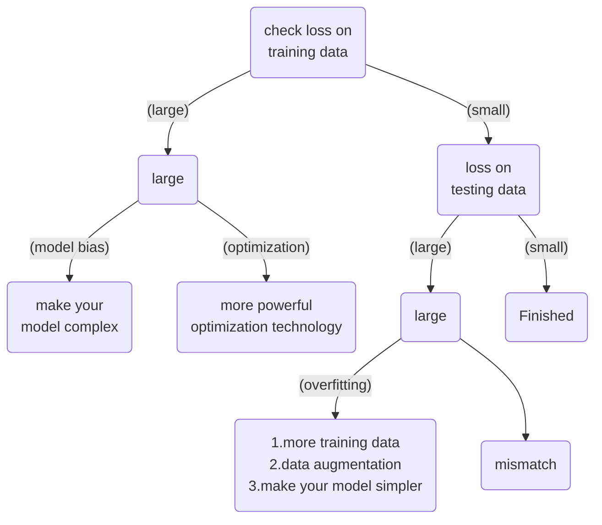

[李宏毅2021/2022春机器学习课程__bilibili](https://www.bilibili.com/video/BV1Wv411h7kN/?p=1)

# 1.Intro

Machine learning:  ≈ look for function


Different types of functions (Tasks):

- Regression : the function outputs a scalar.

- Classification: Given options (classes),the function outputs the correct one.

- Structured Learning:  create something with  structure(image, document)


## Linear Model

Linear Model:  $\LARGE y = b + \sum w_ix_i$

> b: bias    w:weight    x:feature   [特征（feature）指的是描述一个实例的属性或特征，也可以称为自变量（independent variable）或输入变量（input variable）]

&dArr;  New Models: more features.

Approximate continuous curve by a piecewise linear curve.    [连续的曲线可被多个分段的线性拟合]

$ \LARGE y = b + \sum_i c_i  sigmoid(b_i + w_ix_1)$

Sigmoid Function:   $ \huge y = c\frac{1} {1+e^{-(b+wx_1)}} = c * sigmoid(b+wx_1) $

&dArr;

$ \LARGE y = b + \sum_i c_i sigmoid(b_i + \sum_jw_{ij}x_j)$​

> i : 有 i 个sigmoid函数；    j：有 j 个x ；  $w$ 表示在第 $i$ 个函数里与所有 j 个向量相乘再求和；

即 ： $\LARGE \vec{r} = \vec{b} + \vec{w} \vec{x}$

$$ \large r =  \left[ \begin{matrix}   b_1 \\   b_2 \\   b_3  \end{matrix}  \right]  +  \left[ \begin{matrix}   w_{11} & w_{12} & w13 \\   w21 & w22 & w23 \\   w31 & w32 & w33  \end{matrix}  \right]  \left[ \begin{matrix}   x1  \\   x2  \\  x3  \end{matrix}  \right] $$

&dArr;

$$\LARGE y = b + \vec{c^T}\vec{a} ;\quad \quad  \vec{a} = \sigma(\vec{r});$$


## Optimiaztion

Loss:	 Loss is a function of parameters $L(\theta)$

​		 Loss means how good a set of values is.

$\Large \vec{\theta^*} = arg \space min_{\theta} L;  \quad \vec{\theta} = \left[ \begin{matrix}   \theta_1 \\   \theta_2 \\   \theta_3  \end{matrix}  \right]$

(Randomly) Pick initial values $\theta^0$

$\LARGE \vec{g} = \left[ \begin{matrix}   \frac{\partial L}{\partial \theta_1}|_{\theta=\theta^0} \\   \frac{\partial L}{\partial \theta_2}|_{\theta=\theta^0} \\   ...  \end{matrix}  \right]$                     Abbreviated as:    $$\Large \vec{g} = \nabla L(\vec{\theta^0})$$

> g means “gradient”  /ˈɡreɪdiənt/


Update parameters:

$$\Large \left[ \begin{matrix}   \theta_1^1 \\   \theta_2^1 \\  ... \end{matrix}  \right] = \left[ \begin{matrix}   \theta_1^0 \\   \theta_2^0 \\  ... \end{matrix}  \right] - \left[ \begin{matrix}   \eta\frac{\partial L}{\partial \theta_1}|_{\theta=\theta^0} \\  \eta \frac{\partial L}{\partial \theta_2}|_{\theta=\theta^0} \\   ...  \end{matrix}  \right]$$               Abbreviated as:    $$\Large \vec{\theta^1} = \vec{\theta^0} - \eta\vec{g}$$

> $\eta$ is “Learning rate”,  one of hyperparameters;       “Batch size”   is also one of hyperparameters;

```python
for{
	compute gradient g = ∇L(θ^i);      #  L <-- N
    update			 θ^{i+1} = θ^i - ηg;
}

# Actually, we use "batch" instead of whole data N; Divide N into m batches;
|--------------------N-------------------------------------|
|L1 <-- Batch1 | L2 <-- Batch2 | .... | Lm <-- Batchm      |

compute gradient g = ∇L1(θ^0);
update			 θ^1 = θ^0 - ηg;
compute gradient g = ∇L2(θ^1);
update			 θ^2 = θ^1 - ηg;
 ...
```

1 epoch  == see all the batches once;            

> 一个Batch更新一次参数叫一次update；把所有Batch看一遍叫 一个epoch；一个epoch里可以有多次update，这跟有多少个Batch有关。


ReLU (Rectified Linear Unit):       $\Large c* max(0, b+wx_1)$

A hard sigmoid is composed of two ReLU:    $$ \large y = b + \sum_i c_i sigmoid(b_i + \sum_jw_{ij}x_j)  \quad \rightarrow \quad \large y = b + \sum_{2i} c_i max(0, b_i + \sum_jw_{ij}x_j)$$    

> Sigmoid & ReLU  are called “Activation function”

Many layers means “Deep”,       one hidden layer is composed of many “Neuron”  &rArr;   “Neural Network”


Why don’t we go deeper?   &rArr;  “Overfitting” !     A more complex model does not always lead to better performance on testing data.


## Network Structure

Input Layer  |    Hidden Layers   |     Output Layer

Fully Connected Feedforward Network:   All neurons of $i_{th}$ layer and ${i+1}_{th}$ layer  are connected.


$\Large \vec{y} =f(\vec{x}) = \sigma(\vec{W^L}...\sigma(\vec{W^2}\sigma(\vec{W^1}\vec{x}+\vec{b^1})+\vec{b^2})... + \vec{b^L})$

So the task of a neural network is to operate a series of Vectors multiply matrices, then add Vectors.    [Matrix Operation] 	

Using parallel computing techniques (such as GPUs) to speed up matrix operation.


## Backpropagation

> [(选修)To Learn More - 反向传播(Backpropagation)_哔哩哔哩_bilibili](https://www.bilibili.com/video/BV1Wv411h7kN/?p=14&spm_id_from=pageDriver&vd_source=bf4c8577fb22820a80ba9f8a7e04169a)

To compute the gradients efficiently,  we use backpropagation.

Only rule :  “Chain rule”

case1: if  $y=g(x)$,  $z = h(y)$,   then $\LARGE \frac{dz}{dx} = \frac{dz}{dy} \frac{dy}{dx}$ 

case2:  if $\Large x=g(s), y=h(s), z=k(x,y )$ ,    then $\LARGE \frac{dz}{ds} = \frac{\partial z}{\partial x}\frac{dx}{ds} + \frac{\partial z}{\partial y}\frac{dy}{ds}$


Now let    $\Large |x^n|   \rightarrow NN:|\theta|  \rightarrow |y^n| \leftarrow C^n  \rightarrow |\hat{y^n}|$

> $C^n$  represents the distance between output $y^n$ and object $\hat{y^n}$ 

$\Large L(\theta) = \sum_{n=1}^N C^n(\theta)  \quad \rightarrow \quad \frac{\partial L(\theta)}{\partial w}= \sum_{n=1}^N \frac{\partial C^n(\theta)}{\partial w} $

Then we don’t need to compute  $\Large \frac{\partial L(\theta)}{\partial w}$,   we just need  $\Large \frac{\partial C^n(\theta)}{\partial w} $  ; finally we sum.


Let every layer is   $\Large z = x_1w_1 + x_2w_2 + b$  , 

then  $\LARGE \frac{\partial C}{\partial w} = \frac{\partial z}{\partial w}\frac{\partial C}{\partial z}$    ;

- Forward pass:  Compute $\LARGE \frac{\partial z}{\partial w}$ for all parameters .     Answer is the value of the input connected by the weight.
- Backward pass: Compute $\Large \frac{\partial C}{\partial z}$ for all activation function inputs $\Large z$ .   (Actually, we Compute $\Large \frac{\partial C}{\partial z}$ from the output layer)


## Regularization

> Regularization is **a set of methods** for **reducing overfitting in machine learning models**. Typically, regularization trades a marginal decrease in training accuracy for an increase in generalizability.

​	$\Large Regularization = Loss Function  + Penalty$


For linear model: $y = b + \sum w_ix_i$ ,   original loss function is $\Large L = \sum_n (\hat{y^n} - (b+\sum w_ix_i))^2$  ;

Then ,  after regularization,  the new Loss function is $\Large L = \sum_n (\hat{y^n} - (b+\sum w_ix_i))^2 + \lambda\sum(w_i)^2$  .

which means, the functions with smaller $w_i$ are better.   [we prefer smooth functions, but don’t be too smooth.]

If some noises corrupt input $x_i$  when testing,   a smoother function has less influence.

> $\Large \lambda$  is one of the hyperparameters,  Select $\large \lambda$ obtaining the best model.       And we don’t consider $b$ when doing regularization.


## Classification

Now we let a binary classification problem.    we want Probability from Class,  e.g. P(x | C~1~)  =  ? 

Multivariate Gaussian Distribution :    $ \Large f_{\mu, \sum}(x) = \frac{1}{(2\pi)^{\frac{D}{2}}} \frac{1}{|\sum|^{\frac{1}{2}}} exp \{   -\frac{1}{2}(x-\mu)^T\sum^{-1}(x-\mu) \}$

> Input: vector x;  Output: probability of sampling x;    D：变量维度。对于二维高斯分布，有D=2;
>
> The shape of the function determines by mean $\Large \mu$   and   covariance matrix $\large \sum$ 

Likelihood of a Gaussian with  mean $\Large \mu$  and  covariance matrix $\large \sum$  =  the probability of the Gaussian samples $x_1, x_2, ., x_m$ ; 		 i.e.     $\Large L(\mu, \sum)  =  f_{\mu,\sum}(x^1)f_{\mu,\sum}(x^2)...f_{\mu,\sum}(x^m)$                  [not Loss function]

We want the Gaussian $(\mu^*, \sum^*)$   with the “maximum likelihood ”.

i.e.  $\Large \mu^*, \sum^* = arg ~~ max_{\mu,\sum}L(\mu,\sum)$

> Actually,    $\large \mu^* = \frac{1}{m}\sum_{n=1}^m x^n$     ;     $\large \sum^* = \frac{1}{m}\sum_{n=1}^m(x^n-\mu^*)(x^n-\mu^*)^T$

Now ,   $\Large P(C_1 | x) = \frac{P(x|C_1)P(C_1)}{P(x|C_1)P(C_1) + P(x|C_2)P(C_2)}$     [According to Bayes theorem and Total Probability Theorem]

​	if $\Large P(C_1 | x) > 0.5$   ,  &rArr;    x  belongs to class 1.

>  P(x | C~1~)   =  $\large f_{\mu^1, \sum^1}(x) = \frac{1}{(2\pi)^{\frac{D}{2}}} \frac{1}{|\sum^1 |^{\frac{1}{2}}} exp \{   -\frac{1}{2}(x-\mu^1)^T(\sum^1)^{-1}(x-\mu^1) \}$​
>
>  P(x | C~2~)   =  $\large f_{\mu^2, \sum^2}(x) = \frac{1}{(2\pi)^{\frac{D}{2}}} \frac{1}{|\sum^2 |^{\frac{1}{2}}} exp \{   -\frac{1}{2}(x-\mu^2)^T(\sum^2)^{-1}(x-\mu^2) \}$

But different covariance matrices lead to “Error”.

Modifying Models   &dArr;

We share the same covariance matrix:    

|$x^1$---Class 1 --$x^i$ |  $x^{i+1}$--- Class 2 --$x^m$|	

​           $  \mu^1    \quad \rightarrow \sum   \leftarrow \quad \mu^2$

Find $\mu^1 ,\sum, \mu^2$ maximizing the likelihood $L(\mu^1, \mu^2, \sum)$;     $ L(\mu^1, \mu^2, \sum) = f_{\mu^1,\sum}(x^1)...f_{\mu^1,\sum}(x^i)f_{\mu^2,\sum}(x^{i+1})...f_{\mu^2,\sum}(x^{m})$

> $\large \mu^1 = \frac{1}{i}\sum_{n=1}^i x^n$ ;  $\large \mu^2 = \frac{1}{m-i}\sum_{n=i+1}^m x^n$ ;       But $\Large \sum = \frac{i}{m}\sum^1 + \frac{m-i}{m}\sum^2$ .

Then, after share the covariance matrix, only considering two features, the boundary is linear.    we can also call such model as “Linear model”.


As for Probability Distribution, You can always use the distribution you like:   

- For binary features, you may assume they are from Bernoulli distributions.    
- If you assume all the dimensions are independent, then you are using  Naive Bayes Classifier.


$\Large P(C_1 | x) = \frac{P(x|C_1)P(C_1)}{P(x|C_1)P(C_1) + P(x|C_2)P(C_2)} = \frac{1}{1+\frac{P(x|C_2)P(C_2)}{P(x|C_1)P(C_1)}} = \frac{1}{1+exp(-z)} = \sigma(z)$    [i.e. “Sigmoid function”]

> $\Large z = ln\frac{P(x|C_1)P(C_1)}{P(x|C_2)P(C_2)} = (\mu^1-\mu^2)^T\sum^{-1}x-\frac{1}{2}(\mu^1)^T(\sum^1)^{-1}\mu^1 + \frac{1}{2}(\mu^2)^T(\sum^2)^{-1}\mu^2 + ln\frac{N_1}{N_2}$ 

So, we have $\large P(C_1 | x) = \sigma(z) = \sigma(w \cdot x+b)$.            i.e. $f_{w,b}(x) = \sigma(z) = \frac{1}{1+exp(-z)}=\sigma(w\cdot x+b)$.

In generative model, we estimate $N_1, N_2,,μ^1,μ^2,\sum$ ,    Then we have $w$ and $b$ .


## Logistic Regression

> This type of statistical model (also known as *logit model*) is often used for **classification** and predictive analytics. Since the outcome is a probability, the dependent variable is bounded between 0 and 1. 

Step1. Function set.       

|      | Logistic Regression                                          | Linear Regression                                            |
| ---- | ------------------------------------------------------------ | ------------------------------------------------------------ |
| 1.   | $\Large f_{w,b}(x) = \sigma(\sum_iw_ix_i +b)$       Output: between 0 and 1. | $\Large f_{w,b}(x) = \sum_iw_ix_i+b$     Output: any value   |
| 2.   | Training data: $(\hat x^n, \hat y^n)$     $\hat y^n:$ 1 for class1; 0 for class 2.        $Loss (f) = \sum_nCross\_entropy(f(x^n), \hat y^n)$ | Training data: $(\hat x^n, \hat y^n)$     $\hat y^n:$ a real number.  $Loss(f) = \frac{1}{2}\sum_n(f(x^n)-\hat y^n)^2$ |
| 3.   | Update: $\large w_i  \leftarrow w_i - \eta \sum_n -(\hat y^n - f_{w,b}(x^n)) x_i^n$ | Same update: $\large w_i  \leftarrow w_i - \eta \sum_n -(\hat y^n - f_{w,b}(x^n)) x_i^n$ |


Step2. Goodness of a Function.

Assume training data is generated based on $f_{w,b}(x) = P_{w,b}(C_1|x)$      &dArr;

| x1   | x2   | x3   | ...  | xn   |
| ---- | ---- | ---- | ---- | ---- |
| C1   | C1   | C2   | ...  | C1   |

Use Likelihood to define its goodness:  $\large L(w,b)  =  f_{w,b}(x^1)f_{w,b}(x^2)(1-f_{w,b}(x^3))...f_{\mu,\sum}(x^n)$ 

The most likely w* and b* is the one with the largest L(w, b).

&dArr;   $\large \hat{y}^n : $   1 for class 1;  0 for class 2;

| x1             | x2             | x3             | ...  | xn             |
| -------------- | -------------- | -------------- | ---- | -------------- |
| $\hat y^1 = 1$ | $\hat y^2 = 1$ | $\hat y^3 = 0$ | ...  | $\hat y^n = 1$ |

Then,  $\large w^*, b^* = arg ~~ max_{w,b}L(w,b) = arg ~~ min_{w,b}-lnL(w, b)$ .

So,  $\large -ln L(w,b) = \sum_n-[\hat y^n lnf_{w,b}(x^n) + (1-\hat y^n)ln(1-f_{w,b}(x^n))] = \sum_n C(f(x^n), \hat y^n)$ .

> $-[\hat y^n lnf_{w,b}(x^n) + (1-\hat y^n)ln(1-f_{w,b}(x^n))]$​   is “Cross entropy between two Bernoulli distribution”.
>
> ​	if we have Distribution p: $p(x=1)=\hat y^n, p(x=0) = 1-\hat y^n$ ;   Distribution q: $q(x=1)=f(x^n), q(x=0) = 1-f(x^n)$.
>
> Then, Cross entropy $H(p, q) = -\sum_x p(x)ln(q(x))$  .       用于衡量两个概率分布之间的差异, 等于0则分布相同。 


Step 3: Find the best function

$$\Large \frac{\partial -lnL(w,b)}{\partial w_i} = \sum_n-[\hat y^n \frac{\partial lnf_{w,b}(x^n)}{\partial w_i} + (1-\hat y^n) \frac{\partial ln(1-f_{w,b}(x^n))}{\partial w_i}]$$​.

beacause	$\Large \frac{\partial lnf_{w,b}(x)}{\partial w_i} = \frac{\partial lnf_{w,b}(x)}{\partial z}\frac{\partial z}{\partial w_i} = \frac{\partial ln\sigma(z)}{\partial z}x_i = \frac{1}{\sigma(z)}\frac{\partial \sigma(z)}{\partial z} x_i= (1-\sigma(z))x_i$   ;

Therefore, $$\Large \frac{\partial -lnL(w,b)}{\partial w_i} = \sum_n-[\hat y^n(1-f_{w,b}(x^n))x_i^n-(1-\hat y^n)f_{w,b}(x^n)x_i^n] \\ \Large = \sum_n -(\hat y^n - f_{w,b}(x^n)) x_i^n$$	.

Use Gradient descent:  $\large w_i  \leftarrow w_i - \eta \sum_n -(\hat y^n - f_{w,b}(x^n)) x_i^n$    [Larger differences, larger update]


Compare Generative model with Discriminative model,  generative makes some assumptions about the distributions of data.

Benefit of generative model:

- With the assumption of probability distribution,  less training data is needed
- With the assumption of probability distribution,more robust to the noise
- Priors and class-dependent probabilities can be estimated from different sources.


Multi-classClassification

We use “Softmax function” :  $\Large y_i = \frac{e^i}{\sum_{j=1}^n}e^j$   ;              So the output probability :  $1 > y_i > 0$   ,   $\sum_i y_i = 1$   .

​	the Cross entropy:  $\Large \sum_{i=1}^n \hat y_i ln y_i$  .        [ $\hat y_i$ is known target]


Limitation of Logistic Regression

- the boundary between two classes is a straight line.
- after “Feature transformation”, we may sovle the problem.  But it is Not easy to find a good transformation !
- Cascading logistic regression models to automatically make feature transformation and then classification.     i.e. “Neural Network”


# 2.General Guidance

Framework of Machine Learning:

Training data: $\{(x^1, \hat y^1), ..., (x^N, \hat y^N)\}$

Training: 

Step 1: Function with unknown. $y=f_\theta(x)$   &rArr; Step 2: Define loss from training data.  $L(\theta)$ &rArr; Step 3:  Optimization. $\theta^* = arg ~~ min_\theta L$.

Testing data:    $\{(x^{N+1}, \hat y^{N+1}), ..., (x^{N+M}, \hat y^{N+M})\}$ .       

Then, we use $y=f_{\theta^*}(x)$  to label the testing data  ,  and we get output $\{y^{N+1}, y^{N+2}, ..., y^{N+M}\}$ .


if you are not feel satistied with your results, then follow the basic guidance &dArr;  





You should know whether your model is learning base on traing data first.

whether is Optimization lssue or not:

- Gaining the insights from comparison 
- Start from shallower networks (or other models),which are easier to optimize.
- If **deeper networks** do **not obtain smaller loss** **on training data**, then there is optimization issue.


## Overfitting

Small loss on training data, but large loss on testing data. 


Solutions:  

1.add data

- more training data
- Data augmentation

2.add constrains                         (Too much constrains will lead to Model bias issues)

- Less parameters   or  sharing parameters.
- Less features.
- Early stopping.
- Regularization.
- Dropout.


Bias-Complexity Trade-off.


There may be public and private Testing Set,  so final models are not just  based on public dataset.

Cross Validation:

​	Split training data into training set and validation set for model selection.   The model trained on the training set is evaluated on the validation set, and then the model is selected based on the scores (loss) obtained from the validation set.

N-fold Crosss Validation:

​	The original sample is randomly partitioned into N equal sized subsamples, often referred to as "folds". Of the N subsamples, a single subsample is retained as the validation data for testing the model, and the remaining N − 1 subsamples are used as training data. The cross-validation process is then repeated N times, with each of the  N subsamples used exactly once as the validation data. The N results can then be averaged to produce a single estimation. 

| Whole--    | --training-- | --set | Model     |
| ---------- | ------------ | ----- | --------- |
| Train      | Train        | Train | MSE       |
| Train      | Validation   | Train | MSE       |
| Validation | Train        | Train | MSE       |
|            |              |       | Avg MSE = |


Mismatch:

​	Your training and testing data have different distributions. Be aware of how data is generated.  Simply increasing the training data will not help.


