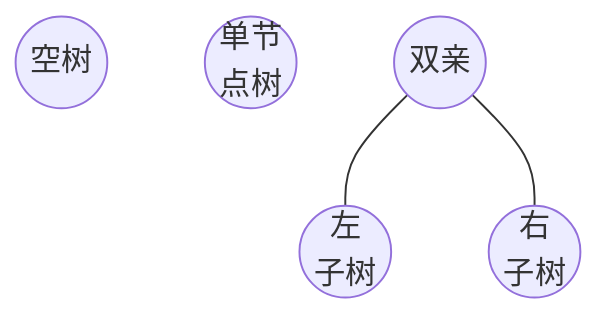
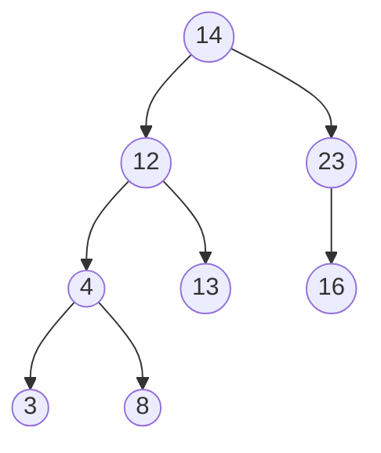
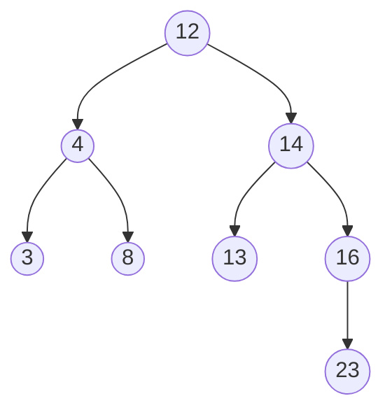

[2017—Java零基础教程视频（适合Java 0基础，Java初学入门）_哔哩哔哩_bilibili](https://www.bilibili.com/video/BV1Rx411876f/?spm_id_from=333.337.search-card.all.click&vd_source=bf4c8577fb22820a80ba9f8a7e04169a)

[2024—Java零基础视频教程_上部(Java入门必刷视频_动力节点老杜JavaSE）_哔哩哔哩_bilibili](https://www.bilibili.com/video/BV1a5411y77c/?spm_id_from=333.337.search-card.all.click&vd_source=bf4c8577fb22820a80ba9f8a7e04169a)  

> 学习目标:   需要扎实的掌握，这是后续学Java的基石。非常重要，需要多练多敲。
> 课程评价：动力节点的杜老师 永远的神。讲课条理清楚,非常厉害.

# 第一章.概述

## 常用DOS命令：

常用的windows组合键

- win + D  :  返回桌面与返回

- win + E ： 打开文件资源管理器

- win + R

- win + L ：锁屏

- alt +  tab  ：应用间切换

打开DOS命令窗口：win + R，输入cmd  （command缩写）

DOS命令窗口中的复制与粘贴：
①选中要复制的内容，然后点击右键，这就是复制；②在需要粘贴的位置，再次点击右键就是粘贴；

关于DOS命令窗口的当前所在目录：
①C:\Users\Administrator> 表示当前所在位置是:C:\Users\Administrator

常用命令：

- dir  ： 列出当前文件下所有目录及目录
- cls ：清屏
- exit ：退出DOS命令窗口
- 切换盘符：  若当前在C盘，输入`D:`就切换到D:\>
- del  ：删除1个文件，删除多个文件 ;  `del 1.txt`、`del *.txt`
- ipconfig：看此电脑IP地址、ipconfig /all ：查看更详细的信息
- ping ：查看两台计算机通信   `ping 192.162.137.101`   、  ping -t ：不停查询 `ping 192.162.137.101 -t ` 、`ping www.baidu.com -t`
- 上下方向键可以翻出历史命令、ctrl + c终止dos命令的执行
- mkdir ：创建目录    `mkdir abc`
- rd ：删除目录      `rd abc`
- ren ：重命名      `ren abc xyz`
- cd ：切换目录 ：`cd /`回到根目录、`cd ..`回到上级目录、 cd绝对路径(以盘符开始)、cd 相对路径(相对于当前路径)  [按tab键路径可自动补全)
- 新建并编辑文件: copy con文件名，ctrl +z保存
- type:查看文件内容
- shutdown:关机      `shutdown -s -t 3600`表示3600s后自动关机

 

 批处理文件：可批量执行某些命令的脚本文件。     【windows中是`.bat`文件】


## 通用的文本编辑快捷键：

- ctrl+c复制
- ctrl+v粘贴
- ctrl+x剪切
- ctrl+s保存
- ctrl+z撤销
- ctrl+y重做
- ctrl+a全选
- home光标回到行首
- end光标回到行尾
- ctrl + home光标回到文章开始
- ctrl + end光标回到文章末尾
- shift + home 或end选中一行
- 鼠标双击(选中一个单词)
- ctrl + shift +右箭头或左箭头（选中一个单词)
- ctrl + f查找


## Java的三大分支:

【必学，基础】Java SE (Java Standard Edition)是Java的标准版，它包含了Java语言的核心部分，包括基础类库、虚拟机和开发工具
等。Java SE主要用于开发桌面应用程序、控制台程序和小型服务器端应用程序等。

【企业级开发】Java EE(Java Enterprise Edition）是Java的企业版，它是在Java SE的基础上扩展而来，主要用于开发大型企业级应用
程序，如电子商务系统、ERP系统和CRM系统等。Java EE包含了许多企业级技术，如Servlet、JSP、EJB、JMS、JTA等。

【嵌入式】Java ME (Java Micro Edition)是Java的微型版，它主要用于嵌入式设备和移动设备上的应用程序开发，如手机、平板电
脑、数码相机、路由器等。Java ME的特点是体积小、速度快、资源占用少，可以在较小的内存和处理能力的设备上运行。


## Java语言特点：

1.简单易学: Java语言的语法和C语言很相似，但是它去掉了C中的复杂的指针和多重继承等特性，使得Java语言更加简单易学。

2.面向对象:Java语言是一种纯面向对象的编程语言，它支持对象的封装、继承和多态等面向对象的特性。

3.**平台无关性（跨平台性:一次编译到处运行)**：Java语言的程序可以在不同的操作系统和硬件平台上运行，这是因为Java
程序被编译成字节码，而不是机器码，字节码可以在任何支持Java虚拟机的平台上运行。实现原理:**不同的操作系统上安装属于自己的Java虚拟机**，而Java虚拟机屏蔽了各个操作系统之间的差异，从而做到跨平台。 【JVM--Java虚拟机】

4.安全性:Java语言具有很高的安全性，它提供了一系列的安全措施来保护程序不受恶意攻击和病毒侵害。

5.高性能:Java语言具有很高的性能，它采用了一系列优化措施来提高程序的执行速度和内存使用效率。

6.多线程支持: Java语言具有很好的多线程支持，它提供了一系列的线程控制机制，使得程序可以更好地利用计算机的多核
处理能力。

7.**自动垃圾回收机制**:Java语言采用的是垃圾回收机制(**Garbage Collection，简称GC**)，也就是**自动内存管理机制**。在传统的编程语言中，程序员需要**手动分配和释放内存，容易出现内存泄漏和悬挂指针**等问题。而Java语言采用的垃圾回收机制可以自动分配和释放内存，避免了这些问题。     【缺点：拉低速度，不能让计算机资源发挥到极致】


## Java加载与执行


（右键在浏览器中打开可放大图片）

一次编译，到处运行；编译阶段与运行阶段可在不同电脑、不同操作系统上执行。

.java是Java源文件，使用`javac`命令编译后生成 .class(字节码文件，这个文件不是机器码二进制码，无法直接与OS互动)	

假如有`A.class`文件，使用的执行命令是`java A`（不带.class），此时java虚拟机就启动了，JVM里面有个“类加载器”会去硬盘上找A对应的.class文件，然后装载进去。JVM开始把字节码解释成二进制机器码。然后OS执行二进制码和底层进行交互。

> Java是混合型语言，（即是编译型语言，又是解释型语言）   所以JVM(充当解释器)可以跨平台

注意：

①包含两个阶段：编译阶段和运行阶段。

②编译阶段和运行阶段可以在不同的操作系统上完成。

③编译后删除java源程序，不会影响程序的执行。

④生成的class文件如果是A.class，则类名为A。如果是Hello.class，则类名为Hello。

⑤javac是负责编译的命令。java是负责运行的命令。

⑥class文件不是机器码，操作系统无法直接执行。只有JVM才能看懂。

⑦JVM会把class字节码解释为机器码，这样操作系统才能看懂。

⑧JDK、JRE、JVM分别是什么？他们的关系是什么？   整个JDK既包含开发环境又包含运行环境。

JDK 包含 JRE ， JRE 包含 JVM   ；  JDK > JRE(Java运行环境) > JVM > OS > 硬件

 

## PATH环境变量

- path环境变量不是java的，隶属于windows操作系统
- path环境变量的作用是什么？
	- 在path中有很多路径，路径和路径之间采用 分号(:) 隔开 。  [Linux里面是 分号]
	- 在DOS命令窗口中**输入一个DOS命令之后**，windows会**先从当前路径下找**这个命令，如果**找不到，则会去环境变量PATH的路径中查找**该命令，找到则执行，**找不到，则报错**。
	- PATH环境变量实际上就是给windows操作系统**指路**的。

出现这种报错一般就是path配置出问题了：`c: \Users\Administrator>fdsafdsa    ’fdsafdsa’不是内部或外部命令，也不是可运行的程序或批处理文件。`


## 编写第一个Java程序

在硬盘的任何位置，新建一个java源文件，起名：HelloWorld.java

```java
// public表示公开的
// class表示定义一个类
// Helloworld是给这个类起个名
public class HelloWorld {
  //类体
  /**
  * 这是main方法，程序的入口，程序就是从这里进来开始执行的。
  * @param args 这个是main方法的参数
  */

  //1. 这是main方法，也叫做主方法。
  //2. main方法是JVM规定的固定写法，照抄就行了。程序就是从这个位置进来执行的。这是程序的入口。
  //3. 对于main方法来说能修改的就是args这个变量名。
  //4. public表示公开的
  //5. static表示静态的
  //6. void表示main方法执行结束之后不返回任何数据
    public static void main(String[] args){
        // 这行代码的作用:将字符串"Hello world! "打印输出到控制台。并且输出之后还会换行的。
	    //注意:在一个java程序中，如果符号是语法的一部分，需要使用英文半角符号。不能使用中文。
        //以下程序中双引号和分号都是半角的。不能是中文。
		System.out.println( "Hello world!");

        //方法体
        //方法体当中由一行一行的java语句组成。
        //任何一条java语句必须以“;”结尾。
        
        System.out.println("Hello World!");
        
        //没有1n是不换行的。
        System.out.print("abc ");
        //添加了ln是换行的。
	    System.out.println( "123");
    }
}
```

## 编译第一个java程序

- 使用**javac命令来编译**。首先确保javac命令能用。   `javac -version`
- javac命令怎么用，语法是什么？
	- javac      java源文件的路径
	- javac     java源文件的相对路径       `javac Helloworld.java`
	- javac     java源文件的绝对路径

## 运行第一个Java程序

- 使用**java命令来运行程序**，首先确保java命令可以用。  `java -version`
- java命令怎么用？语法格式是什么？
	- java 类名                          `java Helloworld`
	- 切记 java命令后面跟的**不是文件路径**。java命令后面跟的是<font size=5>类名</font>
- 什么是类名？
	- A.class，类名是A
	- HelloWorld.class，类名是HelloWorld
- <font color=red>要使用java命令，首先DOS命令窗口中的当前路径必须切换到class文件所在的位置。</font>


## 掌握环境变量CLASSPATH

- **classpath环境变量是隶属于Java**语言的。不是windows操作系统的。**和PATH环境变量完全不同**。
- classpath环境变量是给**classloader（类加载器）**指路的。
- java A。执行后。先启动JVM，JVM启动classloader，**classloader去硬盘上通过classpath找A.class文件**。找到则执行，找不到则报错。
- **如果classpath没有配置的话，默认从当前路径下找class字节码文件**。
- **如果classpath配置了**，例如配置到桌面上了：C:\Users\Administrator\Desktop，那么c**lassloader以后就只会去桌面上找字节码文件了，不再从当前路径**下找了。         
- 注意，如果classpath配置为：classpath=.;C:\Users\Administrator\Desktop 是什么意思呢？
	- 先让类加载器从当前路径下找，如果找不到的话，去C:\Users\Administrator\Desktop找。


## 关于编译时的乱码问题

- 当java源文件中有中文时，采用老杜给的editplus工具写代码，最后会出现中文乱码问题，为什么？
	- editplus默认是简体中文GBK。
	- **java21的javac编译器采用的是UTF-8的编码方式**进行编译。
	- 编码不一致，所以乱码了。
- 怎么解决？
	- 第一种方案：
		- javac -encoding GBK HelloWorld2.java
	- 第二种方案：
		- 将editplus的字符集修改为UTF-8
	- 不管哪一种解决方案，都是让两边的字符编码方式一致。


## java中的三种注释

```java
// 单行注释
// 单行注释
```

```java
/*
多行注释
多行注释
*/
```

```java
/**
* javadoc注释，可以给javadoc命令解析提取并生成帮助文档
* @author dujubin
* @version 1.0
* @since 1.0
*/
```

使用以下命令可以提取**生成帮助文档**：

```text
javadoc -d docs -author -version -encoding utf-8 HelloWorld.java
```


## public class与class的区别


1. 一个Java源文件中可以定义多个class
2. 编译之后，一个class就会对应生成一个class字节码文件

```java
/* A.java  */
class X{
    public static void main(String[] args){
    		// ... √
    }
}
class Y{
     public static void main(String[] args){
    		// ... √
    }
}
class A{
    
}
```


3. 如果一个类是public的，类名必须和源文件名保持一致。
4. public的类可以没有。如果有的话，一个文件里也只能有一个。
5. 每个类中都可以编写入口main方法。想执行X类的main方法怎么办？`java X`
6. 这里只是测试一下语法，在实际的开发中，对于一个软件来说，一般入口只有1个。

```java
/* HeHe.java  */
public class HeHe{
    
}
```


# 第二章.Java基础语法

## 标识符

什么是标识符

①在Java中，标识符是用来给变量、方法、类和包等命名的字符序列。  （程序员有权利自己命名的）

②标识符的长度没有限制，但是建议使用有意义的、简洁的标识符，以提高代码的可读性和可维护性。

标识符可以标识什么

- ①变量名
- ②方法名
- ③类名、接口名、枚举名、注解名
- ④包名
- ⑤常量名
- ⑥......

标识符命名规则  [必须这么干，不然会报错]

- ①标识符可以**由字母、数字、下划线(_)和美元符号($)组成**，不能含有其他符号。（java支持全球所有语言，所以这里的 字母 指的是任何一个国家的文字都可以； Java使用`unicode`编码）
- ②标识符**不能以数字开头**。
- ③标识符不能是Java中的关键字，如public、class、void等。
- ④标识符是区分大小写的，即Foo和foo是两个不同的标识符。
- ⑤标识符的**长度没有限制**，但是Java建议使用有意义的、简短的标识符。

标识符命名规范    [大家都这么干，形成共识惯例]

- ①见名知意
- ②驼峰式命名方式
- ③**类名、接口名**、枚举、注解：**首字母大写**，后面每个单词首字母大写。（StudentService，UserService）
- ④**变量名和方法名**：**首字母小写**，后面每个单词首字母大写。（doSome，doOther，stuName）
- ⑤**常量名**：**全部大写**，每个单词**用下划线**连接。（LOGIN_SUCCESS，SYSTEM_ERROR）
- ⑥**包名**：**全部小写**。   ( com powernode  javase  chapter2 )


## 关键字

什么是关键字

​    Java关键字是Java编程语言中**预定义的具有特殊含义**的单词，这些单词**不能被用作标识符**，而是在语法中有特定的用法和限制。

Java关键字有哪些:

- ①Java关**键字都是小写**的。   一共50个，不用单独记。
- ②abstract, assert, boolean, break, byte, case, catch, char, class, continue, default, do, double, else, enum, extends, final, finally, float, for, if, implements, import, instanceof, int, interface, long, native, new, package, private, protected, public, return, short, static, strictfp, super, switch, synchronized, this, throw, throws, transient, try, void, volatile, while         (48个)
- ③Java保留字：goto，const      (2个，目前语言没用上，也不让程序员用)


## 字面量

什么是字面量

​    字面量指的是在**程序中直接使用的数据**，字面量是Java中最基本的表达式，不需要进行计算或转换，直接使用即可。

Java中有哪些字面量：

- ①整数型：10、-5、0、100
- ②浮点型：3.14、-0.5、1.0
- ③布尔型：true、false
- ④字符型：'a'、'b'、'c'、'1'、'2'、'国'                                   【单引号括起来，且只能是一个字符】
- ⑤字符串型："Hello"、"World"、"Java"、"你好呀"、 “A”     【双引号括起来】


加号运算符 +  ：

- ①作用1：求和（当加号两边都是数字时进行求和运算）

- ②作用2：字符串拼接（当加号两边有任意一边是字符串类型时会进行字符串拼接，结果还是一个字符串）

- ```java
	//一个表达式当中出现多个+，顺序是怎样的?如果没有小括号，遵循从左向右。
	//第一个＋是求和，第二个＋是字符拼接
	System. out. println(10 + 20 + "30");       // 结果： "3030"
	System. out. println(10 + (20 + "30"));     // 结果： "102030"
	```

	


## 变量

**什么是变量：**

①**变量是内存当中的一块空间**。是计算机中**存储数据最基本的单元**。

②变量三要素：

- **数据类型**（**决定空间大小**）【int, double, String】
- 变量**名**（只要是合法的标识符即可）
- 变量**值**（变量中具体存储的数据）               `int age = 20; `      【变量值和数据类型要对应】

③变量的声明、赋值、访问

```java
int i;                 // 声明一个整数型的变量，起名i
i = 100;               // 给变量i赋值100     【赋值：变量名 = 变量值】
System.out.println(i); // 访问i变量：读操作
i = 200;               // 访问i变量：改操作【给变量i重新赋值200】
int age = 50;          // 声明与赋值同时完成
```

**变量的作用:**

①变量的存在会让程序更加便于维护。

```java
System.out.println(100 + 111);
System.out.println(100 + 222);
// 以上代码的设计就不如以下的代码：
int num = 100;
System.out.println(num + 111);
System.out.println(num + 222);
```

②变量的存在可以增强程序的可读性。

```java
System.out.println(3.14 * 10 * 10);
//  以上代码的设计就不如以下的代码：
double π = 3.14;
int r = 10;
System.out.println(π * r * r);
```

**变量的小细节：**

- ①变量必须先声明，再赋值，才能访问。

- ②方法体当中的代码遵循自上而下的顺序依次逐行执行，变量先访问，再声明肯定是不行的。

- ③一行代码上可以同时声明多个变量

- ```java
	int a, b, c = 500;    // 注意：这里只有c被赋值500，a、b都没赋值
	```

- ④在同一个作用域 (有效范围，一个大括号就是一个作用域) 当中，变量名不能重名，可以重新赋值。

- ⑤变量值的数据类型必须和变量的数据类型一致，这样是不允许的：String name = 100;

**变量的作用域：**

- ①作用域就是**变量的有效范围**。Java程序中，通常是一个大括号`{}`对应一个作用域。  “出了大括号就不认识了”
- ②**作用域的不同**主要是因为**声明在不同位置的变量具有不同的生命周期**。所谓的**生命周期是：从内存开辟到内存释放**。
- ③Java遵循就近原则。

**变量的分类：**    根据定义的/声明的位置来进行分类，分为：

- ①局部变量 ：凡是在方法体当中定义的变量,一定是局部变量。局部变量只在当前方法体当中有效。
- ②成员变量 ：在类体当中定义的变量叫做成员变量。
	- 1.静态变量
	- 2.实例变量

```java
public class VarTest{
	public static void main(String[] args){
		int a = 10;       //局部变量
	}
	int b = 200;          // 实例变量
	static int c = 300;   // 静态变量
}
```


## 二/八/十/十六进制

二进制概述：

①计算机底层只能识别二进制。计算机底层只识别二进制是因为计算机内部的电子元件只能识别两种状态，即开和关，或者高电平和低电平。二进制正好可以用两种状态来表示数字和字符，因此成为了计算机最基本的表示方法。在计算机内部，所有的数据都被转化为二进制形式进行处理和存储。虽然计算机可以通过不同的编程语言和程序来处理不同的数据类型和格式，但最终都需要将其转化为二进制形式才能被计算机底层识别和处理。

什么是二进制：

- ①十进制：满十进一		                  `17`
- ②二进制：满二进一           (0~1)               `0b10001 `             **二进制变量的声明以0b为前缀；**
- ③八进制：满八进一           (0~7)               `021`                     **八进制变量的声明以0为前缀；**
- ④十六进制：满十六进一   (0~9, a~f)         `0h11`                    **十六进制变量的声明以0x为前缀。**


十进制转换为二进制：

​	除2取余，一直到商为0为止，最后将所有的余数逆序输出。   (竖式中从下到上，对应二进制从高位到低位)

二进制转换为十进制：

- ①将二进制数每一位权值找出来，然后每个权值与对应二进制位相乘，最后将它们相加，即可得到十进制数。
- ②什么是权值？

​		在二进制中，权值指的是每个位所代表的数值大小，即二进制中每个位的位置所代表的数值大小。

​		例如，在二进制数1101中，最高位的权值为8 (2^3^)，次高位的权值为4 (2^2^)，第三位的权值为2 (2^1^)，最低位的权值为1 (2^0^)。

​		例如，二进制数1101转换为十进制数的计算过程如下：

​			1×2³ + 1×2² + 0×2¹ + 1×2⁰ = 8 + 4 + 0 + 1 = 13

十进制转为八进制：

​	除8取余，一直到商为0为止，最后将所有的余数逆序输出。   (竖式中从下到上，对应进制从高位到低位)

十进制转为十六进制：

​	除16取余，一直到商为0为止，最后将所有的余数逆序输出。   (竖式中从下到上，对应进制从高位到低位)


二进制转换为十六进制：      【四位四位的转】

- ①将二进制数从右往左每四位一组，不足四位则在左侧补0，得到若干个四位二进制数。 
- ②将每个四位二进制数转换为对应的十六进制数。              `0b1111` <=>  `0hF`

十六进制转换为二进制

- ①将十六进制中的每个数字转换成4个二进制位


## 原码、反码、补码

byte (/baɪt/) 与bit (/bɪt/)：

- ①**byte（字节）**是计算机**存储和处理数据的基本单位**，通常由8个比特（bit）组成。每个比特（bit）是计算机中最小的存储单位，只能存储0或1两个状态。因此，**一个字节（byte）可以存储8个比特（bit）**的数据。
- ②两者之间的关系是，**1 byte = 8 bit**，即8个比特（bit）组成一个字节（byte）。
- ③在计算机中，**数据通常以字节（byte）为单位**进行**存储和传输**，而**比特（bit）则是用来表示数据的最小单位**。
- ④1KB = 1024byte    =   2^10^ byte          【大写B是byte-字节】
- ⑤1MB = 1024KB     =    2^20^ byte
- ⑥1GB = 1024MB     =    2^30^ byte
- ⑦1TB = 1024GB      =    2^40^ byte


原码反码补码：

- ①原码反码补码是计算机**二进制的三种表示形式**。
- ②计算机在**底层都是采用二进制补码**形式表示的。         【计算机都用“补码”】
- ③**二进制位最高位称为符号位**，**0为正数**，**1为负数**。


正数(+)的原码反码补码：

- ①**正数的原码反码补码是相同**的。
- ②请问127的原码反码补码分别是多少？`0b0111_1111`

负数(-)的原码反码补码：

- ①**负数的原码运算**规则：将**绝对值转换为二进制后，最高位改为1**。 (哪怕原来就是1也改成1)

- ②-5的原码：`0b1000_0101`

- ③-5的**反码**：`0b1111_1010`（原则是：**以原码作为参考**，**符号位不变，其他位取反**。）

- ④-5的**补码**：`0b1111_1011`（原则是：**以反码作为参考**，**符号位不变，加1**）

	

已知负数补码怎么得到原码：

- ①虽然计算机底层是采用补码的形式存储的，但最终显示给人类的时候是以原码的形式显示的。
- ②将**负数的补码**形式**除符号位外的所有位按位取反**，**再加1即可得到原码**。
- ③已知补码：1_000_0001
- ④它的原码是：1_111_1111          [先变成 1_111_1110 后 再加1]
- ⑤结果是：-127
- ⑥对于**一个字节**来说能够表示的，**最大值127** (` 0b0111_1111`)，**最小值-128** (`0b1000_0000`)。  **一共256种情况**。

> 特殊：**-128的原码(`0b1000_0000`)与补码相同**。


计算机底层为什么采用补码：

- ①可以简化电路设计：采用补码形式可以将加减法运算转化为相同的操作，从而简化电路设计。

- ②解决了0的正负问题：在原码中，0有两个表示，+0和-0，这样会导致计算结果不唯一，而**在补码中，0只有一种表示**，即全0，可以避免这个问题。

- ③解决了负数溢出问题

- ④方便计算机进行运算：补码形式可以方便计算机进行加减法运算，且可以使用相同的电路进行运算，提高了计算机的运算效率。

	

## 数据类型

分为两大类：基本数据类型、引用数据类型。        （除了这8个，其余都是引用数据类型）  【String不是基本数据类型】


关于默认值：Java语言中变量必须先声明，再赋值，才能使用。对于局部变量来说必须手动赋值；而对于**成员变量来说，如果没有手动赋值，系统会自动赋默认值**。   【所有引用数据变量，默认值是`null`】    【注意Java中的char占2个字节】

> Java的int类型，一定是4字节：
>
> Java 的设计哲学是“一次编写，到处运行”（write once, run anywhere，简称 WORA）。为了实现这个目标，Java 需要确保其基本数据类型在所有平台上具有相同的大小和行为。这样，无论 Java 程序在哪里运行，它都可以期望相同的数据类型行为。
>
> 为了确保 Java 程序在所有平台上都有一致的行为，Java 语言规范明确指定了基本数据类型的大小。与 C 和 C++ 等语言不同，这些语言的数据类型大小可能会根据平台和编译器而变化，Java 的 `int` 总是32位，无论在哪个平台上。

### 整数型--`byte,short,int,long`

整数型字面量的四种表示形式：

- 1. 十进制表示法：以数字0-9组成的常数，默认为十进制表示法。                        例如：int a = 10;
- 2. 二进制表示法：以0b或0B开头的常数，由0和1组合而成。                                例如：int b = 0b101;
- 3. 八进制表示法：以0开头的常数，由数字0-7组成。                                             例如：int c = 012;
- 4. 十六进制表示法：以0x或0X开头的常数，由0-9和A-F（大小写均可）组成。     例如：int d = 0x1F;

整数型字面量默认当做`int`处理：

①Java中整数型字面量默认被当做int类型来处理，如果要表示long类型的整数，需要在字面量后面加上'L'或'l'标记。例如，下面是表示int和long类型整数的字面量的示例：

```java
int x = 10; // 10是一个int类型的字面量
long y = 10L; // 10L是一个long类型的字面量
```

> 需要注意的是，大小写字母'L'和'l'的使用没有区别，但是容易被误解为数字1，因此建议使用大写字母。

```java
long z = 2147483648;
// ↑编译报错，原因是2147483648被当做int类型处理，而该数字本身已经超出了int最大值 【不是long存不下】
long z = 2147483648L;   // 修改后    【2147483648直接被分配8个字节】
```


自动类型转换：

​      在Java中，对于基本数据类型来说，**小容量是可以直接赋值给大容量**的，这被称为自动类型转换。对于数字类型来说大小关系为：`byte < short < int < long < float < double`

强制类型转换：

- ①Java中大容量是无法直接转换成小容量的。因为这种操作可能会导致精度损失，所以这种行为交给了程序员来决定，当然这种后果自然是程序员自己去承担。因此在代码中需要程序员自己亲手加上强制类型转换符，程序才能编译通过
- ②强制类型转换时，底层二进制是如何变化的？原则：**砍掉左侧多余的二进制**。
- ③强制类型转换时，**精度可能会损失，也可能不会损失**，这要看具体的数据是否真正的超出了强转后的类型的取值范围。

```java
long x = 1000L;    //错误:不兼容的类型:从long转换到int可能会有损失
//强制类型转换。
int y = (int)x;
```


当一个整数字面量没有超出byte的取值范围：

- ①在Java中有这样一个规定，当整数型字面量没有超出byte的范围：可以直接赋值给byte类型的变量。

- ```java
	byte b = 127; // 这是允许的,不用强制类型转换.  显然，这是一种编译优化。同时也是为了方便程序员写代码。
	```

- ②如果超出了范围，例如：

- ```java
	byte b = 128; // 编译报错,  128超出了byte范围
	// 这样就会报错，需要做强制类型转换 ↓
	byte b = (byte)128;    // 此时b是-128， 出现精度损失
	```

- ③在整数类型中，除了byte有这个待遇之外，short同样也是支持的。即：如果整数型字面量没有超出short取值范围时，也是支持直接赋值的。   (-32768~32767)


两个int类型做运算:

​	两个int类型的数据做运算，最终的结果还是int类型.

```java
int a = 10;
int b = 3;
System.out.println(a / b);  // 结果是 3 ,  属于int类型
```

多种数据类型混合运算:

​	在Java中，多种数据类型混合运算时，各自先转换成容量最大的类型，再做运算。

```java
byte a = 100;
int b = 200;
long c = 300L;
long d = a + b + c;     // 如果d变量是int类型则编译器会报错
```


编译器的小心思：

①以下程序编译通过：

```java
byte x = 10 / 3;
// 为什么编译通过？这种情况下都是字面量的时候，编译器可以在编译阶段得出结果是3，而3没有超出byte取值范围。可以直接赋值。
```

②以下程序编译报错：

```java
int a = 10; int b = 3; byte x = a / b;
/* 为什么编译失败？这种a和b都是变量的情况下，编译器是无法在编译阶段得出结果的，编译器只能检测到结果是int类型。int类型不能直接赋值给byte类型变量。  */
```

③怎么解决？要么把x变量声明为int类型，要么强制类型转换，例如：

```java
int a = 10; int b = 3; byte x = (byte)(a / b);
// 这里需要注意的是：注意小括号的添加，如果不添加小括号，例如:
int a = 10; int b = 3; byte x = (byte)a / b;
// 这样还是编译报错，因为只是将a强转为byte了, b还是int。byte和int混合运算，结果还是int类型。
```

```java
//这条语法规则需要记住: byte和short混合运算的时候，各自先转换成int再做运算。
// byte + byte  --> int
// byte + short --> int
// short +short --> int
short m = 10;
byte n = 10;
//short result = m + n; 会导致编译器报错。最后结果是int类型，不能使用short变量接收。
int result = m + n;
```


### 浮点型--`float,double`

浮点型字面量默认被当做double：

- ①Java中，浮点型字面量默认被当做double类型，如果要当做float类型，需要在数字后面添加 F 或 f。

 ```java
float f = 3.0; // 编译报错	
// 报错原因是：3.0默认被当做double类型，大容量无法直接赋值给小容量。如何修改：	
float f = 3.0F;   // 修改后
float f = (float)3.0;   // 可能损失精度
 ```

- ②另外，可以通过以下程序的输出结果看到，double精度高于float：

```java
double d = 1.5656856894;
System.out.println(d);
float f = 1.5656856894F;
System.out.println(f);
```

- ③`float`：单精度, 4字节，可精确到7位小数 ；  `double`：双精度, 8字节，可精确到15位小数；


浮点型数据两种表示形式：

- ①第一种形式：十进制

- ```java
	double x = 1.23;
	double y = 0.23;
	double z = .23;
	```

- ②第二种形式：科学计数法

- ```java
	double x = 0.123E2; // 0.123 * 10^2
	double y = 123.34E-2; // 123.34 * 10^(-2)
	```


浮点型数据存储原理：

- ①符号位：0表示整数。1表示负数。
- ②**指数位**：比如小数0.123E30，其中30就是指数。表示0.123 * 10的30次幂。所以**也有把指数位叫做偏移量**的。**最大偏移量127**。(-126~127)
- ③**尾数位**：浮点数的**小数部分的有效数字**。例如：0.00123，那么**尾数位存储**123**对应的二进制**。
- ④从浮点型数据存储原理上可以看到，二进制中的指数位决定了数字呈指数级增大。因此**float虽然是4个字节，但却可以表示比long更大的数值**。因此float容量比long的容量大。           float的图展示 ↓      (详见IEEE 754)


浮点型数据使用注意事项：

①**一旦有浮点型数据参与运算**得出的结果，**一定不要使用“==”**与其它数字进行“相等比较”。 【原因:任何浮点型数据，在计算机底层存储的都是它的**近似值**。 】

②不要这样：

```java
double x = 6.9;
double y = 3.0;
double z = x / y;
if(z == 2.3){      // 不能直接 ==  。  z存的近似值
  System.out.println("相等");
}
```

③可以这样：

```java
double x = 6.9;		  // 存的6.9的近似值
double y = 3.0;       // 存的3.0的近似值
double z = x / y;
if(z - 2.3 < 0.000001){     //  有一个极小量。  【可以认为 z 与 2.3相等】  【采用小于大于的运算符】
  System.out.println("相等");
}
```


### 字符型--`char`

- ①占用两个字节，0~65535，和short容量相同，但char可以取更大的正整数。
- ②单个字符，必须使用**单引号括起来**，不能是多个字符。   `‘a’, 'B', '中', '1'`
- ③可以保存一个汉字。     Java中，char类型统一采用Unicode编码。
- ④`char c = ‘’;` 这是不允许的。
- ⑤`char c = ‘\u0000’;` 这表示一个空字符，也是char的默认值。`\u0000`是一个Unicode码。  【`\u`后面跟的是十六进制数】
- ⑥**空字符与空格字符是不同**的。空字符表示什么也没有。空格字符表示一个空格。


转义字符：    `\`  [backslash] 在Java中具有转义功能。

- ①`\t` ： 表示制表符，相当于按下 Tab 键。
- ②`\n`: 表示换行符。
- ③`\"`: 表示双引号（"）。
- ④`\'`: 表示单引号（'）。
- ⑤`\\`: 表示反斜线（\）本身。


字符编码：

- ①字符编码是人为规定的**文字与二进制之间的转换**关系。

- ②在早期计算机系统中，字符编码主要采用的是 **ASCII 编码**，采用1个字节编码。最多可以表示256个字符。（实际上ASCII码表只用了128个。），程序员需要记住这几个:

	- **a 对应ASCII码 97**（b是98，以此类推）

	- **A 对应ASCII码 65**（B是66，以此类推）

	- **0 对应ASCII码 48**（1是49，以此类推）


什么是编码？什么是解码？乱码是怎么产生的？

- ①字符在计算机系统中，解码（Decoding）和编码（Encoding）是两个常用的概念，分别表示将二进制数据转换为字符和将字符转换为二进制数据。
- ②编码是将字符转换为二进制数据的过程。解码是将二进制数据转换为字符的过程。例如：
	- 'a' ---------按照ASCII码表编码-----------> 01100001
	- 01100001 --------按照ASCII码表解码------------> 'a'
- ③**乱码**是指在字符编码和解码的过程中，由于**编码和解码所采用的字符集不一致**，或者编码和解码**所采用的字符集不支持某些字符**，导致**最终显示的字符与原始字符不一致**。为了避免乱码的问题，我们需要统一使用一个字符集，并且在进行字符编码和解码时要保持一致。    【编和解用的不是同一套码表】


常见的字符编码：

- ①**ASCII** 编码（American Standard Code for Information Interchange：美国信息交换标准编码）：采用**1个字节编码**，包括字母、数字、符号和控制字符等。 
- ②Latin-1编码（ISO 8859-1），采用1个字节编码。该编码方式是为了表示欧洲语言（如荷兰语、西班牙语、法语、德语等）中的字符而设计的，共支持 256 个字符。
- ③ANSI 编码（American National Standards Institute：美国国家标准协会）：采用1个字节编码，支持英文、拉丁文等字符。**两个ANSI码可以表示一个汉字**。 
- ④**Unicode** 编码：可表示所有语言的字符。采用了十六进制表示，**占用 2 个字节或 4 个字节**，最多可表示超过一百万个字符。 （使用这种方式是有点浪费空间的，例如英文字符'a'其实采用一个字节存储就够了。）【char就是unicode编码，占2字节】
- ⑤UTF-8 编码（Unicode Transformation Format，8-bit）：**基于 Unicode 编码的可变长度字符编码**，能够支持多语言和国际化的需求，使用 **1~4 个字节来表示一个字符**，是目前 Web 开发中**最常用**的字符编码方式。 （一个英文字母1个字节，一个汉字3个字节。）
- ⑥UTF-16 编码：基于 Unicode 编码的可变长度字符编码，使用 2 或 4 个字节来表示一个字符，应用于很多较早的系统和编程语言中。 （一个英文字母2个字节。一个汉字4个字节。）
- ⑦UTF-32编码：基于Unicode编码的固定长度字符编码，其特点是每个字符占用4个字节。


常见的字符编码 （中文）：

- ①GB2312 编码（小）：是中国国家标准的简体中文字符集，使用 2 个字节来表示一个汉字，是 GBK 编码的前身。 
- ②**GBK 编码**（Guo Biao Ku）（中）：是针对中文设计的一个汉字编码方式，使用 **2 个字节来表示一个汉字**，能够表示中国内地的所有汉字。 
- ③GB18030编码（大）：是中国国家标准GB 18030-2005《信息技术 中文编码字符集》中规定的字符集编码方案，用于取代GB2312和GBK编码。
- ④Big5 编码（大五码）：是台湾地区的繁体中文字符集，使用 2 个字节来表示一个汉字，适用于使用繁体中文的应用场景。

>  每种编码方式都有其特点和适用场景。在进行软件开发、网站开发和数据存储时，需要根据实际情况选择适合的编码方式。


`char`参与的运算：

- ①Java中**允许将一个整数赋值给char类型变量**，但**这个整数会被当做ASCII码值**来处理。

- ②需要特别注意的是，这个**码值有要求，不能超出char的取值范围**。

- ```java
	char c1 = 65535;   // √
	char c2 = 65536;   // ×, 超出char的取值范围
	char c3 = 'a';
	char c4 = '\u0041';   // \u后面跟的是十六进制数，对应Unicode码，实际上是一个字符
	```

- ③只要整数型字面量没有超出`byte short char`的取值范围，都是可以直接赋值给`byte short char`类型变量的。

- ```java
	/*
		规则：byte short char混合运算时，各自会先转换成int再做运算。
	*/
	System.out.println('a' + 1);  // 结果是 98       
	char c = 'a' + 1;    // 'a' + 1 算出来是数98， 再把98赋给c，因为c是char型，所以c是ASCII对应的'b'  等价于: char c=98;
	System.out.println(c);        // 结果是 'b'
	```

- ```java
	byte b = 1;
	short s = 1;
	char c = 1;
	short num = b + s + c;     // ×, 编译报错，因为b+s+c是int类型，不能赋给short
	/* 修改后：
	第一种： int num = b + s+ c;     第二种： short num = (short)(b+s+c);
	*/
	/*
	多种数据类型混合运算的时候，各自先转换成最大的再做运算。
	*/
	int k = 100;
	short s = 200;
	long f = 300L;
	double d = 3.0;
	double result = k + s + f + d;     // result不能是long类型，必须是最大的
	```


### 布尔型--`boolean`

boolean  (/ˈbuːliən/)  类型：

①在Java中，boolean类型只有两个值：`true、false`。没有其它值，没有0和1这一说。

②通常用于表示一些逻辑上的真假值，并在程序中进行逻辑控制，例如以下代码：

```java
boolean gender = true;     // boolean gender = 1; 会报错，int无法转换成boolean

if(gender){
  System.out.println("男");
}else{
  System.out.println("女");
}
```


基本数据类型转换规则

1. 八种基本数据类型，除布尔型之外，其它类型都可以互相转换。
2. 小容量转换为大容量，叫做自动类型转换，容量从小到大的排序为：

​		 a. byte < short(char) < int < long < float < double

​		 b. 注意char比short可以表示更大的整数

3. 大容量转换为小容量，叫做强制类型转换，需要加强制类型转换符才能编译通过，运行时可能损失精度，也可能不会损失。
4. 整数字面量如果没有超出byte short char的取值范围，可以直接赋值给byte short char类型的变量。
5. byte short char混合运算，各自先转换为int再做运算。
6. 多种类型混合运算，各自先转换成容量最大的类型，再做运算。


## 运算符

运算符：

- ①算术运算符：+、-、*、/、%、++、--
- ②关系运算符：==、!=、>、>=、<、<=
- ③逻辑运算符：&、|、!、&&、||
- ④按位运算符：&、|、^、~、<<、>>、>>>
- ⑤赋值运算符：`=、+=、-=、*=、/=、%=、&=、|=、^=、<<=、>>=、>>>=`
- ⑥条件运算符：?:
- ⑦instanceof运算符：instanceof
- ⑧new运算符：new
- ⑨.运算符：`.`

注意：**运算符有优先级**，关于优先级不需要记忆，**不确定的添加小括号**，添加小括号的优先级高，会先执行


### 算术运算符

- ① + ：求和、字符串拼接、正数
- ② - ：相减、负数
- ③ * ：乘积
- ④ / ：商（除法）
- ⑤ % ：取模（求余数）    【 取模公式：x % y = x - x / y * y 】
- ⑥ ++ ：自加1
- ⑦ -- ：自减1


### 接收用户键盘输入

```java
import java.util.Scanner 
    
Scanner scanner = new Scanner(System.in);  //创建一个键盘扫描器对象

String s1 = scanner.next();      // 从键盘上接收一个字符串，但是接收的是第一个空格之前的内容。
String s2 = scanner.nextLine();  // 从键盘上接收一个字符串，但是接收的是第一个换行符\n之前的内容。

int i = scanner.nextInt();   // 程序执行到这里就会停下来，等待键盘的输入。键盘如果没有输入，这里就会一直卡着。直到用户输入了内容之后，敲回车，这行代码就执行结束了。s.nextInt()会专门从键盘上扫描int类型的数字，然后将扫描到的int数字赋值给num变量。这样就完成了数据从控制台到内存。  针对nextInt()方法来说，只能接收整数数字。输入其他的字符串会报错。
double d = scanner.nextDouble();

/* 注意：如果在调用scanner.nextLine()前，调用了next() 或 nextInt() 或 nextDouble() 会导致在缓存里留下一个'\r'，这样nextLine()被调用时直接读到'\r'结束从而无法实现真正的输入。  
【 解决方案：↓  】
s.next();
s.nextLine();                 // 第一次读取缓存中遗留的'\r'回车符
String name = s.nextLine();   // 第二次才真正接收用户输入
*/
```


### 自加、自减

++ 自加1
-- 自减1

- 1.++可以出现在变量前,也可以出现在变量后。
		`++i;`可以   ;  `i++;`也可以。
	像++这种运算符，只有一边有操作数，我们把这种运算符称为: 一元运算符。
	a + b，这里的+两边有两个操作数，所以这种运算符被称为:     二元运算符。
- 2．无论++出现在变量前，还是变量后，执行结束后，都会让变量中的值自加1。
- 3．当++出现在变量后：    先赋值后自加1。
- 4．当++出现在变量前：    先自加1后赋值。

```java
public class OperatorTest02{
	public static void main(String[] args){
        int k = 10;
        int f = k++;   // 运算原理:先将k中的值赋值给f，然后k变量自己再加1
        System.out.println( "k = " +k);  // 11
        System.out.println( "f = " +f);   // 10
        
        int e = 100; 
        int x = ++e;  // 运算原理:先将e变量自己加1，再将e的值赋值给x
        System.out. println( "e = " +e); // 101
        System.out. println( "x = " +x); // 101
        
        int y = 100;
        System.out.println(y++); // 100        相当于 x = y++ , 再把x的值传进函数参数，所以此时x值为100, y值变为101
        System.out.println(y);   // 101
        
        int z = 10;
        System.out.println(++z); // 101      相当于 p = ++z, 再把p传进函数参数
        System.out.println(z);   // 101
    }
}
/*
Printstream中的源码:    // out是一个存在于System类中的类型为Printstream的成员变量
public void println( int x) {    
		if (getclass() ==Printstream.class) {
			writeln( String.valueof(x) );
		}else {
			synchronized (this) {
				print(x);
				newLine( );
			}
		}
}
*/
```

> 通过字节码的解读，对自加自减过程能够了解的更清晰。

### 字节码解读

查看字节码的命令：javap -c 字节码文件             `javap -c ReadClass.class`

```java
public class ReadClass{
   public static void main(String[] args){
		 int i = 10;
		 int j = i;
		 j++;
   }
}
```

```java
/*  字节码如下：↓
Compiled from "ReadClasse3.java"
public class ReadC1ass03 {
	public Readclass();
		Code:
			0: aload_0
			1: invokespecial #1    // Method java/lang/Object."<init>":()v
			4: return

	public static void main(java.lang.String[]);
		Code:
			0: bipush      10      // 将10这个字面量压入操作数栈当中。
			2: istore_1            // 将操作数栈顶元素弹出，然后将其存储到局部变量表的1号槽位(slot)上
			3: iload_1             // 将局部变量表1号槽位的数据复制一份，压入操作数栈 (在栈顶)
			4: istore_2            // 将操作数栈顶元素弹出，然后将其存储到局部变量表的2号槽位上
			5: iinc       2, 1     // 对应j++，表示将局部变量表中2号槽位的数据加1
			8: return
}
*/
```

在Java语言中，任何一个方法执行时，都会专门为这个方法分配所属的内存空间，供这个方法使用。每个方法都有自己独立的内存空间。这个内存空间中有两块比较重要的内存空间:
	一块叫做:      局部变量表   (存储局部变量)
	另一块叫做:  操作数栈     （存储程序运行过程中参与运算的数据)


### 关系运算符

关系运算符

①关系运算符又叫做比较运算符。包括：`>、 >=、 <、 <=、 ==、 !=`             【单等号是赋值运算符，双等号是比较运算符】

②**所有关系运算符的运算结果都是布尔类型**，不是true，就是false。                 【字符串String的相等比较不能用`==`，用`equals()`】

```java
int a = 10;
int b = 10;

System.out.println(a > b); // false
System.out.println(a >= b); // true
System.out.println(a < b); // false
System.out.println(a <= b); // true
System.out.println(a == b); // true
System.out.println(a != b); // false
```


### 逻辑运算符

①逻辑运算符：&（逻辑与）、 |（逻辑或）、 !（逻辑非）、^（逻辑异或）、 &&（短路与）、 ||（短路或）

②逻辑运算符特点：**逻辑运算符两边的操作数要求必须是布尔类型**，并且**最终运算结果也一定是布尔类型**。

③逻辑与 & ：两边操作数都是true，结果才是true。可以翻译为“并且”。

④逻辑或 | ：两边操作数只要有一个是true，结果就是true。可以翻译为“或者”。

⑤逻辑非 ! ： `!false`就是true，`!true`就是false。

⑥逻辑异或 ^ ：咱俩不一样，结果就是true。

⑦短路与 && ：和逻辑与 & 的运算结果相同。只是存在一种短路现象。（左边操作数为`false`时，右边操作数不执行）

⑧短路或   || ：和逻辑或 | 的运算结果相同。 只是存在一种短路现象。（左边操作数为`true`时，右边操作数不执行）

⑨虽然短路与&& 效率高于逻辑与& ，但逻辑与& 也有用武之地，具体看需求是怎样的。

```java
int x = 99;  int y = 100;
//逻辑与&
System.out.println(x > y & x > ++y);
System.out.println( y ;  // 101      【x > ++y中的++y还是执行了】
int x = 99; int y = 100;
//短路与&&
System.out.println(x > y && x > ++y);
System.out.println( y );   // 100    【由于短路，x > ++y中的++y没执行】
```


### 按位运算符

Ⅰ.按位运算符**用于在二进制位级别上处理整数数据**。主要包括：

- 左移 <<
- 右移 >>
- 无符号右移 >>>
- 按位与 &                  【左右两边是数字那就是按位与，左右两边是布尔型那就是逻辑与】
- 按位或 |
- 按位异或 ^
- 按位取反 ~

Ⅱ.注意：按位运算符的**操作数要求必须是整数**。否则会出现编译错误。  （小数不支持）

【任何位运算符，操作的都是补码】

左移 `<< ` ：

①它能够将一个二进制数的所有位向左移动指定的位数。左移运算符的运算规则如下：

1. 将**二进制数左移n位**，**相当于将数值乘以2的n次方**。

例如，将二进制数`0b1011`左移2位，即为`0b101100`，相当于将11乘以2^2^（即4），得到44。

2. 左移运算符**不会改变操作数的符号**。左移后，**右补0**。    (符号位不变)

无论操作数是正数、负数还是零，左移运算符都只进行位级移动，不会改变符号。

3. 左移运算符**会对溢出进行截断**。

②如何将2快速变成8？   `2 << 2 = 2*4 = 8`


右移 `>>` ：

①它能够将一个二进制数的所有位向右移动指定的位数。右移运算符的运算规则如下：

1. 将**二进制数右移n位**，**相当于将数值除以2的n次方**。

例如，将二进制数`0b101100`右移2位，即为`0b1011`，相当于将44除以2^2^（即4），得到11。

2. 右移运算符对正数、负数和零的处理方式不同。

对于**正数**，**符号位不变**，**右移时左补0**。        【正 、负数的符号位都不能变】

对于**负数**，**符号位不变**，**右移时左补1**。

对于零，右移运算符操作后结果仍为零。

3. 右移运算符**会对溢出进行截断**。


无符号右移 `>>>`：

它能够将一个二进制数的所有位向右移动指定的位数，而**不考虑符号位**。无符号右移运算符的运算规则如下：

1. 将**二进制数右移n位**，**相当于将数值除以2的n次方**，并**将最高位填充为0**。
2. 任意一个数字经过无符号右移之后，**最终结果一定是非负数**（0或正整数）。
3. 无符号右移运算符**对溢出进行截断**。


按位与 `&` ：

将两个整数的二进制表示按位进行与运算，只有当相应的二进制位都为1时，结果才为1，否则结果为0

```java
int a = 32;
int b = 25;
System.out.println(a & b); // 0
a的二进制：00100000
b的二进制：00011001
按位与之后：00000000
```

请使用按位与运算符判断某个数字是否为奇数？思路：拿着这个数字和1进行按位与，如果结果是1，则表示该数字为奇数。

```java
if((num & 1) == 1) System.out.println("奇数");    // 注意运算符优先级问题 
```


按位或 `|` ：

将两个整数的二进制表示按位进行或运算，只有当相应的二进制位都为0时，结果才为0，否则结果为1

```java
int a = 32;
int b = 25;
System.out.println(a | b); // 57
/*
a的二进制：00100000
b的二进制：00011001
按位或之后：00111001
*/
```

请将0这个数字中第4位的二进制位设置为1（按位或的具体应用，将某个二进制位设置为1）：

```java
int flag = 0;                  // 0b0000_0000
flag = flag | (1 << 3);        // 0b0000_1000
```


按位异或 `^`：

①将两个整数的**二进制表示按位进行异或**运算，只有当相应的二进制位不同，结果才为1，否则结果为0

```java
int a = 100;                        // 0b0110_0100
int b = 200;					  // 0b1100_1000
System.out.println(a ^ b); // 172   // 0b1010_1100
```

②按位异或运算符**具有自反性**，自反性指：**数字A连续对数字B进行两次按位异或运算之后，可以得到原始的数字A**。因为按位异或运算符具有这样的特征，所以在密码学方面应用广泛。通常使用它可以完成加密和解密操作。

```java
a ^ b ^ b == a;
```

```java
//具体应用:加密解密
int data = 2147483647;  //原始数据，这个数据将来要进行加密的。
//对以上的data进行加密
int key = 483;   //秘钥(私人的，只有我知道这个钥匙)
//加密
int password = data ^ key;  
System.out.println(password);   // 2147483164
//解密
int num = password ^ key;
System.out.println(num);
```


按位取反 `~`：

①将整数的二进制表示按位进行取反运算，即0变为1，1变为0

```java
System.out.println(~100);  // -101
/* 100的二进制：0110_0100
        取反后：1001_1011（这是一个补码哦）
   将补码转为原码：1110_0101 （-101）      */
```

②应用一下：位清除操作（将某个二进制位中指定位清除为0）

```java
// 例如有这样一个二进制：0b0110_1101，将第4个低位清除为0
int value = 0b01101101;          // 待清除数据
int flag = 1 << 3;               // 需要清除第4个低位
int result = value & (~flag);    // 使用这种方式运算进行位清除  【先将flag取反，再和value与操作, 让指定为和0与就清零了】
```


### 赋值运算符

基本赋值运算符：`=` 等号右边先执行，将直接结果赋值给左边的变量。

扩展赋值运算符：       【中间不能有空格】

①`+=`、`-=`、`*=`、`/=`、`%=`；      很少用的：`&=`、`|=`、`^=`、`>>=`、`<<=`、`>>>=`

②以 += 为例。i += 3; 表示 i = i + 3;

③+= 就是先+后=，也就是先求和，然后将求和的结果重新赋值。

④对于扩展赋值运算符来说，有一个非常重要的运算规则需要注意：**扩展赋值运算符不会改变运算结果的类型**。（即使精度损失了，也不会改变运算结果类型。）

```java
byte m = 10;
m = m + 20;   //编译错误:不兼容的类型:从int转换到byte可能会有损失。  m+20结果是int，不能赋给short类型的m 【没有强转】
m += 20;      // 能正常编译，因为底层实际上对应的是: m = (byte)(m + 20); //扩展赋值运算符不会改变运算结果的类型【自带强转】
```


### 条件运算符

①Java 语言中的条件运算符由 `?` 和 `:` 组成，也被称为三元运算符。它的语法格式为：

`布尔表达式 ? 表达式1 : 表达式2`

②当布尔表达式的值为 true 时，条件运算符的结果为表达式1的值，否则为表达式2的值。这种运算符常用于简化 if-else 语句的代码量。

③简单示例：

```java
int a = 5, b = 7;
int max = (a > b) ? a : b;
System.out.println("最大值为：" + max);
// 当 a > b 的结果为 false 时，条件运算符的结果为表达式2，即 b 的值为变量 max 的值。当 a > b 的结果为 true 时，条件运算符的结果为表达式1，即 a 的值为变量 max 的值
```

④条件运算符在 Java 中的使用相对简单，能够减少代码重复和代码量，常用于简单的条件处理和表达式值的判断。


## 控制语句

控制语句：用于控制程序的执行流程，改变程序执行的次序。

- ①分支语句
	- 1.if语句
	- 2.switch语句
- ②循环语句
	- 1.for循环
	- 2.while循环
	- 3.do while循环
- ③跳转语句
	- 1.break语句
	- 2.continue语句


### 分支语句if

①第一种写法：

```java
if(布尔表达式){
	分支语句;
}
```

原理：如果布尔表达式true，则执行分支语句。如果为false，则不执行。

②第二种写法：

```java
if(布尔表达式){
    分支1;
} else {
    分支2;
}
```

原理：如果布尔表达式true，则执行分支1。如果为false，则执行分支2。

③第三种写法：

```java
if(布尔表达式){
    分支1;
} else if(布尔表达式){
    分支2;
} else {
	分支3;
}
```

原理：从上往下依次判断布尔表达式，只要遇到布尔表达式为true，则执行对应的分支，整个if结束。如果都是false，没有分支执行。

④第四种写法：

```java
if(布尔表达式){
    分支1;
} else if(布尔表达式){
    分支2;
} else if(布尔表达式){
	分支3;
} else {
    分支4;
}
```

原理：从上往下依次判断布尔表达式，只要遇到布尔表达式为true，则执行对应的分支，整个if结束。如果都是false，没则执行最后的else分支。


if语句的使用注意事项：

- ①对于任何一个if语句来说，最多只能有一个分支执行。
- ②分支中如果只有一条Java语句，大括号可以省略。
- ③在if选择结构中还可以嵌套别的选择结构或循环结构。


### 分支语句--`switch`

switch语句完整格式:

```java
switch(expression) {      // expression执行完必须是一个值，且值的类型只能是 int 或 枚举 或 字符串。
        				//  【当然，也可以直接把byte short char放进去，会进行自动类型转换】
    case value1:
    //当expression的值等于value1时，执行这里的代码
        break;
	case value2:
	//当expression的值等于value2时，执行这里的代码
        break;
	case value3:
	//当expression的值等于value3时，执行这里的代码
        break;
	// ...
    default:
	//当expression的值与所有的case语句都不匹配时，执行这里的代码
}

switch(month){    // case合并
	case 1:
	case 3:
	case 5:
		//...
		break;
    default:    
}
```

switch语句使用注意事项：

1. switch 语句适用于判断固定值。if语句适用于判断范围或区间时使用。**switch能做的if肯定能做**，if能完成的switch不一定能完成。 
2. JDK7之前，switch只支持int类型、枚举类型，在JDK7之后，增加了对字符串类型的支持。
3. case 语句中的值必须是字面量，不能是变量。 
4. case 语句中的值必须和switch后面的值是同一类型，或者能够相互转换。 
5. case可以合并。
6. 在每个 case 分支中要加上 break 语句，以避免case穿透现象。 
7. 在 switch 语句中，一般都应该有一个 default 分支，用于处理一些特殊情况，以避免程序出错。 （当然，default语句不写，也不会编译报错。）
8. switch 语句中的 default 分支可以放在 switch 块的任意位置，但是通常建议将 default 分支放在所有 case 分支的最后面。（可读性好）


Java12中switch引入了新特性，代码变得更加简洁：   【不要与原有形式混用】

```java
switch(x){    // 直接用箭头，省略了break
  case 1 -> System.out.println(1);
  case 2 -> System.out.println(2);
  default -> System.out.println("default");
}

switch(x){          // case合并
  case 1, 2, 3 -> System.out.println("123");
}

switch(x){
  case 1 -> {      // 一个case里要写多个语句
	System.out.println(1);
	System.out.println(1);
  }
}
```


### 循环语句--`for`

```java
for(初始化表达式; 布尔表达式; 更新表达式){
	// 循环体
}

/* 初始化表达式最先执行，并且只执行1次。
   条件表达式的执行结果必须是一个布尔类型的值。
   更新表达式一般是负责更新某个变量值的。(只有更新了某个变量值，条件表达式才有机会变成false。循环终止。  */
```

> for后面小括号中的三个表达式都不是必须的。

for 循环嵌套 for 循环：通过嵌套 for 循环，可以在外层循环的每次迭代中执行内层循环若干次。    例如：

```java
for (int i = 1; i <= 9; i++) {
  for (int j = 1; j <= i; j++) {
	System.out.print(j + " x " + i + " = " + i * j + "\t");
  }
  System.out.println();
}
```

这段代码中，外层循环的循环变量为 i，它的取值范围是 1 到 9，每次迭代时执行内层循环。内层循环的循环变量为 j，它的取值范围是 1 到 i，这样可以确保每行只打印到当前行数的结果。在内层循环中，打印出 j 和 i 的积，用 tab 键隔开，使结果排列整齐。


### 循环语句--`while`

while循环：

①while循环语法格式：

```java
while(布尔表达式){
	//循环体;
}
```

②执行原理：只要布尔表达式为true就会一直循环，直到布尔表达式结果为false，循环结束。

③while循环体的执行次数可能是：**0 - n次**。

④**for循环适用于循环次数固定**的。**while循环适用于循环次数不固定**的。


### 循环语句--`do while`：

①do while循环语法格式：

```java
do {
  //循环体;
} while (布尔表达式);          // 注意结尾的分号 【这是小括号结尾导致的，如果是大括号结尾就不用加分号】
```

②执行原理：先执行一次循环体，再判断布尔表达式，为true继续循环，直到布尔表达式结果为false，循环结束。

③do while循环体的执行次数可能是：**1 - n次**。

④do while循环比较**适合用在不管条件是否成立**，**第一次必须要执行的业务**。


### 跳转语句

- ①break;

	- 1.出现在switch语句用来终止switch语句的执行。

	- 2.` break; `可使用在在循环中，用来终止循环的执行。

	- 3.默认情况下，单独使用 `break;`  终止的是**离它最近的循环**。

	- 4.` break 循环标记; `用来终止指定的循环。   【很少使用】

		```java
		for1:for(int i=0; i<5; i++){       //   打标记的语法： name: 
			def:for(int j=1; j<6; j++) {
				if(i == 2){
		            break for1;    // 终止指定标记的循环
		        }
		    }
		}
		```

- ②continue;

	- 1.终止当前本次循环，直接进入下一次循环继续执行。

	- 2.`continue;` **终止当前本次循环**，**直接进入离它最近的循环继续**。

	- 3.`continue 循环标记;` 终止当前本次循环，直接进入指定的循环继续。    【很少使用】

		```java
		f1:for(int i=0; i<5; i++){       //   打标记的语法： name: 
			f2:for(int j=1; j<6; j++) {
				if(i == 2){
		            continue f1;    // 终止指定标记的循环
		        }
		    }
		}
		```

- ③`break;`与`return;`

	- 1.break;终止的是循环。
	- 2.return;终止的是方法。


## 方法 (method)

方法是什么，有什么用：

- ①方法（Method）本质上是一段可以被重复利用的代码片段。
- ②一个方法一般都是一个独立的功能。
- ③这在C语言中叫做函数（Function）。
- ④方法要执行，肯定需要调用它才能执行。


### 方法的定义和调用：

语法格式：

```java
[修饰符列表] 返回值类型 方法名(形式参数列表){
  // 方法体;
  // 若要求返回值， 则写成 return 值; 
  // 对于void类型， 可以写 return; 也可以不写
}
```

①修饰符列表：可选项。

②返回值类型：用来指定方法返回值的数据类型（方法执行结束后的结果类型）。只要是Java合法的数据类型，都可以，例如：`byte,short,int,long,float,double,boolean,char,String...`。如果方法执行结束时没有返回任何数据，返回值类型也不能空着，需要写`void`关键字。     【不能空着不写】

```java
public static void main(string[]args){  // main方法被JVM调用，不会有返回值给JVM
}
```

③方法名：只要是合法的标识符即可。但最好见名知意。方法通常反应行为，所以方法名一般为动词。

④形式参数列表：简称形参。用来接收数据。参数个数0~N个。如果有多个，使用逗号隔开。例如（int a, double b, long c）。每一个形式参数都可以看做局部变量。   【方法被调用时才开辟空间。 形参中起决定作用的是形参类型】

⑤每个方法都有方法体，方法体是一对大括号。在大括号中编写Java语句。

⑥方法的调用：如果修饰符列表中有`static`关键字，采用 `类名.方法名(实际参数列表);` 调用方法。

- 调用者和被调用者在同一个类中，` 类名. `可以省略。
- 实际参数列表：简称实参，实参和形参要一一对应，个数对应，数据类型对应。

⑦调用方法，如果方法执行结束后有返回值，可以采用变量接收该返回值。当然，也可以选择不接收。


### 方法执行时内存变化：

①**方法只定义不调用是不会分配内存**的。（从Java8开始, 只是方法的字节码指令存储在元空间metaspace中。元空间使用的是本地内存）

②方法调用的瞬间，才会在JVM的栈内存中分配空间，此时发生压栈动作。这个方法的空间被称为栈帧。

③栈帧中主要包括：局部变量表，操作数栈等。     （局部变量存在局部变量表里）

④方法执行结束时，该栈帧弹栈，给该方法分配的内存空间就释放。（释放了就是没有了，抹掉了）


### 方法重载(overload)：

方法重载是**编译阶段的一种机制**（静态多态）。  【在编译阶段已完成了方法的绑定，编译阶段已确定了要使用哪个方法】

- ①什么情况下构成方法重载？

	- 1.在同一个类中

	- 2.方法名相同

	- 3.参数列表不同

		- 类型不同算不同
		- 顺序不同算不同
		- 个数不同算不同

```java
public class over1oadTeste3{
	public static void main(String[] args){
		m1();
		m1( "abc " );
	}
	//形参的个数不同
	public static void m1(){             // 重载
		system.out.println( "m1()");
	}
	public static void m1(String s){     // 重载
		system.out.println( "m1( String s)");
	}
}
```

- ②什么时候我们考虑使用方法重载？

  - 在同一个类中，如果功能相似，建议使用方法重载。  

  	> 使用System.out.println()就是方法重载

- ③方法重载好处？

	- 简化代码调用。
	- 更易维护。
	- 代码美观。


### 递归：

- ①什么是方法的递归调用？   方法自己调用自己。
- ②递归使用注意事项？
	- 递归必须要有结束条件。       【递归调用如果没有结束条件的话，会出现栈内存溢出错误:`java.lang.stackOverflowError`】
	- 递归和循环都能完成的话，优先选择循环。（递归更耗费内存。因为每调用一次方法就要压一次栈）
- ③递归有结束条件，就一定不会栈内存溢出吗？    如果太深的递归，还是会溢出。
- ④实际开发中，使用递归时，发生栈内存溢出，该怎么办？   
	- 首先可以调整栈内存的大小。扩大栈内存。
		如果扩大之后，运行一段时间还是出现了栈内存溢出错误。可能是因为递归结束条件不对。需要进行代码的修改。


## package和import

package包机制：

- ①包机制作用：便于代码管理。不同的类放在不同的包下，好维护。

- ②怎么定义包：在java源码第一行编写 package 语句。注意：**package语句只能出现在java代码第一行**。(除注释与空白行外,)

- ```java
	package com;            // package语句只能写一行
	
	public class PackageTest{
	    public static void main(String[] args){
	        //...
	    }
	}    
	```

- ③包名命名规范：1.所有包名全部小写。2.公司域名倒序 + 项目名 + 模块名 + 功能名。例如： com.powernode.oa.empgt.service

- ⑤如何带包编译： `javac -d 编译后的存放目录 java源文件路径 `    例如: `javac -d . PackageTest.java`  【也可以不带包编译，编译后手动创建目录。但麻烦】

- ⑥有了包机制后，完整类名是包含包名的，例如类名是：com.powernode.javase.chapter02.PackageTest                                                            此时运行命令必须添加包名是 `java com.powernode.javase.chapter02.PackageTest `

import：

- ①import语句用来引入其他类。

- ②A类中使用B类，A类和B类**不在同一个包下时**，就**需要在A类中使用import引入**B类。

- ③**java.lang包下的不需要手动引入**。 系统自动导入了。  【Scanner类要使用前就需要写出import导入】

- ④**import语句只能出现在package语句之下，class定义之前**。  

- ⑤import语句可以编写多个。

- ⑥import语句**可以模糊导入**：(类名可以用*, 包名不能省略)`import java.util.*;`       【但不是直接全部导入，还是根据需要来导入】

- ⑦import静态导入：`import static java.lang.System.*; `     【不常用，是语法糖，但可读性太差】

- ```java
	package com;
	import static java.lang.System.*;    // 静态导入，将system类中的所有静态变量和静态方法全部导入。
	public class Main{
	    public static void main(String[] args){
	        out.printlin(5);    // 前面的System就可以省略了
	    }
	}
	```

	


## IDEA工具使用 & 快捷键

> IDE（集成开发工具）

新建一个Project后，立马设置JDK。`Compiler output`里的路径是表示编译之后的字节码文件放的地方。

new一个module，里面会自动生成一个src文件夹，（有需要先建package），在里面新建class


常用的IDEA快捷操作：

- 1.新建/新增任何东西：alt + insert

- 2.退出任何窗口：ESC

- 3.编写源码的窗口最大化：ctrl + shift + F12

- 4.生成main方法：`psvm`

- 5.快速生成输出语句：`sout`

- 6.IDEA会自动保存，自动编译。直接运行run即可。

- 7.打开Project窗口：alt+1        （alt + 窗口编号(1,2,3,4)）

- 8.查找某个类：敲两次shift，选择Classes，输入类名

- 9.切换选项卡：alt + 左右方向键

- 10.自动生成变量：`.var `         【比如`10.var`会自动生成`int i = 10;`】

- 11.删除一行：ctrl + y

- 12.复制一行：ctrl + d

- 13.在一个类当中查找方法：ctrl + F12

- 14.生成for循环：`fori`

- 15.自动生成if语句：`.if`

	

常用的IDEA快捷操作

- 1.单行注释：ctrl + /
- 2.多行注释：ctrl + shift + /
- 3.查看源码：按ctrl别松手，鼠标移动到对应的类名下方，出现下划线，点击过去，可以查看类源码。
- 4.多行编辑：按alt别松手，鼠标拖动多行，完成多行编辑。
- 5.怎么快速生成创建对象语句：类名.new.var
- 6.怎么快速生成if语句：布尔类型值.if
- 7.怎么快速生成setter和getter方法：alt + insert，然后选择setter and getter生成。
- 8.怎么快速生成构造方法：alt + insert，然后选择Constructor。
- 9.在IDEA当中如何自动纠错：将光标移动到错误的位置，按atl + enter。会有提示，根据提示进行纠错。
- 10.移动代码到上一行：alt + shift + 上/下方向
- 11.怎么快速重写方法？alt + insert，选择Override....
- 12.怎么快速重写方法？ctrl + o
- 13.快速向下转型，并同时生成变量名：变量名.castvar
- 14.**快速查看方法的参数：ctrl + p**
- 15.**返回上一步：ctrl + alt + 左方向键**。 下一步：ctrl + alt + 右方向键。
- 16.代码格式化：ctrl + alt + L。
- 17.查看继承结构：ctrl + H    （在定义的class 类名处右键`Diagram`）


# 第三章. 面向对象

## 概述

**软件开发方法**：面向过程和面向对象

- ①面向过程：关注点在**实现功能的步骤**上。
	- PO：Procedure Oriented。代表语言：C语言
	- 面向过程就是分析出解决问题所需要的步骤，然后用函数把这些步骤一步一步实现，使用的时候一个一个依次调用就可以了。
	- 例如开汽车：启动、踩离合、挂挡、松离合、踩油门、车走了。
	- 再例如装修房子：做水电、刷墙、贴地砖、做柜子和家具、入住。
	- 对于**简单的流程**是适合使用面向过程的方式进行的。复杂的流程不适合使用面向过程的开发方式。
- ②面向对象：关注点在**实现功能需要哪些对象的参与**。
	- OO：Object Oriented 面向对象。包括OOA,OOD,OOP。OOA：Object Oriented Analysis 面向对象分析。OOD：Object Oriented Design 面向对象设计。OOP：Object Oriented Programming 面向对象编程。代表语言：Java、C#、Python等。
	- 人类是以面向对象的方式去认知世界的。所以采用**面向对象的思想更加容易处理复杂的问题**。
	- 面向对象就是**分析出解决这个问题都需要哪些对象的参加**，然后**让对象与对象之间协作起来形成一个系统**。
	- 例如开汽车：汽车对象、司机对象。司机对象有一个驾驶的行为。司机对象驾驶汽车对象。
	- 再例如装修房子：水电工对象，油漆工对象，瓦工对象，木工对象。每个对象都有自己的行为动作。最终完成装修。
	- 面向对象开发方式**耦合度低，扩展能力强**。例如采用面向过程生产一台电脑，不会分CPU、内存和硬盘，它会按照电脑的工作流程一次成型。采用面向对象生产一台电脑，CPU是一个对象，内存条是一个对象，硬盘是一个对象，如果觉得硬盘容量小，后期是很容易更换的，这就是扩展性。


### 面向对象三大特征：

①封装（Encapsulation）

②继承（Inheritance）

③多态（Polymorphism）


### 类与对象

①类：

- 现实世界中，**事物与事物之间具有共同特征**，例如：刘德华和梁朝伟都有姓名、身份证号、身高等状态，都有吃、跑、跳等行为。将这些**共同的状态和行为提取出来，形成了一个模板**，**称为类**。
- 类实际上是人类大脑思考总结的一个模板，**类是一个抽象的概念**。
- 状态在程序中对应属性。**属性通常用变量来表示**。
- 行为在程序中对应方法。用**方法来描述行为动作**。
- **类 = 属性 + 方法**。

②对象：

- **实际存在的个体**。
- **对象又称为实例**（instance）。
- **通过类这个模板可以实例化n个对象**。（通过类可以创造多个对象）
- 例如通过“明星类”可以创造出“刘德华对象”和“梁朝伟对象”。 明星类中有一个属性姓名：String name;
- “刘德华对象”和“梁朝伟对象”由于是通过明星类造出来的，所以都有name属性，但是值是不同的。因此这种属性被称为**实例变量**。

> 类是一个模板，对象是实际存在的个体。


## 对象的创建和使用

### 类的定义：

①语法格式:

```java
[修饰符列表] class 类名 {
  // 属性（描述状态）
  // 方法（描述行为动作）
}
```

例如：学生类

```java
public class Student {
  // 姓名
  String name;             // 实例变量
  // 年龄
  int age;                 // 实例变量
  // 性别
  boolean gender;          // 实例变量
  // 学习
  public void study(){     // 实例方法
      System.out.println(“正在学习”); 
  } 
}
```

实例变量是一个对象一份，比如创建3个学生对象，每个学生对象中应该都有name变量。
实例变量属于成员变量，成员变量如果没有手动赋值，系统会赋默认值。


①对象的创建

```java
Student s = new Student();   // 在JVM里创建了一个对象，并把它赋给s
// 在Java中，使用class定义的类，属于引用数据类型。所以Student属于引用数据类型。类型名为：Student。
Student s;                   // 定义一个变量。数据类型是Student 【引用数据类型】。变量名是s。
```

②对象的使用

```java
s.name                  // 读取属性值
s.name = “jackson”;     // 修改属性值
```

③通过一个类可以实例化多个对象

```java
Student s1 = new Student();
Student s2 = new Student();
```


### 对象的内存分析（对象与引用）               

> 视频解析：  [115-Java零基础-第三章JVM内存分析_哔哩哔哩_bilibili](https://www.bilibili.com/video/BV1a5411y77c?p=115&vd_source=bf4c8577fb22820a80ba9f8a7e04169a)

①**new运算符**会在JVM的**堆内存中分配空间用来存储实例变量**。**new分配的空间就是Java对象**。

②在JVM中对象创建后会有对应的内存地址，**将内存地址赋值给一个变量**，**这个变量被称为引用**。【引用本质上是一个变量，这个变量中保存了Java对象的内存地址】   【“引用”和“对象”要区分，对象在JVM堆中，引用是保存对象地址的变量】

```java
public class StudentTest{
    public static void main(String[] args){
        // 
        Student s1 = new Student();  // s1就是一个"引用"， s1这个变量中实际存的是对象地址
        s1.name = "张三";
    }
}
```


③Java中的**GC(垃圾回收)**主要针对的是**JVM的堆内存**。        详见规范：[Chapter 2. The Structure of the JVM (oracle.com)](https://docs.oracle.com/javase/specs/jvms/se21/html/jvms-2.html#jvms-2.5)

```java
/*   */
public class StudentTest{
    public static void main(String[] args){
        VIP vip1 = new VIP();
        vip1.name = "张三";
        vip1.shopping();
        System.out.println(VIP.name); // 报错。实例变量要想访问，必须先new对象。通过"引用"来访问实例变量。实例变量是不能通过类名直接访问的。
        VIP.shopping();   // 报错。 实例方法需要"引用"去调。
    }
}
/*      */
public class VIP{
    String name;       // 实例变量(对象变量)
    
    public void shopping(){   // 没有添加static的方法，叫：实例方法。 (通常需要描述一个对象的行为动作时,不加static)
		// ...
    }
}
```

④**空指针异常**是如何发生的？      因为运行的时候会找真正的对象，如果对象不存在了，就会出现这个异常。

```java
Dog dog = new Dog();
dog = null;      // 此时之前new出来存在堆里的对象就会被自动回收

//注意:引用一旦为null，表示引用不再指向对象了。但是通过引用访问name属性，编译可以通过。
//运行时会出现异常:空指针异常。NullPointerException。这是一个非常著名的异常。
System.out.println("狗狗的名字:" + dog.name);  

dog.eat();  //会出现空指针异常。
dog.run();  //会出现空指针异常。
```

⑤**方法调用时参数是如何传递**的？    无论类型,都是将变量中保存的值**复制一份传递过去**。   【只是有时值是基本数据类型, 有时值是对象内存地址】

Ⅰ.传递基本数据类型：

```java
public class ArgsTest01 {
	public static void main(String[] args) {
		int i = 10;
         // 调用add方法的时候，将i传进去，实际上是怎么传的?  将i变量中保存值10复制了一份，传给了add方法。
		add(i);
		system.out.println("main--->" + i);   // 结果是10
	}

	public static void add(int i){      // 方法的形参属于局部变量
		i++;
		System.out.println( "add--->" + i);   // 结果是11
	}
    /*   其实就是 ↓
    public static void add(int k){
		k++;
		System.out.println( "add--->" + k);   // 结果是11
	}
    */
}
```


Ⅱ.传递引用数据类型：

```java
public class ArgsTest02 {
	public static void main(String[ ] args) {
		User u = new User(); I
		u.age = 10;
		// u是怎么传递过去的?  将变量中保存的值传递过去。
        //  只不过这里的u变量中保存的值比较特殊，是一个对象的内存地址。
		add(u);
		System.out.println("main-->" + u.age);   // 结果是 11
	}

	public static void add(User u) {          // u是一个引用。
		u.age++;
		System.out.println("add-->" + u.age); //  结果是 11
	}
}
```


⑥初识`this`关键字：   `this`出现在实例方法中，代表当前对象。    `this.`大部分情况下可以省略。

```java
public class Student {
	//属性：实例变量，学生姓名 
	String name;
	
	public void study (){
	// this 本质上是一个引用。
	// this 中保存的也是对象的内存地址。但this中保存的是当前对象的内存地址。 【谁调了这个方法,当前对象就是谁】
	System.out.println(this.name + "正在努力的学习!"); 
        
    System.out.println(name + "正在努力的学习!");   // name默认访问当前对象的name  【这里this.可以省略】    
}
// this存储在实例方法栈帧的局部变量表的0号槽位上。 【this里面又保存了内存地址】
```


```java
public static void main(String[] args） {
	//创建学生对象
	Student zhangsan = new Student();
	// zhangsan是引用。通过“引用.”来访问实例变量。
    zhangsan.name ="张三";
	System.out.println("学生姓名:" + zhangsan.name);    
	zhangsan.study();       // 调用方法就会压栈
}
```


## 封装 (Encapsulation)

面向对象三大特征之一：封装 (Encapsulation)

①现实世界中封装：

液晶电视也是一种封装好的电视设备，它将电视所需的各项零部件封装在一个整体的外壳中，提供给用户一个简单而便利的使用接口，让用户可以轻松地切换频道、调节音量等。液晶电视内部包含了很多复杂的技术，如显示屏、LED背光模块、电路板、扬声器等等，而这些内部结构对于大多数普通用户来说是不可见的，用户只需要通过遥控器就可以完成电视的各种设置和操作，这就是封装的好处。

②什么是封装？

封装是一种将数据和方法加以包装，使之成为一个独立的实体，并且把它与外部对象隔离开来的机制。具体来说，封装是将一个对象的所有“状态（属性）”以及“行为（方法）”统一封装到一个类中，从而隐藏了对象内部的具体实现细节，向外界提供了有限的访问接口，以实现对对象的保护和隔离。

③封装的好处？

封装通过限制外部对对象内部的直接访问和修改，保证了**数据的安全性**，并提高了代码的**可维护性和可复用性**。

④在代码上如何实现封装？

第一步：属性私有化    (使用`private`进行修饰)；  作用：禁止外部程序对该属性进行随意的访问。

> 所有被private修饰的，都是私有的，私有的只能在本类中访问。
>

第二步：对外提供公开的访问入口，即`getter`方法 (负责读) 和`setter`方法 (负责改)。

> IDEA中使用`alt + insert`快捷键可快速生成对应方法。

```java
/* 访问一般包括两种:   读:读取属性的值    改:修改属性的值
    那么应该对外提供两个方法，一个负责读，一个负责修改。
    读方法的格式: getter                  【getter不存在安全问题, getter是绝对安全的】
		public int getAge(){ }
	改方法的格式: setter                  【setter中需要编写拦截过滤代码来保证属性的安全】
		public void setAge(int age){ }
*/
public class User {
	private int age;
	//读取age属性的值
	public int getAge({
		return this.age;
    }
	//修改age属性的值
	public void setAge(int age){      // Java有就近原则
		if( age < 0 && age > 100){      // 过滤代码
		   System.out.println("对不起，您的年龄值不合法!");
            return;
		}
        // this. 大部分情况下可以省略。
	   // this. 什么时候不能省略?  用来区分局部变量和实例变量的时候。
		this.age = age;
	}
}                     
```


```java
public class User {
    public void shopping(){
		system.out.println(name +"正在疯狂购物!" );
		// 最后要结账（调用付款的方法)
    	pay();   //  也可写成this.pay();       this．大部分情况下是可以省略的。  [实例方法里调用实例方法]
	}
	/**
	*  实例方法
	*/
	public void pay(){
		System.out.println(this.name +"正在付款....");
	}
}     
```


## 构造方法

构造方法Constructor    (也叫“构造器”)

①构造方法有什么作用？

- 1.构造方法的执行分为两个阶段：对象的创建和对象的初始化。这两个阶段不能颠倒，也不可分割。
- 2.在Java中，当我们使用关键字new时，就会在内存中创建一个新的对象，虽然对象已经被创建出来了，但还没有被初始化。而初始化则是在执行构造方法体时进行的。
- 3.构造方法中赋值是对象第一次创建时属性赋的值。set方法可以在后期的时候调用，来完成属性值的修改。

②构造方法如何定义？

```java
[修饰符列表] 构造方法名(形参){            // 【构造方法名必须和类名一致】
    构造方法体;
}                               // [返回值类型与return都不用写]
```

③构造方法如何调用？

```java
new 构造方法名(实参);       // 【构造方法最终执行结束之后，会自动将创建的对象的内存地址返回。但构造方法体中不需要return语句】
```

④关于无参数构造方法：规定：如果一个类没有显示的定义任何构造方法，系统会默认提供一个无参数构造方法，也被称为缺省构造器。一旦显示的定义了构造方法，则缺省构造器将不存在。

> 为了方便对象的创建，建议将缺省构造器显示的定义出来。

```java
[修饰符列表] 构造方法名(){            // 显式定义无参数的构造方法
    //构造方法体;
}
```

⑤构造方法支持重载(overload)机制。    即 一个类中可以定义多个构造方法。

⑥

- ​    对象在什么时候创建的?     new的时候，会直接在堆内存中开辟空间。然后给所有属性赋默认值，完成对象的创建。(这个过程是在构造方法体执行之前就完成了。)
-   对象初始化在什么时候完成的?     构造方法体开始执行，标志着开始进行对象初始化。构造方法体执行完毕，表示对象初始化完毕。

⑦构造代码块如何定义？    直接在类里面写上一个大括号。

```java
{
    // 构造方法体
}
```

```java
public class Student{
    private String name;
    // 构造代码块
    {
        System.out.println("执行");
        System.out.println(this.name);  // 说明构造代码块执行之前对象已经创建好了，并且系统也完成了默认赋值。
    }
    public Student(){
        //
    }
}
```

每一次在new的时候，都会先执行一次构造代码块。   构造代码块是在构造方法执行之前执行的。

构造代码块有什么用?
如果所有的构造方法在最开始的时候有相同的一部分代码，不妨将这个公共的代码提取到构造代码块当中这样代码可以得到复用。


关于构造代码块。对象的创建和初始化过程梳理：

1. new的时候在堆内存中开辟空间，给所有属性赋默认值
2. 执行构造代码块进行初始化
3. 执行构造方法体进行初始化
4. 构造方法执行结束，对象初始化完毕。


## this 关键字

①this是一个关键字。

②this出现在**实例方法中**，**代表当前对象**。语法是：`this.`

③this**本质上是一个引用**，该引用**保存当前对象的内存地址**。

④通过 `this.`可以访问实例变量，可以调用实例方法。

⑤`this`存储在：**栈帧的局部变量表的第0个槽位上**。

⑥` this. `大部分情况下可以省略，用于**区分局部变量和实例变量时不能省略**。

⑦**this不能出现在静态方法**中 (带有static) 。    【static的方法中没有当前对象存在】

⑧  `this(实参)` 语法：

1. 只能出现在构造方法的第一行。
2. 通过当前构造方法去调用本类中其他的构造方法。
3. 作用：代码复用。

```java
public class Date{
    private int year;
    private int month;
    private int day;
    public Date() {
		/*                  // 如果不想写这么麻烦
		this.year = 1970;
		this.month = 1;
		this.day = 1;         */

        //↓ 不要这么写，这样会导致再创建一个新的对象。
        //new Date(1970,1,1);

        //↓ 不会创建新对象。只是通过一个构造方法去调用另一个构造方法。
        this(1970, 1, 1);     // 
	}

    public Date(int year,int month, int day) {
		this.year = year;
		this.month = month;
        this.day = day;
	}
}
```


## static 关键字

> [130-Java零基础-第三章静态变量的内存图_哔哩哔哩_bilibili](https://www.bilibili.com/video/BV1a5411y77c?p=130&vd_source=bf4c8577fb22820a80ba9f8a7e04169a)

①static是一个关键字，翻译为：静态的。

②**static修饰的变量叫做静态变量**。   当所有对象的某个属性的值是相同的，建议将该属性定义为静态变量，则在内存空间上只有一份，来节省内存开销。
当一个属性是对象级别的，这个属性通常定义为实例变量。(实例变量是一个对象一份。100个对象就应该有100个空间)

> static修饰的变量是可以被修改的。

③**静态变量**在**类加载时初始化**，JDK8之后，**存储在堆内存中**。  【类加载在执行main方法之前执行，必须把类装载到内存中，才能调用类上的方法，所以方法里有什么东西也得装载进去】

④static**修饰的方法叫做静态方法**。

⑤**所有静态变量和静态方法，统一使用`类名.`调用**。         【只要带了static，就属于”类“级别，类级别的属性，不需要new对象，直接通过类名访问】

> 虽然可以使用“引用.”来调用，但实际运行时和对象无关，所以不建议这样写，因为这样写会给其他人造成疑惑。

```java
public class Chinese{
    String id;
    String name;	                  // 实例变量
    
    static String country = "中国";    // 静态变量
    
    public void display(){             // 实例方法
        
    }
    
    public static void test(){         // 静态方法
        
    }
}
/* Main.java  */
Chinese zhangsan = new Chinese("12211", "张三");       // zhangsan 就是一个引用(reference)
System.out.println(Chinese.country);     // 静态变量要通过"类名."来访问

Chinese.test();      // 调用静态方法

System.out.println(zhangsan.country);    // 静态变量也可通过"引用."来访问，但会造成困惑，认为可能是一个实例变量
zhangsan.test();   // 不会触发空指针异常，但不建议
zhangsan = null;
System.out.println(zhangsan.country);    // zhangsan指向null之后，程序却不会触发异常 【说明实际跟对象没有关系】
```


⑥使用“引用.”访问静态相关的，即使引用为null，也不会出现空指针异常。

【一个空引用访问实例相关的（包括实例变量与实例方法），都会出现空指针异常】

⑦静态方法中不能使用this关键字。因此无法直接访问实例变量和调用实例方法。

> 因为`this`代表当前对象，而静态方法执行的时候与对象没有关系。

```java
public static void test(){
    // display();      // 调用失败，因为display作为实例方法，需要对象来调用；而静态方法没有当前对象
    // System.out.println(name);    // 报错，因为name属于实例变量   【除非自己new一个对象】
    System.out.println(country);    // 成功，因为是静态变量；而同一个类中 "类名." 是可以省略的
    
    Chinese.test2();         // 成功
    test2();                  // 成功
}

public static void test2(){
}
```

```java
public class Chinese{
	public void doSome({
        //正规访问方式
        System.out.println(this.k);
        System.out.println(Chinese.f);
        this.doOther1();
        Chinese.doOther2();
        
        //省略的方式
        System.out.println(k);
        System.out.println(f);
        doOther1();
        doOther2(;
                 
        //实例变量   
        int k = 100;
        //静态变量
        static int f =1000;
                 
        //实例方法        
        public void doOther1(){
        	System.out.println("do other1....");
        }
        //静态方法         
        public void doOther2(){
        	System.out.println("do other2....");
        }         
}
```

⑧静态代码块在类加载时执行，并且只执行一次。一个类中可以编写多个静态代码块，遵循自上而下的顺序依次执行。

⑨静态代码块代表了类加载时刻，如果有代码需要在类加载的时刻执行，可将该代码放到静态代码块中。  【属于特殊时间点的时刻】

> 例如，有这样一个需求:请在类加载时，记录目志。那么记录日志的代码就可以编写到静态代码块当中。

```java
static {     // 静态代码块
    // ...
}
```

```java
public class Main{
    //实例方法
    public void doSome(){
    	system.out.println(name);    // doSome方法被调用时，name变量早已在对象被new时就存在了
    }
    //实例变量
    String name = "zhangsam";
    //静态变量
    static int i = 100;
	//静态代码块
    static {
        // System.out.println(name);   // 报错原因:在静态上下文中无法直接访问实例相关的数
  
        System.out.println(i);     // 成功，这个i可以访问，因为i变量是静态变量，正好也是在类加载时初始化
        System.out.printin("静态代码块1执行了");
    
        // System.out.println(j);  // 报错，j无法访问的原因是:程序执行到这里的时候,j变量不存在 【类加载有顺序】
    }
    
    //静态变量
    static int j = 10000;
    
    //静态代码块
    static {
    	System.out.println("静态代码块2执行了");
    }
    
    public static void main(String[] args) {
    	System.out.println( "main execute!");
    }
    
    //静态代码块
    static {
    	System.out. printLn("静态代码块3执行了");
    }
}
```


## super 关键字

①super关键字和this关键字对比来学习。this代表的是当前对象。**super代表的是当前对象中的父类型特征**。

②super 与 this 都不能使用在静态上下文中。

```java
public static void test(){
    System.out.println(this.name);  // 报错
    System.out.println(super.name);  // 报错
}
```

③`super.`大部分情况下是可以省略的。什么时候不能省略？    【super就是用来父类与子类中相同的属性或方法】

​	**当父类和子类中定义了相同的属性（实例变量）或者相同方法（实例方法）时，如果需要在子类中访问父类的属性或方法时，`super.`不能省略。**

```java
/*   Person.java   */
public void doSome(){}
/*   Teacher.java   */
@Override
public void doSome(){
    // ...
    super.doSome();   // 调用父类对应的方法
    // ...
}
```

④`this`可以单独单独输出，`super`不能单独打印输出。

```java
System.out.println(this);  // √   // this本身是一个引用。所以可以直接输出。
System.out.println(super)  // 报错   // super只是一个代号，只代表当前对象父类特征部分，并不是引用。  需要写成 super.属性
```

⑤`super(实参)`; 通过子类的构造方法调用父类的构造方法，目的是为了完成父类型特征的初始化。

```java
/*   Account.java   */
double actno;
double balance;
public Account(String actno, double balance){
    this.actno = actno;
    this.balance = balance;
}
/*   CreateAccount.java   */
double credit;
public CreateAccount(String actno, double balance, double credit){
    // 通过子类的构造方法调用父类的构造方法。 引入该语法的作用:1.代码复用。2.“模拟”现实世界中的要有儿子，得先有父亲。
	super(actno, balance);  // 通过子类构造方法调用父类构造方法是为了给继承过来的父类型特征初始化
    this.credit = credit;
}
```

⑥当一个构造方法第一行没有显式的调用`super(实参);`，也没有显式的调用`this(实参)`，系统会自动调用super()。因此一个类中的无参数构造方法建议显示的定义出来。

```java
/*             */
public Teacher(String name){
    super();    // 不写也会有
    this.name = name;
}
```

⑦`super(实参);` 这个语法**只能出现在构造方法第一行**。     【所以super() 与 this() 不能共存】

> 如果继承顺序是：Object  → Person  →  Teacher → ZhangSan   ;   调用无参构造super()顺序也是 Object → Person  →  Teacher → ZhangSan 

⑧在Java语言中只要new对象，Object的无参数构造方法一定会执行。


```java
/*  Person.java   */
public class Person{
    String name;
    public Person(){
    }
}
/*   Teacher.java   */
public class Teacher extends Person{
    double sal;
    String name;    //
    public Teacher(){
        // super();  // 自动存在，即在调用子类构造方法时先执行父类的构造方法
         this.name = name;   // this指着当前对象，优先给Teacher类中的name赋值
		this.age = age;
		this.email = email;
		this.address = address;
		this.sal = sal;
    }
    
    public void display(){
		System.out.println(this.name);   //  输出 “张三”
    	System.out.println(super.name);  //  输出 null 
    }
}
/*    Main.java    */
public static void main(String[] args){
    Teacher t = new Teacher("张三", 20, "zs@qq.com", "Beijng", 100.0);
    t.display();
}
```


## final 关键字

①final**修饰的类不能被继承**    【没后代了，“最终的”】

```java
//编译报错：因为java.Lang.String类被final修饰，无法继承。
class MyString extends String{}
```

②final修饰的方法不能被覆盖

```java
class A{
    public final void m(){
        System.out.println（"我是一个m方法，我这个算法非常优秀了，你们别覆盖。");
    }
}
class B extends A{
    public void m(){    //编译报错：m()方法被final修饰，无法覆盖。
        System.out.println("我认为m方法算法一般，我要重写！");
    }
}
```

③**final修饰的变量，一旦赋值则不能重新赋值**。

```java
public static void main(String[] args) {
	final double pi = 3.14;   // √
	pi = 3.1415926;  //编译报错，不能重新赋值。

	final int k;
	k=200;   // √，首次初始化可以，但一旦赋值后就不能被重新赋值
	K=300;   // 会报错
}
```

④final修饰的实例变量不能使用系统默认值，必须在构造方法执行完之前手动赋值（要么直接手动赋值，要么在构造方法里手动赋值）。

> 一般不单独用final修饰实例变量。因为这样每次new都会开空间，而这个值又不能被修改，导致空间内容重复。

```java
public class User{
    final int num;   // ×，报错，不能使用系统默认值
    
    /*  ↓  √  方法一：实例变量直接手动赋值  */
    final String name = "zhang";
    final int age = 20;
    
    /*  ↓  √ 方法二：先定义，再在构造方法里手动赋值   
    final String name;
    final int age;
    
    public User(String name,int age){
    	this.name=name;
    	this.age = age;
    }
    */
}
```

⑤**final修饰的实例变量一般和static联合使用**：称为**常量   (值不能发生改变的变量)**。

> 常量名：全部大写，每个单词用下划线连接。（LOGIN_SUCCESS，SYSTEM_ERROR）
>
> 定义：`public static final 数据类型 常量名 = 常量值`
>
> 访问常量：`类名.常量名`

```java
public class Math{
    // 可以public是因为别人都修改不了
    public static final double MATH_PI = 3.14159;   
    
    public static void main(String[] args){
        System.out.println("π= " + Math.MATH_PI);   // 访问常量
    }
}

```

⑥final修饰的引用，一旦指向某个对象后，不能再指向其它对象。但指向的对象内部的数据是可以修改的。

```java
public class ProductTest {
    public static void main(String[] args){
        //final修饰的pro引用，指向某一对象后，pro保存的对象地址不会变。但对象里面的东西可以改
        final Product pro = new Product("BMW535li", 10.0);
        pro.setName("Porsche911");  // √，修改指向的对象内部的内存可以
        
        pro = new Product("BenzE300L", 20.0);  // ×，会报错，引用不能指向别的对象      
    }
}
```


## JVM体系结构

JVM对应了一套规范（Java虚拟机规范），它可以有不同的实现.       规范：[Java SE Specifications (oracle.com)](https://docs.oracle.com/javase/specs/index.html)

①JVM规范是一种抽象的概念，它可以有多种不同的实现。例如：

- 1.HotSpot (✔)：HotSpot 由 Oracle 公司开发，是目前最常用的虚拟机实现，也是默认的 Java 虚拟机，默认包含在 Oracle JDK 和 OpenJDK 中

- 2.JRockit：JRockit 也是由 Oracle 公司开发。它是一款针对生产环境优化的 JVM 实现，能够提供高性能和可伸缩性
- 3.IBM JDK：IBM JDK 是 IBM 公司开发的 Java 环境，采用了与 HotSpot 不同的 J9 VM，能够提供更小的内存占用和更迅速的启动时间
- 4.Azul Zing：Azul Zing 是针对生产环境优化的虚拟机实现，能够提供高性能和实时处理能力，适合于高负载的企业应用和实时分析等场景
- 5.OpenJ9：OpenJ9 是由 IBM 开发的优化的 Java 虚拟机实现，支持高度轻量级、低时延的 GC、优化的 JIT 编译器和用于健康度测试的可观察性仪表板

②主要研究运行时数据区 (Run-Time Data Area)。运行时数据区包括6部分：

- 1.The pc Register（程序计数器）
- 2.Java Virtual Machine Stacks（Java虚拟机栈）
- 3.Heap（堆）
- 4.Method Area（方法区）
- 5.Run-Time Constant Pool（运行时常量池）
- 6.Native Method Stacks（本地方法栈）


JVM规范中的运行时数据区

①The pc Register（程序计数器）：是一块较小的内存空间，里面**存的是下一条要执行的字节码指令**。此计数器记录的是正在执行的虚拟机字节码指令的地址；

②Java Virtual Machine Stacks（Java虚拟机栈）：Java虚拟机栈用于**存储栈帧**。栈帧用于存储局部变量表、操作数栈、动态链接、方法出口等信息。

③Heap（堆）：是Java虚拟机所**管理的最大的一块内存**。堆内存用于**存放Java对象实例以及数组**。堆是**垃圾收集器(GC)收集垃圾的主要区域**。

④Method Area（方法区）：用于存储已被虚拟机加载的类信息、常量、**静态变量**、即时编译器编译后的代码等数据。

> “规范”中要求静态变量存在方法区。   但按照具体实现，比如HotSpot就将静态变量存在堆中。

⑤Run-Time Constant Pool（运行时常量池）：是方法区的一部分，用于存放编译期生成的**各种字面量与符号引用(即类名、属性名、方法名)**。

⑥Native Method Stacks（本地方法栈）：在本地方法的执行过程中，会使用到本地方法栈。和 Java 虚拟机栈十分相似。

> ```java
> public native String intern();  //JDK源码中的本地方法。 底层调用C++写的动态链接库程序。  【本地方法调用往本地方法栈压栈】
> ```

总结：这些运行时数据区虽然在功能上有所区别，但在整个 Java 虚拟机启动时都需要被创建，并且在虚拟机运行期间始终存在，直到虚拟机停止运行时被销毁。同时，不同的 JVM 实现对运行时数据区的分配和管理方式也可能不同，会对性能和功能产生影响。


## 单例模式——设计模式

①什么是设计模式？

**设计模式（Design Pattern）**是一套被广泛接受的、经过试验验证的、**可反复使用的基于面向对象的软件设计经验总结**，它是软件开发人员在软件设计中，对常见问题的解决方案的总结和抽象。设计模式是**针对软件开发中常见问题和模式的通用解决方案**。

②设计模式有哪些？

1.**GoF设计模式**：《Design Patterns: Elements of Reusable Object-Oriented Software》（即后述《设计模式》一书），由 Erich Gamma、Richard Helm、Ralph Johnson 和 John Vlissides 合著（Addison-Wesley，1995）。这几位作者常被称为四人组（Gang of Four）。     【包含23种设计模式】   【GoF 是 “Gang of Four”的缩写】

2.架构设计模式（Architectural Pattern）：主要用于软件系统的整体架构设计，包括多层架构、**MVC架构**、微服务架构、REST架构和大数据架构等。

3.企业级设计模式（Enterprise Pattern）：主要用于企业级应用程序设计，包括基于服务的架构（SOA）、企业集成模式（EIP）、业务流程建模（BPM）和企业规则引擎（BRE）等。

4.领域驱动设计模式（Domain Driven Design Pattern）：主要用于领域建模和开发，包括聚合、实体、值对象、领域事件和领域服务等。

5.并发设计模式（Concurrency Pattern）：主要用于处理并发性问题，包括互斥、线程池、管道、多线程算法和Actor模型等。

6.数据访问模式（Data Access Pattern）：主要用于处理数据访问层次结构，包括**数据访问对象（DAO）**、仓库模式和活动记录模式等。

③GoF设计模式能够分为三大类：

- 1.创建型：主要解决对象的创建问题                                 【单例模式就是创建型】
- 2.结构型：通过设计和构建对象之间的关系，以达到更好的重用性、扩展性和灵活性
- 3.行为型：主要用于处理对象之间的算法和责任分配


单例模式（GoF23种设计模式之一，最简单的设计模式：如何保证某种类型的对象只创建一个）

```java
/**
* Singleton (单例)
*	实现： step1. 构造方法私有化.  step2. 对外提供一个公开的静态方法, 用这个方法获取单个实例. 
*		  step3. 定义一个静态变量, 在类加载时初始化静态变量 (只初始化一次)
*/ 

// 饿汉式:  类加载时就创建对象。

public class Singleton {
  private static Singleton instance = new Singleton();    // 在类加载的时候就创建实例
  private Singleton() {                           // 将构造方法设为私有化
  } 					
  public static Singleton getInstance() {               // 提供一个公有的静态方法，以获取实例
  		return instance;
  }
}

// 懒汉式：第一次调用get()方法时才会创建对象。      【↓非线程安全】

public class Singleton {

  private static Singleton instance;    // 声明一个静态的、私有的该类类型的变量，用于存储该类的实例   【默认是null】

  private Singleton() {                // 将构造方法设为私有化
  } 

  public static Singleton getInstance() {    // 提供一个公有的静态方法，以获取实例
    if (instance == null) {                  // 第一次调用该方法时，才真正创建实例
        instance = new Singleton();          // 创建实例
    }
   return instance;     // 获取实例
}
```


##  继承（Inheritance）

①面向对象三大特征之一：继承

②继承作用？

- 基本作用：代码复用
- 重要作用：有了继承，才有了方法覆盖和多态机制。

③继承在java中如何实现？

```java
[修饰符列表] class 类名 extends 父类名{
    
}
```

> extends 翻译为扩展。表示子类继承父类后，子类是对父类的扩展。

④继承相关的术语：当B类继承A类时

- A类称为：父类、超类、基类、superclass
- B类称为：子类、派生类、subclass

⑤Java**只支持单继承**，一个类**只能直接继承一个类**。

⑥Java不支持多继承，但支持多重继承（多层继承）。

```java
class A extends B{
    private int i = 10;
    public int k = 50;
}
class B {}
class C extends A{      // C -> A -> B,   C可调用B中的方法
}

/*   Main.java   */
c.i;    // 会报错, i是私有的
c.k;    // √
```

⑦子类继承父类后，除**私有的不支持继承、构造方法不支持继承**。其它的全部会继承。

⑧一个类没有显示继承任何类时，**默认继承java.lang.Object类**。    【Object类是JDK类库中的根类】

```java
class E {}
/*    Main.java  */
E e = new E();
String s = e.toString();    // toString()方法在Object类中
```


> [Java Downloads | Oracle](https://www.oracle.com/java/technologies/downloads/#java21) 选择JDK版本后点击 Documentation Download下载后，文件夹中 doc/api/index.html 查看帮助文档
>
> 最核心的是`java.lang`


## Override / 方法重写

> 方法重载是“overload”

方法覆盖/override/方法重写：

①什么情况下考虑使用方法覆盖？

​	当从父类中继承过来的方法无法满足当前子类的业务需求时。

②发生方法覆盖的条件？

- 具有继承关系的父子类之间
- 具有相同的返回值类型 (如果返回值类型是引用数据类型，则该返回值类型可以是原类型的子类型)，相同的方法名，相同的形式参数列表 (顺序、类型一一对应) 【形参不一样就变成“方法重载”了】
- 访问权限不能变低，可以变高。   【父类权限是protected，子类可重写为public，但不能是private(变低了)】
- 抛出异常不能变多，可以变少。
- 返回值类型可以是父类方法返回值类型的子类。

③方法覆盖的细节：

- 当子类将父类方法覆盖后，将来子类对象调用方法时，一定执行重写之后的方法。
- `@override`注解标注的方法会在**编译阶段检查**该方法是否重写了父类的方法。
- 私有方法(private) & 构造方法 因为不能继承，所以不能覆盖。
- 方法覆盖针对的是实例方法，所以静态方法不存在方法覆盖。 【静态方法本身与多态无关，因为多态机制需要对象的参与。既然与多态无关，自然与方法覆盖无关】
- 方法覆盖针对的是实例方法，与实例变量无关。 【】

```java
public class Bird extends Animal{
    
    @Override        // 注解是给编译器看的。这个注解用来标注方法，让编译器检查该方法是否是重写方法 【只在编译阶段有用】
    public void move(){
        
    }
}
```

```java
/*   Main.java   */
A aa = new B();
System.out.println(aa.name);    // 结果是A类中的变量"张三"  [实例变量不存在覆盖。aa.name在编译时绑定的是A类的属性，运行时也会输出A类的name属性值]
/*              */
class A {
	//实例变量
	String name ="张三";
}
class B extends A {
	// 实例变量
	String name = "李四";
}
```


## 多态 (Polymorphism)

> 关于基本数据类型之间的类型转换:
> 	第一种:小容量转换成大容量，叫做自动类型转换。
> 		int i = 100;
> 		long x=i;
> 	第二种:大容最转换成小容最，不能自动转换，必须添加强制类型转换符才行。叫做强制类型转换。
> 		int y =(int)x;
>
> 除了基本数据类型之间的类型转换之外，对于引用数据类型来说，也可以进行类型转换；一般称为向上转型和向下转型。

多态的基础语法：

①什么是向上转型和向下转型？Java允许具有继承关系的父子类型之间的类型转换。

向上转型（upcasting）：  子  →  父

​	子类型的对象可以赋值给一个父类型的引用。

向下转型（downcasting）：父  →  子

​	父类型的引用可以转换为子类型的引用。但是需要加强制类型转换符。

【无论是向上转型还是向下转型，前提条件是：两种类型之间必须存在继承关系。这样编译器才能编译通过。】


```java
/*   Animal.java    */
public class Animal{
}
/*    Cat.java   */
public class Cat extends Animal{
}
/*    Main.java   */
Animal a1 = new Cat();      // Upcasting, 向上转型：	子类型的对象赋值给一个父类型的引用。
						  // 这里在运行时开辟的真正对象是Cat类
```

②什么是多态？多种形态，编译阶段一种形态，运行阶段另一种形态，因此叫做多态。

```java
/*   Animal.java    */
public class Animal{
    public void move(){}
}
/*    Cat.java   */
public class Cat extends Animal{
    @Override
    public void move(){}
    
    public String catchMouse(){}   // 子类特有的方法
}
/*    Main.java   */
Animal a = new Cat();   // 向上转型：父类型引用指向子类对象。  编译时看父，运行时看真实的对象。
a.move();       // 编译时静态绑定Animal类中的move()；运行时动态绑定Cat类中的move()；

a.catchMouse();   // 编译会报错。

Cat c = (Cat)a;
c.catchMouse();      // 向下转型   【当调用的方法是子类中特有的方法，考虑使用向下转型】
```

Java程序分为编译阶段和运行阶段：

- 编译阶段：编译时，编译器只知道a是Animal类型，因此去Animal类中找move()方法，找到之后，绑定成功，编译通过。这个过程通常被称为静态绑定。
- 运行阶段：运行时和JVM堆内存中的真实Java对象有关，所以运行时会自动调用真实对象的move()方法。这个过程通常被称为动态绑定 / 运行期绑定。        【new对象开空间只在运行时进行】


```java
// 大前提：不管是向下还是向上，两种类型之间必须有继承关系。  没有继承关系，编译器会报错
/*  Bird b2 = new Bird();
    Cat c3 =(Cat)b2;         
*/  
// ↑ 运行时候出现classCastException(类型转换异常)：因为运行时堆中真实对象是Cat对象，Cat无法转换成Bird，则出现类型转换异常。
//    instanceof  运算符的出现，可以解决ClassCastException异常。

/*
instanceof 运算符的语法规则:    【在程序运行期动态判断变量保存的内存地址指向的对象是不是某个类型】
	1.instanceof运算符的结果一定是:true/false   
	2. 语法格式:
		(引用 instanceof 类型)
	3.例如:
		(a instanceof Cat)
			true表示a引用指向的对象是Cat类型。
			false表示a引用指向的对象不是Cat类型。
*/

// 多态
Animal x= new Cat();     //向下转型

//做向下转型之前，为了避免ClassCastException发生，一般建议使用instanceof进行判断

if(x instanceof Bird){
	Bird y=(Bird)x;
}
```


多态在开发中的作用：

- ①**降低程序的耦合度**，提高程序的扩展力。
- ②**尽量使用多态，面向抽象编程**，不要面向具体编程。


## 软件开发七大原则

①软件开发原则旨在引导软件行业的从业者在代码设计和开发过程中，遵循一些基本原则，以达到高质量、易维护、易扩展、安全性强等目标。软件开发原则与具体的编程语言无关的，属于软件设计方面的知识。

②软件开发七大原则：

- 1.**开闭原则 (Open-Closed Principle，OCP)**：一个软件实体应该对扩展开放，对修改关闭。即在不修改原有代码的基础上，通过添加新的代码来扩展功能。（最基本的原则，其它原则都是为这个原则服务的。）
- 2.单一职责原则：一个类只负责单一的职责，也就是一个类只有一个引起它变化的原因。
- 3.里氏替换原则：子类对象可以替换其基类对象出现的任何地方，并且保证原有程序的正确性。
- 4.接口隔离原则：客户端不应该依赖它不需要的接口。
- 5.依赖倒置原则：高层模块不应该依赖底层模块，它们都应该依赖于抽象接口。换言之，面向接口编程。
- 6.迪米特法则：一个对象应该对其它对象保持最少的了解。即一个类应该对自己需要耦合或调用的类知道得最少。
- 7.合成复用原则：尽量使用对象组合和聚合，而不是继承来达到复用的目的。组合和聚合可以在获取外部对象的方法中被调用，是一种运行时关联，而继承则是一种编译时关联。


## 抽象类

①什么时候考虑将类定义为抽象类：

​	如果**类中有些方法无法实现**或者没有意义，可以将方法定义为抽象方法，类定义为抽象类。这样在抽象类中只提供**公共代码**，具体的实现**强行**交给**子类去做**。

> 注意：在java中，只要一个方法带着大括号，不管大括号中是否写有东西，只要有大括号就表示一种实现。
>
> 对于无法确定实现的方法，建议定义为抽象方法。

②抽象方法定义：    修饰符列表中添加`abstract`，不能有方法体，以 ”`;`” 结束。    (`public`和`abstract`关键字的顺序没有要求)

当一个类中有抽象方法，java要求该类必须是抽象的。

​    抽象类定义：  `public abstract class 类名{}`  或  `abstract public class 类名{}`

```java
public abstract class People{   // 抽象类
    public void hello(){    // 普通方法，无方法体内容也是一种实现。子类继承时不会强制要求重写该方法。
        
    }
    public abstract void greet();    //抽象方法，  子类继承时会强制要求重写该方法
}
```

子类去继承抽象类时，要么子类还是抽象类 (抽象类中才允许有抽象方法)，要么子类 `重写 / 实现` 父类中的所有抽象方法。

```java
public class EnglishPerson extends Person {     // 子类继承抽象类
    @override
    public void greet(){     // 重写抽象方法
        System.out.println("HeLlo,my name is "+ this.getName());
    }
}
```

③抽象类中不一定有抽象方法，但如果有抽象方法那么类要求必须是抽象类。

④抽象类有构造方法，但无法实例化。 抽象类的构造方法是给子类使用的 （因为子类实例化时会调用）。

```java
abstract public class Person{
    public Person(){
    }
    public Person(String name,int age){    // 抽象类中的构造方法
        this.name = name;
        this.age = age;
    }
}

/*   Main.java   */
new Person();   // × 报错，抽象类无法创建对象。
```

⑤`abstract`关键字不能和`private`，`final`，`static`关键字共存。

> `private`不能被继承，也就不能被覆盖。
>
> `final`修饰的方法不能被覆盖。
>
> `static`修饰的方法就没有方法覆盖这一说。


## 接口

> 多态 + 接口 来实现模块间的松耦合。

①接口（**interface**）在Java中表示**一种规范或契约** （是完全抽象的），它**定义了一组抽象方法和常量**，用来描述一些实现这个接口的类应该具有哪些行为和属性。   接口和类一样，也是**一种引用数据类型**。

②接口怎么定义？

```java
[修饰符列表] interface 接口名{}           // interface 编译后也会生成.class字节码文件
```

③抽象类是半抽象的，接口是完全抽象的。接口没有构造方法，也无法实例化。

④接口中只能定义：常量 + 抽象方法。接口中的常量的`static final`可以省略。接口中的抽象方法的`abstract`可以省略。**接口中所有**的方法和变量**都是`public`修饰**的。    【JDK8之前的语法规则】

```java
public interface MyInterface {
    // 下面两种定义等价
    public static final int num1 = 1;   
    int num2 = 2;    // public static final 可省略     【可用 MyInterface.num2 访问】
    
    // 下面的抽象方法定义等价
    public abstract void m1();
    void m2();    // public abstract 可省略， 还是抽象方法   
}
```

⑤**接口和接口之间可以多继承**。

```java
interface A{
}
interface B{
}
interface C extends A,B {    // 一个接口可继承多个接口
}
```

⑥类和接口的关系我们叫做实现（这里的实现也可以等同看做继承）。使用`implements`关键字进行接口的实现。  类去实现接口。

> `implements` 加 s 就表示可实现多个接口

⑦一个非抽象的类实现接口必须将接口中所有的抽象方法全部实现。 （除非这个类变成抽象类）

⑧**一个类可以实现多个接口**。语法是：`class 类 implements 接口A,接口B{}`

```java
class MyInterfaceImpl implements MyInterface, A {
	// 里面要把MyInterface 跟 A 的抽象方法全部实现 （如果A继承了别的接口B，也要把B里的抽象方法实现）
    @override
    public void m1(){ 
        // ... 
    }
}

/*  Main.java  ↓  */
//使用了接口之后，为了降低程序的耦合度，一定要让接口和多态联合起来使用'
//父类型的引用指向子类型的对象
MyInterface mii = new MyInterfaceImpl();    
// ↓ 面向接口去调用
mii.m1();   // 调用 MyINterface接口中定义的m1抽象方法（已被MyInterfaceImpl类实现）
```

⑨Java8及之后，接口中允许出现默认方法和静态方法(JDK8新特性)

​	1.引入默认方式是为了解决“接口演变”问题：接口可以定义抽象方法，但是不能实现这些方法。所有实现接口的类都必须实现这些抽象方法。这会导致“接口升级”的问题：当我们向接口添加或删除一个抽象方法时，这会破坏该接口的所有实现，并且所有该接口的用户都必须修改其代码才能适应更改。这就是所谓的"接口演变"问题。

​	2.引入的静态方法只能使用“本接口名”来访问，无法使用实现类的类名访问。     【工具类中的方法都是静态的，接口引入静态方法说明接口可被作为工具使用】

```java
public interface MyInterface {
    // 接口中的默认方法 ↓   :  所有实现该接口的类中不会强制实现默认方法（如果需要可重写，同时也可直接调用）
    default void defaultMethod(){
        System.out.println("接口中的默认方法defaultMethod执行");
    }
    
    // 静态方法
    static void staticMethod(){     // public可省略
		System.out.println("接口中的静态方法执行");
    }
}

/*  Main.java  ↓ */
MyInterface mii = new MyInterfaceImpl();    

mii.defaultMethod();

MyInterface.staticMethod();
```

⑩JDK9之后允许接口中定义私有的实例方法（为默认方法服务的）和私有的静态方法（为静态方法服务的）。 【防止一个方法里代码过多，可以拆分代码】

```java
public interface MyInterface {
    // 私有实例方法
    private void privateMethod(){
        System.out.println("privateMethod执行了。");
    }
    default void defaultMethod(){
        System.out.println("接口中的默认方法defaultMethod执行");
        privateMethod();   //
    }
    
    // 私有静态方法
    private static void privateStaticMethod(){
        System.out.println("privateMethod执行了。");
    }
    static void staticMethod(){     // public可省略
		System.out.println("接口中的静态方法执行");
         privateStaticMethod();     // 静态方法里不能调用实例方法
    }
}
```

⑪所有的接口隐式的继承Object。因此接口也可以调用Object类的相关方法。

```java
MyInterface mii = new MyInterfaceImpl(); 
mii.toString();  // √  可调用Object类中所有方法
```


**接口的作用：**

①面向接口调用的称为：接口调用者

②面向接口实现的称为：接口实现者

③调用者和实现者通过接口达到**解耦合**。也就是说调用者不需要关心具体的实现者，实现者也不需要关心具体的调用者，双方都遵循规范，面向接口进行开发。

④**面向抽象编程，面向接口编程，可以降低程序的耦合度，提高程序的扩展力。**    项目可以按模块开发，提高效率。

```java
// 例如定义一个Usb接口，提供read()和write()方法，通过read()方法读，通过write()方法写：
// 调用者是Computer，实现者是HardDriver与Printer。  调用者和实现者都是面向Usb接口写代码。
// 接口将Computer和具体的设备解耦合了。

/*  Usb.java   */   
public interface Usb {
    void read();
    void write();
}
/*  HardDriver.java   */
/*  硬盘是实现者。面向Usb接口写实现类。  */
public class HardDrive implements Usb{
    @override
    public void read(){
        System.out.println("硬盘开始读数据");
    }
    @override
    public void write(){
        System.out.println("硬盘开始写数据");
    }
}
/*  Printer.java   */
/*打印机是实现者。面向Usb接口写实现类。*/
public class Printer implements Usb{
    @override
    public void read(){
        System.out.println("打印机开始读数据");
    }
    @override
    public void write(){
        System.out.println("打印机开始打印文件");
    }
}
/*  Computer.java  */
/*电脑类, 面向Usb接口调用方法即可。这是调用者。 */
public class Computer{
    //  本质还是多态
    public void conn(Usb usb){      // 参数不要写具体的类
        System.out.println("连接设备成功");
        usb.read();
        usb.write();
    }
}

/*  Main.java   接口 + 多态  */
//创建硬盘对象
HardDrive hardDrive = new HardDrive();
//创建电脑对象
Computer computer =new Computer();
//连接设备
computer.conn(hardDrive);
//创建打印机对象
Printer printer = new Printer();
//连接设备
computer.conn(printer);
```


## 接口与抽象类如何选择

①抽象类和接口虽然在代码角度都能达到同样的效果，但适用场景不同：

- **抽象类**主要适用于**公共代码的提取**。当**多个类中有共同的属性和方法**时，为了达到代码的复用，建议为这几个类提取出来一个父类，在该父类中编写公共的代码。如果有一些方法无法在该类中实现，可以延迟到子类中实现。这样的类就应该使用抽象类。

- **接口**主要用于**功能的扩展**。例如有很多类，一些类需要这个方法，另外一些类不需要这个方法时，可以将该方法定义到接口中。需要这个方法的类就去实现这个接口，不需要这个方法的就可以不实现这个接口。**接口主要规定的是行为**。


注意：一个类单继承某个类的同时可以实现多个接口：    【要求 `extends`在前，`implements`在后】

```java
class 类名 extends 父类名 implements 接口A, 接口B{ 
    
}
```

注意：当某种类型向下转型为某个接口类型时，接口类型和该类之间可以没有实现关系，编译器不会报错的。

```java
if(xiaoYanZi instanceof Flyable){   /* xiaoYanZi 是 class new出来的对象  ;  Flyable 是 interface  */
    //java中有语法规定：类转换成接口的时候，类和接口之间不需要有实现关系，编译器也不会报错。 【不代表运行没问题，看代码情况】
    Flyable f = (Flyable)xiaoYanZi;    //向下转型，类也可以转换成接口。
    f.fly();
}
```


## UML 与 类之间关系

**UML：**

①UML（Unified Modeling Language，统一建模语言）是一种用于**面向对象软件开发**的图形化的建模语言。它由Grady Booch、James Rumbaugh和Ivar Jacobson等三位著名的软件工程师所开发，并于1997年正式发布。UML提供了一套通用的图形化符号和规范，帮助开发人员以图形化的形式表达软件设计和编写的所有关键方面，从而更好地展示软件系统的设计和实现过程。

②UML是一种图形化的语言，类似于现实生活中建筑工程师画的建筑图纸，图纸上有特定的符号代表特殊的含义。

③UML不是专门为java语言准备的。只要是面向对象的编程语言，开发前的设计，都需要画UML图进行系统设计。（设计模式、软件开发七大原则等同样也不是只为java语言准备的。）

④UML图包括：

- 类图（Class Diagram）：描述软件系统中的类、接口、关系和其属性等；

- 用例图（Use Case Diagram）：描述系统的功能需求和用户与系统之间的关系；

- 序列图（Sequence Diagram）：描述对象之间的交互、消息传递和时序约束等；

- 状态图（Statechart Diagram）：描述类或对象的生命周期以及状态之间的转换；

- 对象图（Object Diagram）：表示特定时间的系统状态，并显示其包含的对象及其属性；

- 协作图（Collaboration Diagram）：描述对象之间的协作，表示对象之间相互合作来完成任务的关系；

- 活动图（Activity Diagram）：描述系统的动态行为和流程，包括控制流和对象流；

- 部署图（Deployment Diagram）：描述软件或系统在不同物理设备上部署的情况，包括计算机、网络、中间件、应用程序等。


⑤常见的UML建模工具有：StarUML，Rational Rose等。


**类之间的关系：（6种）**

> 关系强弱：  泛化 > 实现  >  关联

1. 泛化关系（is a）         【就是继承关系】  (Generalization)

```java
public class Animal{}
public class Cat extends Animal{}       // 【Cat与Dog 实线三角箭头指向 Animal 】
public class Dog extends Animal{}
```

2. 实现关系（is like a）   【接口与实现类】  (Interface Realization)

```java
public interface Usb {}
public class Printer implements Usb{}      // 【Printer与HardDriver 虚线三角箭头 指向Usb 】
public class HardDrive implements Usb{}
```

3. 关联关系（has a）      【A类中有B】   (Directed Association)

```java
public class Course{}
public class Student{        // Student → Course   【A里有B 是 A 实线箭头——→ B】
    // 以 实例变量（属性）形式存在
    Course course;
}
```

4. 聚合关系：   (Aggregation)

聚合关系指的是一个类包含、合成或者拥有另一个类的实例，而这个实例是可以独立存在的。聚合关系是**一种弱关联关系**，表示**整体与部分之间的关系**。例如一个教室有多个学生。  【整体与部分有各自的生命周期】

```java
public class Student {}
public class ClassRoom{       // 空心菱形指向 整体
    List<Student>students;
}
```

5. 组合关系（Composition）

组合关系是**聚合关系的一种特殊情况**，表示**整体与部分之间的关系更加强烈**。组合关系指的是一个类包含、合成或者拥有另一个类的实例，而这个实例只能同时存在于一个整体对象中。**如果整体对象被销毁，那么部分对象也会被销毁**。例如一个人对应四个肢体。	 【整体的生命周期决定了部分的生命周期，生命周期是一个】

```java
public class Limbs {}
public class Person{     // 实心菱形 指向 整体
    List<Limbs>limbs;
}
```

6. 依赖关系    （Dependency）

依赖关系是一种**临时性的关系**，当一个类使用另一个类的功能时，就会产生依赖关系。如果一个类的改变会影响到另一个类的功能，那么这两个类之间就存在依赖关系。依赖关系是一种较弱的关系，可以存在多个依赖于同一个类的对象。例如A类中使用了B类，但是B类作为A类的方法参数或者局部变量等。

```java
// 通常体现在方法参数、局部变量
public class User{             //User中涉及A， User 虚线箭头 ---→ 指向 A
    public void doSome(A a){} //

    public void doOther{
    	A a;    // 局部变量
    }
}
public class A {} 
```


## 访问控制权限

| 修饰符    | 同一个类        | 同一个包 | 子类 | 所有类 |
| --------- | --------------- | -------- | ---- | ------ |
| private   | √        可访问 |          |      |        |
| 缺省      | √               | √        |      |        |
| protected | √               | √        | √    |        |
| public    | √               | √        | √    | √      |

- ①private：私有的，只能在本类中访问。
- ②缺省：默认的，同一个包下可以访问。   【不同包下不能访问】
- ③protected：受保护的，子类中可以访问。（受保护的通常就是给子孙用的。）【不同包下不能访问，但不同包时如果是子类继承则可访问  （proteced的方法代码如果要调用就要让所在的Class就是继承的子类）】
- ④public：公共的，在任何位置都可以访问。

```java
public class User{
    //私有的
    private String name;
    //缺省的
    int age;
    //受保护的
    protected String email;
    //公开的
    public String addr;
}
```

注意：

- 类中的属性和方法访问权限共有四种：private、缺省、protected和public。
- 类(class)的访问权限只有两种：public和 缺省。

- 访问权限控制符不能修饰局部变量。  （局部变量本身的生命周期就很短）


## Object类

Object类

①`java.lang.Object`是所有类的超类。java中所有类都实现了这个类中的方法。

②Object类是我们学习JDK类库的第一个类。通过这个类的学习要求掌握会查阅API (Application Program Interface)帮助文档。

​	Link🔗：[Object (Java SE 21 & JDK 21) (oracle.com)](https://docs.oracle.com/en/java/javase/21/docs/api/java.base/java/lang/Object.html)

③现阶段Object类中需掌握的方法：

### `toString()`

toString：将java对象转换成字符串。   【一般都要重写才使用】

```java
// Object类中toString（）方法的默认实现:
public String toString(){
    return getClass().getName() + "@" + Integer.toHexString(hashcode());
}
/*  默认实现是：完整类名+ @ +十六进制的数字  [这个输出结果可以等同看做一个java对象的内存地址]         */
```

```java
Date d3 = new Date(2008, 5, 12);   // 假设Date类中已重写toString()方法
//当println()输出的是一个引用的时候, 会自动调用“引用.toString()”   [查源码可知道]
System.out.println(d3);    //输出：2008年5月12日        [可避免空指针异常]
System.out.println(d3.toString());   // 通常结果一样，但遇到null空指针时，手动调toString会爆空指针异常
System.out.println(d3 == null ? "null" : d3.toString());   // 真正与println(d3)一样
```

### `equals()`
equals：判断两个对象是否相等。         【字符串String的比较不能使用==，必须使用equals方法进行比较。（String类已经重写equals方法和toString方法）】

```java
// Object类中对equals方法的默认实现:
public boolean equals(object obj){
    return (this == obj);
}
```

```java
int a = 10;
int b = 10;
System.out.println(a==b);  // == 运算规则：比较两个变量中保存的值是否相等。
int c = 20;
System.out.println(a == c);  // false 

Object obj1 = new Object();   // obj1中保存的值是堆里面的对象的内存地址    // Object obj1 = 0x12
Object obj2 = new Object();                                             // Object obj2 = 0x34
System.out.println(obj1 == obj2);  // false
```

```java
// 重写方法时参数列表要一样，不然就是重载(原方法未被覆盖)
@override
public boolean equals(object obj){     // 【如果类中关联了其他类的引用类型比较，也要考虑是否重写equals】
    //要实现 d1.equals(d2)
    //this就是d1, obj就是d2
    if（obj == null) return false; 
    if（this == obj) return true;  //两个对象的内存地址相同
    if（obj instanceof Date){
        Date d=（Date）obj;   // 向下转型
        return this.year == d.year && this.month == d.month && this.day == d.day;
    }
    return false;
}

Date d1=new Date(2008, 8, 8);
Date d2=new Date(2008, 8, 8);
System.out.println(d1 ==d2);  // false
//↓ Date在重写equals方法之前：false
//↓ Date在重写equals方法之后：true
System.out.println(d1.equals(d2));
```

④现阶段Object类中需了解的方法：

### `hashCode()`

- hashCode：返回一个对象的哈希值（十进制形式），通常作为在哈希表中查找该对象的键值。Object类的默认实现是根据对象的内存地址生成一个哈希码（即将对象的内存地址转换为整数作为哈希值）。hashCode()方法是为了HashMap、Hashtable、HashSet等集合类进行优化而设置的，以便更快地查找和存储对象。

```java
// 默认实现：
@IntrinsicCandidate
public native int hashCode();   // 方法有native表示是本地方法，本地方法底层调的是动态链接库（C++程序）
```

### `finalize()`

finalize：         【从Java9开始，这个方法被标记为已过时，不建议使用。仅供了解】
当java对象被回收时，由GC (垃圾回收器) 自动调用被回收对象的finalize方法，通常在该方法中完成销毁前的准备。

```java
// 默认实现：   显然需要子类重写
@Deprecated(since = "9", forRemoval=true)
protected void finalize() throws Throwable{}
```

```java
public class Person{
    @override
    protected void finalize() throws Throwable{   // 重写finalize，调用是GC自动去调，与程序员无关
        System.out.printLn(this + "即将被回收");  // 在对象被销毁前打印如下语句
    }
}

public static void main(String[] args){
    for（int i=0; i<10000; i++）{   // 试图触发垃圾回收
        Person p1 = new Person();
        p1=null;
             
    	if(i % 1000 == 0){
        	System.gc();  //程序员手动建议垃圾回收器GC启动（只是建议，不保证GC一定启动）
    	}
    }
}
```

### `clone()`

clone：对象的拷贝。（浅拷贝，深拷贝）  

​	通常在开发中需要保护原对象数据结构。通常复制一份，生成一个新对象，对新对象进行操作。

1.protected修饰的只能在同一个包下或者子类中访问。

2.只有实现了`Cloneable`接口的对象才能被克隆。   【Java中接口分为两种：①标志型接口。(接口里啥也没写) 标志接口是给JVM看的 ②普通接口。在接口里定义方法】

```java
// 默认实现：
@IntrinsicCandidate
protected native Object clone() throws CloneNotSupportedException;
// 受保护的方法，专门给子类使用的。native表示本地方法。底层调用C++程序已经可以完成对象的创建了。
```

```java
package java.lang
public interface Cloneable{     // 标志接口
}    
```

解决`clone()`方法的调用问题： 在子类中重写该`clone()`方法。  并且为了保证`clone()`方法在任何位置都可以调用，建议将其修饰符修改为：`public` 。


**浅克隆 / 浅拷贝  ↓**

```java
public class UserTest {
    public static void main(String[] args) throws CloneNotSupportedException{
        User user = new User( 20);

        // ↓ 报错原因：因为object类中的cLone（）方法是protected修饰的。
        //protected修饰的只能在：本类，同包，子类中访问。
        user.clone(）;  // ×  但是这行代码不满足以上所说条件。 【未重写时还是Object的clone方法，不同包 且 User与UserTest类没有继承关系, user不能在UserTest类中调自己此时的属于Object类定义的clone方法】
                   
        Obeject obj = user.clone();  // User类中重写clone方法后就正常，此时就算是protected但User与UserTest在同一个包中  【为了防止处在不同包中又无法调用，所以通常重写后clone改为public权限】  
                   
        User user1 = (User)user.clone();   // 向下转型方式 。 因为clone返回的是Object类型           
	}
}                   

public class User implements Cloneable{   // 必须实现Cloneable接口，表示这个类可以被克隆
    public void test() throws CloneNotSupportedException{
		this.clone()  // √ 因为此时虽然User与Object不在同一个包，但User继承Object,所以User自己可以调clone
    }    
    @override
    public Object clone() throws CloneNotSupportedException {   // protected Object clone() throws ...
        // 通常重写后把clone改为public属性，因为需要在任何地方均可使用
        return super.clone();
    }
}                   
```

浅拷贝内存地址图：

```java
public class User implements Cloneable{   
    // ...
    @override
    public Object clone() throws CloneNotSupportedException {  
        return super.clone();     // 浅克隆
    }
}   

/* Main.java  */
Address a = new Address("北京", "海淀");  //创建住址对象
User user1 = new User("李四", a);   //创建User对象
User user2 = (User)user1.clone();   //克隆一个User对象
System.out.println(user1);   // User{name='李四'，addr=Address{city='北京'，street='海淀'}}
System.out.println(user2);   // User{name='李四'，addr=Address{city='北京'，street='海淀'}}

user2.getAddr().setCity("天津");  //
System.out.println(user1);   // 打印User{name='李四'，addr=Address{city='天津street='海淀'}}
System.out.println(user2);   // 打印User{name='李四'，addr=Address{city='天津street='海淀'}}
```


> 浅克隆只克隆一层。  后面的引用地址还是原来的
>
> ```mermaid
> graph LR
> 
> A((a1))
> B((a1'))
> C((a2))
> D((a3))
> 
> A-->C-->D
> B-->C
> ```

> 深克隆是克隆出的不只第一层，还包括所有关联的对象。
>
> ```mermaid
> graph LR
> 
> A((a1))
> B((a1'))
> C((a2))
> D((a3))
> E((a2'))
> F((a3'))
> 
> A-->C-->D
> B-->E-->F
> ```

**深克隆 / 深拷贝  ↓**

```java
public class Address implements Cloneable{
    private String city;
    private String street;
    //...
    @override
    public Object clone() throws CloneNotSupportedException {  
        return super.clone();   // 因为Address类的属性中没有对象
    }
}
public class User implements Cloneable{
    private String name;
    private Address addr;
    // ...
    @override
    public Object clone() throws CloneNotSupportedException {  
        //重写方法，让其达到深克隆的效果
        //User要克隆，User对象关联的Address对象也需要克隆一份。
        Address copyAddr = (Address)this.getAddr.clone();   // 克隆当前对象里的家庭住址对象
        
        User copyUser = (User)super.clone();    // 克隆一个新的User对象    
        copyUser.setAddr(copyAddr);    // 给新克隆对象赋值
        
        return copyUser;     // 深克隆
    }
}   

/* Main.java  */
Address a = new Address("北京", "海淀");  //创建住址对象
User user1 = new User("李四", a);   //创建User对象
User user2 = (User)user1.clone();   //克隆一个User对象

user2.getAddr().setCity("天津");  //
System.out.println(user1);   // 打印User{name='李四'，addr=Address{city='北京',street='海淀'}}
System.out.println(user2);   // 打印User{name='李四'，addr=Address{city='天津',street='海淀'}}
```


## 内部类

内部类 ： 定义在一个类中的类。

①什么时候使用内部类？

​	1.**一个类用到了另外一个类**，而**这两个类的联系比较密切**，但是如果把这两个类定义为独立的类，不但增加了类的数量，也不利于代码的阅读和维护。   【A类内部有B类，B类只想给A用，不想被外部使用】

​	2.内部类可以访问外部类的私有成员，这样可以将相关的类和接口隐藏在外部类的内部，从而提高封装性。

​	3.匿名内部类是指没有名字的内部类，通常用于定义一个只使用一次的类，比如在事件处理中。

②内部类包括哪几种？  （静态、实例、局部、匿名）

​	1.静态内部类：和静态变量一个级别

```java
public class OuterClass{
    private static int i = 100;
    private int j = 200;
    public static void m1(){}
    public void m2(){}
    
    // 对于静态内部类来说：访问控制权限修饰符在这里都可以使用。
    public static class InnerClass{     // 可以写 private static class InnerClass{}
        public void m3(){
            System.out.println(i);
            System.out.println(j);   // ×  无法直接访问外部类中实例变量和实例方法
            m1();   
            m2();   // ×
        }
        public static void m4();
    }
    
    public static void main(){
        // 直接在本类中就可以省略OuterClass， 且此时静态内部类变为private也可正常访问 ↓
        InnerClass innerClass2 = new InnerClass();
        innerClass2.m3();
        InnerClass.m4();
    }
}

/*   Main.java   */
//创建内部类对象
OuterClass.InnerClass innerClass = new OuterClass.InnerClass();
//调用方法
innerClass.m3();
// 调用m4() - 静态方法
OuterClass.InnerClass.m4()      // 不需要new对象
```

> 在静态内部类无法直接访问外部类中实例变量和实例方法。静态的可以  【因为访问静态类时根本不会new对象，实例空间就不会开出来】

​	2.实例内部类：和实例变量一个级别，可以等同看作实例变量

```java
public class OuterClass{
    private static int i = 100;
    private int j = 200;
    public static void m1(){}
    public void m2(){}
    
    // 实例内部类，访问控制权限修饰符在这里都可以使用。
    public class InnerClass{     // 可以写 private static class InnerClass{}
        public void x(){
            System.out.println(i);
            System.out.println(j);   // √
            m1();   
            m2();   // √
        }
        public static void m4();
    }
}

/*   Main.java   */
// 也可简写成  OuterClass.InnerClass innerClass = new OuterClass().new InnerClass();
OuterClass outerClass = new OuterClass();
OuterClass.InnerClass innerClass = outerClass.new InnerClass();
innerClass.x();
```

> 实例内部类中可以直接访问外部类中所有的实例变量，实例方法，静态变量，静态方法。

​	3.局部内部类：和局部变量一个级别，等同于局部变量。

```java
public class OuterClass{
    private static int k=1;  //静态变量
    private int f=2;   //实例变量
    
    public void m1(){
        int i = 100;   //局部变量
        
        //局部内部类   【局部内部类不能被public、private等访问权限修饰符修饰】
        class InnerClass {
            //实例方法
            public void x(){
                System.out.println(k);
                System.out.println(f);   // √，因为m1是实例方法
                
                System.out.println(i);   // 局部内部类访问外部的局部变量时，局部变量需要被final修饰。 【从JDK8开始，不需手动添加final，但JVM会自动添加】
            }
        }
        // i = 200;  //如果之前在局部内部类里访问过i，则i是final修饰的，再赋值就会报错
        
        // 不能出方法体new
        InnerClass innerClass = new InnerClass();
        innerClass.x();
    }
    
    public static void m2(){  // 静态方法
        class InnerClass{
            public void x(){
                System.out.println(k);
                System.out.println(f);   // ×  因为f是实例变量，而m2是静态方法
            }
        }
    }
}

/*   Main.java   */
OuterClass outerClass = new OuterClass();
outerClass.m1();
```

> 局部内部类能不能访问外部类的数据，取决于局部内部类所在的方法。

​	4.匿名内部类：**特殊的局部内部类**，没有名字，**只能用一次**。     可以防止类爆炸。

```java
public class Test{
    public static void main(String[] args){
        //创建电脑对象
        Computer computer = new Computer();
        // computer.conn(new Printer());
        
        // 匿名内部类  : 既完成了定义又实例化了对象
        computer.conn(new Usb(){      // new一个接口，并完成接口的实现
            // ↓ 实质就是接口的实现
            @override
            public void read(){
                System.out.println("read.....");
            }
            @override
            public void write(){
                System.out.println("write.....");
            }
        }
}
                      
class Computer{
    public void conn(Usb usb){
        usb.read();
        usb.write();
    }
}
interface Usb{
    void read();
    void write();
}
                      
/*  使用匿名内部类后，无需再编写一个接口的实现类
class Printer implements Usb {
    @override
    public void read(){
        System.out.printLn（"打印机开始读取数据"）；
    }
    @override
    public void write() {
        System.out.printLn("打印机开始打印"）；
    }
}  */
```


# 第四章.数组

## 数组概述


①什么是数组？

1.Java中，数组是一种用于**存储多个相同数据类型元素**的容器。

2.例如一个存储整数的数组：`int[] nums = {100, 200, 300};`

3.例如一个存储字符串的数组：`String[] names = {“jack”,“lucy”,“lisi”};`

4.**数组是一种引用数据类型**，隐式继承Object类。因此数组也可以调用Object类中的方法。

5.数组对象存储在堆内存中。

②数组的分类？

1.根据维数进行分类：一维数组，二维数组，三维数组，多维数组。

2.根据数组中存储的元素类型分类：基本类型数组，引用类型数组。

3.根据数组初始化方式不同分类：静态数组，动态数组。

③Java数组存储元素的特点？

1. **数组长度一旦确定不可变**。  【Java中】

2. 数组中元素数据类型一致，每个元素占用空间大小相同。

3.	数组中每个元素在空间存储上，**内存地址是连续**的。

4.	每个元素有索引 (index)，首元素索引0，以1递增。

5.	以首元素的内存地址作为数组对象在堆内存中的地址。

6. 所有数组对象都有`length`属性用来获取数组元素个数。末尾元素下标：`length-1`


①数组优点：

根据下标**查询某个元素的效率极高**。数组中有100个元素和有100万个元素，查询效率相同。时间复杂度O(1)。

> 因为**知道首元素内存地址**，元素在空间存储上内存地址又是连续的，每个元素占用空间大小相同，只要知道下标，就可以通过数学表达式计算出来要查找元素的内存地址。**直接通过内存地址定位元素**。

②数组缺点：

1.**随机增删元素的效率较低**。

> 因为随机增删元素时，为了保证数组中元素的内存地址连续，需要涉及到后续元素的位移问题。时间复杂度O(n)。（注意：对数组末尾元素的增删效率是不受影响的。）

2.**无法存储大量数据**，因为在内存上难以找到非常大的一块连续的内存空间。


## 一维数组

一维数组

①一维数组是线性结构。二维数组，三维数组，多维数组是非线性结构。

②静态初始化 & 动态初始化一维数组：

```java
/*  静态初始化  */
// 第一种:  数据类型[] 变量名 = new 数据类型[]{元素1, 元素2, 元素3,...};
int[] arr = new int[]{55,67,22};

// 第二种:  数据类型[] 变量名 = {元素1, 元素2, ...};
int[] arr = {1, 2, 3};
```

```java
/*  动态初始化  */
// 数据类型[] 变量名 = new 数据类型[长度];
int[] nums = new int[4];

/*
动态初始化一维数组之后，数组长度确定，数组中存储的每个元素将采用默认值。

数据类型              默认值  
 byte                  0
 short                 0
 int                   0
 long                  0L
 float                 0.0F
 double                0.0
 boolean               false
 char                  \u0000
 引用数据类型           null
*/
```

③如何访问数组中的元素？

```java
// 通过下标来访问
int[] arr = {101, 202, 303};    // index为0, 1, 2
System.out.println(arr[0]);   // 101
System.out.println(arr[arr.length - 1]);
arr[1] = 666;

/*  数组下标越界问题 ↓   */
System.out.println(arr[5]);   // 编译不报错，但运行报错：ArrayIndexOutOfBoundsException异常   
```

④如何遍历数组？

```java
// 第一种：for循环
for(int i=0; i<arr.length; i++) {
    System.out.println(arr[i]);
}
for (int i = arr.length - 1; i >= 0; i--) {
    System.out.println(arr[i]);
}

// 第二种：for-Each (增强for循环, jdk5开始引入)
/* 语法结构 ↓ ：      【注意：变量名代表数组中的每个元素】
	for(数据中元素的数据类型 变量名：数组名){        
	
	}      
*/
int[] arr = {101, 202, 303}; 
for (int num: arr){
    System.out.println(num);   // num代表数组中的每个元素
}

	// 优点：代码简洁，可读性强。 
	// 缺点：无下标。
```

⑤一维数组涉及方法传参

```java
public static void main(String[] args) {
    // 第一种：创建好数组对象，然后传进去
    int[] nums = {11, 22, 33};
    display(nums);
    
    // 第二种：直接传
    display(new int[]{11,22,33,44});
    display(new int[10]);
    // display({1,2,3,4});  × 不能这样写
    // 不能写成new int[10]{1,2,3,4};   语法不支持
}

public static void display(int[] arr){
    // ...
}
```


一维数组中存储引用时的内存图:      存储的是引用。

```java
public class Bird extends Animal{}
public class Cat extends Animal{}
/*  Main.java  */
Bird b = new Bird();
Cat c = new Cat();
// 数组中存储的不是对象本身，实际上是对象在堆内存当中的地址。存储的是引用。 [这样才能保证数组中每个元素大小相同]
Animal[] animals = {b, c, new Cat(), new Bird()};
```


**一维数组的扩容:**

①数组长度一旦确定不可变。如果数组满了，想存储更多的数据，只能创建一个新的数组，将原数组中的数据全部拷贝到新数组当中。这样就可完成扩容。

②数组扩容会影响程序的执行效率，怎么优化？     建议减少扩容次数。建议预测数据量，创建一个容量差不多的数组。

③扩容方法：   使用 `System.arraycopy()`

```java
//原数组
int[] src={1,3,3,4,45,5,6,7,78,8,8,9,9};
//新数组
int[] dest = new int[src.length * 2];
//拷贝
System.arraycopy(src, 1 ,dest, 3, src.length-1);    // 该方法的效率还是可以的，底层是native调的C++
		 // (Object src,int srcPos, Object dest,int destPos, int length)
```


## main方法的命令行参数

main方法中的`String[] args`作用： 接收命令行参数。     【JVM负责调用`ArrayTest.main()`方法】

JVM负责给main方法准备备一个`string[]`一维数组的对象。

```java
public class ArrayTest{
    public static void main(String[] args){    // 就算命令行参数没有, args数组对象也会被创建,但长度为0
        // ...
    }
}
```

对于命令`java ArrayTest abc def xyz`

   底层JVM:做法：

- 命令行参数："abc def xyz"
- JVM会将以上字符串以“空格"进行拆分，生成一个新的数组对象。最后这个数组对象是：`String[] args={"abc"，"def"，"xyz"}；`


命令行参数使用：

```java
// e.g: 使用该程序时通过命令行参数提供正确用户名和密码
/*  Test.java  */
public static void main(String[] args){
    if(args.length != 2){
        System.out.println("对不起，至少需要提供用户名和密码");
        return;
    }
    
    String username = args[0];  //取出用户名   
    String password = args[1];  //取出密码
    
    // 如果equals方法两边是字符串且其中一个是字面量, 建议将字面量放在前面来防止空指针异常
    if("admin".equals(username) && "admin123".equals(password)){ 
        System.out.println("你好管理员。");
    }
}
```

```shell
# 在命令行窗口中(如windows的CMD)使用 ↓
javac Test.java              # 先编译
java Test admin admin123     # 运行时提供参数
```

```shell
# 使用IDEA工具接收命令行参数
 1.在运行按钮旁边的选择运行文件处点击"Edit Configurations"
 2.选择要配置的程序文件，在"Build and run"一栏中有"Program arguments"输入框。
 3.在输入框中输入： admin admin123 
 4.应用并运行
```


## 方法的可变长参数

在形参列表中，可变长度的参数在参数列表中只能出现一个且只能在所有参数的最后一个位置出现。

```java
// 可变长度参数可当作数组来看待。
public static void main(String[] args) {
    m1();                 // √
    m1(10);               // √
    m1(10, 20);           // √
    m1(new int[]{11,22,33,44});   // √
    
    m2(111, "abc", "def"); 
}

// 语法格式：  数据类型... 变量名
public static void m1(int... nums){
    for(int n: nums){
        System.out.println(n);
    }
}
public static void m2(int a, String... names){
    for(int i=0; i<names.length; i++){
        System.out.println(names[i]);
    }
}
```


## 二维数组

①二维数组是一个特殊的一维数组，特殊在：这个一维数组中每个元素是一个一维数组。

②二维数组的静态初始化 & 动态初始化

```java
/*   静态初始化    */
// 第一种：
int[][]arr = new int[][]{
    {1,2,3},
    {4,5,6,7,8},
    {1,1,1,1,1,1,1,1}
};
System.out.println(arr.length);   // 3
System.out.println(arr[1].length);    // 5
System.out.println(arr[0][1]);   // 2    取第0号一维数组的第1号元素

// 第二种：
int[][]arr2 = {
    {1,2,3},
    {4,5,6,7,8},
    {1,1,1,1,1,1,1,1}
};
```

```java
/* 动态初始化  */
// 等长：
int[][] arr = new int[3][4];
// 不等长：
int[][] nums = new int[3][];

nums[0] =new int[]{1,3,3,4};
nums[1] =new int[]{2,3,4};
nums[2] =new int[]{1,1,1,1,1,1,1,1,1,1};
```


③二维数组中元素的遍历

```java
//动态初始化一个二维数组：等长
int[][] arr =new int[3][4];

//遍历二维数组
for(int i=0; i<arr.length; i++){
    //arr[i]是一个一维数组。 循环遍历一维数组
    for(int j=0; j<arr[i].length; j++){
        System.out.print(arr[i][j]);
    }
}
```


## IDEA工具中进行Debug

①在可能出现问题的代码附近添加断点。一般是将断点添加在方法体的某一行代码上。

②断点可以添加多个。在行号处点一次添加一个断点。再点一次断点则消失。

③添加断点后，如果想让程序运行到断点处停下来，需要使用Debug模式运行程序。

④给断点添加条件 ：    比如一个循环中不想从头开始看，就可以添加断点条件来快速跳至循环中的指定元素。

在断点处右键在Condition输入框中输入，如`student.getNo()  == 9`。之后点“Resume Program”按钮就可直接跳转。


“Resume Program”按钮：走到下一个断点或程序阻塞处或断点条件成立处；如果下边无断点则程序直接结束。

“Step over”按钮：下一步。

“Step into”按钮：进入方法里。

“Step out”按钮：跳出方法，让当前方法结束。

“View Breakpoint”: 查看项目中添加了多少断点。  如果在多线程环境调试要在`Suspend`处选择`Thread`(表示只阻塞当前线程)

“Stop client”:完全停止。

“Mute Breakpoint”:  点击一次让所有断点失效，此时程序会当断点不存在。


“Force Step over”:   

“Force Step into”:  有时查看JDK源码时调试会略过部分代码，就可强行进入来查看。


查看某变量的值：控制台右键点击“New watch”，然后输入变量名。

查看某表达式的结果：控制台右键点击“Evaluate Expression”，然后输入表达式，如`student.lenght`，会动态展示表达式的结果


控制台左侧显示的是程序执行的栈顺序 (VM Stack)。


## JUnit 单元测试

官网：[JUnit 5](https://junit.org/junit5/)

①什么是单元测试？

​	一个项目是巨大的，只有保证你写的每一块都是正确的，最后整个项目才能正常运行。这里所谓的每一块就是一个单元。

②做单元测试需要引入JUnit框架，JUnit框架在JDK中没有，需要额外引入，也就是引入JUnit框架的class文件（jar包, 一种压缩包）

```java
// 项目目录
-lib
    -junit-jupiter-api-5.8.0.jar
    -junit-platform-commons-1.9.2.jar
    -junit-platformengine-1.9.2.jar

-src
    -User.java
    -UserTest.java
    
// 引入方法：
IDEA中左侧project中选中三个jar包，右键点击"Add as Library"。之后IDEA就自动把这些jar包里的class文件加到自己项目的classPath中
【在"File -> Project Structure -> Module -> Dependencies"可查看到已成功引入】    
```

③单元测试类（测试用例）怎么写？

​	单元测试类名：`XxxTest`            【在测试用例中写对应的单元测试方法】

④单元测试方法怎么写？

​	1.单元测试方法需要**使用`@Test`注解**标注。

​	2.单元测试方法**返回值**类型**必须是void**

​	3.单元测试方法**形参个数为0**

​	4.建议单元测试方法名：`testXxx`

```java
/*  Math.java  */
public class Math {
    public static int sum（int a,int b){
        return a+b;
    }
    public static int sub（int a,int b){
        return a-b;
    }
    public static int mul（int a,int b){
        return a * b;
    }
    public static int div(int a,int b){
        return a/b;
    }
}
/*  MathTest.java  —— 测试用例   【不用写main方法，可以对每个测试方法单独运行，也可在类旁让所有方法全运行】 */
import org.junit.jupiter.api.Test;
public class MathTest {
    // 单元测试方法
    @Test
    public void testSum(){            // public可省略
        //实际值：程序运行之后的结果
        int actual = Math.sum(10, 20);
        //期望值：你觉得这个结果应该是多少
        int expected = 30;
        //断言 (断言机制)
        Assertions.assertEquals(expected, actual);   // 如果一样就通过，不一样就报错
    }
    
    @Test
    public void testSub(){
        int actual= Math.sub(20, 10);
        int expected=10;
        Assertions.assertEquals(expected,actual);
    }
    @Test
    public void testMul(){
        int actual = Math.mul(20, 10);
        int expected = 200;
        Assertions.assertEquals(expected,actual);
    }
    @Test
    public void testDiv(){
        int actual = Math.div(20, 10);
        int expected =2;
        Assertions.assertEquals(expected,actual);
    }
}
```


⑤常见注解：

`@BeforeAll` 、`@AfterAll` ：主要用于在测试开始之前 / 结束之后执行必要的代码。**被标注的方法需要是静态**的。

`@BeforeEach` 、`@AfterEach` ：主要用于在每个测试方法执行前/后执行必要的代码。

```java
public class MathTest {
    @BeforeAll           // 让整个类的全部测试方法开始执行,before会在测试开始前运行，after在测试结束后运行
    public static void before(){
        System.out.printLn（"开始执行单元测试了！")
    }
    @AfterAll
    public static void after(){
        System.out.printLn（"单元测试执行完毕！"）；
    }
 	
    @BeforeEach
    public void beforeEach(){           // 每个单元测试方法的开始之前与结束之后执行。
        System.out.printLn（"单元测试方法开始执行"）；
    }
    @AfterEach
    public void afterEach(){
        System.out.printLn（"单元测试方法执行结束"）；
    }
        
    // ...
    @Test
    public void testDiv(){
        int actual = Math.div(20, 10);
        int expected =2;
        Assertions.assertEquals(expected,actual);
    }
}
```


⑥单元测试方法中使用Scanner进行输入失效怎么办？   

- IDEA里选中导航栏的 “Help”，然后选中 “Edit Custom VM Options...”， 
- 接着在文件中添加内容： `-Deditable.java.test.console=true`    ，最后在重启IDEA即可解决。


## Arrays工具类常用方法

`java.utils.Arrays`，    都是静态方法 ↓              [Arrays (Java SE 21 & JDK 21) (oracle.com)](https://docs.oracle.com/en/java/javase/21/docs/api/java.base/java/util/Arrays.html)

①`Arrays.toString()`：将数组对象转换成字符串形式

```java
int[] arr={1,2,3,34,54};
System.out.println(arr):   // [I@3d3fcdb0
System.out.println(Arrays.toString(arr));  // [1,2,3,34,54]
```

②`Arrays.deepToString()`：可以将二维数组或多维数组转换成字符串

```java
int[][] arr ={
    {12,2,3,3},
    {4,45,5,5},
    {1,1,1,1,1,1}
};
System.out.println(Arrays.toString(arr));       //  [[I@641147d0,[I@6e38921c,[I@64d7f7e0]
System.out.println(Arrays.deepToString(arr));   //  [[12,2,3,3],[4,45,5,5],[1,1,1,1,1,1]]
```


③`Arrays.equals(int[] arr1, int[] arr2)`：判断两个数组是否相等

④`Arrays.equals(Object[] arr1, Object[] arr2)` ：   注意数组里面的元素对象类型的equals方法是否需要重写

```java
int[] arr1 = {1,2,3};
int[] arr2 = {1,2,3};
System.out.println(Arrays.equals(arr1,arr2));      // true

String[] names1 = new String[]{"abc","def","xyz"};
String[] names2 = {"abc","def","xyz"};
System.out.println(Arrays.equals(names1,names2));   // true

// 注意：当equals的参数Object[]不是String类型而是其他类型，需要涉及到对象的equals方法重写。
```

⑤`Arrays.deepEquals(Object[] arr1, Object[] arr2)` ：判断两个二维数组或多维数组是否相等


### 排序

⑥`Arrays.sort(int[] arr)`  ：基于快速排序算法，适合小型数据量排序。  （从小到大排）

⑦`Arrays.sort(String[] arr) ` :  按照字典序从小到大排。

```java
int[]arr={1,3,45,5,6,7,87,8};
Arrays.sort(arr);
System.out.println(Arrays.toString(arr));   // 1 3 5 6 7 8 45 87

String[] strs = {"a", "ac", "ad","b"};
Arrays.sort(strs);
System.out.println(Arrays.toString(strs));    // a ac ad b
```

**自定义类型要做排序比较的话，必须实现Comparable接口里的compareTo方法**

```java
Person[] persons ={p1，p2,p3,p4};  // 自定义类型的数组
// 排序
Arrays.sort(persons);   // 排序比较时会先把p1转型成Comparable类型，然后面向该接口去调方法
System.out.println(Arrays.toString(persons));  // [Person{age=18},Person{age=19},PPerson{age=20},Person{age=22}]

/*  Person.java    */
public class Person implements Comparable{  // 必须实现Comparable接口里的compareTo方法
    private int age;
    private String name;
    
    @Override
    public int compareTo(Object o){   // 该方法由JDK自动调用
        // 编写比较规则
        // p1.compareTo(p2)  是p1和p2之间进行比较。
        // this是p1 ,  o是p2
        //另一个对象的年龄
        Person person = (Person) o;   // 向下转型
        //按照年龄进行比较
        return this.age - person.age;     // 返回值=0表示相等, 返回值 <0表示this放数组的左边 , >0表示this放数组的右边  
        	// 【如果a.compareTo(b)返回一个负数，这意味着a应该排在b之前】
        
        // 按照姓名字典序比较 【String类型可直接调compareTo方法】
        // return this.name.compareTo(person.name);     // 升序
        // return person.name.compareTo(this.name);     // 降序
    }
}
```

⑧`Arrays.parallelSort(int[] arr)` ：基于分治的归并排序算法，支持多核CPU排序，适合大数据量排序。 【JDK8引入】

```java
/*  通过源码分析：如果超过4096个长度，则会启用多核。 4096以内还是会自动调用sort方法  */
int[] arr = new int[100000000];
Random random = new Random();
for(int i=0;i<arr.length;i++){
    int num = random.nextInt(100000000);
    arr[i] =num;
}
//获取系统当前时间的毫秒数（从1970-01-01 0h:0min:0s : 000ms 到 当前系统时间的总毫秒数  1秒=1000毫秒）
long begin = System.currentTimeMillis();
//排序
Arrays.parallelsort(arr);
//获取系统当前时间的毫秒数
long end =System.currentTimeMillis();
//耗时
System.out.println(end - begin);
```


⑨`int binarySearch(int[] arr, int key)`：二分法查找

```java
int[] arr={1,2,3,4,5,6,7};
System.out.println(Arrays.binarySearch(arr, 5));    // 4
```

⑩`Arrays.fill(int[] arr, int data)`： 以data数据对数组的所有元素填充。

⑪`Arrays.fill(int[] a, int fromIndex, int toIndex, int val)`  :  从某index按照value值填充到某index 【不包含toIndex】

```java
int[] arr=newint[5]; // 5个0
Arrays.fill(arr, 10);
System.out.println(Arrays.toString(arr));  // [10,10,10,10,10]

Arrays.fill(arr, 1, 3, 100);
System.out.println(Arrays.toString(arr));  // [10, 100, 100, 10, 10]
```

⑫int[] Arrays.copyOf(int[] original, int newLength)方法：直接从0下标开始截取一段长度的数组拷贝，会生成一个新数组

⑬int[] Arrays.copyOfRange(int[] original, int from, int to)  :  可以指定起始位置的数组拷贝，会生成一个新数组   【to 不包含】

```java
int[] arr={1,2,3,4,5,6,7,8,9};
int[] newArr = Arrays.copyof(arr, 3);
System.out.println(Arrays.toString(newArr));    // [1,2,3]
//to不包含
int[] newArr2 = Arrays.copy0fRange(arr, 2, 4);
System.out.println(Arrays.toString(newArr2));   // [3,4]
```

⑭Arrays.asList(T... data)方法：将一组数据转换成List集合。

```java
List list = Arrays.asList(1,2,3,3,4,4,5,5,6,6,7);
for(int i=0; i<list.size(); i++) {
    System.out.println(list.get(i));
}
```


# 第五章.异常

## 异常概述

①什么是异常？                   [Exception (Java SE 21 & JDK 21) (oracle.com)](https://docs.oracle.com/en/java/javase/21/docs/api/java.base/java/lang/Exception.html)

1.Java中的异常是指程序运行时出现了错误或异常情况，导致程序无法继续正常执行的现象。例如，数组下标越界、空指针异常、类型转换异常等都属于异常情况。

2.Java提供了异常处理机制，即在程序中对可能出现的异常情况进行捕捉和处理。异常机制可以帮助程序员更好地管理程序的错误和异常情况，避免程序崩溃或出现不可预测的行为。

3.没有异常机制的话，程序中就可能会出现一些难以调试和预测的异常行为，可能导致程序崩溃，甚至可能造成数据损失或损害用户利益。因此，异常机制是一项非常重要的功能，是编写可靠程序的基础。

②异常 (Exception) 在Java中以类和对象的形式存在。

定义异常其实本质上就是定义一个类。   异常如果发生的话，也需要通过这个异常类new对象。

```java
String s = null;
s.toString();  // 这里会发生空指针异常，程序执行到这里JVM就会在底层new一个NuLLPointerException类型的实例。
```


## 异常继承结构

①所有的异常(Exception)和错误(Error)都是可抛出的。都继承了Throwable类。

②程序一旦出现错误(Error)，只有一个结果，就是终止JVM的执行。所有的**错误是无法处理**的。但是**错误也是可抛出**的。

③所有的**异常(Exception)都是可抛出**的，并且所有的**异常都是可以处理**的。

④Exception的分类：

- 所有的RuntimeException的子类：叫做 “运行时异常” / “未检查异常(UncheckedException)” / “非受控异常” 

> 运行时异常一般是由程序员的错误引起的，并且不需要强制进行异常处理。   比如 null pointer.

- Exception的所有子类子类（除RuntimeException之外）：叫做 “编译时异常” / “检查异常(CheckedException)” / “受控异常”

> 编译时异常一般是由外部环境或外在条件引起的，如网络故障、磁盘空间不足、文件找不到 file not found等

⑤编译时异常和运行时异常区别：

- **编译时异常**：在**编写程序阶段必须对其进行预处理**，如果不进行预处理编译器会报错。
- 运行时异常特点：在编写程序阶段可以选择处理，也可以不处理，没有硬性要求。

凡是异常跟外界条件有关系的，统一继承`Exception`类；  如果一个异常是程序员编程导致的, 就继承`RuntimeException`类。

> 注意：编译时异常并不是在编译阶段发生的异常！**所有的异常发生都是在运行阶段**的，因为每个异常发生都是会new异常对象的，new异常对象只能在运行阶段完成。     叫做编译时异常 是因为 这种异常必须在编译阶段提前预处理，如果不处理编译器报错，因此而得名编译时异常。

继承结构图 ↓ ：


```java
public static void main(String[] args){
    //异常的发生要经历两个阶段
    //第一个阶段：创建异常对象
    NuLLPointerException e = new NuLLPointerException();
    //第二个阶段：让异常发生 (手动抛出异常)
    throw e;
    
    // 通常用合并成一步的写法 ↓
    throw new NuLLPointerException();
}
```


## 自定义异常

①第一步：编写异常类继承 要么 `Exception` 要么 `RuntimeException`

②第二步：提供一个无参数构造方法；再提供一个带`String msg`参数的构造方法，在有参构造方法中调用父类的构造方法。

```java
/*  IllegalNameException.java  —— 无效名字异常   */
public class IllegalNameException extends Exception {
    public IllegalNameException(){
    }
    public IllegalNameException(String message){
        super(message);
    }
}
```


## 异常的处理

①异常的处理包括两种方式：

- 声明异常：类似于推卸责任的处理方式

	​	在方法定义时使用`throws`关键字声明异常，告知调用者，调用这个方法可能会出现异常。这种处理方式的态度是：如果出现了**异常则会抛给调用者来处理**。

- 捕捉异常：真正的处理捕捉异常

	​	在可能出现异常的代码上使用`try..catch`进行捕捉处理。这种处理方式的态度是：把异常抓住。其它方法如果调用这个方法，对于调用者来说是不知道这个异常发生的。因为这个异常被抓住并处理掉了。

异常在处理的整个过程中应该是：**声明和捕捉联合使用**。

②什么时候捕捉？什么时候声明？

**如果异常发生后需要调用者来处理的，需要调用者知道的，则采用声明方式`throws`**。  **否则采用捕捉 `try...catch`**。


### `throws`

第一种处理方式：声明异常 （**throws**关键字）  

> 在方法的签名位置使用 `throws` 关键字来进行声明异常的抛出。       【`throw`是让异常发生时使用】

如果一个异常发生后希望调用者来处理的，使用声明异常（俗话说：交给上级处理）

```java
public void method() throws AException, BException... { }
```

如果AException和BException都继承自XException，那么也可以这样写：

```java
public void method() throws XException{ }
```

- 调用者在调用method()方法时，编译器会检测到该方法上用throws声明了异常，表示可能会抛出异常，编译器会继续检测该异常是否为编译时异常，如果为编译时异常则必须在编译阶段进行处理，如果不处理编译器就会报错。
- 如果所有位置都采用throws，包括main方法的处理态度也是throws，则如果运行时出现了异常，最终异常是抛给了main方法的调用者（JVM），JVM则会终止程序的执行。因此为保证程序在出现异常后不被中断，至少main方法不要使用throws进行声明。
- 发生异常后，在发生异常的位置上，往下的代码是不会执行的，除非进行了异常的捕捉。

```java
public class ExceptionTest03{
    // public static void main(String[] args) throws IllegalNameException,IllegalAgeException {
    public static void main(String[] args) throws Exception {   // 可以写成throws 异常的父类型
        			// 为保证程序在出现异常后不被中断，至少main方法不要使用throws进行声明
        Scanner scanner = new Scanner(System.in);
        System.out.printLn（"欢迎使用本系统，先进行用户的注册："）；
        System.out.print（"请输入用户名：")；
        String name = scanner.next();
        System.out.print（"请输入年龄："）；
        int age = scanner.nextInt();
        //注册
        UserService userService = new UserService();
        userService.register(name,age);
    }
}
/*  用户的业务类  */
class UserService {
    public void register(String name,int age) throws IllegalNameException,IllegalAgeException {
        System.out.printLn（"正在注册，请稍后...."）；
        UserDao userDao = new UserDao();
        userDao.save(name, age);
        System.out.println（"注册成功，欢迎[”name +“]");
    }
}
                                                                                                            
/* 操作数据库的一个类  */
class UserDao {
	public void save(String name,int age) throws IllegalNameException, IllegalAgeException {
        System.out.printLn（"用户["+ name + "]的信息正在保存....");
        if(name.length() < 6 || name.length()>12){
            throw new IllegaLNameException();   // 这里不要try..catch，因为自己new出来的异常，自己往外扔；目的就是让调用者知道这个异常发生了。 所以处理一定是throws
            
            // ↓ 这里不能写任何代码，因为这里的代码永远都不会执行。
            //System.out.println("hello world");
        } if(age<18）{
            throw new IllegalAgeException();   // 让异常发生
        }
        System.out.println("用户["+name+"]的信息保存成功！");
    }
}
```


### `try catch`

第二种处理方式：捕捉异常 (try...catch...关键字)

如果一个异常发生后，不需要调用者知道，也不需要调用者来处理，选择使用捕捉方式处理。

```java
try{
	// 尝试执行可能会出现异常的代码
	// try块中的代码如果执行出现异常，则try块中出现异常的位置往下的代码是不会执行的，直接进入catch块执行
}catch(AException e){
	// 如果捕捉到AException类型的异常，在这里处理
}catch(BException e){
	// 如果捕捉到BException类型的异常，在这里处理
}catch(XException e){
	// 如果捕捉到XException类型的异常，在这里处理
}
// 当try..catch..将所有发生的异常捕捉后，后续代码是会继续往下执行的。
```

注意：catch语句块可以看做是分支，try...catch语句中，最多只有一个catch分支执行。

​	  catch可以写多个，但是必须遵循自上而下，从小到大。（从继承的结构来看，得是子类在前，父类在后；因为在之前就会被捕捉）

【JDK7新特性：catch后面小括号中可以编写多个异常，使用运算符 “|” 隔开。】	

```java
try{
    userService.register(name, age);
}catch(IllegalNameException | IllegalAgeException e) {
    System.out.printLn（"对不起，用户名不合法");
}
```

```java
public class ExceptionTest03{
    public static void main(String[] args) {    // 为保证程序在出现异常后不被中断，至少main方法不要使用throws进行声明
        Scanner scanner = new Scanner(System.in);
        System.out.printLn（"欢迎使用本系统，先进行用户的注册："）；
        System.out.print（"请输入用户名：")；
        String name = scanner.next();
        System.out.print（"请输入年龄："）；
        int age = scanner.nextInt();
        //注册
        UserService userService = new UserService();
        try{
            //可能出现异常的代码
            userService.register(name, age);
        }catch(IllegaLNameException e){
            System.out.println("对不起，用户名不合法");
            // e 的 toString 已被重写
        }catch(IllegalAgeException e){
            System.out.println("对不起，年龄不合法！");
        } catch (Exception e) {
            System.out.println("异常发生");
        }
        System.out.println("main over!");
    }
}
/*  用户的业务类  */
class UserService {
    public void register(String name,int age) throws IllegalNameException,IllegalAgeException {
        System.out.printLn（"正在注册，请稍后...."）；
        UserDao userDao = new UserDao();
        userDao.save(name, age);
        System.out.println（"注册成功，欢迎[”name +“]");
    }
}
                                                                                                            
/* 操作数据库的一个类  */
class UserDao {
	public void save(String name,int age) throws IllegalNameException, IllegalAgeException {
        System.out.printLn（"用户["+ name + "]的信息正在保存....");
        if(name.length() < 6 || name.length()>12){
            throw new IllegaLNameException();   // 这里不要try..catch，因为自己new出来的异常，自己往外扔；目的就是让调用者知道这个异常发生了。 所以处理一定是throws
            
            // ↓ 这里不能写任何代码，因为这里的代码永远都不会执行。
            //System.out.println("hello world");
        } 
        if(age<18){
            throw new IllegalAgeException();   // 让异常发生
        }
        System.out.println("用户["+name+"]的信息保存成功！");
    }
}
```


## 异常的常用方法

以后编程对于预想的错误情况处理就不要写System.out跟return， 而是改成抛出异常的方式。

```java
public class ExceptionTesto5 {
    public static void main(String[] args) {
        User user = new User();
        try {
            user.setAge(-100);
        }catch(Exception e){
            System.out.println("...");
        }
    }
}

class User {
    public void setAge(int age) throws Exception{
        if(age<0 || age>100){
            //System.out.printLn（"对不起，年龄不合法"）；
            //return;         ← 以后就不要这样写, 改成抛异常

            //手动抛出异常，让异常发生。
            throw new Exception("年龄不合法");
        }
        this.age = age;
    }
}
```


**异常的常用方法:**

获取异常的简单描述信息：

​	`exception.getMessage();`    获取的message是通过构造方法创建异常对象时传递过去的message。

打印异常堆栈信息：

​     `exception.printStackTrace();`

> 异常信息的打印是符合栈数据结构的。
>
> 看异常信息主要看最开始的描述信息，看栈顶信息。

```java
// ...
try{
    userService.register(name, age);
}catch(IllegaLNameException e){
	//这个方法可以获取当时创建异常对象时给异常构造方法传递的String message参数的值。
    String message = e.getMessage();
    System.out.println(message);   // "无效名字异常"
}catch(IllegalAgeException e){
    //真正的开发中，catch块里不要空自。
    System.out.println(e.getMessage());
    e.printStackTrace();   // 高版本JDK中打印异常堆栈是采用多线程并行执行的
} 
// ...
class UserDao {
	public void save(String name,int age) throws IllegalNameException, IllegalAgeException {
        if(name.length() < 6 || name.length()>12){
            throw new ILLegaLNameException("无效名字异常");
        } 
        if(age < 18）{
            throw new IllegalAgeException("无效年龄异常");   
        }
    }
}
```


## finally 语句块

​	放在**finally语句块当中的代码是一定会执行的**。   通常在finally语句块当中完成资源的释放，因为资源的释放是必须要执行的。为了保证资源一定能释放，建议写到finally语句块当中。   （如果资源没有释放会一直占用内存）

finally语句块不能单独使用，至少需要配合try语句块一起使用：

- try...finally
- try...catch...finally

```java
FileInputStream in = null;
try{
    //创建文件输入流对象
    in =new FileInputStream("E:\\com\\test.txt");
    //开始读
    byte[] bytes = new byte[1024]；//一次读取1KB
    int readCount =0;
    while((readCount=in.read(bytes))!=-1){
        System.out.print(new String(bytes,offset:0,readCount));
    }
}catch(FileNotFoundException e){
    e.printStackTrace();
}catch(IoException e){
    e.printStackTrace();
}finally{
    //关闭流
    if(in != null){
        try {
            in.close();
        }catch(IoException e){
            e.printStackTrace();
        }
    }
}
```


final、finally、finalize分别是什么？

- final是一个关键字，修饰的类无法继承，修饰的方法无法覆盖，修饰的变量不能修改。
- finally是一个关键字，和try一起使用，finally语句块中的代码一定会执行。
- finalize是一个标识符，它是Object类中的一个方法名。


```java
public static void m1(){
    try{
        System.out.println("try....");
        return;
    }finally{
        System.out.println("finally...");   // 能执行
    }
    // ↓ 这里就不能写代码，因为不会执行
    //System.out.println("m1 over!");
    
public static void m2(){
    try{
        System.out.println("try....");
        //退出JVM。
        System.exit(0);
    }finally{
        // ↓ 这里的代码无法执行了。
        System.out.println("finally...");
    }
}
    
public static int m3(){   // m3方法调用的返回值是100
    int i= 100;
    try{
        return i;   // 这条语句是最后执行。（因为return语句一执行，方法必然结束）
        // Java规则：方法体中代码必须遵循自上而下顺序依次逐行执行，所以return 的 i值必须为100
    }finally{
        i++;  // 这里实际上是找了个临时变量进行++ 
    }
}
```


## 方法覆盖与异常

子类继承父类之后，重写了父类的方法，**重写之后不能抛出更多的异常。可以更少**。

> 建议父类怎么写，子类就怎么写。

```java
class Pet {
    public void run() throws IllegalNameException, IllegalAgeException{}
}
class Rabbit extends Pet {
    /* 正常写法：父类怎么抛，子类就怎么抛
    @Override
    public void run() throws IllegalNameException, IllegalAgeException {}  */
    
    /*  子类抛的异常可以变少
    @0verride
    public void run() throws IllegalNameException{}  */
    
    /*  子类可以不抛异常
    @0verride
    public void run(）{}     */
    
    @override
    public void run() throws Exception{}   // ×，报错因为抛出的异常范围变大
                                                                                          
}
```


# 第六章.常用类

## String 类

> ```c
> char str1[7] = "runoob";    // 'r' 'u' 'n' 'o' 'o' 'b' '\0'
> ```
>
> C 语言中 ↑  ，字符串实际上是使用空字符 `\0` 结尾的一维字符数组。因此，`\0` 是用于标记字符串的结束。C 编译器会在初始化数组时，自动把 `\0` 放在字符串的末尾。             【注意不同语言之间字符串的处理】
>
> 但在Java中，这不是必要的。Java的字符串和字符数组操作会自动处理字符串的结束，无需考虑 `\0`。
>
> ```java
> char[] javaChar = {'r', 'u', 'n'};    // Java的字符串和字符数组会自动以最后一个字符作为结束
> ```

### String 概述

①Java中的String属于**引用数据类型**，代表字符串。   被final修饰，不允许被继承。

②Java专门在堆中为**字符串字面量**准备了一个字符串常量池。因为字符串使用比较频繁，放在字符串常量池中省去了对象的创建过程，从而提高程序执行效率。（常量池属于一种缓存技术，提前创建好对象放进去，用的时候直接拿。缓存技术是提高程序执行效率的重要手段。）

```java
//s1是一个引用。保存了对象的内存地址。
String s1 = "hello";
//s2是一个引用。保存了对象的内存地址。
String s2 = "hello";
s2.length()  // 5

System.out.println(s1 == s2);  // true   (说明s1和s2指向了字符串常量池中的同一个字符串对象)

String s3 ="test";     // 字符串字面量 存在 常量池
String s4= new String("test");  // 创建对象，保存在堆中 
System.out.println(s3== s4);   // false
System.out.println(s3.equals(s4));   // true
```

> **注意：字符串字面量在编译的时候就已经确定了将其放到字符串常量池中。**  在Java程序当中，凡是带有双引号的字符串，在编译阶段就已经完全确定了：这些字符串字面量将来会放在字符串常量池中。  JVM启动时会进行一系列的初始化，其中就包括字符串常量池的初始化。在初始化字符串常量池的时候，会将所有的字符串字面量全部提前创建好，放到字符串常量池中。    在执行java程序的过程中，如果需要这个字符串字面量对象，直接从字符串常量池中获取。提高执行效率。

③Java8之后字符串常量池在堆中。Java8之前字符串常量池在永久代。

④字符串一旦创建是**不可变**的。

```java
// JDK21-String类源码：
public final class String 
	implements java.io.Serializable, Comparable<String>, CharSequence,
	Constable,ConstantDesc {
	@Stable
    private final byte[] value;   //   【Java9引入字符串压缩机制，所以变成byte数组；Java8之前是char数组】
}
```

```java
String s = "hello";   // 其中“hello”存储在字符串常量池中。
//“hello”不可变。不能变成“hello123”。 如果进行字符串拼接，必然创建新的字符串对象。
//注意：是 “hello” 不可变， 但s可以指向其它的字符串对象：s = “xyz”; 因为s只是引用
```


### String的拼接

①动态拼接之后的新字符串不会自动放到字符串常量池中：      【字符串常量池可以添加，但不能删除】

```java
String s1 = "abc";
String s2 = "def";
String s3 = s1 + s2;   // s3指向的对象在堆中   【底层实际上在进行+的时候 ( +号两边至少有一个是变量)，会创建一个StringBuilder对象，进行字符串的拼接。最后的时候会自动调用StringBuiLder对象的toString方法，再将StringBuiLder转换成String对象。】
String s4 = "abcdef";
System.out.println(s3 == s4); // false  （说明拼接后的字符串并没有放到字符串常量池）

//如果这个字符串使用比较频繁，希望将其加入到字符串常量池中，就使用intern方法
String s5 = s3.intern();   // 这里会把s3代表的字符串放入常量池，又因为此时常量池已有该字符串,故把已有的s4对应的内存地址返回
System.out.println(s4 == s5);   // true
```

②两个字符串字面量拼接会做编译阶段的优化，在编译阶段就会进行字符串的拼接。

```java
// +两边都是字符串字面量，这种情况java对其进行优化：在编译时就完成了字符串的拼接。
String x = "java" + "test";   //等同于：String x = "javatest"
String y = "javatest";
System.out.println(x == y);   // true
```


### String类常用构造方法   

[String (Java SE 21 & JDK 21) (oracle.com)](https://docs.oracle.com/en/java/javase/21/docs/api/java.base/java/lang/String.html)

①`String(char[] value)`：根据char数组创建一个新的字符串对象。

②`String(char[] value, int offset, int count)`：根据char数组的指定部分创建一个新的字符串对象。

③`String(byte[] bytes)`：  根据byte数组创建一个新的字符串对象，默认使用平台默认的字符集进行解码。

④`String(byte[] bytes, int offset, int length)`：根据byte数组的指定部分创建一个新的字符串对象，默认使用平台默认的字符集进行解码。

```java
char[] chars = new char[]{'p', 'o', 'r', 't'}；

String s1 = new String(chars);
System.out.println(s1);   // port

String s2 = new String(chars, 0, 2);
System.out.println(s2);     // po

byte[] bytes ={97,98,99,100};

String s3 = new String（bytes);   
System.out.println(s3);  // abcd

String s4=new String(bytes, 0, 2);
System.out.println(s4);    // ab
```

> 乱码的本质：在进行编码和解码的时候没有使用同一个字符编码方式。

⑤`String(byte[] bytes, Charset charset)`：   根据字节数组和指定的字符集创建一个新的字符串对象。

⑥`String(byte[] bytes, String charsetName)`：

```java
byte[] bs = "叮咚鸡，大狗叫".getBytes("UTF-8");   // 先将字符串转换成byte[]数组（这个过程是一个编码的过程）
// String s5 = new String(bs,"UTF-8");   // StandardCharsets.UTF_8是Charset类，推荐写成这样
String s5 = new String(bs, StandardCharsets.UTF_8);   //将byte[]数组转换成字符串（这个过程是一个解码的过程）

System.out.println(s5);

//在不知道字符编码方式的时候，可以动态获取平台的编码方式。（使用平台默认的字符集进行编码）
byte[] bs2 = "死亡搁浅".getBytes(Charset.defaultCharset());   
String s6 = new String(bs2, Charset.defaultCharset());   //使用平台默认的字符集进行解码。

System.out.println(s6);
```

⑦`String(String original)`：  通过复制现有字符串创建一个新的字符串对象。

> 这个方法被`@IntrinsicCandidate`标注，（JDK16引入）这个注解的作用是告诉编译器，该方法或构造函数是一个内在的候选方法,可以被优化和替换为更高效的代码。因此它是不建议使用的。

```java
//内在的候选方法，不建议使用了。
String s7 = new String("STRING");  //底层会有两个对象，一个是"STRING"在字符串常量池中。一个是在堆内存中。浪费内存。
String s8 ="STRING";   // 等价于 ↑ ， 更推荐这种形式 ←
```


### String的常用方法

①`char charAt(int index); `返回索引处的char值

②`int length(); `获取字符串长度

③`boolean isEmpty(); `判断字符串是否为空字符串，如果`length()`是0就是空字符串。

```java
char c = "power".charAt(3);
System.out.println(c);   // e

//注意：数组是Length属性。字符串是Length（）方法。
System.out.println("Power".length();  // 5
                   
String s = "";
System.out.println(s.isEmpty()); // true
s = "hello";
System.out.println(s.isEmpty()): // false
s = " ";
System.out.println(s.isEmpty());  // false                   
```

④`boolean equals(Object anObject); `判断两个字符串是否相等。

⑤`boolean equalsIgnoreCase(String anotherString); `判断两个字符串是否相等，忽略大小写。

⑥`boolean contains(CharSequence s); `判断当前字符串中是否包含某个子字符串

```java
String s3="Java";
String s4="java";
System.out.println(s3.equals(s4));  // false
System.out.println(s3.equalsIgnoreCase(s4));  // true

System.out.println("HeLloWorld.java".contains(".java"));  // true
System.out.println("HelloWorld.java".contains(".txt"));  // false
```

> `CharSequence` 是 String实现的接口，作为参数类型可直接看作String类

⑦`boolean startsWith(String prefix); `判断当前字符串是否以某个字符串开头

⑧`boolean endsWith(String suffix); `判断当前字符串是否以某个字符串结尾

⑨`int compareTo(String anotherString);` 两个字符串按照字典顺序比较大小

⑩`int compareToIgnoreCase(String str); `两个字符串按照字典顺序比较大小，比较时忽略大小写

```java
System.out.println("http://www.baidu.com".startsWith("http://"));// true
System.out.println("http://www.baidu.com".endsWith（".com")):// true

System.out.println("a".compareTo（"b"));   //  < 0
System.out.println("b".compareTo("a"));    //  > 0
System.out.println("a".compareTo("a"));    //  = 0
System.out.println("A".compareTo("a"));    //  < 0   【按照ASCII码计算】
System.out.println("A".compareToIgnoreCase("a"));   // = 0 
```

⑪`int indexOf(String str); `获取当前字符串中str字符串的第一次出现处的下标。

⑫`int indexOf(String str, int fromIndex);` 从当前字符串的fromIndex下标开始**往右搜索**，获取当前字符串中str字符串的**第一次出现**处的下标。

⑬`int lastIndexOf(String str); `获取当前字符串中str字符串的最后一次出现处的下标。

⑭`int lastIndexOf(String str, int fromIndex); `从当前字符串的fromIndex下标开始**往左搜索**，获取当前字符串中str字符串的**最后一次出现处**的下标。

```java
System.out.println("oraclec++javac#phppythongolangjavamysql".indexof("java"));     // 9
System.out.println("oraclec++javac#phppythongolangjavamysql".indexof("java",10));  // 30

System.out.println("javamysqlc++oraclec++#".lastIndex0f(str:"c++"));               // 18
System.out.println("javamysqlc++oraclec++#".lastIndex0f(str:"c++",fromlndex:17));  // 9
```

​	

①`byte[] getBytes(); `将字符串转换成字节数组。其实就是对字符串进行编码。默认按照系统默认字符集。

②`byte[] getBytes(String charsetName); `将字符串按照指定字符集的方式进行编码。

③`byte[] getBytes(Charset charset);`

④`char[] toCharArray(); `将字符串转换字符数组。

```java
byte[] bs = "你好，世界".getBytes("UTF-8"); 

char[] chars="Plant".toCharArray();
for(char c : chars){
    System.out.println(c);
}
```

⑤`String toLowerCase(); `  将字符串全部转为小写

⑥`String toUpperCase(); `   将字符串全部转为大写

```java
System.out.println("AbCdEf".toUpperCase())   // ABCDEF
System.out.println("AbCdEf".toLowerCase())   // abcdef
```

⑦`String concat(String str); `进行字符串的拼接操作。【一般直接用 “ + ” 拼接】

> - “ + ” 既可以进行求和，也可以和任何类型进行字符串的拼接。底层拼接时会创建StringBuilder对象进行拼接。“ + “ 拼接null时不会出现空指针异常。
> - concat方法参数只能是字符串类型，拼接时不会创建StringBuilder对象，拼接完成后返回一个新的String对象。拼接null会出现空指针异常。
> - “ + ” 使用较多。  (如果进行大量字符串拼接，这两个都不合适)  （大量字符串拼接操作建议使用StringBuilder）

⑧`String substring(int beginIndex); `从指定下标beginIndex开始截取子字符串

⑨`String substring(int beginIndex, int endIndex); `   注意：前闭后开，不包含endIndex

```java
//截取子字符串
System.out.println("http://www.baidu.com".substring(7));           // www.baidu.com
System.out.println("http://www.baidu.com".substring("http://".length()));   // www.baidu.com

//注意：不包括endIndex
System.out.println("http://127.0.0.1:8080/Login?name=admin&password=123".substring(17,21));   // 8080
```

⑩`String trim(); `去除字符串前后空白（trim只能去除ASCII码中的空格和制表符tab）【全角空格无法去除】

⑪`String strip(); `去除字符串前后空白（支持所有的编码形式的空白，可以将全角空格去除，`\u3000`是全角空格）【Java11新增】

```java
String s1 = "    abc    def   ";
String s2 = s1.trim();      // "abc    def"

String s3 = "\u3000\u3000\u3000a  b  c\u3000\u3000\u3000";
String s3_1 = s3.strip();        // "a  b  c"
String s4 = "    a  b   c   ";
String s4_1 = s4.strip();     //  "a  b   c"

// 效率是trim更高
```

①`String stripLeading(); `去除前空白

②`String stripTrailing(); `去除后空白


③`String toString();`

④`String intern();`   获取字符串常量池中的字符串，如果常量池中没有，则将字符串加入常量池并返回。

```java
byte[] bytes = {97,98,99,100}; 
String s = new String(bytes);

String s2 = s.intern();  // 将字符串 “abcd”放入字符串常量池并返回常量池中的字符串 “abcd”
```

⑤`static String join(CharSequence d, CharSequence... elements); `将多个字符串以某个分隔符连接   【Java8引入】

⑥`static String join(CharSequence delimiter, Iterable<? extends CharSequence> elements); `        【Java8引入】

```java
String str = String.join("-", "java", "C++", "oracle", "mysqL");   // java-C++-oracle-mysql

//创建一个集合对象
List list = new ArrayList();
List.add("abc");
List.add（"def");
list.add（"xyz");
System.out.println(String.join("-", list));    // abc-def-xyz
```

⑦`static String valueOf(boolean b); `以下所有的静态方法`valueOf`作用是将非字符串类型的数据转换为字符串形式。

⑧`static String valueOf(char c);`

⑨`static String valueOf(char[] data);`

⑩`static String valueOf(char[] data, int offset, int count);`

⑪`static String valueOf(double d);`

⑫`static String valueOf(float f);`

⑬`static String valueOf(int i);`

⑭`static String valueOf(long l);`

⑮`static String valueOf(Object obj);`

```java
String s1 = String.value0f(1000);
System.out.println(s1 instanceof String);  // true

//这样做也可以将一个数字转换成字符串
int a = 1000;
String s2 = a + "";
System.out.println(s2);
```

```java
/*   源码中的默认实现   */
public static String valueOf(object obj){
    return (obj == null) ? "null" : obj.toString();    // 要看对象的toString有无重写
}

//将0bject转换成字符串
Object obj = new Object();
String s3 = String.value0f(obj);
System.out.println(s3);     //  java.lang.0bject@797badd3
```

String的正则表达式相关的方法：

①`String replace(CharSequence target, CharSequence replacement);`

将当前字符串中**所有的target替换**成replacement，返回一个新的字符串。

②`String replaceAll(String regex, String replacement);`

将当前字符串中**所有符合正则表达式的regex替换**成replacement。

```java
String str1="oraclejavac++mysqlphppythonjavamysql".replace("java", "golang");

String str2="a1b2c3d54e43f".replaceAll("\\d", "");      // 带引号的字符串里 \\ 的第一个\是转义字符
System.out.println(str2);   // abcdef
```

③`String[] split(String regex);`

将当前字符串以某个正则表达式表示的子字符串进行分割，返回一个字符串数组。

④`boolean matches(String regex);`

判断当前字符串是否符合正则表达式regex。

```java
String[] ymd ="1970-10-11".split("-");     // ymd.length = 3
for(String s :ymd){
    System.out.println(s);  
}
// 1970
// 10
// 11

String emailRegExp = "^\\w+([-+.]\\w+)*@\\w+([-.]\\w+)*\\.\\w+([-.]\\w+)*$";
String email = "otto@126.com";
System.out.println(email.matches(emailRegExp));    // true
```

详见 pattern 类。


### 部分面试题

```java
String s1 ="abc";
String s2= new String("abc");
System.out.println(s1 == s2);  // false
System.out.println(s1.equals(s2));  // true


String s1= "a" + "b" + "c";  //这种拼接会在编译阶段完成。编译器优化策略。
String s2="abc";
System.out.println(s1 == s2);  // true

String s1 ="abc";
String s2="ab";
String s3 = s2 + "c";
System.out.println(s1 == s3);  // false
System.out.println(s1.equals(s3));  // true

//问题：创建了几个对象？  答：一共5个
//字符串常量池中1个String 
s1 ="a";
//字符串常量池中1个，堆1个。
String s2= new String("b");
//堆中2个。（两个String用+拼接时，先创建一个StringBuilder对象，最后返回一个String对象）
String s3 = s1 + s2;

// 问题：创建了几个对象？  答：一共6个
//字符串常量池中2个
//StringBuilder1个
//堆中的String 3个。
String S=new String("a")+ new String("b");

//这个程序会出现异常吗？如果没有异常，结果是什么？  不会出异常
String s1 = null;
String s2=s1 +null;   // 底层实际上把s1变成 String.ValueOf(s1)
System.out.println(s2);   // 打印 nullnull

String s1="ab";
final String s2= "b";     // final表示不变的值, 这时编译阶段可确定
String s3 ="a"+s2;        // 此时相当于  s3 = "a" + "b"
System.out.println(s1 == s3);   // true


String s1 = "ab";
final String s2 = getB();     // 虽然有final，但方法的调用只能在运行阶段
String s3 = "a" + s2;       
System.out.println(s1 == s3);   // false
public String getB(){return "b";}

String s1 = "a1";
String s2 = "a" + 1;    // 1 作为字面量是可以确定的值
System.out.println(s1 == s2);// true

String s1 = new String("abc");
StringBuilder s2 = new StringBuilder("abc");
//类型不一样，没有比较的意义。    equals前提是 instanceof一样
System.out.println(s1.equals(s2));  //  false

// String源码里的equals ↓
public boolean equals(object anObject){
    if  (this == anObject){return true;}
    return (anObject instanceof String aString) && 
           (!COMPACT_STRINGS || this.coder == aString.coder) && 
            StringLatin1.equals(value,aString.value);
}
```

```java
public void test1(){
    System.out.println(get()); // false
}
public boolean get(){
    try{
        return true;
    } finally{
        return false;     // 从上往下执行。  如果finally里没有return，就执行完finally后再走try里的return
    }
}
```

```java
// 同名方法采取类型就近原则，即看形参与哪个方法中的类型更接近  (这里null与String类型离得更近，因为Object类是String类的父类)
public void test2(){
    m(null);    // 打印String...
}
public void m(object o){
    System.out.println("object...");
}
public void m(String o){
    System.out.println("String...");
}
```

```java
// 类加载按顺序执行。 先在a调用method，因为此时不知道b是多少，所以返回0，即a=0;
static int a = method();
static int b = 10;
public static int method(){
    return b;
}
public void test3(){
    System.out.println(a); // 0
}
```

```java
// main方法执行是要进行类加载，先执行输出 1. 2. 3. 4. 5. 6.
public static void main(String[] args）{
    // new B对象是执行输出 1. 2. 3. 4.
    new B();  
}
class A{
    private static A a = new B();  //
    static{
        System.out.println（"A的静态代码块执行了");   // 5.
    }
    {
        System.out.printLn（"A的构造代码块执行了");    // 1.
    }
    public A(){
        System.out.printLn（"A的构造方法执行了"）；    // 2.
    }
}                        
class B extends A{
    static{
        System.out.println（"B的静态代码块执行了");   // 6.
    }
    {
        System.out.printLn（"B的构造代码块执行了");    // 3.
    }
    public A(){
        System.out.printLn（"B的构造方法执行了"）；    // 4.
    }
}                        
```


## 正则表达式 (Regexp)

①正则表达式（**regular expression**），简称为regex或regexp，是一种用于描述特定模式的表达式。它可以**匹配、查找、替换文本**中与该模式匹配的内容，被广泛**应用于各种文本处理和匹配相关**的应用中。

②正则表达式的应用:

- 1.验证输入内容的格式是否正确。例如，邮箱，手机号，密码等
- 2.在文本编辑器中进行搜索和替换。例如，在代码编辑器中查找指定字符串或替换错误的代码成为正确的代码块
- 3.数据挖掘和信息提取。正则表达式可以从HTML、XML、JSON等格式的数据中提取所需的信息
- 4.用于编写脚本语言，如awk，grep和sed
- 5.服务器端编程。正则表达式在处理数据和字符串时具有高效的性能，可以在开发Web应用程序时被广泛应用

③正则表达式和Java语言的关系？

Java语言中可以使用正则表达式。C语言以及其它**大部分编程语言都支持**正则表达式。


正则表达式常见符号：

①元字符

`. `匹配**除换行符以外**的**任意**字符

`\w` 匹配字母或数字或下划线或汉字

`\s `匹配任意的空白符

`\d` 匹配数字

`\b `匹配单词的开始或结束

`^` 匹配字符串的开始

`$` 匹配字符串的结束

②字符转义

`\.` 表示一个普通的 `.`字符。  `\*` 表示一个普通 `*` 字符。

③重复次数

`* `重复零次或更多次（0 - n）

`+ `重复一次或更多次(1 - n)

`?` 重复零次或一次 (0 或 1)

`{n}` 重复n次 (n)

`{n,}` 重复n次或更多次  ( >= n)

`{n,m}` 重复n到m次 (n - m)


④字符类

`[abcdef] `匹配abcdef这几个字符中的**任意一个**字符

`[0-9] `匹配0-9中的任意一个数字

`[a-zA-Z0-9]`  匹配a-z，A-Z，0-9的任意一个字符

`[.?!]` 匹配标点符号（`.`或`?`或`!`）

`[abc-]` 匹配 abc- 四个字符中的任意一个字符（注意 `-` 只能出现在末尾。如果 `- `在中间则表示区间）

⑤分支条件      `|` 就表示分支“或”

`0\d{2}-\d{8} | 0\d{3}-\d{7}`这个表达式能匹配两种以连字号分隔的电话号码：

一种是三位区号，8位本地号(如010-12345678)，一种是4位区号，7位本地号(0376-2233445)

⑥分组         即加小括号`()`

`(\d{1,3}.){3}\d{1,3}` 是一个简单的IP地址匹配表达式。要理解这个表达式，请按下列顺序分析：\d{1,3}匹配1到3位的数字，

(\d{1,3}.){3}匹配三位数字加上一个英文句号(**这个整体即这个分组)重复**3次，最后再加上一个一到三位的数字(\d{1,3})

⑦反义

`\W`  匹配任意不是字母，数字，下划线，汉字的字符

`\S`  匹配任意不是空白符的字符

`\D`  匹配任意非数字的字符

`\B`  匹配不是单词开头或结束的位置

`[^x]`  匹配除了x以外的任意字符

`[^aeiou]` 匹配除了aeiou这几个字母以外的任意字符


### 校验数字的表达式

```
1. 数字：^[0-9]*$

2. n位的数字：^\d{n}$

3. 至少n位的数字：^\d{n,}$

4. m-n位的数字：^\d{m,n}$

5. 零和非零开头的数字：^(0|[1-9][0-9]*)$

6. 非零开头的最多带两位小数的数字：^([1-9][0-9]*)+(.[0-9]{1,2})?$

7. 带1-2位小数的正数或负数：^(\-)?\d+(\.\d{1,2})?$

8. 正数、负数、和小数：^(\-|\+)?\d+(\.\d+)?$

9. 有两位小数的正实数：^[0-9]+(.[0-9]{2})?$

10. 有1~3位小数的正实数：^[0-9]+(.[0-9]{1,3})?$

11. 非零的正整数：^[1-9]\d*$ 或 ^([1-9][0-9]*){1,3}$ 或 ^\+?[1-9][0-9]*$

12. 非零的负整数：^\-[1-9][]0-9"*$ 或 ^-[1-9]\d*$

13. 非负整数：^\d+$ 或 ^[1-9]\d*|0$

14. 非正整数：^-[1-9]\d*|0$ 或 ^((-\d+)|(0+))$

15. 非负浮点数：^\d+(\.\d+)?$ 或 ^[1-9]\d*\.\d*|0\.\d*[1-9]\d*|0?\.0+|0$

16. 非正浮点数：^((-\d+(\.\d+)?)|(0+(\.0+)?))$ 或 ^(-([1-9]\d*\.\d*|0\.\d*[1-9]\d*))|0?\.0+|0$

17. 正浮点数：^[1-9]\d*\.\d*|0\.\d*[1-9]\d*$ 或 ^(([0-9]+\.[0-9]*[1-9][0-9]*)|([0-9]*[1-9][0-9]*\.[0-9]+)|([0-9]*[1-9][0-9]*))$

18. 负浮点数：^-([1-9]\d*\.\d*|0\.\d*[1-9]\d*)$ 或 ^(-(([0-9]+\.[0-9]*[1-9][0-9]*)|([0-9]*[1-9][0-9]*\.[0-9]+)|([0-9]*[1-9][0-9]*)))$

19. 浮点数：^(-?\d+)(\.\d+)?$ 或 ^-?([1-9]\d*\.\d*|0\.\d*[1-9]\d*|0?\.0+|0)$
```


### 校验字符的表达式

```
1. 汉字：^[\u4e00-\u9fa5]{0,}$

2. 英文和数字：^[A-Za-z0-9]+$ 或 ^[A-Za-z0-9]{4,40}$

3. 长度为3-20的所有字符：^.{3,20}$

4. 由26个英文字母组成的字符串：^[A-Za-z]+$

5. 由26个大写英文字母组成的字符串：^[A-Z]+$

6. 由26个小写英文字母组成的字符串：^[a-z]+$

7. 由数字和26个英文字母组成的字符串：^[A-Za-z0-9]+$

8. 由数字、26个英文字母或者下划线组成的字符串：^\w+$ 或 ^\w{3,20}$

9. 中文、英文、数字包括下划线：^[\u4E00-\u9FA5A-Za-z0-9_]+$

10. 中文、英文、数字但不包括下划线等符号：^[\u4E00-\u9FA5A-Za-z0-9]+$ 或 ^[\u4E00-\u9FA5A-Za-z0-9]{2,20}$

11. 可以输入含有^%&',;=?$\"等字符：[^%&',;=?$\x22]+

12. 禁止输入含有~的字符：[^~\x22]+
```

### 特殊需求表达式

```
1. Email地址：^\w+([-+.]\w+)*@\w+([-.]\w+)*\.\w+([-.]\w+)*$

2. 域名：[a-zA-Z0-9][-a-zA-Z0-9]{0,62}(/.[a-zA-Z0-9][-a-zA-Z0-9]{0,62})+/.?

3. InternetURL：[a-zA-z]+://[^\s]* 或 ^http://([\w-]+\.)+[\w-]+(/[\w-./?%&=]*)?$

4. 手机号码：^(13[0-9]|14[0-9]|15[0-9]|16[0-9]|17[0-9]|18[0-9]|19[0-9])\d{8}$ (由于工信部放号段不定时，所以建议使用泛解析 ^([1][3,4,5,6,7,8,9])\d{9}$)

5. 电话号码("XXX-XXXXXXX"、"XXXX-XXXXXXXX"、"XXX-XXXXXXX"、"XXX-XXXXXXXX"、"XXXXXXX"和"XXXXXXXX)：^(\(\d{3,4}-)|\d{3.4}-)?\d{7,8}$ 

6. 国内电话号码(0511-4405222、021-87888822)：\d{3}-\d{8}|\d{4}-\d{7} 

7. 18位身份证号码(数字、字母x结尾)：^((\d{18})|([0-9x]{18})|([0-9X]{18}))$

8. 帐号是否合法(字母开头，允许5-16字节，允许字母数字下划线)：^[a-zA-Z][a-zA-Z0-9_]{4,15}$

9. 密码(以字母开头，长度在6~18之间，只能包含字母、数字和下划线)：^[a-zA-Z]\w{5,17}$

10. 强密码(必须包含大小写字母和数字的组合，不能使用特殊字符，长度在8-10之间)：^(?=.*\d)(?=.*[a-z])(?=.*[A-Z]).{8,10}$  

11. 日期格式：^\d{4}-\d{1,2}-\d{1,2}

12. 一年的12个月(01～09和1～12)：^(0?[1-9]|1[0-2])$

13. 一个月的31天(01～09和1～31)：^((0?[1-9])|((1|2)[0-9])|30|31)$ 

14. xml文件：^([a-zA-Z]+-?)+[a-zA-Z0-9]+\\.[x|X][m|M][l|L]$

15. 中文字符的正则表达式：[\u4e00-\u9fa5]

16. 双字节字符：[^\x00-\xff]    (包括汉字在内，可以用来计算字符串的长度(一个双字节字符长度计2，ASCII字符计1))

17. 空白行的正则表达式：\n\s*\r    (可以用来删除空白行)

18. HTML标记的正则表达式：<(\S*?)[^>]*>.*?</\1>|<.*? />    (网上流传的版本太糟糕，上面这个也仅仅能部分，对于复杂的嵌套标记依旧无能为力)

19. 首尾空白字符的正则表达式：^\s*|\s*$或(^\s*)|(\s*$)    (可以用来删除行首行尾的空白字符(包括空格、制表符、换页符等等)，非常有用的表达式)

20. 腾讯QQ号：[1-9][0-9]{4,}    (腾讯QQ号从10000开始)

21. 中国邮政编码：[1-9]\d{5}(?!\d)    (中国邮政编码为6位数字)

22. IP地址：\d+\.\d+\.\d+\.\d+    (提取IP地址时有用)

23. IP地址：((?:(?:25[0-5]|2[0-4]\\d|[01]?\\d?\\d)\\.){3}(?:25[0-5]|2[0-4]\\d|[01]?\\d?\\d))
```


## `StringBuffer`与`StringBuilder`类

### 概述

StringBuffer和StringBuilder：**可变长度**字符串

①这两个类是**专门为频繁进行字符串拼接**而准备。

②**StringBuffer先出现**的，Java5的时候新增了StringBuilder。**StringBuffer是线程安全**的。在**不需要考虑线程安全问题的情况下优先选择StringBuilder，效率较高**一些。

```java
// JDK21 - StringBuilder & StringBuffer 源码 ↓
public final class StringBuilder
    extends AbstractstringBuilder
    implements Appendable, java.io.Serializable, Comparable<StringBuilder>, CharSequence {
    									    //  Comparable<T>
 	// ...
    @IntrinsicCandidate
    public StringBuilder(){ super(16); }   // capacity
}
    
public final class StringBuffer
    extends AbstractStringBuilder
    implements Appendable, Serializable, Comparable<StringBuffer>, CharSequence  {}   
```

```java
abstract sealed class AbstractStringBuilder implements Appendable,CharSequence
    	permits StringBuilder, StringBuffer{
    byte[] value;
    //...
}
```

③**底层是` byte[] `数组**，并且这个` byte[] `数组没有被`final`修饰，这说明如果`byte[]`数组满了，可以创建一个更大的新数组来达到扩容，然后它可以重新指向这个新的数组对象。(扩容是基于数组，所以要注意效率问题)

> 优化策略：创建StringBuilder对象时，预估计字符串的长度，**给定一个合适的初始化容量，减少底层数组的扩容**。

④**StringBuilder默认初始化**容量：**16**

⑤StringBuilder一次扩容多少？     (可以通过Debug跟踪一下stringBuilder.append方法)

​	扩容策略：从**当前容量开始**，**每次扩容为原来的2倍再加上2**。


### 构造方法:

①StringBuilder() 构造一个字符串生成器，其中不包含任何字符，初始容量为16个字符。

②StringBuilder(int capacity) 构造一个字符串生成器，其中不包含任何字符，并且具有由容量参数指定的初始容量。

③StringBuilder(String str) 构造初始化为指定字符串内容的字符串生成器

④StringBuilder(CharSequence seq)

```java
StringBuilder sb1 = new StringBuilder();   // 初始化容量为16
StringBuilder sb2 = new StringBuilder(320);    // 给定容量为320
StringBuilder sb3 = new StringBuilder("abcdef");
StringBuilder sb4 = new StringBuilder(sb3);
```


### 常用方法

①`StringBuilder append(Type data);`

```java
StringBuilder s = new StringBuilder();
/*  底层只创建有 s 这一个StringBuilder对象 */
s.append(10);
s.append("abc");    
s.append(new Object());
s.append(false);
s.append(3.14);
System.out.println(s.toString());   // 10abcjava.lang.0bject@3d3fcdb0false3.14
```

②`StringBuilder delete(int start, int end);`

③`StringBuilder deleteCharAt(int index);`

```java
StringBuilder s = new StringBuilder("abcdef");
// [3,5)
s.delete(3,5);
System.out.println(s);  //abcf
s.deleteCharAt(0);
System.out.println(s);   // bcf
```

④`StringBuilder insert(int offset, String str);`

⑤`StringBuilder replace(int start, int end, String str)`

```java
StringBuilder s = new StringBuilder("abcdef");
// 从index=3 开始插入
s.insert(3, "hello world");
System.out.println(s);    // abhello worldcdef
s.replace(3, "hello world".length() + 3, "你好");
System.out.println(s);    // ab你好cdef
```

⑥`StringBuilder reverse();`

⑦`void setCharAt(int index, char ch);`

⑧`void setLength(int newLength);`

```java
StringBuilder s = new StringBuilder("abcdef");
s.reverse();   
System.out.println(s);   // fedcba

StringBuilder sb = new SringBuilder();
sb.append(101);
s.setCharAt(0, 'A');
System.out.println(s);   // A01

StringBuilder s1 = new StringBuilder("aaa11111111");
// 保留前3个  
s1.setLength(3);    //  谨慎使用，会把已有的数据抹掉
System.out.println(s1);   // aaa
```

⑨`char charAt(int index);`

⑩`int indexOf(String str);`

⑪`int indexOf(String str, int fromIndex);`

⑫`int lastIndexOf(String str);`

⑬`int lastIndexOf(String str, int fromIndex);`

⑭`int length();`

⑮`String substring(int start);`

⑯`String substring(int start, int end);`

⑰`String toString();`


### String的效率问题

以下这种写法尽量避免，效率太低：

```java
String s = "";
for(int i = 0; i < 100000; i++){
  s += i;
/* 底层会新建一个StringBuilder对象, 然后调用StringBuilder的append(i)方法进行追加。
 然后再调用StringBuilder的toString()方法转成String类型。
 	即：这里会频繁的创建String对象，导致效率很低；同时给GC带来巨大压力。  */  
}
```

因此建议使用下面的方式，只创建一个StringBuilder对象。

```java
StringBuilder s = new StringBuilder(100000);
for(int i = 0; i < 100000; i++){
  s.append(i);
    /* 整个循环过程中只创建了一个对象，即StringBuilder对象
}
```


## 包装类

### 概述

为了方便开发，Java为8种基本数据类型分别又提供了对应的包装类。（**包装类都是引用数据类型**。）

```java
//    8种基本数据类型                        包装类                           //
// ----------------------------------------------------------------------   //
       byte                              java.lang.Byte
       short                             java.lang.Short
       int                               java.lang.Integer     //
       long                              java.lang.Long
       float                             java.lang.Float
       double                            java.lang.Double
       boolean                           java.lang.Boolean
       char                              java.lang.Character     //
```


包装类中的6个数字类型都继承了`Number`类:

Byte、Short、Integer、Long、Float、Double都继承了Number类，因此这些类中都有以下这些方法：

- 1.byteValue()
- 2.shortValue()
- 3.intValue()
- 4.longValue()
- 5.floatValue()
- 6.doubleValue()

这些方法的作用就是将包装类型的数据转换为基本数据类型。

**包装类转换成基本数据类型的过程**称为：**拆箱 (unboxing)**


Boolean的拆箱方法：booleanValue();

Character的拆箱方法：charValue();


### Integer的 fields

①通过Integer提供的常量可以获取int的最大值和最小值：

①最大值：Integer.MAX_VALUE

②最小值：Integer.MIN_VALUE

②当然，其它5个数字包装类也有对应的常量：

①byte最大值：Byte.MAX_VALUE

②byte最小值：Byte.MIN_VALUE

③short最大值：Short.MAX_VALUE

④short最小值：Short.MIN_VALUE

⑤......


### Integer的构造方法

①`Integer(int value)`

Java9之后标记已过时，不建议使用。

该构造方法可以**将基本数据类型转换成包装类**。这个过程我们称为**装箱 (boxing)**

②`Integer(String s)`

1.Java9之后标记已过时，不建议使用。

2.该构造方法可以将字符串数字转换成包装类。但字符串必须是整数数字，如果不是会出现异常：**NumberFormatException**

```java
int i = 100;
Integer i1 = new Integer(i);
```

其它包装类的构造方法也是如此，例如Boolean的构造方法

- `Boolean(boolean value)`
- `Boolean(String s)`

以上两个构造方法也都在Java9的时候标记已过时。


### Integer的常用方法

①static int compare(int x, int y); 比较大小

②static int max(int a, int b); 最大值

③static int min(int a, int b); 最小值

```java
int result = Integer.compare(30,20);   // 1
int result = Integer.compare(20,20);   // 0
int result = Integer.compare(20,30);   // -1

System.out.println(Integer.max(10, 20));   // 20
System.out.println(Integer.min(10, 20));   // 10
```

④**static int parseInt(String s); 将字符串数字转换成数字类型。**

> **其它包装类也有类似这个的方法，  如：Double.parseDouble(String s)**

```java
int num1 = Integer.parseInt(123);
// int num = Integer.parseInt（"123a");   会爆 java.lang.NumberFormatException 异常
```

⑤static String toBinaryString(int i); 获取数字二进制的字符串表示形式

⑥static String toHexString(int i); 获取数字十六进制的字符串表示形式

⑦static String toOctalString(int i); 获取数字八进制的字符串表示形式

```java
int num =20;
System.out.println(num + "对应的十六进制" + Integer.toHexString(num));   // 14
System.out.println(num + "对应的二进制" + Integer.toBinaryString(num));  // 10100
System.out.println(num + "对应的八进制" + Integer.to0ctalString(num));   // 24
```

⑧int compareTo(Integer anotherInteger); 比较大小，可见实现了Comparable接口

⑨boolean equals(Object obj); 包装类已经重写了equals()方法。

⑩String toString(); 包装类已经重写了toString()方法。

```java
// Integer以及其它的包装类都已经将equals和toString重写了。
Integer a = new Integer(100);
Integer b = new Integer(100);
System.out.println(a == b);  // false
System.out.println(a.equals(b));  // true

System.out.println(a.toString());   // 100
```

⑪int intValue();    将包装类拆箱为基本数据类型

```java
//装箱
Integer i = new Integer(100);
//拆箱
int num = i.intValue();
System.out.println(num + 1);   // 101
```

⑫static String toString(int i); 将基本数据类型转换成字符串

⑬`static Integer valueOf(int i); `将基本数据类型转换成Integer

⑭`static Integer valueOf(String s)` 将字符串转换成Integer（这个字符串必须是数字字符串，不然出现NumberFormatException）

```java
//将基本数据类型转换成String
String str = Integer.toString(100);
//这种方式也行 ↓:
int i = 100;
String s = i + "";

Integer i1 = Integer.value0f(100);
Integer i2 = Integer.value0f("100");
```


### String、int、Integer三种类型之间的互相转换

```java
// String --->int
String s1 = "123";
int i1 = Integer.parseInt(s1);
System.out.println(i1 + 1);    // 124

// int ---> String

//第一种:
int i2 = 123;
String s2 = i2 + "";
System.out.println(s2 + 1);  // "1231"
//第二种:
String s3 = Integer.toString(i2);
System.out.println(s3 + 1);  // "1231"

// String -->Integer
String s4 = "123";
Integer i3 = Integer.valueOf(s4);

// Integer-->String
String s5 = String.valueOf(i3);   // 避免了空指针异常
	// 不建议 i3.toString(); 因为可能有空指针异常

//int --> Integer
int i4 = 100;
Integer i5 = Integer.valueOf(i4);

// Integer --> int
int i6 = i5.intValue();
```


### 自动装箱和自动拆箱

①Java5之后为了开发方便，引入了新特性：自动拆箱和自动装箱。  （属于编译阶段的功能）

②自动装箱 (auto boxing) :

```java
Integer a = 10000;   // 自动装箱
// 程序在编译的时候底层实际上的代码是：Integer a = new Integer(10000);
```

③自动拆箱 (auto unboxing) :

```java
int b = a;      // 自动拆箱
// 底层实际上会调用：int b = a.intValue();

System.out.println(a + 1);  // 这里的a也会做自动拆箱。
```

④注意空指针异常：

```java
Integer a = null;
System.out.println(a + 1);  // 出现空指针异常的原因是a在进行自动拆箱时，会调用 a.intValue()方法。
						 // 因为a是null，访问实例方法会出现空指针异常，因此使用时应注意。
```


```java
public static void m1(Integer i){
    //发生自动拆箱   [注意空指针异常]
    if(i != null){      // 排除空引用
        System.out.println(i+1);
    }
}
```


### 整数型常量池

`[-128 ~ 127]` Java为这个区间的一共256个Integer对象创建了 整数型常量池。

即：如果整数没有超出范围的话，直接从整数型常量池获取Integer对象。

> 这个常量池是一个数组：`Integer[] integerCache；`   这个数组中存储了256个Integer的引用。

```java
Integer x = 128;
Integer y = 128;
System.out.println(x == y); // false

Integer a = 127;
Integer b = 127;
System.out.println(a == b); // true   (此时内存地址一样)
```


## 大数字

### BigInteger

如果整数超过long的最大值怎么办？  （**BigInteger**）

①java中提供了一种**引用数据类型**来解决这个问题：`java.math.BigInteger`。**它的父类是Number**。

②常用构造方法：BigInteger(String val)

```java
BigInteger num1 = new BigInteger("99999999999999999999");
```

③常用方法：

①BigInteger add(BigInteger val); 求和

②BigInteger subtract(BigInteger val); 相减

③BigInteger multiply(BigInteger val); 乘积

④BigInteger divide(BigInteger val); 商

```java
//加法
BigInteger result1 = num1.add(num2);
//减法
BigInteger result2 = num1.subtract(num2);
//乘法
BigInteger result3 = num1.multiply(num2);
//除法
BigInteger result4 = num1.divide(num2);
```

⑤int compareTo(BigInteger val); 比较

⑥BigInteger abs(); 绝对值

⑦BigInteger max(BigInteger val); 最大值

⑧BigInteger min(BigInteger val); 最小值

⑨BigInteger pow(int exponent); 次幂

⑩BigInteger sqrt(); 平方根

```java
BigInteger bigInteger =new BigInteger("2");
BigInteger pow = bigInteger.pow(3);
System.out.println(pow);   //  8

BigInteger bigInteger1 = new BigInteger("9");
BigInteger sqrt = bigInteger1.sqrt();
System.out.println(sqrt);   // 3
```


### BigDecimal

如果浮点型数据超过double的最大值怎么办？

①java中提供了一种引用数据类型来解决这个问题：java.math.BigDecimal（**经常用在财务软件中**）。它的父类是Number。

②构造方法：BigDecimal(String val)

```java
BigDecimal num1 = new BigDecimal("1o");
```

③常用方法：

①BigDecimal add(BigDecimal augend); 求和

②BigDecimal subtract(BigDecimal subtrahend); 相减

③BigDecimal multiply(BigDecimal multiplicand); 乘积

④BigDecimal divide(BigDecimal divisor); 商

⑤BigDecimal max(BigDecimal val); 最大值

⑥BigDecimal min(BigDecimal val); 最小值

⑦BigDecimal movePointLeft(int n); 向左移动小数点

⑧BigDecimal movePointRight(int n); 向右移动小数点

```java
BigDecimal num3 =new BigDecimal("123456789.123456789");
System.out.println(num3.movePointLeft(3));   // 123456.789123456789
```


### 数字格式化

①`java.text.DecimalFormat` 类是专门用来对数字进行格式的。    【在 java.text 包下】

②常用数字格式：

- ①`###,###.##`         // 三个数字为一组，组和组之间使用逗号隔开，保留两位小数
- ②`###,###.0000`    // 三个数字为一组，组和组之间使用逗号隔开，保留4位小数，不够补0

③构造方法：DecimalFormat(String pattern)

④常用方法：String format(数字);

```java
// 创建一个数字格式化对象
DecimaLFormat df = new DecimaLFormat("###,###.##");
//格式化
String s = df.format(12345678.123);
System.out.println(s);   // "12,345,678.123"

//保留四位小数，要求不够补0
DecimaLFormat df2 = new DecimalFormat("###,###.0000");
String s2 = df2.format(12345678.123);
System.out.println(s2);   // "12,345,678.1230"
```


## 日期处理

### 日期相关API

①`long time = System.currentTimeMillis();`   // 获取**自1970年1月1日0时0分0秒到系统当前时间**的**总毫秒数**。  【按照UTC时区】

②`java.util.Date `日期类          【注意是 java.util 下的】

- 构造方法：Date()
- 构造方法：`Date(long ms)`   ： 获得基于 1970-01-01 0h0min0s 增加  ms 毫秒后的时间   

```java
//注意不是java.sql.Date（java.sql.Date的父类是java.util.Date）
//获取系统当前时间    【时区也是根据系统时区】
Date date = new Date();
System.out.println(date);   //  Tue Jan 16 15:46:28 CST 2024   <← 仅供格式举例>

//获取指定的时间
Date date1=new Date(1000);   // 基于 1970-01-01 0:0:0 增加 1000ms后的时间
System.out.println(date1);  // Thu Jan 01 08:00:01 CST 1970    <CST是中国时区,比UTC快8h>

// 获取当前系统时间的前10分钟时间
Date date3=new Date(System.currentTimeMillis() - 1000 * 60 * 10);
```

③`java.text.SimpleDateFormat `日期格式化类      

> - 日期格式化，需要借助：java.text.DateFormat
> - ​					java.text.SimpleDateFormat（通常用这个。DateFormat是SimpleDateFormat的父类。）

```java
// java.util.Date -> java.lang.String
Date now = new Date();  //获取系统当前时间 
// 创建格式化对象
SimpleDateFormat sdf = new SimpleDateFormat("yyyy-MM-dd HH:mm:ss SSS");    // 在构造方法中指定日期格式 [具体见文档]
// 调用format方法完成格式化
String str = sdf.format(now);

// java.lang.String ---> java.util.Date
// 日期字符串
String strDate = "2008-08-08 08:08:08 888";
//创建日期格式化对象
SimpleDateFormat sdf2 = new SimpleDateFormat("yyyy-MM-dd HH:mm:ss SSS");
//解析：将字符串String转换成Date
Date date = sdf2.parse(strDate);
```

④`java.util.Calendar `日历类

获取当前时间的日历对象：`Calendar c = Calendar.getInstance();`

获取日历中的某部分：`int year = c.get(Calendar.YEAR);`

常用日历类常量：

- Calendar.YEAR 获取年份                                               Calendar.MONTH 获取月份 (0表示1月，1表示2月，...，11表示12月)
- Calendar.DAY_OF_MONTH 获取本月的第几天             Calendar.DAY_OF_YEAR 获取本年的第几天
- Calendar.HOUR_OF_DAY 小时 (24小时制)                   Calendar.HOUR 小时 (12小时制)
- Calendar.MINUTE 获取分钟                                           Calendar.SECOND 获取秒
- Calendar.MILLISECOND 获取毫秒                                Calendar.DAY_OF_WEEK 获取星期几  (1表示星期日，...，7表示星期六)

```java
//获取当前系统时间的日历对象（调用一个静态方法）
Calendar calendar = Calendar.getInstance();

//获取日历中的年
int year = calendar.get(Calendar.YEAR);
//获取日历中的月
int month = calendar.get(Calendar.MONTH);   // 0-11
```

日历的`set`方法：设置日历

```java
//设置该日历的年是2008年
calendar.set(Calendar.YEAR, 2008);
// 设置日历是2008年8月8日8时8分8秒的日历
cal.set(2008, CaLendar.AUGUST, 8, 8, 8, 8); 
	// 月份提供有常量
```

日历的`add`方法（日历中各个部分的加减）：

```java
// 年加1
cal.add(Calendar.YEAR, 1);
// 年减2
cal.add(Calendar.YEAR, -2);
```

日历对象的`setTime()`让日历关联具体的时间

calendar.setTime(new Date());

日历对象的`getTime()`方法获取日历的具体时间：

Date time = calendar.getTime();

```java
//获取一个2008年5月12日15：30：30的Date
String strDate = "2008-05-12 15:30:30";
SimpleDateFormat sdf = new SimpleDateFormat("yyyy-MM-dd HH:mm:ss");
Date date = sdf.parse(strDate);
cal.setTime(date);    // 

//获取日历代表的日期
Date time = cal.getTime();
String S = sdf.format(time);
System.out.println(s);      // 2008-05-12 15:30:30
```


### 线程安全的新日期API

传统的日期API存在线程安全问题，Java8又提供了一套全新的日期API     【建议直接用这一套】   【都在 java.time 包下】

①java.time.LocalDate、java.time.LocalTime、java.time.LocalDateTime 日期、时间、日期时间

②java.time.Instant 时间戳信息

③java.time.Duration 计算两个时间对象之间的时间间隔，精度为纳秒

④java.time.Period 计算两个日期之间的时间间隔，以年、月、日为单位。

⑤java.time.temporal.TemporalAdjusters 提供了一些方法用于方便的进行日期时间调整

⑥java.time.format.DateTimeFormatter 用于进行日期时间格式化和解析


LocalDate日期、LocalTime时间、LocalDateTime日期时间

①获取当前时间（精确到纳秒，1秒=1000毫秒，1毫秒=1000微秒，1微秒=1000纳秒）

```java
LocalDateTime now = LocalDateTime.now(); 
System.out.println(now);  // 2024-01-16T17:18:24.286865500
```

②获取指定日期时间

```java
LocalDateTime ldt = LocalDateTime.of(2008,8,8,8,8,8,8); // 获取指定的日期时间
```

③加日期和加时间

```java
LocalDateTime localDateTime = ldt.plusYears(1).plusMonths(1).plusDays(1).
    plusHours(1).plusMinutes(1).plusSeconds(1).plusNanos(1);     // 对象的链式调用
```

④减日期和减时间

```java
LocalDateTime localDateTime = ldt.minusYears(1).minusMonths(1).minusDays(1).
    minusHours(1).minusMinutes(1).minusSeconds(1).minusNanos(1);
```

⑤获取年月日时分秒

```java
int year = now.getYear();      // 年 
int month = now.getMonth().getValue();         // 月
int dayOfMonth = now.getDayOfMonth();          // 一个月的第几天 
int dayOfWeek = now.getDayOfWeek().getValue(); // 一个周第几天
int dayOfYear = now.getDayOfYear();            // 一年的第几天 
int hour = now.getHour();     // 时
int minute = now.getMinute(); // 分 
int second = now.getSecond(); // 秒
int nano = now.getNano();     // 纳秒
```


Instant 时间戳（获取1970年1月1日 0时0分0秒到某个时间的时间戳）

①获取系统当前时间（UTC：全球标准时间）

```java
Instant instant = Instant.now(); 
System.out.println（now);  // 2024-01-16T09:27:54.685672900Z
```

②获取时间戳

```java
long epochMilli = instant.toEpochMilli(); 
System.out.println(epochMilli);    // 1705397318113
```


Duration 计算时间间隔

①计算两个时间相差时间间隔

```java
LocalDateTime now1 = LocalDateTime.of(2008,8,8,8,8,8);
LocalDateTime now2 = LocalDateTime.of(2009,9,9,9,9,9);
Duration between = Duration.between(now1, now2);  // 得到Duration对象
// 两个时间差多少个小时
System.out.println(between.toHours());
// 两个时间差多少天
System.out.println(between.toDays());
```


Period 计算日期间隔

①计算两个日期间隔

```java
LocalDate now1 = LocalDate.of(2007,7,7);
LocalDate now2 = LocalDate.of(2008,8,8);

Period between = Period.between(now1, now2);

// 相差年数
System.out.println(between.getYears());
// 相差月数
System.out.println(between.getMonths());
// 相差天数
System.out.println(between.getDays());
```


TemporalAdjusters  时间矫正器

①LocalDateTime now = LocalDateTime.now(); // 获取系统当前时间

②now.with(TemporalAdjusters.firstDayOfMonth()); // 获取当前月的第一天

③now.with(TemporalAdjusters.firstDayOfNextYear()); // 下一年的第一天

④now.with(TemporalAdjusters.lastDayOfYear()); // 本年最后一天

⑤now.with(TemporalAdjusters.lastDayOfMonth()); // 本月最后一天

⑥now.with(TemporalAdjusters.next(DayOfWeek.MONDAY)); // 下周一

⑦......


DateTimeFormatter 日期格式化

①日期格式化 （LocalDateTime --> String）

```java
LocalDateTime now = LocalDateTime.now();   // 获取一个日期时间
// 创建格式化对象
DateTimeFormatter dtf = DateTimeFormatter.ofPattern("yyyy-MM-dd HH:mm:ss");
// 格式化
String s = dtf.format(now);
```

②将字符串转换成日期（String --> LocalDateTime）

```java
DateTimeFormatter dtf = DateTimeFormatter.ofPattern("yyyy-MM-dd HH:mm:ss");
LocalDateTime localDateTime = LocalDateTime.parse("2008-08-08 08:08:08", dtf);  // 
```


## Math类

java.lang.Math 数学工具类，都是静态方法

①常用属性：static final double PI（圆周率）

②常用方法：

①static int abs(int a); 绝对值

②static double ceil(double a); 向上取整

③static double floor(double a); 向下取整

④static int max(int a, int b); 最大值

⑤static int min(int a, int b); 最小值

⑥static double random(); 随机数[0.0, 1.0)             int num = (int)(Math.random() * 100);可以获取[0-100)的随机数

⑦static long round(double a); 四舍五入

⑧static double sqrt(double a); 平方根

⑨static double pow(double a, double b);  a的b次幂

```java
//向上取整
System.out.println(Math.ceil(1.3));  // 2.0
//向下取整
System.out.println(Math.floor(1.9999));   // 1.0
//四舍五入
System.out.println(Math.round(3.4));  // 3
System.out.println(Math.round(3.5));  // 4
//平方根
System.out.println(Math.sqrt(9)); // 3.0
System.out.println(Math.sqrt(10));   // 3.1622776601683795
```


## 枚举

（Java5新特性）

①枚举类型在Java中是一种**引用数据类型**。

②合理使用枚举类型可以让代码更加清晰、可读性更高，可以有效地避免一些常见的错误。

> 错误越早发现越好。完美的状态是：所有的错误，包括业务的错误尽可能在编译阶段检查出来。

③什么情况下考虑使用枚举类型？

- 这个**数据是有限**的，并且**可以一枚一枚列举出来**的。
- 枚举类型是类型安全的，它可以有效地防止使用错误的类型进行赋值。

④枚举如何定义？以下是最基本的格式：

```java
enum 枚举类型名 {
  枚举值1, 枚举值2, 枚举值3, 枚举值4    // 习惯上都大写
}
```

```java
/*  Season.java  */
public enum Season{
    // 直接定义枚举值，每个枚举值可看作类中的常量
    SPRING, SUMMER, AUTUMN, WINTER
}
/*  Test.java  */
public static void main(String[] args) {
    Season season = get();
    switch (season){
        case SPRING -> System.out.println（"春季");
        case SUMMER -> System.out.println("夏季");
    }
}
public static Season get(){   // 可以做类型的限定
    return Season.SPRING;
}
```


⑤通过反编译(javap)可以看到：

1.所有枚举类型**默认继承java.lang.Enum**,  因此枚举类型无法再去继承其他类。

2.所有的枚举类都被final修饰，所以**枚举类是无法被继承**的

3.**所有的枚举值都是常量**

4.所有的枚举类型中都有一个values数组 （可以通过`values()`获取所有枚举值并遍历）

```shell
Compiled from "Color.java"
public final class Color extends java.lang.Enum<Color> {
	public static final Color GREEN;
	public static final Color RED;
	public static final Color BLUE;
	public static Color[] values;     # 
	# ....
}
```

```java
//获取所有的枚举值，遍历
Color[] colors = Color.values();
for (Color color:colors){
    System.out.println(color);
}
/*
BLUE
GREEN
RED    */
```


枚举的高级用法

①普通类中可以编写的元素，枚举类中也可以编写。

静态代码块，构造代码块

实例方法，静态方法

实例变量，静态变量

②如果枚举类中定义了普通类的东西，则必须指定枚举值，且枚举值的定义只能在类体的最上面，最后一个枚举值后面以`;` 结尾。

```java
public enum Season {
    SPRING, SUMMER, AUTUMN, WINTER;   // 枚举类中出现了普通类中定义的元素，则必须有枚举值，且最后有分号
    
    static {
        System.out.println("静态代码块")
    }
    
    {
        System.out.println("构造代码块");
    }
    //静态变量
    public final static int A =10;
    //实例变量
    private final int b= 20;
    //静态方法
    public static int getA(){
        return A;
    }
    //实例方法
    public int getB(){
        return b;
    }
}
```

③枚举类中的构造方法是私有化的（默认就是私有化的，只能在本类中调用）

构造方法调用时不能用new，直接使用 `枚举值(实参);` 调用。     每一个枚举值相当于枚举类的实例。

```java
public enum Season {
    //定义了有参数的构造方法之后, 通过以下代码来调用构造方法
    //注意: 枚举类的构造方法不能使用new来调用。且枚举类的构造方法只能在本类中调用。
    SPRING("春季", "春意蛊然"),
    SUMMER("夏季", "天太闷热"),
    AUTUMN("秋季", "秋高气爽"),
    WINTER("冬季", "白雪皑皑");
    
    // 提供属性
    private final String name;
    private final String description;
    
    public String getName() {
        return name;
    }
    public String getDesc() {
        return description;
    }
    
    Season(String name, String description) {  //构造方法
        this.name = name;
        this.description = description;
    }
}

/*  Test.java  */
public static void main(String[] args) {
    Season season = get();
    switch (season){
        case SPRING -> System.out.println（Season.SPRING.getDesc());  //  "春意蛊然"
        case SUMMER -> System.out.println(Season.SUMMER.getDesc());
    }
}
public static Season get(){   // 可以做类型的限定
    return Season.SPRING;
}
```

④枚举类因为默认继承了`java.lang.Enum`，因此不能再继承其他类，但可以实现接口。

第一种实现方式：在枚举类中实现。

第二种实现方式：让每一个枚举值实现接口。

```java
/*  */
public interface Eatable{
	void eat();
}
/*   */
// 第一种方法 ↓
public enum Season implements Eatable{
    //...
    Season(String name, String description) {  //构造方法
        // ...
    }
    @Override 
    public void eat(){ // ...
    }
}
// 第二种方法 ↓
public enum Season implements Eatable{
    SPRING("春季", "春意蛊然") {
    	@Override 
    	public void eat(){ // ...
    	}
    },
    SUMMER("夏季", "天太闷热"),
    AUTUMN("秋季", "秋高气爽"),
    WINTER("冬季", "白雪皑皑");
    
}
```


## Random

java.util.Random 随机数生成器（生成随机数的工具类）

①常用构造方法：

Random()

②常用方法：

- int nextInt();                    获取一个int类型取值范围内的随机int数   

- int nextInt(int bound);     获取 `[0, bound)` 区间的随机数

- double nextDouble();      获取 `[0.0, 1.0)` 的随机数。

```java
// 随机生成 [-2147483648 ~ 2147483647]
int num = random.nextInt();

// 取 [0, 100] 之间的随机整数 
int num = random.nextInt(101);

//  [0.0 , 1.0)
double num = random.nextDouble();
```


## System

java.lang.System类的常用方法：

①常用属性：

`static final PrintStream err` 标准错误输出流     （System.err.println(“错误信息”);   输出红色字体）

`static final InputStream in `标准输入流

`static final PrintStream out `标准输出流

```java
System.out.println("hello");    // println方法 是 PrintStream类里的，而System.out就是PrintStream类型

PrintStream printstream = System.out;
printStream.println(100);   //

Scanner s = new Scanner(System.in);
// 等价于 ↓
InputStream inputStream = System.in;
Scanner s2 = new Scanner(inputStream);

System.err.println("错误信息输出");   // 常用于try-catch的catch块里向控制台输出信息

try{
    int a=10;
    int b=0;
    System.out.println(a / b);
} catch (ArithmeticException e){
    System.err.println("除数不能为0");
}
```

②常用方法：

static void arraycopy(Object src, int srcPos, Object dest, int destPos, int length);   数组拷贝

static void exit(int status);   退出虚拟机

static void gc();    建议启动垃圾回收器    (不一定保证启动)

static long currentTimeMillis();     获取自1970-01-01 00:00:00 000到系统当前时间的总毫秒数

static long nanoTime();       获取自1970年1月1日0时0分0秒以来，当前时间的纳秒数

static Map<String,String> getenv();    获取当前系统的所有环境变量，例如Path，JAVA_HOME，CLASSPATH等。

static Properties getProperties();    获取当前系统的所有属性。

static String getProperty(String key);   通过key获取指定的系统属性。

```java
//获取系统的所有环境变量
Map<String,String> map = System.getenv();
System.out.println(map);

System.out.println(map.get("Path"));

//获取系统所有的属性
Properties pro = System.getProperties();
System.out.println(pro);
//根据系统属性的名字获取属性的值
String vmName =System.getProperty("java.vm.name");
System.out.println(vmName);
```


## UUID

UUID（通用唯一标识符  Universally Unique IDentifier), 也称为 GUID (Globally Unique IDentifier  全球唯一标识符）是一种软件构建的标准，用来生成具有唯一性的ID。

UUID具有以下特点：

①UUID可以**在分布式系统中生成唯一的标识符**，避免因为主键冲突等问题带来的麻烦。

②UUID具有足够的唯一性，重复的概率相当低。UUID使用的是128位数字 ，用32个16进制数字来表示，此外还有基于62进制的表示，可以更加简洁紧凑。 

③UUID生成时不需要依赖任何中央控制器或数据库服务器，可以**在本地方便、快速地生成唯一标识符**。

④UUID生成后可以**被许多编程语言支持**并方便地转化为字符串表示形式，适用于多种应用场景。

在Java开发中，UUID的使用是非常普遍的。它可以用于生成数据表主键、场景标识、链路追踪、缓存Key等。使用UUID可以方便地避免主键、缓存Key等因冲突而产生的问题，同时能够实现多种功能，例如追踪、缓存、日志记录等。


Java中的`java.util.UUID`类提供对UUID的支持

①生成UUID：static UUID randomUUID();

②将UUID转换为字符串：String toString();

```java
UUID uuid = UUID.randomUUID();
String S = uuid.toString();
System.out.println(s);   // 4cf8ebab-a70a-4f0c-9222-6b89c4f6aaf3
```


# 第七章.集合

## 概述

①什么是集合？

- 1.集合是一种容器，用来组织和管理数据。

- 2.Java的集合框架对应的这套类库**就是对各种数据结构的实现**。

- 3.**每一个集合类底层采用的数据结构不同**，例如`ArrayList`集合底层采用了数组，`LinkedList`集合底层采用了双向链表，`HashMap`集合底层采用了哈希表，`TreeMap`集合底层采用了红黑树。

- 4.我们不用写数据结构的实现了，直接用就行。但我们**需要知道的是在哪种场合下选择哪一个集合效率是最高**的。

- > 还是要能手写数据结构，了解集合底层原理。

②**集合中存储的是引用**，不是把堆中的对象存储到集合中，**是把对象的地址存储到集合中**。

③默认情况下，**如果不使用泛型的话**，**集合中可以存储任何类型的引用**，只要是Object的子类都可以存储。 （基本数据类型会进行自动装箱）

④Java集合框架相关的类都在` java.util `包下。

⑤Java集合框架分为两部分：

- Collection结构：元素以单个形式存储。
- Map结构：        元素以键值对的映射关系存储。

```java
//创建一个集合对象
Collection c = new ArrayList();
//添加元素
c.add(1);
c.add（"abc");
c.add(new Object());    // 存的是对象地址
c.add(new Animal());
//遍历
Iterator iterator = c.iterator();
while (iterator.hasNext()){
    Object obj = iterator.next();
    System.out.println(obj);
}
```


## Collection—继承结构

> SequencedCollection 和 SequencedSet接口 都是 Java21 新增的接口。

Collection接口是一个所有以单个方式存储元素的所有集合的超级接口。所有以单个方式存储元素的这些集合都继承了Collection接口，都有这个接口中的方法。Collectio接口继承自Iterable接口，说明所有的Collection集合都是可以迭代的，即都可遍历的。

`Iterator` 接口 : 使用Iterator迭代器中的hasNext()和next()方法可以完成集合的遍历。

`Queue`接口 :  队列

`SequencedCollection`接口  : 有序集合   【JDK21新增的接口，之前没有】

`Set`接口 :  无序集合

> - 有序集合：集合中存储的**元素有下标** **或者** 集合中存储的**元素是可排序**的。
> - 无序集合：集合中存储的元素没有下标**并且**集合中存储的元素也没有排序。

`Deque` 接口 :  双向队列  (double ended queue)

`Stack` 实现类：底层使用数组模拟LIFO  （依赖使用Vector模拟的栈的数据结构） 【已不建议使用】


> 图中蓝色的是实现类，其余白色的是接口

所有List实现类 中存储的元素是可重复的。所有Set实现类 中存储的元素不可重复 (如HashSet，LinkedHashSet，TreeSet)。

每个集合实现类 底层对应的数据结构 ↓ ：

> 除了HashSet是无序，其他都是有序。  TreeSet是可排序的，剩余是有下标的。

1.LinkedList:   双向链表   （使用它可以模拟双向队列，但底层不是双向队列的数据结构。要实现“双向队列”需要自己写代码）

2.ArrayList：数组

3.Vector：    数组（线程安全的）  [已不建议使用，Both `Stack` and `Vector` classes are considered obsolete in Java.]

> Vector是全局加锁的，因此在高并发场景下性能较差。有替代方案。

4.HashSet：  哈希表   （典型的无序集合的实现；无序不可重复）

5.LinkedHashSet：  双向链表 + 哈希表    （有序集合；有序不可重复） [有下标导致的有序，双向链表来保证下标]

6.TreeSet：  红黑树              （有序集合，元素是可排序的；有序不可重复）[无下标]

> LinkedHashSet 与 HashSet， 90%以上情况是使用HashSet （如果只保证唯一性），因为LinkedHashSet 效率更低。
>
> Set集合都不用单独学，直接去学Map集合；因为这几个set的构造方法都是new了对应的hashmap。 （可以看作Map的一部分）


## Collection 接口

Collection接口的常用通用方法

①`boolean add(E e); `向集合中添加元素

②int size(); 获取集合中元素个数

③`boolean addAll(Collection<? extends E> c); `   将参数集合中所有元素全部加入当前集合

④`boolean contains(Object o);` 判断集合中是否包含对象o   【看底层到底包含o还是不包含o，会调用equals方法进行比对】

⑤`boolean remove(Object o);` 从集合中删除对象o      【底层会调equals方法】

⑥void clear(); 清空集合

⑦`boolean isEmpty();` 判断集合中元素个数是否为0

⑧`Object[] toArray();`   将集合转换成一维数组

⑨`Iterator<E> iterator`

> `Collection` 接口的 `equals` 方法默认是通过 `Object` 类的实现来比较两个对象的内存地址。所以需要重写。

```java
//创建一个集合对象
Collection c = new ArrayList();
//添加元素   (没使用泛型时可以存各种类型的引用)
c.add(100);  //自动装箱
c.add(3.14);  //自动装箱
c.add(false);  //自动装箱
c.add("jack");
c.add(new Object());  
// 查看集合中元素的个数
System.out.println("集合中元素个数：" + c.size());

//再创建一个集合对象
Collection c2=new ArrayList(）;
c2.add（"zhangsan");
c2.add（"lisi");
c2.add（"wangwu");
// 一次添加多个，将一个集合中所有的元素添加到当前集合对象中
c.addAll(c2);

//创建一个日期对象
Date d1 = new Date（year:2008,month:8,day:8);
c.add（d1);
Date d2=new Date（year:2008,month:8,day:8);
System.out.println(c.contains(d2));  // 在Date类中重写了equals，结果就是 true;  否则是false

//删除集合中的某个元素
c.remove(d2);    // 进行equals比较后再决定是否删除

//清空集合
c.clear();
System.out.println(c.size();  // 0
System.out.println(c.isEmpty();  // true                   
```


## Collection的遍历

（集合的通用遍历方式）

```java
// 第一步：获取当前集合依赖的迭代器对象
Iterator it = collection.iterator();
// [获取到选代器之后选代器中有一个光标cursor, 这个光标起初默认指向集合的第一个位置]

// 第二步：编写循环，循环条件是：当前光标指向的位置是否存在元素。
while(it.hasNext()){}
// [has-->true，表示光标指向的当前位置有数据;  has->false，表示光标指向的当前位置没有数据]

// 第三步：如果有，将光标指向的当前元素返回，并且将光标向下移动一位。
Object obj = it.next();
// [做了两件事：1.取出(获取)当前光标指向位置的元素; 2.将光标向下移动一位]

// 最后cursor指向的位置下标是 size  (即比[0..size-1]多一位) 
```


```java
//循环方式  [常用]
Iterator it = col.iterator();     // 隐式多态 (底层执行时会获取到不同集合对应的迭代器对象)
while(it.hasNext()){
    Object obj = it.next();
    System.out.println(obj);
}

//for循环也是可以的
for(Iterator it = col.iterator(); it.hasNext(); ){
    object obj = it.next();
    System.out.println(obj);
}
```


## SequencedCollection接口

所有的有序集合都实现了SequencedCollection接口

①SequencedCollection接口是Java21版本新增的。

②ArrayList，LinkedList，Vector，LinkedHashSet，TreeSet,Stack 都可以调用这个接口中的方法。

③SequencedCollection接口中的方法：

1.`void addFirst(Object o)`：向头部添加

2.`void addLast(Object o)`：向末尾添加

3.`Object removeFirst()`：删除头部

4.`Object removeLast()`：删除末尾

5.`Object getFirst()`：获取头部节点

6.`Object getLast()`：获取末尾节点

7.`SequencedCollection reversed();` 反转集合中的元素


## 泛型 (generics)

### 概述

①泛型是Java5添加的新特性，属于**编译阶段的功能**。

②泛型可以让开发者在编写代码时指定集合中存储的数据类型

③泛型作用：

- 1.类型安全：指定了集合中元素的类型之后，编译器会在编译时进行类型检查，如果尝试将错误类型的元素添加到集合中，就会在编译时报错，避免了在运行时出现类型错误的问题。     【缺点就是用泛型后只能放一种类型】
- 2.代码简洁：使用泛型可以简化代码，避免了繁琐的类型转换操作。比如，在没有泛型的时候，需要使用 Object 类型来保存集合中的元素，并在使用时强制类型转换成实际类型，而有了泛型之后，只需要在定义集合时指定类型即可。

④在集合中使用泛型

```java
Collection<String> strs = new ArrayList<String>();
```

这就表示该集合只能存储字符串，存储其它类型时编译器报错。

并且以上代码使用泛型后，避免了繁琐的类型转换，集合中的元素可以直接调用String类特有的方法。

```java
//程序编写的时候，是否可以使用泛型，看哪里？
// 看帮助文档中有没有"<>"符号。有这个符号的都可以使用泛型。

//创建一个集合，要求这个集合中只能存放User类型的对象。不能存储其他类型。
Collection<User> users = new ArrayList<User>();
//向集合中添加User对象
User u1 = new User("张三");
users.add(u1);

// 编译器报错，不能添加其他类型，只能添加User类型。
// users.add("abc");

//遍历集合
Iterator<User> it = users.iterator();
while(it.hasNext()){
    User user =it.next();
 	user.pay();   
}
```

⑤Java7的新特性：钻石表达式

```java
Collection<String> strs = new ArrayList<>();     //  ArrayList<String>： <>里的类型可省略
```


### 泛型擦除&补偿 (了解）

①泛型的出现提高了编译时的安全性，正因为编译时对添加的数据做了检查，则程序运行时才不会抛出类型转换异常。因此**泛型本质上是编译时期的技术**，是专门给编译器用的。**加载类的时候，会将泛型擦除掉**（擦除之后的类型为Object类型），这个称为泛型擦除。

②为什么要有泛型擦除呢？其**本质是为了让JDK1.4和JDK1.5能够兼容同一个类加载器**。在JDK1.5版本中，程序编译时期会对集合添加的元素进行安全检查，如果检查完是安全的、没有错误的，那么就意味着添加的元素都属于同一种数据类型，则加载类时就可以把这个泛型擦除掉，将泛型擦除后的类型就是Object类，这样擦除之后的代码就与JDK1.4的代码一致。

③由于加载类的时候，会默认将类中的泛型擦除为Object类型，所以添加的元素就被转化为Object类型，同时取出的元素也默认为Object类型。而我们获得集合中的元素时，按理说取出的元素应该是Object类型，为什么取出的元素却是实际添加的元素类型呢？

​	这里又做了一个默认的操作，我们称之为泛型的补偿。在**程序运行时，通过获取元素的实际类型进行强转，这就叫做泛型补偿**（不必手动实现强制转换）。获得集合中的元素时，虚拟机会根据获得元素的实际类型进行向下转型，也就是会恢复获得元素的实际类型，因此我们就**无需手动执行向下转型操作，从本质上避免了抛出类型转换异常**。


### 泛型的定义与使用:

Ⅰ.  在类上定义泛型

①语法：`class 类名<泛型1,泛型2,泛型3...>{}`

```java
public class MyClass<T> {  // 在类声明时，给类 声明/定义 一个泛型
    		// T可以被其他任意字符串替换，只是一个代号
    private T name;   // 使用泛型
    
    public MyClass(T name){
        this.name = name;
    }
    
    public T getName(){
        return this.name;
    }
}
```

```java
public class Vip<NameType,AgeType>{
    private NameType name;
    private AgeType age;
    public Vip（NameType name,AgeType age){
        this.name = name;
        this.age = age;
    }
}

//创建Vip对象
Vip<String,Integer> vip = new Vip<>("zhangsan", 20);
```


Ⅱ.  在静态方法上定义泛型

①在类上定义的泛型，在静态方法中无法使用。           如果在静态方法中使用泛型，则需要在方法返回值类型前面进行泛型的声明。

> 因为静态方法的调用是直接通过`类名.method()` ，整个过程中并没有去定义类型

②语法格式：`static <泛型1, 泛型2, 泛型3, ...> 返回值类型 方法名(形参列表) {}`

```java
public class Customer{
    /* public static void shopping(T type) {  // 会报错
	}  */

	public static <T> void shopping(T type){   // √
        					// 在静态方法上使用泛型之前，类型必须是提前定义好之后才能用。
    }
    
    public static <E> void print(E[] elts){ 
        for (E elt:elts){
            System.out.println(elt);
        }
    }
}
```


Ⅲ.  在接口上定义泛型

①语法格式：`interface 接口名<泛型1,泛型2,...> {}`

- 实现接口时，如果知道具体的类型，则：`public class MyClass implements Flyable<Bird>{}`
- 实现接口时，如果不知道具体的类型，则：`public class MyClass<T> implements Flyable<T>{}`

```java
public interface MyComparable<T> {
    int compareTo(T o);
}

public class Product implements MyComparable<Product> {
    @0verride
    public int compareTo(Product o) {    // 用了泛型，参数直接是Product类型
        return this.price - o.price;    // 不用转型
    }
}

/* 以前没用泛型时，Compare的写法 ↓  [Comparable接口是支持泛型的]
public class Person implements Comparable{
	@override
	public int compareTo(Object o){   // 参数是Object
		Person person = (Person)o;     // 没用泛型就需要向下转型
		return this.age - person.age;
	}
}       */
```

```java
/*  不知道类型时  */
public class Order<T> implements MyComparable<T> {
    @override
    public int compareTo(T o){
        return 0;
    }
}
/*  不知道类型时也可如下直接写成Object */
public class Order implements MyComparable {
    @override
    public int compareTo(Object o){
        return 0;
    }
}
```


### 泛型通配符

> 属于使用泛型的角度。即在使用泛型的时候可以用泛型通配符。

①泛型是在限定数据类型，当在集合或者其他地方使用到泛型后，那么这时一旦明确泛型的数据类型，那么在使用的时候只能给其传递和数据类型匹配的类型，否则就会报错。

②有的情况下，我们在定义方法时，根本无法确定集合中存储元素的类型是什么。为了解决这个“无法确定集合中存储元素类型”问题，那么Java语言就提供了泛型的通配符。

③通配符的几种形式：

1. 无限定通配符，`<?>`，此处“？”可以为任意引用数据类型。
2. 上限(上界) 通配符，`<? extends Number>`，此处“？”必须为Number及其子类。
3. 下限(下界) 通配符，`<? super Number>`，此处“？”必须为Number及其父类。

```java
public static void print(ArrayList<?> list){}

public static void print2(ArrayList<? extends Number> list){}

public static void print4(ArrayList<? super B>list){}

public static void main(String[] args）{
    //
    print(new ArrayList<String>());
    print(new ArrayList<Object>());
    print(new ArrayList<Integer>());
    print(new ArrayList<User>();
    //
    print2(new ArrayList<Integer>());
    print2(new ArrayList<Double>());
    print2(new ArrayList<Byte>());
    // print2(new ArrayList<String();   // ×[编译器报错]   String不是Number的子类
          
    //
    print4(new ArrayList<B>());
    print4(new ArrayList<A>());
    // print4(new ArrayList<C>());     //  ×[编译器报错]          
}
          
class A{}
class B extends A{}
class C extends B{}          
```


## 集合的并发修改问题(遍历

①迭代集合时删除元素     【要使用迭代器去删，不要使用集合自带的方法】

使用“集合对象.remove(元素)”：会出现ConcurrentModificationException异常。

使用“迭代器对象.remove()”：不会出现异常。

```java
//选代集合，删除集合中的某个元素
Iterator<String> it = names.iterator();
while (it.hasNext()){
    String name=it.next(); // 注意java.util.ConcurrentModificationException 并发修改异常
    if（"lisi".equals(name)){
        // 删除元素（使用集合自带的remove方法删除元素）
        // names.remove(name);
        // 删除元素（使用迭代器的remove方法删除元素）
        it.remove();
    }
}
```


②关于集合的并发修改问题

有两个线程：A和B。A线程负责迭代遍历集合，B线程负责删除集合中的某个元素。当这两个线程同时执行时会出现并发修改。

③如何解决并发修改问题：fail-fast机制

lfail-fast机制又被称为：快速失败机制。也就是说只要程序发现了程序对集合进行了并发修改。就会立即让其失败，以防出现错误。

④fail-fast机制是如何实现的？以下是源码中的实现原理：

- **集合中设置了一个modCount属性**，用来记录修改次数，使用集合对象执行增，删，改中任意一个操作时，modCount就会自动加1。
- 获取迭代器对象的时候，会给迭代器对象初始化一个expectedModCount属性。并且将expectedModCount初始化为modCount，即：`int expectedModCount = modCount;`
- 当**使用集合对象删除元素**时：modCount会加1。但是**迭代器中的expectedModCount不会加1**。而**当迭代器对象的next()方法执行时，会检测expectedModCount和modCount是否相等**，如果不相等，则抛出：ConcurrentModificationException异常。
- 当**使用迭代器删除**元素的时候：**modCount会加1，且expectedModCount也会加1**。这样当迭代器对象的next()方法执行时，检测到的expectedModCount和modCount相等，则不会出现ConcurrentModificationException异常。

⑤注意：虽然我们当前写的程序是单线程的程序，并没有使用多线程，但是**通过迭代器去遍历的同时使用集合去删除元素，这个行为将被认定为并发修改**。

⑥结论：**迭代集合时，删除元素要使用“迭代器对象.remove()”方法来删除**，避免使用“集合对象.remove(元素)”。主要是为了避免ConcurrentModificationException异常的发生。注意：迭代器的remove()方法删除的是next()方法的返回的那个数据。remove()方法调用之前一定是先调用了next()方法，如果不是这样的，就会报错。


## List 接口

### List接口常用方法

①List集合存储元素特点：**有序可重复**。

- 有序：  因为List集合中的元素都是有下标的，从0开始，以1递增。
- 可重复：存进去1，还可以再存一个1。

②List接口下常见的实现类有：

1. **ArrayList**：数组
2. Vector、Stack：数组（线程安全的）   【已不建议使用，过时的】
3. **LinkedList**：双向链表

③List接口特有方法：（在Collection和SequencedCollection中没有的方法，只适合List家族使用的方法，**这些方法都和下标有关系**。）

1.`void add(int index, E element) `在指定索引处插入元素

2.`E set(int index, E element); `修改索引处的元素

3.`E get(int index); `根据索引获取元素（通过这个方法List集合具有自己特殊的遍历方式：根据下标遍历）

4.`E remove(int index);` 删除索引处的元素

5.`int indexOf(Object o); `获取对象o在当前集合中第一次出现时的索引。

6.`int lastIndexOf(Object o);` 获取对象o在当前集合中最后一次出现时的索引。

7.`List<E> subList(int fromIndex, int toIndex); `截取子List集合生成一个新集合（对原集合无影响）。【左闭右开】

8.`static List<E> of(E... elements); `静态方法，返回包含任意数量元素的不可修改列表。（获取的集合是只读的，不可修改的）

```java
List<String> list = new ArrayList<>();
// ...

//截取一个子List集合
List<String> newList = list.subList(3,5);   // 左闭右开：[3, 5)
//遍历（对于List集合来说有特殊的遍历方式，这种方式只适合于List集合的家族）
for(int i=0; i < newList.size(); i++){
    String s = newList.get(i);
}

//获取一个不可修改的集合，只读的集合。
List<Integer> nums =List.of(1,2,3,43,45,5,6,76,7);
// 尝试修改
// nums.set(0,110);  // ×  出现 UnsupportedOperationException
```


### List接口特有迭代

①特有的迭代方式

> 继承自 `Iterator`

`ListIterator<E> listIterator(); `获取List集合特有的迭代器（该迭代器功能更加强大，但**只适合于List集合使用**）

`ListIterator<E> listIterator(int index); `从列表中的指定位置开始，返回列表中元素的列表迭代器

```java
//创建集合
ListList<String> names = new ArrayList<>();
//添加元素
names.add("zhangsan");
names.add("lisi");
names.add("wangwu");
names.add("zhaoLiu");

//使用ListIterator进行遍历
ListIterator<String> li = names.listIterator();
while (li.hasNext()){
    String name = li.next();
}
```


②ListIterator接口中的常用方法：

`boolean hasNext();  `判断光标当前指向的位置是否存在元素。

`E next(); `将当前光标**指向的元素返回**，然后将**光标向下移动一位**。    【先返回，再下移】

`void remove();` 删除上一次next()方法返回的数据(删除的是集合中的)。【remove()方法调用的前提：先调用了next()方法或previous()方法】


`void add(E e); `添加元素（将**元素添加到光标指向**的位置，**然后光标向下移动一位**）

`boolean hasPrevious(); `判断当前光标指向位置的上一个位置是否存在元素。

`E previous(); `获取上一个元素（**将光标向上移动一位**，然后**将光标指向的元素返回**）    【先移动，再返回】

`int nextIndex(); `获取光标指向的那个位置的下标                               【只获取，不移动】

`int previousIndex();` 获取光标指向的那个位置的上一个位置的下标    【只获取，不移动】

`void set(E e); `修改的是上一次next()方法返回的那个数据（修改的是集合中的）【set方法调用的前提：先调用了next()方法或previous()方法】

```java
ListList<String> names = new ArrayList<>();
//添加元素
names.add("zhangsan");
names.add("lisi");
names.add("wangwu");
names.add("zhaoLiu");

//使用ListIterator进行遍历
ListIterator<String> li = names.listIterator();
while (li.hasNext()){
    String name = li.next();
    if（"lisi".equals(name)){
        li.add("李四");
        System.out.println(name);  // 只会打印 zhangsan lisi wangwu zhaoliu 因为添加"李四"后光标下移指向wangwu 
    }
}
System.out.println(names);  // zhangsan lisi 李四 wangwu zhaoliu 

System.out.println(li.hasPrevious()); // true
System.out.println(li.previous());// zhaoliu

// set方法不能随意使用, set调用的前提是: 之前调用了next()或者previous()
// li.set("xxxxxxx");  // 出现java.lang.IllegalStateException
while(li.hasNext()){
    String name =li.next();
    // 在这里时可以调用set方法
    if("wangwu".equals(name)) {
        li.set("王五");    
    }
}
System.out.println(names);  // zhangsan lisi 李四 王五 zhaoliu 
```


### 使用Comparator排序

> Comparator 与 Comparable接口相比，Comparator比较器是“非侵入式”的，更符合“OCP”原则的。因为如果实现Comparable，就需要在类里定义compareTo规则，影响了类本身的代码。使用比较器就可以新开一个实现类，互不干扰。

①回顾数组中自定义类型是如何排序的？

所有自定义类型排序时必须指定排序规则。（int不需要指定，String不需要指定，因为他们都有固定的排序规则。int按照数字大小。String按照字典中的顺序）

如何给自定义类型指定排序规则？让自定义类型实现java.lang.Comparable接口，然后重写compareTo方法，在该方法中指定比较规则。

②List集合的排序

`default void sort(Comparator<? super E> c);`    对List集合中元素排序可以调用此方法。

sort方法需要一个参数: `java.util.Comparator`。 把这个参数叫做比较器，这是一个接口。

如何给自定义类型指定比较规则？

​	可以对Comparator提供一个实现类，并重写compare方法来指定比较规则。

#### 单独实现类式

> 好处：比较规则可以被重复使用。            坏处：要单独写一个类

```java
/* Person.java  */
public class Person{
    int age;
    String name;
    // ...
}

/* Main.java */
public static void main(String[] args） {
    Person p1= new Person("abc", 20);
    Person p2=new Person("bbc", 18);
    Person p3 =new Person("abb", 19);
    //创建List集合
    List<Person> persons = new ArrayList<>();
    persons.add(p1);
    persons.add(p2);
    persons.add(p3);
    // 排序       ↓ 参数需要比较器，就传入一个比较器
    persons.sort(new PersonComparator());   //  （实际就是传入比较规则）

}
                        
/* PersonComparator.java  */
// 单独新建一个类去实现比较器接口 （Comparator里是泛型）
public class PersonComparator implements Comparator<Person>{			
    // 一个单独的比较器。在这个比较器中编写Person的比较规则。
    @override
    public int compare(Person o1,Person o2){
        //按照年龄排序
        return o1.getAge() - o2.getAge(); //升序
        //return o2.getAge() - o1.getAge();//降序
    }
}
```

#### 匿名内部类式 [常用]

当然，Comparator接口的实现类也可以采用匿名内部类的方式。   【这样可以不用单独写一个实现类】

```java
/* Person.java  */
public class Person{
    int age;
    String name;
    // ...
}
/* Main.java */
public static void main(String[] args） {
    Person p1= new Person("abc", 20);
    Person p2=new Person("bbc", 18);
    Person p3 =new Person("abb", 19);
    //创建List集合
    List<Person> persons = new ArrayList<>();
    persons.add(p1);
    persons.add(p2);
    persons.add(p3);
    // 排序    【↓ 采用匿名内部类】
    persons.sort(new Comparator<Person>(){
        @override
        public int compare(Person o1,Person o2){  
            	// compare方法由sort方法内部调用
            return o1.getAge() - o2.getAge(); //升序
    	}
    });
    
    // new语句也可以不写，即简写成 ↓
    /*
    persons.sort({
        @override
        public int compare(Person o1,Person o2){  
            return o1.getAge() - o2.getAge(); 
    	}
    });
    */

}
```


## ArrayList

①ArrayList集合**底层采用了数组**这种数据结构。

②ArrayList集合优点：

底层是数组，因此**根据下标查找元素的时间复杂度是O(1)**。因此检索效率高。

③ArrayList集合缺点：

**随机增删元素效率较低**。不过只要数组的**容量还没满时对末尾元素进行增删，效率不受影响**。

④ArrayList集合适用场景：

需要频繁的检索元素，并且很少的进行随机增删元素时 建议使用。

⑤ArrayList默认初始化容量？

从源码角度可以看到，当**调用无参数构造方法时，初始化容量0** 【即为长度为0的一个数组，不是null】，当**第一次调用add方法时将ArrayList容量初始化为10个长度**。

```java
List<String> names = new ArrayList<>();
```

⑥ArrayList集合扩容策略？

底层扩容会创建一个新的数组，然后使用数组拷贝。**扩容之后的新容量是原容量的1.5倍**。

```java
/*  源码   */
private Object[] grow(int minCapacity) {
    int oldCapacity = elementData.length;
    if(oldCapacity > 0 || elementData != DEFAULTCAPACITY_EMPTY_ELEMENTDATA){
        int newCapacity = ArraysSupport.newLength(oldCapacity,
                                      minCapacity - oldCapacity, /*minimum growth */
                                      oldCapacity >>1 /*preferred growth */);
        return elementData = Arrays.copyOf(elementData, newCapacity);
    } else {
        // 初始时第一次调用add方法			// DEFAULT_CAPACITY = 10;
        return elementData = new Object[Math.max(DEFAULT_CAPACITY, minCapacity)];
    }
}
```

⑦ArrayList集合源码分析： [JDK 21]

（使用ArrayList集合时最好也是预测大概数量，给定初始化容量，减少扩容次数。）

```java
/*  ArrayList.java  源码  */
// 属性分析
transient Object[] elementData;  // 往ArrayList里存，就是往这个数组里存
private int size;      // size是集合里实际存储了的元素个数  （不是数组的长度）

// 构造方法分析
public ArrayList(int initialCapacity) {}  // 初始化时给定初始容量
public ArrayList(){}
public ArrayList(Collection<? extends E> c){}

// add
public boolean add(E e){
    modCount++;    // 修改次数加一
    add(e, elementData, size);
    return true;
}
private void add(E e, Object[] elementData, int s){
    if (s == elementData.length)   // 先判断容量是否满
        elementData = grow();  // 扩容
    elementData[s] = e;  // s 正好为下标
    size = s +1;
}

// 修改分析
public E set(int index, E element){   // index为要修改处的下标，element为修改值
    Objects.checkIndex(index,size);    // 检查下标是否越界
    E oldValue = elementData(index);  // 先保存原来的旧值
    elementData[index] = element;  // 修改
    return oldValue;  // 修改完会返回修改之前的数据
}

// 插入分析
public void add(int index, E element){   // index为插入位置的下标，element为要插入的值
    rangeCheckForAdd(index);   // 检查下标
    modCount++;   // 修改次数加一
    final int s;
    Object[] elementData;
    if((s = size) == (elementData = this.elementData).length)
        elementData =grow();
    System.arraycopy(elementData, index,
                     elementData, index + 1,
                     s -index);   // 拷贝数组，从index位置开始以后挪到index+1以后的位置 [index起全体后移一位]
    elementData[index] = element;  //
    size = s + 1;
}
    
// 删除分析
public E remove(int index){   // index为要删除处的下标
    Objects.checkIndex(index, size);  // 检查下标
    final Object[] es = elementData;
    
    @SuppressWarnings("unchecked") E oldValue =(E) es[index];
    fastRemove(es, index);
    
    return oldValue;
}
private void fastRemove(Object[] es, int i) {
    modCount++;
    final int newSize;
    if ((newSize = size - 1) > i)
        System.arraycopy(es, i + 1, es, i, newSize - i);  // 删除也需要数组拷贝 [index+1及以后的全部前移一位]
    es[size = newSize]= null;   // 数组实际存储的最后一个位置置空
}
```


## Vector 【已不用】

> Vector 与 Stack 在JDK1.6之后便已不再建议使用。因为设计老旧，为了保证线程安全折损了很大的效率。而现在有更好更新的手段去保证线程安全。

①Vecto**r底层也是数组**，和ArrayList相同。

②不同的是Vector以及Stack几乎所有的方法都是线程同步的（被synchronized修饰：线程排队执行，不能并发），因此**Vector和Stack是线程安全**的，但**由于效率较低，已经很少使用**。因为**现在保证线程安全有更好更新的手段，同时不影响太多效率**。

③Vector初始化容量：10

④Vector扩容策略：扩容之后的容量是原容量的2倍。

```java
List<String> lists = new Vector<>();
/*   Vector.java 源码  【JDK21】  */
public Vector(){
    this(10);
}

private Object[] grow(int minCapacity){
    int oldCapacity = elementData.length;
    int newCapacity = ArraysSupport.newLength(oldCapacity,
                                     minCapacity - oldCapacity,/*minimum growth */
                                     capacityIncrement > 0 ? capacityIncrement : oldCapacity/*preferred growth */);
    return elementData = Arrays.copyof(elementData, newCapacity);
}
```


## 链表 - 数据结构

- 单向链表
- 双向链表
- 环形链表 ：
	- 环形单链表
	- 环形双链表

④链表优点：

​	因为链表节点在**空间存储上，内存地址不是连续**的。因此**删除某个节点时不需要涉及到元素位移**的问题。因此**随机增删元素效率较高。时间复杂度O(1)**

⑤链表缺点：

​	链表中元素在**查找时，只能从某个节点开始顺序查找**，因为链表节点的内存地址在空间上不是连续的。链表**查找元素效率较低，时间复杂度O(n)**

⑥链表的适用场景：   需要频繁进行随机增删，但很少的查找的操作时。


## LinkedList

①LinkedList是一个**双向链表**   （不带环形）

### 源码分析：

  [JDK 21]

```java
LinkedList<String> ll = new LinkedList<>();

/*  LinkedList.java  源码 ↓ */
// 属性分析
transient int size = 0;
transient Node<E> first;   // 头节点
transient Node<E> last;    // 尾节点

public Linkedlist(){   // 无参构造方法里什么都没有，创建一个空链表 （一个节点也没有）
}

private static class Node<E>{
    E item;          // 数据
    Node<E> next;    // 下一个节点的内存地址
    Node<E> prev;    // 上一个节点的内存地址
    
    Node(Node<E> prev, E element, Node<E> next){
        this.item = element;
        this.next = next;
        this.prev =prev;
    }
}

// add 分析
public boolean add(E e){   // 不指定下标的直接添加元素
    linkLast(e);     // 默认情况下直接添加在末尾
    return true;
}
void linkLast(E e){
    final Node<E> l = last;    // 用临时变量l 把末尾节点存起来
    final Node<E> newNode = new Node<>(l, e, null);  // 创一个新节点 [prevNode | data | nextNode]
    last = newNode;   //
    if (l == null)
        first = newNode;
    else
        l.next = newNode;
    size++;
    modCount++;
}

public void add(int index, E element){   // 指定下标index的添加元素
    checkPositionIndex(index);   // 检查下标是否越界
    if (index == size)
        linkLast(element);  // 往末尾加
    else
        linkBefore(element, node(index));  // 先找出index对应的节点，再把element挂在这个节点的前面
}
Node<E> node(int index) {   // 根据下标index查找节点
    // assert isElementIndex(index);
    if (index < (size >>1)){    // 从前往后找
        Node<E> x = first;
        for (int i = 0; i < index; i++)
            x = x.next;
        return x;
    } else {                  // 从后往前找
        Node<E> x= last;
        for (int i = size-1; i > index; i--)
            x = x.prev;
        return x;
    }
}
void linkBefore(E e,Node<E> succ) {
    // assert succ != null;
    final Node<E> pred = succ.prev;
    final Node<E> newNode = new Node<>(pred, e, succ);   // [prev | data | next]
    succ.prev = newNode;      // succ节点的前面是该插入元素节点
    if (pred == null)
        first = newNode;
    else
        pred.next = newNode;
    size++;
    modCount++;
}

// 修改分析
public E set(int index,E element) {
    checkElementIndex(index);
    Node<E> x = node(index);   // 根据index查找节点
    E oldVal = x.item;
    x.item = element;
    return oldVal;
}

// 删除分析
public E remove(int index){
    checkElementIndex(index);
    return unlink(node(index));
}
E unlink(Node<E> x){
    // assert x != null;
    final E element = x.item;
    final Node<E> next = x.next;
    final Node<E> prev =x.prev;
    
    if (prev == null){
        first = next;
    } else {
        prev.next = next;
        x.prev = null;
    }
    
    if (next == null){
        last = prev;
    } else {
        next.prev = prev;
        x.next = null;
    }
    
    x.item = null;
    size--;
    modCount++;
    return element;
}

// 查找分析
public E get(int index){
    checkElementIndex(index);
    return node(index).item;
}
```


### 手写单向链表：

```java
/**
 * 自定义的单向链表
 */
public class MyLinked<E> {
    /**
     * 元素个数
     */
    private int size;
    /*单向链表的头结点*/
    private Node<E> first;
    /*构建一个空链表*/
    public MyLinked() {
    }
    /**
     * 获取集合中元素的个数
     * @return 个数
     */
    public int size(){
        return size;
    }
    
    /**
     * 向单向链表的末尾添加一个元素。
     * @param data 数据
     */
    public void add (E data){
        //如果first是空，表示是一个空链表
        if(first == null){
            first = new Node<>(data, null);
            size++;
            return;
        }
        // 找到末尾结点
        Node<E> last = findLast();   //
        last.next = new Node<>(data, null);
        
        size++;
    }
    
    /**
     * 找到单向链表的末尾结点
     * @return 末尾结点
     */
    private Node<E> findLast(){
        if(first == null){
            //空链表
            return null;
        }
        // 假设第一个结点就是最后一个结点。
        Node<E> last = first;
        while(last.next != null){
            //把last.next看做是最后一个结点
            last = last.next;
        }
        return last;
    }
    
    /**
     * 将元素添加到指定索引处
     * @param index 下标
     * @param data 数据
     */
    public void add(int index, E data) {
        //这里按说应该进行下标的检查，防止越界。
        
        Node<E> newNode = new Node<>(data, null);
        Node<E> prev = node(index-1);
        newNode.next = prev.next;
        prev.next = newNode;
        
        size++;
    }
    
    /**
     * 返回索引处的结点对象
     * @param index 索引
     * @return 结点对象
     */
    private Node<E> node(int index){
        Node<E> next = first;
        for(int i = 0; i < index; i++){
            next = next.next;
        }
        return next;
    }
    /**
     * 删除指定索引处的元素
     * @param index 索引
     */
    public void remove(int index) {
        //检查index是否越界
        
        if(index == 0){    // 假设删除的是头节点
            Node<E> oldFirst = first;  // oldFirst是对原始头节点对象的引用
            first = first.next;
            oldFirst.next = null;
            oldFirst.item = null;
            size--;
            return;
        }
        //寻找要被删除的结点的上一个结点
        Node<E> prev = node(index-1);
        Node<E> removed = node(index);
        prev.next = removed.next;
        removed.next = null;
        removed.item = null;
        size--;
    }
    
    /**
     * 修改指定索引处的数据
     * @param index 索引
     * @param data 数据
     */
    public void set(int index, E data) {
        Node<E> node = node(index);
        node.item = data;
    }
    
    /**
     * 根据下标获取数据
     * @param index 下标
     * @return 数据
     */
    public E get(int index){
        return node(index).item;
    }
    
    /**
     * 单向链表当中的结点（建议定义为静态内部类）
     */
    private static class Node<E> {
        /**
         * 数据
         */
        E item;
        /**
         * 下一个结点的内存地址
         */
        Node<E> next;
        
        /**
         * 构造一个结点对象
         * @param item 结点中的数据
         * @param next 下一个结点的内存地址
         */
        public Node(E item, Node<E> next) {
            this.item = item;
            this.next = next;
        }
    }
}
```


[346-Java零基础-第七章数组和双向链表都可以模拟栈_哔哩哔哩_bilibili](https://www.bilibili.com/video/BV1Eb4y1P7iq?p=146&spm_id_from=pageDriver&vd_source=bf4c8577fb22820a80ba9f8a7e04169a)


## 栈 - 数据结构

①LIFO原则（Last In，First Out）：**后进先出**  /  先进后出

> 压栈叫“push”，弹栈叫“pop”

②实现栈数据结构，**可以用数组来实现，也可以用双向链表来实现**。

③用数组实现的代表是：Stack、ArrayDeque    【一般使用 `ArrayDeque`】

1.`Stack`：Vetor的子类，实现了栈数据结构，除了具有Vetor的方法，还扩展了其它方法，完成了栈结构的模拟。

> 不过在JDK1.6（Java6）之后就不建议使用了，因为它是线程安全的，太慢了。

Stack中的方法如下：

- E push(E item)：压栈

- E pop()：弹栈（将栈顶元素删除，并返回被删除的引用）

- int search(Object o)：查找栈中元素（返回值的意思是：以1为开始，从栈顶往下数第几个）

- E peek()：窥视栈顶元素（不会将栈顶元素删除，只是看看栈顶元素是什么。注意：如果栈为空时会报异常）


2.`ArrayDeque` :  Deque的子类，底层是数组；实现了双端队列，也实现了栈结构

- E push(E item)

- E pop()

④用链表实现的代表是：LinkedList

`LinkedList` ： 

- E push(E item)

- E pop()

```java
//创建栈
Stack<String> stack1 = new Stack<>();
//压栈
stack1.push("1");
stack1.push("2");
// seach方法
System.out.println("位置: " + stack1.search("1"));   // 位置: 2   [以1为开始，从栈顶往下数第几个到该处]
//弹栈
System.out.println(stack1.pop());  // 2
//窥视
System.out.println("此时栈顶元素: " + stack1.peek());  // 1
System.out.println(stack1.pop());  // 1
// System.out.println(stackl.pop());  // 空栈再去弹就会报java.util.EmptyStackException

LinkedList<String> stack2 = new LinkedList<>();
// 压栈
stack2.push("1");
stack2.push("2");
//弹栈
System.out.println(stack2.pop());
System.out.println(stack2.pop());

ArrayDeque<String> stack3 = new ArrayDeque<>();
// 压栈
stack3.push("1");
stack3.push("2");
//弹栈
System.out.println(stack3.pop());
System.out.println(stack3.pop());
```


## 队列 - 数据结构

```java
/*  两头通   */
	      --------------------------------------
  --入口--→                                      --出口--→
         --[队尾]--------------------------[队头]--
```

①队列是一种**特殊的线性表**，特殊之处在于它**只允许在表的前端（front）进行删除**操作，而**在表的后端（rear）进行插入**操作，队列是一种操作受限制的线性表。进行插入操作（入口）的端称为队尾，进行删除操作（出口）的端称为队头。

> 入队叫“offer”，出队叫“poll”

②队列的插入操作只能在队尾操作，队列的删除操作只能在队头操作，因此队列是一种**先进先出**（First In First Out)的线性表，简称FIFO表。

③Queue接口是一种基于FIFO（先进先出）的数据结构， 而**Deque接口**被称为“**双端队列**”：两端都可以进行入队和出队操作的队列。

④Java集合框架中队列的实现：

- 链表实现方式：LinkedList
- 数组实现方式：ArrayDeque

​      `LinkedList` 和 `ArrayDeque` 都实现了 `Queue、Deque` 接口，因此这两个类都具备队列和双端队列的特性。

Ⅰ. `LinkedList` :  底层是基于双向链表实现的，因此它天然就是一个双端队列，既支持从队尾入队，从队头出队，也支持从队头入队，从队尾出队。            用Deque的实现方式来说，就是它既实现了队列的offer()和poll()方法，也实现了双端队列的offerFirst()、offerLast()、pollFirst()和pollLast()方法等。

Ⅱ. `ArrayDeque`: 底层是使用环形数组实现的，也是一个双端队列。它比LinkedList更加高效，因为在数组中随机访问元素的时间复杂度是O(1)，而链表中需要从头或尾部遍历链表寻找元素，时间复杂度是O(N)。

​	环形数组公式： index = (start + i)  %  capacity.               【其中 i 是下标】 

> 比如正常按照0 ~ 9 入队，当First Out时，下标正常加一，但要找寻下标为10的元素，此时根据公式得到index = (0 + 10) % 10 = 0, 即为First In的元素下标。

⑤Queue接口基于Collection扩展的方法包括：

- `boolean offer(E e);` 入队。
- `E poll(); `        出队，如果队列为空，返回null。
- `E remove();`      出队，如果队列为空，抛异常。
- `E peek();  `      查看队头元素，如果为空则返回null。
- `E element();  ` 查看对头元素，如果为空则抛异常。

```java
//创建队列对象
Queue<String> queue1 = new ArrayDeque<>();
// 入队
queue1.offer("1");
queue1.offer("2");
// 出队
System.out.println(queue1.poll());   // 1
System.out.println(queue1.poll());   // 2

Queue<String> queue2 = new LinkedList<>();
// 入队
queue2.offer("1");
queue2.offer("2");
// 出队
System.out.println(queue2.poll());    // 1
System.out.println(queue2.poll());    // 2
```

⑥Deque接口基于Queue接口扩展的方法包括：

以下2个方法可模拟队列：

- boolean offerLast(E e);  从队尾入队
- E pollFirst();  从队头出队

以下4个方法可模拟双端队列：

- boolean offerLast(E e);  从队尾入队
- E pollFirst();  从队头出队 
- boolean offerFirst(E e);  从队头入队
- E pollLast();  从队尾出队

另外：`offerLast() + pollLast()`或者`pollFirst() + offerFirst()`可以模拟栈数据结构。或者也可以直接调用`push/pop`方法。

```java
//创建双端队列对象
// Deque<String> deque1 = new LinkedList<>();
Deque<String> deque1 = new ArrayDeque<>();
// 队尾进
deque1.offerLast("1");
deque1.offerLast("2");
// 队头出
System.out.println(deque1.pollFirst());   // 1
System.out.println(dequel.pollFirst());   // 2

// 队头进，队尾出
deque1.offerFirst("a");
dequel.offerFirst("b");
System.out.println(dequel.pollLast());   // a
System.out.println(deque1.pollLast());   // b
```


## Map—继承结构

> Map 接口 与 Collection 接口 各自独立，没有继承关系。
>
> ```java
> public interface Map<K, V> {/* ...  */ }
> ```

①Map集合**以key和value的键值对**形式存储。 **key和value存储的都是引用**。

②Map集合中**key起主导作用**。value是附属在key上的。

③`SequencedMap`是Java21新增的。

④LinkedHashMap和TreeMap都是有序集合。（key是有序的）

⑤HashMap，Hashtable，Properties都是无序集合。（key是无序的）

⑥Map集合的**key都是不可重复**的。key重复的话，value会覆盖。


> 图中蓝色的和灰色是实现类，纯白色的是接口。

`HashMap` 实现类：底层是 哈希表 (又叫“散列表”) 。           key特点：无序不可重复

> 无序：插入的顺序和取出的顺序不同。   不可重复：具有唯一性。

`LinkedHashMap` 实现类：底层是 双向链表 + 哈希表。	key特点：有序不可重复。  （有序：有下标）

`TreeMap` 实现类：底层是 红黑树。	key特点：有序不可重复    （有序：元素可排序）

`Hashtable` 实现类：底层是哈希表。   Hashtable中所有的方法都是线程安全的，效率较低，故很少使用该类。

`Properties` 实现类： 被称为属性类。  key和value都是String类型。


⑦Set集合与Map集合的关系：

- HashSet集合底层是new了一个HashMap。往HashSet集合中存储元素实际上是将元素存储到HashMap集合的key部分。HashMap集合的key是无序不可重复的，因此HashSet集合就是无序不可重复的。HashMap集合底层是哈希表/散列表，因此HashSet底层也是哈希表/散列表。

```java
/*   源码  */
public HashSet(){
    map = new HashMap<>();
}
```

- TreeSet集合底层是new了一个TreeMap。往TreeSet集合中存储元素实际上是将元素存储到TreeMap集合的key部分。TreeMap集合的key是不可重复但可排序的，因此TreeSet集合就是不可重复但可排序的。TreeMap集合底层是红黑树，因此TreeSet底层也是红黑树。它们的排序通过java.lang.Comparable和java.util.Comparator均可实现。

- LinkedHashSet集合底层是new了一个LinkedHashMap。LinkedHashMap集合只是为了保证元素的插入顺序，效率比HashSet低，底层采用的哈希表+双向链表。

⑧根据源码可以看到向Set集合中add时，底层会向Map中put。value只是一个固定不变的常量，只是起到一个占位符的作用。主要是key。


## Map接口的常用方法

①`V put(K key, V value); `添加键值对

②`void putAll(Map<? extends K,? extends V> m);` 添加多个键值对

③`V get(Object key); `通过key获取value

④`boolean containsKey(Object key); `是否包含某个key                【底层会调用equals】

⑤`boolean containsValue(Object value);` 是否包含某个value       【底层会调用equals】

⑥`V remove(Object key); `通过key删除key-value

⑦`void clear(); `清空Map

⑧`int size(); `键值对个数

⑨`boolean isEmpty(); `判断是否为空Map

⑩`Collection<V> values();` 获取所有的value

⑪`Set<K> keySet(); `获取所有的key

⑫`Set<Map.Entry<K,V>> entrySet(); `获取所有键值对的Set视图。    [Map.Entry是个内部类]

⑬`static <K,V> Map<K,V> of(K k1, V v1, K k2, V v2, K k3, V v3); ` 静态方法，使用现有的key-value构造Map

```java
// 创建一个Map集合
Map<Integer,String> maps = new HashMap<>();
// 添加键值对
maps.put(120, "张三");
maps.put(110, "李四");

//根据key获取value
String name = maps.get(110);
System.out.println(name);    // 李四
System.out.println(maps.get(11111));  // null    [key对应的value不存在的就返回null，不会报异常]

// 再创建一个Map集合
Map<Integer,String> newMaps = new HashMap<>();
newMaps.put(111, "赵六");
newMaps.putAll(maps);     // 3

//清空map集合
maps.clear();
System.out.println("个数：" + maps.size());    // 0

//判断集合中是否包含某个key
System.out.println(newMaps.containsKey(110));   // true

System.out.println(newMaps.containsValue("李四"));   // true

//通过key删除整个key-vaLue对。
newMaps.remove(111);
System.out.println(newMaps.size());
//获取所有的value
Collection<String> values = maps.values();
//for-each迭代集合。 (for-each语法底层用的还是迭代器iterator)
for(String value : values){
    System.out.println(value);
}

//静态方法of                       直接通过键值对生成map集合
Map<Integer, String> userMap = Map.of(1, "zhangsan", 2, "lisi", 3, "wangwu", 4, "zhaoliu");
System.out.println(userMap.size());   // 4
```


## Map集合的遍历迭代

```java
//创建Map集合
Map<Integer,String> maps = new HashMap<>();
//存放元素
maps.put(1, "张三");
maps.put(2, "李四");
maps.put(3, "王五");
maps.put(4, "赵六");

// 遍历Map集合
// 思路1: 用keySet方法获取Map集合的所有key, 然后遍历每个key, 通过key获取value。
// 第一种写法 ↓    (使用iterator迭代器)
Set<Integer> keys = maps.keySet();
Iterator<Integer> it = keys.iterator();
while (it.hasNext()) {
    Integer key = it.next();
    String value = maps.get(key);
    System.out.println(key + "=" + value);
}

// 第二种写法 ↓   （for-each）  【本质上底层也调了iterator迭代器，只是写法上简便了】
Set<Integer> keys = maps.keySet();
for(Integer key : keys) {
    System.out.println(key + "=" + maps.get(key));
}

// 思路2 【推荐，效率更高】:  使用entrySet方法
// 第一种写法 ↓
Set<Map.Entry<Integer, String>> entries = maps.entrySet();   // 得到的Set里是Entry对象，每个Entry对象有个键值对
Iterator<Map.Entry<Integer,String>> it = entries.iterator();
while (it.hasNext()) {
    Map.Entry<Integer,String> entry = it.next();
    Integer key = entry.getKey();
    String value = entry.getValue();
    System.out.println(key + "=" + value);
}
// 第二种写法 ↓
// for-each
for(Map.Entry<Integer,String> entry : maps.entrySet()) {
    System.out.println(entry.getKey() + "=" + entry.getValue());
}
```


## HashMap

### 概述

①HashMap 集合的 **key是无序不可重复**的。

1. 无序：插入顺序和取出顺序不一定相同。
2. 不可重复：key具有唯一性。

②向HashMap集合中**put时**，**key如果重复的话，value会覆盖**。

​	key可以是`null` ,  但null只能有一个，不然就会覆盖。   [如果key为null，整个键值对默认添加在哈希表下表为0的数组处，不进行hashcode计算]

```java
Map<String,String> map = new HashMap<>();
map.put(null, "zhangsan");
map.put(null,"lisi");  // 会覆盖，key里null只能有一个
System.out.println(map.size());  // 1
```

③HashMap集合的key具有唯一性，向key部分插入自定义的类型会怎样？ 【不能只重写equals方法】

```java
//Map集合的key部分存储的是自定义的类型
Map<User,Integer> map = new HashMap<>();
//准备User对象
User user1 = new User("zhangsan", 20);
User user4 = new User("zhaoliu", 19);
User user5 = new User("zhaoliu", 19);
//向Map集合中put：key+ value
map.put(user1,110);
map.put(user4,113);    // 要保证自定义类put时key是唯一的，必须自己重写equals方法以及hashcode方法
map.put(user5,114);
//遍历
Set<User> users = map.keySet();
for(user user : users) {
    Integer value = map.get(user);
    System.out.println(user + "====>" + value);
}
```

④HashMap底层的数据结构是：哈希表 / 散列表

1. 哈希表是一种查询和增删效率都很高的一种数据结构，非常重要，在很多场合使用。必须掌握。

2. 哈希表如何做到的查询和增删效率都好的呢，因为哈希表是“数组 + 链表”的结合体。数组和链表的结合不是绝对的。
3. 哈希表可能是：数组 + 链表，数组 + 红黑树， 数组 + 链表 + 红黑树等。


> 节点中的hash值 (哈希码) 是key经过调用hashcode (哈希函数) 方法后得到的结果。

⑤HashMap集合底层部分源码：

```java
/*   HashMap.java   */
public class HashMap<K,V> extends AbstractMap<K,V>implements Map<K,V>，Cloneable，Serializable {
    /**
     * The table, initialized on first use, and resized as necessary. 
     * When allocated, length is always a power of two.    // 一维数组的长度会一直保持2的倍数
     * (We also tolerate length zero in some operations to allow bootstrapping mechanics that are currently
     * not needed.)
     */                       
    transient Node<K,V>[] table;   // 存放Node的一维数组，又叫“位桶数组”
    // ....
	static class Node<K,V> implements Map.Entry<K,V> {
        final int hash;    // 哈希值
        final K key;
        V value;
        Node<K,V> next;     // 下一个节点的内存地址
        
    Node(int hash, K key, V value, Node<K,V> next) {
        this.hash = hash;
        this.key = key;
        this.value = value;
        this.next = next;
    }
        
     // ...                                                                                         
}
```


### 哈希表存储原理

①哈希表：一种数据结构的名字。

②哈希函数：

​	通过哈希函数可以将一个Java对象映射为一个数字。即通过哈希函数的执行可以得到一个哈希值。

在Java中，hashCode()方法就是哈希函数。也就是说hashCode()方法的返回值就是哈希值。一个好的哈希函数，可以让散列分布均匀。

③哈希值：也叫做哈希码。是哈希函数执行的结果。

④哈希碰撞：也叫做哈希冲突。

- 当两个对象 “哈希值%数组长度” 之后得到的下标相同时，就发生了哈希冲突。
- 如何解决哈希冲突？     将冲突的挂到同一个链表上或同一个红黑树上。  [依次比较key是否equals，如果全是false就尾插]

> 以上描述凡是“哈希”都可以换为“散列”。


> JDK8以后，对于冲突的是“尾插法”，即新放进来的冲突节点挂在链表的尾部。
>
> 如果key为`null`，不进行hashcode计算，直接添加在索引下标为0的位置

#### 重写hashcode与equals

注意：

1. 存放在HashMap集合key部分的元素，以及存储在HashSet集合中的元素，都必须**同时重写hashCode + equals方法**。
2. equals返回true时，hashCode必须相同。  这样才能保证key是不重复的。

> 重写hashcode() 方法时，不能让其返回一个固定值，不然全碰撞，挂在同一条链上。

```java
/*   Person.java   */
public class User {
    private String name;
    private int age;
    
    @Override
    public boolean equals(object o) {
        if (this == o) return true;
        if (o == null || getclass() !=o.getClass()) return false;
        User user = (User) o;
        return age == user.age && Objects.equals(name,user.name);
    }
    @Override
    public int hashcode() {   // 得重写
        return Objects.hash(name,age);   // 如果认为name跟age都相同就算相同，那就都传进来保证hashcode的生成
    }
}
/*  Main.java  */
Map<User,Integer> map = new HashMap<>();
//准备User对象
User user1 = new User("zhangsan", 20);
User user4 = new User("zhaoliu", 19);
User user5 = new User("zhaoliu", 19);
//向Map集合中put：key+ value
map.put(user1, 110);
map.put(user4, 113);
map.put(user5, 120);    // 重写equals与hashcode后，就会覆盖
```


### 手写HashMap的put 与 get

```java
public class MyHashMap<K, V> {
    
    private Node<K, V>[] table;  // 哈希表
    
    private int size;  // 实际存储的键值对个数
    
    @SuppressWarnings("unchecked")  // 注解：忽略警告
    public MyHashMap() {
        this.table = new Node[16];   // new数组的时候不能用泛型，即不能 new Node<K,V>[16]
    }
    
    static class Node<K, V> {
        int hash;   // 哈希码
        K key;     
        V value;
        Node<K, V> next;   // 下个节点的内存地址
        
        public Node(int hash, K key, V value, Node<K，V> next) {
            this.hash = hash;
            this.key = key;
            this.value = value;
            this.next = next;
        }
        
        @Override
        public String toString() {
            return "[" + key + ", " + value + "]";
        }
    }
    
    public int size(){
        return size;
    }
    
    /*  手写 put() 方法  */
    public V put(K key, V value) {    // 返回值: 如果K一样，就返回oldValue; K不一样就返回当前传入的value
        /*
        【第一步】：处理key为null的情况
			如果添加键值对的key就是null，则将该键值对存储到table数组索引为0的位置。
	    【第二步】：获得key对象的哈希值
			如果添加键值对的key不是null，则就调用key的hashcode()方法，获得key的哈希值。
	    【第三步】：获得键值对的存储位置
			因为获得的哈希值在数组合法索引范围之外，因此我们就需要将获得的哈希值转化为[0，数组长度-1]范围的整数，
			那么可以通过取模法来实现，也就是通过“哈希值 % 数组长度”来获得索引位置（i）。
	    【第四步】：将键值对添加到table数组中
			当table[i]返回结果为null时，则键键值对封装为Node对象并存入到table[i]的位置。
			当table[i]返回结果不为null时，则意味着table[i]存储的是单链表。我们首先遍历单链表，如果遍历出来节点的
			key和添加键值对的key相同，那么就执行覆盖操作；如果遍历出来节点的key和添加键值对的key都不同，则就将键键
			值对封装为Node对象并插入到单链表末尾。
        */
        if (key == null) {
			return putForNullKey(value);
        }
        int hash = key.hashCode();    // 注意：得到的hash值可能是负数
        // 将hash值转换为数组下标
        int index = Math.abs(hash % table.length)
        
        Node<K,V> node = table[index];
        if(null == node) {
			table[index]= new Node<>(hash,key,value, null);
             size++;
             return value;
        }
        // 有单向链表（遍历单向链表，尾插法）
        Node<K,V> prev = null;
        while(null != node) {
            if(node.key.equals(key)) {    // 注意这里比较key是否相同用的equals方法
                V oldValue = node.value;
                node.value = value;
                return oldValue;
            }
            prev = node;
            node = node.next;
        }
        prev.next = new Node<>(hash, key, value, null);
        size++;
        return value;
    }
    
    private V putForNullKey(V value) {
		Node<K,V> node = table[0];
        if(node == null) {
            table[0] = new Node<>(0, null, value, null);
            size++;    //
            return value;
        }
        //程序可以执行到此处，说明下标为0的位置上有单向链表
        Node<K,V> prev = null;
        while(node != null) {
            if(node.key == null) {    // 如果有相同key，就覆盖 
                V oldValue = node.value;
                node.value = value;
                return oldValue;
            }
            prev = node;
            node = node.next;    // 不断遍历找到链表尾部，准备“尾插”
        }
        // 注意：循环结束后的node是null，不是最后一个节点;  prev才是last节点
        prev.next = new Node<>(0, null, value, null);
        size++;
        return value;
    }
    
    /*   手写 get() 方法  */
    public V get(K key) {
        /*【第一步】：处理key为null的情况
        	如果查询的key就是null, 则就在table数组索引为0的位置去查询。
          【第二步】：获得key对象的哈希值
          	如果查询的key不是null，则就调用key的hashcode()方法，获得key的哈希值。
          【第三步】：获得键值对的存储位置
          	因为获得的哈希值在数组合法索引范围之外，因此我们就需要将获得的哈希值转化为[0，数组长度-1]范围的整数，
          	那么可以通过取模法来实现，也就是通过 “ 哈希值%数组长度 ” 来获得索引位置(i)。
          【第四步】：遍历单链表，根据key获得value值
          	如果table[i]返回的结果为null，则证明单链表不存在，那么返回null即可
          	如果table[i]返回的结果不为null时，则证明单链表存在，那么就遍历整个单链表。如果遍历出来节点的key和查询的key
          	相同，那么就返回遍历出来节点的value值；如果整个单链表遍历完毕，则遍历出来节点的key和查询的key都不相等，那么
          	就证明查询key在链表中不存在，则直接返回null即可。
         */
     	if(null == key) {
            Node<K,V> node = table[0];
            if(null == node) {
                return null;
            }
            //程序执行到这里，数组下标为0的位置不是null。   
        	while(node != null) {
                if(null == node.key) {
                    return node.value;
                }
                node = node.next;
            }
        }
        // key不是null
        int hash = key.hashCode();
        int index = Math.abs(hash % table.length);
        Node<K,V> node = table[index];
        if(null == node) {
            return null;
        }
        while(null != node) {
            if(node.key.equals(key)) {
                return node.value;
            }
            node = node.next;
        }
        return null;
    } 
    
    /*  重写toString方法  */
    @Override
    public String toString(){
        StringBuilder sb = new StringBuilder();
        for(int i = 0; i < table.length; i++) {
            Node<K,V> node = table[i];
            //如果node不是空, 就遍历整个单向链表
            while(node != null) {
                sb.append(node);
                sb.append("\n");
                node = node.next;
            }
        }
        return sb.tostring();
    }
    
}
```


### HashMap在JDK8后的改进（包含JDK8）

①初始化时机：

- Java8之前，构造方法执行时初始化table数组。
- Java8之后，**第一次调用put方法时初始化table数组**。

②插入法：

- Java8之前，头插法
- Java8之后，**尾插法**

③数据结构：

- Java8之前：数组 + 单向链表
- Java8之后：数组 + 单向链表 + 红黑树。
- 最开始使用单向链表解决哈希冲突。如果**结点数量 >= 8，并且table的长度 >= 64。单向链表转换为红黑树**。
- 当删除红黑树上的结点时，**红黑树上的结点数量 <= 6 时。红黑树转换为单向链表**。


### HashMap容量&扩容

**HashMap初始化容量永远都是2的次幂**

①HashMap集合初始化容量16（第一次调用put方法时初始化）

②HashMap集合的容量永远都是2的次幂，假如给定初始化容量为31，它底层也会变成32的容量。

③将容量设置为2的次幂作用是：1.**加快哈希计算   2.减少哈希冲突**，让散列分布更均匀。

④为什么会加快哈希计算？

首先，使用二进制运算是最快的。当一个数字是2的次幂时：hash & (length-1) 的结果和 hash % length 的结果相同。

注意：只有是2的次幂时，以上等式才会成立。为了使用 & 运算符，让效率提升，因此建议容量一直是2的次幂。

⑤为什么会减少哈希冲突？

底层运算是：hash & length - 1

- 如果length是偶数：**length-1后一定是奇数**，**奇数二进制位最后一位一定是1**,1和其他二进制位**进行与运算，结果可能是1，也可能是0**，这样可以减少哈希冲突，**让散列分布更加均匀**。
- 如果length是奇数：length-1后一定是偶数，偶数二进制位最后一位一定是0,0和任何数进行与运算，结果一定是0，这样就会导致发生大量的哈希冲突，白白浪费了一半的空间。


**关于HashMap的初始化容量的设置**

①当哈希表中的元素越来越多的时候，散列碰撞的几率也就越来越高（因为数组的长度是固定的），从而导致单链表过长，降低了哈希表的性能，此时我们就需要对哈希表进行扩容操作。

②那么HashMap什么时候进行扩容呢？当**执行put()操作**的时候，如果HashMap中**存储元素的个数超过“ 数组长度 * loadFactor ”的结果**（loadFactor指的是负载因子，loadFactor的默认值一般为0.75），那么**就需要执行数组扩容操作**。

③所谓的**扩容操作**，就是**把数组的空间大小扩大一倍**，然后**遍历哈希表中元素，把这些元素重新均匀分散到扩容后的哈希表中**。例如，默认情况下，数组大小为16，那么当HashMap中元素个数超过`16*0.75=12`的时候，就需要执行扩容操作，把数组的大小扩展为2*16=32，然后重新计算每个元素在数组中的位置，这是一个非常消耗性能的操作。

> 因为 index = hash % length ,    length一旦改变,index值就要重新计算

④为了避免扩容带来的性能损坏，**建议使用哈希表之前，先预测哈希表需要存储元素的个数**，**提前为哈希表中的数组设置合适的存储空间大小，避免去执行扩容**的操作，进一步提升哈希表的性能。

​	例如：我们需要存储1000个元素，按照哈希表的容量设置为2的整数次幂的思想，我们设置哈希表的容量为1024更合适。但是0.75*1024 = 768 < 1024，需要执行消耗性能的扩容操作，因此我们设置哈希表的容量为2048更加合适，这样既考虑了 & 的问题，也避免了扩容的问题。 

> 给定一个初始化容量，既要能容纳1000个节点，又不会在存储过程中因为loadFactor而发生扩容操作。

⑤思考：当我们创建一个HashMap对象，设置哈希表的容量为15，请问HashMap对象创建成功后，哈希表的实际容量为多少呢？

​	答：首先初始化为16， 16 * 0.75 = 12， 所以实际容量是12，超过就会扩容。


## LinkedHashMap

①LinkedHashMap集合和HashMap集合的用法完全相同。

②不过LinkedHashMap**可以保证元素的插入顺序** （插入与取出的顺序一致）。    因此比HashMap**效率低**一些。

③LinkedHashMap是如何保证插入顺序的？**底层采用了双向链表来记录顺序**。

④LinkedHashMap集合底层采用的数据结构是：**哈希表 + 双向链表**。

⑤LinkedHashMap集合的**key是：有序不可重复**。       key部分也需要同时重写hashCode + equals。

⑥key的取值可以为null，key如果相同，value也是覆盖。

```java
Map<Integer,String> map = new LinkedHashMap<>();
//有序：插入顺序和取出顺序一致。
map.put(100, "张三1");
```


## Hashtable  【已不用】

①Hashtable和HashMap一样，底层也是哈希表。

②Hashtable是线程安全的，方法上都有synchronized关键字。使用较少，因为保证线程安全有其他方式。 [现在用JUC下的]

③Hashtable的初始化容量：11。默认加载因子：0.75

④Hashtable的扩容策略：2倍。

⑤Hashtable中保留有一些传统方法，这些方法不属于集合框架：   ↓ 独有的迭代方式

- `Enumeration keys();` 获取所有key的迭代器

- `Enumeration elements(); `获取所有value的迭代器

⑥Enumeration的相关方法

- `boolean hasMoreElements(); ` 是否含有元素

- `E nextElement();` 获取元素

```java
/*  for-Each遍历
Set<Map.Entry<Integer,String>> entries = map.entrySet();
for(Map.Entry<Integer,String> entry : entries) {
	System.out.println(entry.getKey() + "=" + entry.getValue());
}  */
Hashtable<Integer,String> hashtable = new Hashtable<();
hashtable.put(1,"zhangsan");
hashtable.put(2,"lisi");
//迭代
//获取含有所有key的迭代器
Enumeration<Integer> keys = hashtable.keys();
while (keys.hasMoreElements()) {
    Integer key = keys.nextElement();
    System.out.println(key);
}
//获取含有所有value的迭代器
Enumeration<String> values = hashtable.elements();
while (values.hasMoreElements()) {
    String value = values.nextElement();
    System.out.println(value);
}
```

⑦Hashtable和HashMap集合的区别：

- HashMap集合线程不安全，效率高，key和value允许null。

- **Hashtable集合**线程安全，效率低，**key和value不允许null**。


## Properties

①Properties被称为属性类。通常和xxx.properties属性配置文件一起使用。  [在IO流中会需要]

②Properties的父类是Hashtable。因此Properties也是线程安全的。Properties也是一个Map集合。

③Properties不支持泛型，key和value都只能是String类型。

④Properties相关方法：

- `Object setProperty(String key, String value);`     和put方法一样。
- `String getProperty(String key);  `   通过key获取value
- `Set<String> propertyNames();`            获取所有的key

```java
//创建一个属性类对象
Properties pro = new Properties();
//往属性类对象中存储key和value，是 name-value对
pro.setProperty("jdbc.driver", "com.mysql.jdbc.Driver");
pro.setProperty("jdbc.user", "root");
//通过key获取value
String driver = pro.getProperty("jdbc.driver");
String user = pro.getProperty("jdbc.user");

//获取所有的key
Enumeration<?> names = pro.propertyNames();
while (names.hasMoreElements()) {
    String name = (String)names.nextElement();
    String value = pro.getProperty(name);
}
```


## 二叉树&红黑树 - 数据结构

二叉树 : 

①二叉树(BinaryTree)由一个结点及两棵互不相交的、分别称作这个根的左子树和右子树的二叉树组成。

②下图中展现了不同基本形态的二叉树。



有五种基本类型：

(a) 为空树。

(b) 为仅有一个结点的二叉树。

(c) 是左、右子树均非空的二叉树。

(d) 是仅有左子树而右子树为空的二叉树。

(e) 是仅有右子树而左子树为空的二叉树。


排序二叉树 : 

①排序二叉树采用**左小右大原则存储**，按照**中序遍历方式，自动就是排好序**的。

- 中序遍历：左根右

- 前序遍历：根左右

- 后序遍历：左右根


②比如：我们要将数据【14, 12, 23, 4, 16, 13, 8, 3】存储到排序二叉树中，就变成下图所示：



③排序二叉树的问题：**排序二叉树本身实现了排序功能，可以快速检索**。但如果插入的节点集本身就是有序的，要么是由小到大排列，要么是由大到小排列，那么最后得到的排序二叉树将变成普通的链表，其检索效率就会很差。

④先进行排序变成：【3, 4, 8, 12, 13, 14, 16, 23】，然后存储到排序二叉树中，显然就变成了链表。


平衡二叉树（AVL）: 

①为了避免出现上述一边倒的存储，科学家提出了“平衡二叉树”。

②在**平衡二叉树中任何结点的两个子树的高度最大差别为1**，所以它也被称为高度平衡树。 **增加和删除结点可能需要通过一次或多次树旋转来重新平衡**这个树。

③结点的**平衡因子是它的左子树的高度减去它的右子树的高度(有时相反)**。带有平衡因子1、0或 -1的节点被认为是平衡的。带有平衡因子-2或2的节点被认为是不平衡的，并需要重新平衡这个树。

④比如，我们存储排好序的数据【3, 4, 8, 12, 13, 14, 16, 23】，增加结点如果出现不平衡，则通过节点的左旋或右旋，重新平衡树结构，最终平衡二叉树如下图所示 :（另参见：https://www.cs.usfca.edu/~galles/visualization/Algorithms.html）




红黑二叉树 : 

①红黑二叉树(简称：红黑树)，它首先是一棵二叉树，同时也**是一棵自平衡的排序二叉树**。

②红黑树在原有的排序二叉树增加了如下几个约束：

1. 每个结点要么红色，要么黑色。
2. **根结点永远是黑色**。
3. 所有的**叶子结点都是空结点(即null)，并且是黑**色的。
4. **每个红色结点的两个子结点都是黑**色 (从每个**叶子结点到根结点的路径上不会有两个连续的红色**结点) 。
5. 从**任一结点到其子树中每个叶子结点**的路径**都包含相同数量的黑色**结点。
6. 每次**新结点在插入时，颜色是红色**的。     插入后，会根据红黑树的约束条件进行：树的旋转和颜色的调整。

这些约束强化了红黑树的关键性质：**从根到叶子的最长的可能路径不多于最短的可能路径的两倍长**。这样就让树大致上是平衡的。

③**红黑树是一个更高效的检索二叉树**，JDK 提供的集合类 TreeMap、TreeSet 本身就是一个红黑树的实现。红黑树的基本操作：插入、删除、左旋、右旋、着色。      每插入或者删除一个节点，可能会导致树不在符合红黑树的特征，需要进行修复，进行 “左旋、右旋、着色” 操作，使树继续保持红黑树的特性。

> 与AVL相比：红黑树不追求完全平衡，而是允许一定程度的不平衡，这使得在插入和删除操作时，红黑树可能需要的旋转次数较少。  红黑树 维护操作相对简单，因为它的不平衡情况可以在最多三次旋转之内解决，而AVL树可能需要更多的旋转来维持其严格的平衡性。     如果对插入和删除操作的效率有较高要求，红黑树可能更好；而如果对查询性能有较高要求，AVL树可能更合适


## TreeMap

①TreeMap底层就是红黑树。

```java
/*  TreeMap.java 部分源码  [JDK21]   */
public class TreeMap<K,V> extends AbstractMap<K,V>
    				implements NavigableMap<K,V>, Cloneable, java.io.Serializable {
    private final Comparator<? super K> comparator;
    private transient Entry<K，V> root;
    private transient int size = 0;
    private transient int modCount = 0;
    //...
    public TreeMap() {  comparator = null; }
    public TreeMap(Comparator<? super K> comparator) {this.comparator =comparator; }
    // ...
    static final class Entry<K,V> implements Map.Entry<K,V> {
        K key;
        V value;
        Entry<K,V> left;
        Entry<K,V> right;
        Entry<K,V> parent;
        boolean color = BLACK;
        //...
    }
}
```

②TreeMap和HashMap用法一样，只不过需要key排序的时候，就可以使用TreeMap。

③TreeMap的key不能是null。  key部分 可排序但不可重复。

④让TreeMap集合的key可排序，有两种方式：

- 第一种方式：key实现了Comparable接口，并且提供了compareTo方法，在该方法中添加了比较规则。(**比较规则不变的话建议这种。**)
- 第二种方式：创建TreeMap集合时，传一个比较器，比较器实现Comparator接口，在compare方法中添加比较规则。

```java
/*  第一种方法   */
// 让key元素实现Comparable接口，这种方式有点侵入式。  (比较规则不改变的时候推荐用)
public class Person implements Comparable<Person>{
	private String name;
    private int age;
    
    @Override
    public boolean equals(Object o) {/*...*/}
    @Override 
    public int hashCode() { /* ... */}
    
    @Override
    public int compareTo(Person o) {
        if(this.name.equals(o.name)) {
            return this.age - o.age;
        }
        return this.name.compareTo(o.name);
    }
}

Map<Person,String> persons = new TreeMap<>();
Person p1 = new Person("bbc",20);
Person p2 = new Person("abc", 19);
presons.put(p1, "101");    // put进去后就已经按照key元素的比较进行排序了
presons.put(p2, "202");
System.out.println(map);  // [abc-19], [bbc-20]       【直接输出需要重写toString】
```

```java
/*   第二种方法   */
// 单独建个比较器类。  扩展能力强
public class UserComparator implements Comparator<User> {
    @0verride
    public int compare(User o1, User o2) {
        return o1.getAge() - o2.getAge();
    }
}

/*  UserComparator comparator = new UserComparator();
    Map<User,String> map = new TreeMap<>(comparator);       */
//创建Map集合
Map<User,String> map = new TreeMap<>(new UserComparator());

// 匿名内部类方式 —— 比较器
Map<User,Integer> map2 = new TreeMap<>(new Comparator<User>() {
    @override
    public int compare(User o1,User o2) {
        return o1.getAge()-o2.getAge();
    }
});
```

```java
/*   TreeMap 源码 [JDK21]   */
private V put(K key, V value, boolean replaceOld) {
    Entry<K,V> t = root;
    if (t == null) {
        addEntryToEmptyMap(key,value);
        return null;
    }
    int cmp;
    Entry<K,V> parent;
    Comparator<? super K> cpr = comparator;   // 比较器cpr
    if (cpr !=null) {   // cpr不为空就走比较器
        do {
            parent = t;
            cmp = cpr.compare(key, t.key);   //
            if (cmp < 0)
                t = t.left;
            else if (cmp > 0)
                t = t.right;
            else { 
                V oldValue = t.value;
                if(replaceOld || oldvalue == null) {
                    t.value = value;
                }
                return oldValue;
            } 
        }while (t ! = null);
    } else {   // cpr为空就走Comparable接口
        Objects.requireNonNull(key);
        Comparable<? super K> k = (Comparable<? super K>) key;  // 对key向下转型
        do {
            parent = t;
            cmp = k.compareTo(t.key);  //
            if (cmp < 0)
                t = t.left;
            else if (cmp > 0)
                t = t.right;
            else {    // 相同就value覆盖
                V oldvalue =t.value;
                if (replaceOld || oldValue == null) {
                    t.value = value;
                }
                return oldValue;
            } 
        } while (t!=null);
    }
    addEntry(key, value, parent, cmp < 0);
    return null;
}
```


## 哪些集合不能添加null ?

- Hashtable 的 key 和 value 都不能为 null。
- Properties 的 key 和 value 都不能为 null。
- TreeMap 的 key 不能为 null。     【value可以是null】
- TreeSet 不能添加 null。

> 其余集合都能添加null


## Set接口

①Set接口继承Collection，没有任何新增任何方法。

②Set接口常用实现类包括：HashSet、LinkedHashSet、TreeSet。

③HashSet底层就是HashMap，往HashSet集合中存储元素，实际上是放到了HashMap集合的key部分。

​	放在HashSet集合中的元素，要同时重写hashCode+equals。底层当然也是哈希表。

HashSet集合存储元素特点：无序不可重复。    【add时重复的并不会放进去，不会报错】

```java
/*  HashSet.java   */
public class HashSet<E> extends AbstractSet<E> 
                       implements Set<E>,Cloneable,java.io.Serializable {
    transient HashMap<E, Object>map;
    static final Object PRESENT = new Object();   // 无意义占位用数据 - dummy value

    public HashSet() {
        map = new HashMap<>();
    }
	public HashSet(int initiaLCapacity) {
    	map = new HashMap<>(initialCapacity);
	}
    
    public boolean add(E e) {
        return map.put(e, PRESENT) == null;    // key存放元素,  value是占位符
    } 
}
/*  test.java */
Set<String> set2 = new HashSet<>();
set2.add（"bbc");
set2.add（"bbc");
set2.add（"abc");
set2.add（"acc");
System.out.println(set2);   // [acc, bbc, abc]    // 无序，不可重复
```

④LinkedHashSet底层就是LinkedHashMap。所以底层是“哈希表+双向链表”。   	放进去的元素需要重写hashCode+equals。

LinkedHashSet集合存储元素特点：有序不可重复。 【有序指存进去的顺序和取出的顺序一样】    	

```java
Set<Integer> set1 = new LinkedHashSet<>();
set1.add(100);
set1.add(2);
set1.add(300);
for(Integer value : set1){
	System.out.println(value);     // 100    2    300
}	
```

⑤TreeSet底层就是TreeMap。所以底层也是红黑树。        **TreeSet中不能存放null**。

TreeSet集合存储元素特点：有序不可重复。     【有序表示可排序】

​	放在TreeSet集合中元素要想排序，要么存储的元素实现Comparable接口，要么在构造TreeSet集合的时候传一个比较器。


## HashSet面试题：


```java
/*   Main.java  —— 面试经典题 */
HashSet<Student> set = new HashSet<>();
Student stu = new Student("张三", 18);
set.add(stu);      // 存的是对象的内存地址
set.add(new Student("李四", 21));

stu.setName("王五");    // 将张三学生的名字改成王五, 仅修改了node中的name，node节点仍是原哈希值

// 问题1：请问是否删除了HashSet集合中的stu对象呢？
set.remove(stu);
// 答: 不能删除。因为此时根据stu(name:"王五",age:18)计算出的hash值并不一定与原来挂载的node的hash相同，也就不一定找到原node

// 问题2：添加以下Student对象是否成功？
set.add(new Student("王五", 18));
// 答: 可以添加。因为此时根据("王五",18)计算出的hash并不会跟其他节点冲突。

// 问题3：添加以下Student对象是否成功？
set.add(new Student("张三", 18));
// 答: 可以添加。虽然计算出的hash与第一个node相同，但此时equals结果为false，故正常添加。

/*  Student.java  */
public class Student {
    private String name;
    private int age;
    @Override
	public boolean equals(object o){
		if (this == o) return true;
		if (o == null || getclass() != o.getclass()) return false;
		Student student=(Student)o;
		return age == student.age && objects.equals(name, student.name);
    }
	@Override
	public int hashCode(） {return Objects.hash(name, age); }
}
```


## Collections工具类

> `Collection` 是集合接口，`Collections`是一个类

部分方法：

①专门针对List集合又准备了排序方法：sort

②混排，打乱顺序：shuffle

③反转：reverse

④替换所有元素：fill

```java
List<Integer> list = new ArrayList<>();
list.add(1);
list.add(10);
list.add(8);
Collections.sort(list);
System.out.println(list);    // [1, 8, 10]
//如果List集合中的元素是自定义类型的，排序前提是需要实现Comparable接口，compareTo提供比较规则。
//或者用sort的重载方法，单独提供一个比较器的方式来达到排序。
List<Person> personList = new ArrayList<>();
personList.add(p1);
personList.add(p2);
Collections.sort(personList,new Comparator<Person>(){
	@Override
	public int compare(Person o1,Person o2) {
		return o1.getAge() - o2.getAge();
    }
});
System.out.println(personList);


//打乱顺序
List<Integer> list2 = Arrays.asList(1,2,3,4,5,6,7);
Collections.shuffle(list2);
System.out.println(list2);    // [4,5,7,6,3,1,2]

//反转List集合中的元素
Collections.reverse(list2);
System.out.println(list2);

//替换所有元素
Collections.fill(list2, null);
System.out.println(list2);   // [null,null,null,null,null,null,null]
```


# 第八章.IO流

> Input / Output Stream

## IO流概述

①什么是IO流？

- IO流指的是：程序中**数据的流动**。  数据可以从内存流动到硬盘 （Output），也可以从硬盘流动到内存 （Input）。
- Java中IO流最基本的作用是：完成文件的读和写。


②IO流的分类？      [程序在JVM里运行，JVM是内存；内存是临时存储数据的空间，硬盘是持久化设备]

- 根据数据流向分为：**输入和输出是相对于内存**而言的。

​	①**输入**流：**从硬盘到内存**。   (输入又叫做 读：read)

​	②输出流：从内存到硬盘。（输出又叫做 写：write）

- 根据**读写数据形式**分为：

​	①字节流：一次读取**一个字节**。适合读取**非文本数据**。例如图片、声音、视频等文件。【当然**字节流是万能的，什么都可以**读和写】

​	②字符流：一次读取一个**字符**。**只适合读取普通文本**。不适合读取二进制文件。因为字符流**统一使用Unicode编码**，可以避免出现编码混乱的问题。

> 注意：Java的所有IO流中凡是**以Stream结尾的都是字节流**。凡是**以Reader和Writer结尾的都是字符流**。
>
> 字节流读文本时可能因为编码问题导致乱码。

- 根据流在IO操作中的作用和实现方式来分类:

​	①节点流：节点流负责数据源和数据目的地的连接，是IO中**最基本**的组成部分。

​	②处理流：处理流对节点流进行装饰/包装，提供更多高级处理操作，方便用户进行数据处理。

③Java中已经将IO流实现了，在 **java.io** 包下，可以直接使用。


## IO流的体系结构 (非全部)


> 上图是常用的IO流。实际上IO流远远不止这些。

以下4个流都是抽象类，是所有IO流的四大头领：

- InputStream：字节输入流
- OutputStream：字节输出流
- Reader：字符输入流
- Writer：字符输出流

①所有的流都实现了Closeable接口，都有close()方法，流用完要关闭。

②所有的输出流都实现了Flushable接口，都有flush()方法。  flush方法的作用是：将缓存清空，强制全部写出(到文件)。以防数据丢失。

> 注意：只要用流就要close(),并且要保证能close();         只要用输出流就要flush()

```java
/*  源码 [JDK21]  */
public abstract class InputStream implements Closeable{}
```

```java
/*  Colseable.java  */
public interface Closeable extends AutoCloseable{
	public void close() throws IOException;
}
```


## FileInputStream

>  文件字节输入流，可以读取任何文件。  （但建议读二进制文件，例如：图片、声音、视频等）
>
> 读取普通文本是按照一次一个字节，容易出现乱码问题。使用FileInputStream读取的文件中有中文时，有可能读取到中文某个汉字的一半，在将byte[]数组转换为String时可能出现乱码问题，因此不太适合读取纯文本。

②常用构造方法

`FileInputStream(String name)`   ：创建一个文件字节输入流对象，参数是文件的路径

`FileInputStream(File file)`    ：  参数是一个File类对象     【推荐】

③常用方法

- `int read();`从文件读取一个字节(8个bit)，返回值为读取到的字节本身，如果读不到任何数据返回 -1

- `int read(byte[] b); `一次读取多个字节，如果文件内容足够多，则一次最多读取b.length个字节。返回值是读取到的字节总数。   如果没有读取到任何数据，则返回 -1

- `int read(byte[] b, int off, int len); ` 一次最多读取len个字节，读到数据后向byte数组中存放时，从off开始存放。读取不到任何数据则返回 -1

- `long skip(long n); `跳过 n 个字节

- `int available();`   返回流中剩余的估计字节数量。

- `void close() `关闭流。

```java
/*  file1.txt 内容 */
abcdef

/*  Main.java   */    
InputStream in = null;
try {
	//创建一个文件字节输入流
	in = new FileInputStream("D:\\test\\file1.txt");    // 多态：父类型引用指向子类型对象
    				// 写成 ("D:/test/file1.txt")  也可以，即一个正斜杠或两个反斜杠
    //读取整个文件的第一个字节。
	int read = in.read();
	System.out.println(read);   // 97   (即把a的字节读出来，由于ASCII码所以是97)
    //改进while循环
	int readByte = 0;
	while((readByte = in.read()) != -1) {
		System.out.println(readByte);
    }
    
    //提前准备一个byte[]数组（一次最多读取4个字节。）
	byte[] bytes = new byte[4];
	int readCount = in.read(bytes);
	System.out.println("第一次读取到的字节数量：" + readCount);
    //将byte数组转换成字符串
	String s1 = new String(bytes, 0, readCount);
	System.out.println(s1);
    // 改成while循环
    int readcount = 0;
	while((readcount = in.read(bytes)) != -1){
		System.out.print(new String(bytes, 0, readCount));
    }
    
    byte[] bytes = new byte[10];
	int readcount = in.read(bytes, 2, 5);   //
	System.out.println("读取到了多少个字节："+readCount）；
	for(byte b : bytes){
		System.out.println(b);
    }
                       
    int readByte = in.read();
	// 跳过两个字节
	in.skip(2);
	readByte = in.read();
	System.out.println(readByte);//   
                       
    // 读文件之前使用available()方法直接建个大数组，不用写循环了。但注意数组不能建太大                   
    byte[] bytes = new byte[in.available()];
	int readCount = in.read(bytes);
	System.out.println(new String(bytes, 0,readCount));                   
    
} catch (IOException e){
	e.printStackTrace();
} finally{
	//关闭之前进行空处理
	if (in != nul）{
		//处理异常
		try{
			in.close();   // 记得关闭
		} catch (IOException e){
			e.printStackTrace();
        }
    }
}        
```


## FileOutputStream

①文件字节输出流，负责写。        `java.io.FileOutputStream`

②常用构造方法：

- FileOutputStream(String name)     创建输出流对象。使用时最开始会先将原文件清空，然后再不断写入。
- FileOutputStream(String name, boolean append)  创建输出流对象，当append为true时不会清空，在原文件末尾以追加形式写入。    当append为false时会清空原文件内容，然后写入。

③常用方法：

- `void write(int b);`   写入一个字节
- `void write(byte[] b);` 将字节数组中所有数据全部写出
- `void write(byte[] b, int off, int len);` 将字节数组的一部分写出
- `void close()` 关闭流
- `void flush()` 刷新 ：将缓存清空，强制全部写出(到文件)。

```java
// 创建文件字节输出流对象
FileOutputStream out = null;
try{
    // out = new FileOutputStream("E:\\code\\file2.txt", true);
	out = new FileOutputStream("E:\\code\\file2.txt");   // 如果文件不存在会自动创建
    // ↑ 等价于：out = new FileOutputStream("E:\\code\\file2.txt", false); 
    
	// 开始写 ↓
    
    out.write(97);  // txt中会出现“a” （根据ASCII码展示）
    out.write(98);  // 此时写不会把之前刚刚文件中的a清空。只有在对象创建并使用的首次，根据append状态决定清空

    byte[] bytes ={97,98,99,100};
	out.write(bytes);    // 直接把数组中全部以字节写入
    
    out.write(bytes, 0, 2);   // 将字节数组的一部分写入
    
    byte[] bs = "你好世界, hello world!".getBytes();
	out.write(bs);
    
    // 记着刷新
	out.flush();
    
} catch (FileNotFoundException e){
	throw new RuntimeException(e);
} catch (IoException e）{
	throw new RuntimeException(e);
} finally{
	if(out !=null){
		try{
			out.close();   // 非空检测再关闭
		} catch (IoException e){
			throw new RuntimeException(e);
        }
     } 
}                 
```


## 文件的复制

文件拷贝，实现原理： 使用FileInputStream读文件，使用FileOutputStream写文件。一边读一边写。

```java
//输入流
FileInputStream in = null;
//输出流
FileOutputStream out = null;
try{
	in= new FileInputStream("E:\\video\\test1.avi");
	out = new FileoutputStream("E:\\test1.avi");
	
    // 一次至少拷贝1KB
	byte[] bytes = new byte[1024];
	int readCount = 0;
	while((readCount = in.read(bytes)) != -1){
		out.write(bytes, 0, readCount);   // 读了多少写多少
    }
    
    // 刷新
	out.flush();
} catch (FileNotFoundException e）{
	throw new RuntimeException(e);
} catch (IoException e){
	throw new RuntimeException(e);
} finally{
	//关闭 (分别try..catch...)
	if (in != null){
		try{
			in.close();
        } catch (IoException e）{
			throw new RuntimeException(e);
        }
    }
    if (out != null) {
		try{
			out.close();
        } catch (IoException e){
			throw new RuntimeException(e);
        }
    }
}
```


## try-with-resources (资源自动关闭)

> JDK7及以后的新特性，作为一个语法糖，使用后就不用再写close了
>

凡是实现了AutoCloseable接口的流都可以使用try-with-resources来自动关闭。（实际上所有流都实现了AutoColseable）

try-with-resources的语法格式： 在try后加了个小括号  `try(){}catch(){}`      在try的小括号里写声明的流来自动关闭

```java
try (
    // 只要放在这里声明的流都会自动关闭，不用写finally与close()   【最后一个声明流后面不加分号】
	声明流;
	声明流;
	声明流;
	声明流
){
    
} catch(Exception e) {
    
}
```

演示 ↓

```java
try(FileInputStream in = new FileInputStream("E:\\code\\file2.txt");
    FileOutputStream out = new FileOutputStream("E:\\file2.txt")) {
	
    byte[] bytes = new byte[1024];
	int readCount =0;
	while((readCount = in.read(bytes)) != -1) 
		out.write(bytes, 0, readcount);
    
} catch (FileNotFoundException e){
	throw new RuntimeException(e);
} catch (IOException e）{
	throw new RuntimeException(e);
}
```


## FileReader

①文件字符输入流，以字符的形式读文件，一次至少读取一个完整的字符。 (用于普通文本文件)

②常用的构造方法：

- FileReader(String fileName)

③常用的方法：    【注意底层是char数组而不是byte数组】【Java中一个char占2个字节】

- `int read()`
- `int read(char[] cbuf);`        
- `int read(char[] cbuf, int off, int len);`
- `long skip(long n);`
- `void close()`

```java
// 使用try-with-resources语法糖
try(FileReader reader = new FileReader("E:\\code\\file1.txt")){
	// 开始读
	char[] chars = new char[3];   // 哪怕数组很小，要读的文件内容很多也不会出现乱码
	int readCount = 0;
	while((readCount = reader.read(chars)) != -1){
		System.out.print(new String(chars, 0, readCount));
    }
} catch (FileNotFoundException e）{
	throw new RuntimeException(e);
} catch (IOExceptione）{
	throw new RuntimeException(e);
}
```


## FileWriter

①文件字符输出流     (用于普通文本文件)

②常用的构造方法：

- FileWriter(String fileName)

- FileWriter(String fileName, boolean append)

③常用的方法：

①void write(char[] cbuf)

②void write(char[] cbuf, int off, int len);

③void write(String str);

④void write(String str, int off, int len);

⑤void flush();

⑥void close();

⑦`Writer append(CharSequence csq, int start, int end)`  

⑧`Writer append(char c); `   向流里追加一个字符

```java
try(FileWriter writer = new FileWriter("E:\\code\\file3.txt")) {
	//开始写
	writer.write("hello world!");
    writer.append("\n");
	writer.write("张三李四王五赵六", 2, 2);
	writer.write("张三李四王五".toCharArray());
	writer.write("张三李四王五".toCharArray(), 2, 2);
	
    writer.append("a");   // 追加是往流里追加，最后刷新的时候又写入
	writer.append("b");
    
    //建议手动刷新     【资源自动close时也会刷新】
	writer.flush();
} catch (IoException e){
	throw new RuntimeException(e);
}
```


## 普通文本文件的复制

使用文件字符输入输出流进行文件复制，但是这种方式只能复制普通文本文件。  （不能是视频、PPT等）

```java
try(FileReader reader = new FileReader("E:\\code\\file.txt");
    FileWriter writer = new FileWriter("E:\\file.txt")) {
	// 一边读一边写
	char[] chars = new char[3];
	int readCount = 0;
	while((readCount = reader.read(chars)) != -1)
		writer.write(chars, 0, readCount);

    //刷新
	writer.flush();
} catch (FileNotFoundException e){
	throw new RuntimeException(e);
} catch(IOException e){
	throw new RuntimeException(e);
}
```


## 文件路径

- 绝对路径     【不推荐，在迁移时会出现问题】

```java
FileInputStream in = new FileInputStream("E:/powernode/code/file.txt");
```

- 相对路径：相对路径一定是从当前所在的路径开始。
	在IDEA工具中，默认的当前路径是project的根。（项目的根就是当前路径）  【换个IDE运行程序, 路径可能就变了】

```java
FileInputStream in = new FileInputStream("log");   // 原文件在	E:/powernode/code/javase/log
				// 项目根路径为 E:/powernode/code/javase/
```

- 从类路径当中加载资源：  （找到后会获得对应的绝对路径）  【这种路径是动态的，有更好移植性】

> 注意：这种方式只能从类路径当中加载资源；即把要读取的文件放在src文件夹里面，默认当前路径就是类的根路径。     如果这个资源是放在类路径之外的，这种方式不合适。

```java
// Thread.currentThread() 获取当前线程
// Thread.currentThread().getContextClassLoader()  获取当前线程的类加载器
// getResource()方法就表示从 "类的根路径" 下开始加载资源
// 如果代码是以下这种写法的，表示当前路径就是类的根路径。自动从类的根路径下开始加载资源。
// 这种方式的优点：通用，在进行系统移植的时候，这种方式仍然是通用的。适应性强。
// 这种方式的缺点：资源必须放在类路径当中。没有在类路径下，是无法加载到的。

String path = Thread.currentThread().getContextClassLoader().getResource("log2").getPath();
System.out.println(path);   /* /E:/powernode/code/javase/out/production/chapter08/log2  */
	// 该.java文件在 /E:/powernode/code/javase/chapter08/src 文件夹中
    // 要读取的log2文件放在 /E:/powernode/code/javase/chapter08/src/log2 处
FileInputStream in = new FileInputStream(path);
```


## 缓冲流 Buffered

- BufferedInputStream、BufferedOutputStream   （适合读写非普通文本文件）

- BufferedReader、BufferedWriter    （适合读写普通文本文件。）

①缓冲流的读写速度快。   原理是：在内存中准备了一个缓存；读的时候从缓存中读。写的时候将缓存中的数据一次写出。都是在减少和磁盘的交互次数（I/O次数）。


> 在内存当中的这个大的byte数组可以看做是一个缓冲区。而且这个byte数组是不需要维护的，由 `BufferedlnputStream` 、`BufferedOutputStream` 自动维护。

```java
/*   BufferedInputStream.java 源码 [JDK21]  */
public class BufferedInputStream extends FilterInputStream {
    private static final int DEFAULT_BUFFER_SIZE = 8192;   // 默认缓冲区大小是8192个字节
    private static final byte[] EMPTY= new byte[0];
    // ... 
    public BufferedInputStream(InputStream in) {
		this(in, DEFAULT_BUFFER_SIZE);
    }
}
```

②缓冲流都是处理流/包装流。         `FileInputStream` / `FileOutputStream`是节点流。   包装流是对里面的节点流进行功能上的增强。     

`java.io.BufferedInputStream`的用法和`FileInputStream`用法相同。   BufferedInputStream对FileInputStream进行了功能增强。增加了一个缓冲区的功能。

不同点是：

- FileInputStream是节点流。
- BufferedInputStream是缓冲流（又叫 “包装流 / 处理流” ）。这个流的效率高，自带缓冲区，并且自已维护缓冲区。（读大文件的时候建议采用缓冲流来读取）

构造方法： `BufferedInputStream(InputStream in)`

```java
BufferedInputStream bis = null;
try {
	/* 创建节点流
	FileInputStream in = new FileInputStream("file.txt");
	// 创建包装流
	bis = new BufferedInputStream(in);  */
    
    // 一般直接组合起来写
    bis = new BufferedInputStream(new FileInputStream("file.txt"));

    // 读，和FileInputStream用法完全相同
	byte[] bytes = new byte[1024];
	int readCount = 0;
	while((readCount = bis.read(bytes)) != -1)
		System.out.print(new String(bytes, 0, readCount));
    

} catch (Exception e){
	e.printStackTrace();
} finally{
	// 只需要关闭最外层的那个包装流即可。节点流不需要手动关闭。
	if (bis != null){
        try {
        	bis.close();
        } catch(IoException e){
        	e.printStackTrace();
        }
     }
}
```

③关闭流只需要关闭最外层的处理流即可，通过源码就可以看到，当关闭处理流时，底层节点流也会关闭。

```java
/*   BufferedInputStream.java 源码 [JDK21]  */
public void close() throws IOException {
	byte[] buffer;
	while ((buffer = buf) != null) {
		if (U.compareAndSetReference(this, BUF_OFFSET, buffer, null)) {
			InputStream input = in;   //
			in = null;
			if (input != null)
				input.close();   // 关闭处理流时，底层节点流也会关闭
			return;
        }
		// Else retry in case a new buf was CASed in fill()
    }
}
```

`java.io.BufferedoutputStream`也是一个缓冲流。属于输出流。   `  FileoutputStream`是节点流。`BufferedoutputStream`是包装流。

```java
BufferedOutputStream bos = null;
try {
	bos = new BufferedOutputStream(new FileOutputStream("file.txt"));
	
    bos.write("hello world".getBytes());
	// 缓冲流需要手动刷新。
	bos.flush();
} catch (Exception e){
	e.printStackTrace();
} finally {
	if (bos != null){
		try{
			// 只需要关闭最外层的包装流即可。
			bos.close();
		} catch (IOException e){
			e.printStackTrace();
        }
    }
}
```

④输出效率提高：在缓冲区中先将数据存储起来，当缓冲区达到一定大小或者需要刷新缓冲区时，再将数据一次性输出到目标设备。

⑤输入效率提高： read()方法从缓冲区中读取数据。当缓冲区中的数据不足时，它会自动从底层输入流中读取一定大小的数据，并将数据存储到缓冲区中。  大部分情况下，调用read()方法时，都是从缓冲区中读取，而不需要和硬盘交互。

```java
// 带缓冲区的文件复制    【如果是大文件的复制拷贝，建议使用缓冲流】
try(BufferedInputStream bis = new BufferedInputStream(new FileInputStream("E:/code/video.avi"));
    BufferedOutputStream bos = new BufferedOutputStream(new FileOutputStream("E:/video.avi"))){
	// 一边读一边写
	byte[] bytes = new byte[1024];
	int readCount = 0;
	while((readCount = bis.read(bytes)) != -1){
		bos.write(bytes, 0, readCount);

    //手动刷新
	bos.flush();
} catch (FileNotFoundException e）{
	throw new RuntimeException(e);
} catch (IOException e）{
	throw new RuntimeException(e);
}
```

BufferedReader ：带缓冲区的字符输入流。负责读。

```java
public static void main(String[] args) throws Exception{
    //创建带有缓冲区的字符输入流对象
    BufferedReader br = new BufferedReader(new FileReader("file.txt"));
    
    //开始读（br.readLine()方法每次读取一行，如果读取不到任何数据，则返回null。）
    String s = null;
    while((s = br.readLine()) != null){
    	System.out.println(s);
    
    br.close();
}
```

⑥缓冲流的特有方法（输入流，负责读）：以下两个方法的作用是允许我们在读取数据流时回退到原来的位置（重复读取数据时用）

- `void mark(int readAheadLimit); `标记位置     【在JDK21版本中，参数无意义。低版本JDK中参数表示在标记处最多可以读取的字符数量 (标记本身也算计数)，如果你读取的字符数超出上限值，则调用reset()方法时会出现IOException】

- `void reset(); `    重新回到上一次标记的位置

> 这两个方法有先后顺序：先mark再reset。   另外这两个方法不是在所有流中都能用。有些流中有这个方法，但是不能用。

```java
/*   file1.txt  [文件里实际存的是二进制数据，具体展示内容取决于解码] */
abcdef

/*  Main.java  (省略没写try-catch块处理异常)   */    
    									// FileReader其实也是包装类
BufferedReader br = new BufferedReader(new FileReader("E:\\code\\file1.txt"));
// 开始读
System.out.println(br.read());   // 97    -- a
System.out.println(br.read());   // 98    -- b

//打标记 （此时相当于给 c 做标记）
br.mark(3);    // JDK21参数无意义，随便写。
System.out.println(br.read());   // 99    -- c
System.out.println(br.read());   // 100   -- d

//回到上一次打标记的位置上 （也就是 c 的位置）
br.reset();

//重新读刚才的内容
System.out.println(br.read());   // 99   -- c
System.out.println(br.read());   // 100  -- d

//关闭流
br.close();
```


## FileReader/Writer的乱码

文件里实际存储的是二进制数据。     具体展示的内容是经过解码的。


在使用 FileReader 与 FileWriter时，如果字符集编解码不同，就会导致乱码问题。  （比如原文件是GBK编码，使用FileWriter向里追加内容时如果按照默认UTF-8写入，再以GBK打开文件就会出现乱码）


## 转换流 — 解决乱码

> 继承关系：Reader ←  InputStreamReader  ←  FileReader      （InputStreamReader 是 FileReader  的父类）
>
> ​		  Writer  ←   OutputStreamWriter   ←  FileWriter
>
> 实际读写普通文本文件还是使用 FileReader 跟 FileWriter，只是要注意字符集。

### InputStreamReader

①InputStreamReader为转换流，属于字符流。 （主要解决读的乱码问题）

②作用是将文件中的字节流转换为程序中的字符流。 字符流将字节流包裹住，转换过程是一个输入的过程，是一个**解码**(decode)的过程。  


③常用的构造方法：

- `InputStreamReader(InputStream in, String charsetName)`   指定字符集
- `InputStreamReader(InputStream in)`     采用平台默认字符集进行解码：UTF-8

④乱码的产生：创建字符流时指定的字符集和文件的字符集不一致。

```java
/*  Test.java  （忽略了对异常的处理）  */
InputStreamReader isr = new InputStreamReader(new FileInputStream("E:\\code\\file3.txt"), "GBK");
							// 包装流              // 字节流                       // 指定字符集为GBK

// 由于 FileReader 是 InputStreamReader 的子类，封装了InputStreamReader，所以代码可简写为 ↓  
FileReader isr = new FileReader("E:\\code\\file3.txt", Charset.forName("GBK"));   // 【推荐写法】
					// 底层其实还是InputStreamReader转换流的作用

//开始读
int readCount = 0;
char[] chars = new char[1024];
while((readCount = isr.read(chars)) != -1){
	System.out.print(new String(chars, 0, readCount));
}

// 关闭流  （只用关闭外面的包装流）
isr.close();
```

所以 FileReader 是一个包装流。


### OutputStreamWriter

①OutputStreamWriter是转换流，属于字符流。   （主要解决写的乱码问题）

②作用是将程序中的字符转换为文件中的字节。这个过程是一个**编码**的过程。

③常用构造方法：

- `OutputStreamWriter(OutputStream out, String charsetName)`    使用指定的字符集
- `OutputStreamWriter(OutputStream out)`    采用平台默认字符集

FileWriter是OutputStreamWriter的子类。  FileWriter的出现简化了代码。  FileWriter是一个包装流，不是节点流。

```java
/*  忽略了对异常的处理  （一般原文件字符集是什么，流指定的字符集就是对应的。因为一般不对原文件字符集做修改）  */
OutputStreamWriter osw = new OutputStreamWriter(new FileOutputStream("E:\\code\\file4.txt", true), "GBK");

// 简写成 ↓
FileWriter osw = new FileWriter("E:\\code\\file4.txt", Charset.forName("GBK"), true);

//开始写
osw.write("来动力节点学Java");

osw.flush();
osw.close();
```


## 数据流  Data

- DataOutputStream （数据字节输出流） 、 DataInputStream （数据字节输入流）

①这两个流都是包装流，读写数据专用的流。

②DataOutputStream 作用：直接将Java程序中的数据写入文件，写到文件中就是二进制。

​	效率很高，原因：写的过程不需要转码，程序中是什么样子，原封不动的写出去。写完后，文件是打不开的。即使打开也是乱码，因为文件中直接存储的是二进制。

③注意：使用DataOutputStream写的文件，只能使用DataInputStream去读取。 并且读取的顺序需要和写入的顺序一致，这样才能保证数据恢复原样。

④构造方法：

- DataInputStream(InputStream in)


- DataOutputStream(OutputStream out)

Ⅰ.写的方法：

writeByte()、writeShort()、writeInt()、writeLong()、writeFloat()、writeDouble()、writeBoolean()、writeChar()、writeUTF(String)

Ⅱ.读的方法：

readByte()、readShort()、readInt()、readLong()、readFloat()、readDouble()、readBoolean()、readChar()、readUTF()

```java
// 创建数据字节输出流对象
DataOutputStream dos = new DataOutputStream(new FileOutputStream("data"));
// 准备数据
byte b = 127;
short s= 32767;
int i= 2147483647:
long l=1111111111L;
float f=3.0F;
double d=3.14;
boolean flag = false;
char c = '国';
String str = "你好世界"；
    
// 开始写
dos.writeByte(b);
dos.writeShort(s);
dos.writeInt(i);
dos.writeLong(l);
dos.writeFloat(f);
dos.writeDouble(d);
dos.writeBoolean(flag);
dos.writeChar(c);
dos.writeUTF(str);     // 字符串用的是UTF

dos.flush();
dos.close();
```

`java.io.DataInputStream`  ：数据流（数据字节输入流）    作用：专门用来读取使用`DataoutputStream`流写入的文件。

> 注意：读取的顺序要和写入的顺序一致。（要不然无法恢复原样。）

```java
// 创建数据字节输入流对象
DataInputStream dis = new DataInputStream(new FileInputStream("data"));

// 开始读  (按照原有的顺序读出来)
byte b = dis.readByte();
short s = dis.readShort();
int i = dis.readInt();
long l = dis.readLong();
float f = dis.readFloat();
double d = dis.readDouble();
boolean flag = dis.readBoolean();
char c = dis.readchar();
String str = dis.readUTF();

System.out.println(b);    // 127
System.out.println(s);    // 32767
System.out.println(i);
System.out.println(l);
System.out.println(f);
System.out.println(d);
System.out.println(flag);
System.out.println(c);
System.out.println(str);

//关闭流
dis.close();
```


## 对象流  (序列化/反序列化)

- ObjectOutputStream（对象字节输出流）、ObjectInputStream

①通过这两个流，可以完成对象的序列化和反序列化。  都是包装流。


②序列化(Serial)：将**Java对象转换为字节序列**的过程。（字节序列可以在网络中传输），使用`ObjectOutputStream`序列化。

```java
/*ObjectOutputStream: 作用是完成对象的序列化过程。   它可以将JVM当中的Java对象序列化到文件中/网络中。   */

//创建“对象字节输出流”对象  （忽略了对异常的处理）
ObjectOutputStream oos = new ObjectOutputStream(new FileOutputStream("object"));

// 准备一个Java对象
Date nowTime = new Date();
// 序列化serial
oos.writeObject(nowTime);
 
// 刷新
oos.flush();
// 关闭
oos.close();

/*   序列化对象如果是多个对象的话，一般会序列化一个集合。   */
Date date1= new Date();
Date date2= new Date();
Date date3=new Date();
List<Date> list = new ArrayList<>();  //
list.add(date1);
list.add(date2);
list.add(date3);

// 序列化
ObjectOutputStream dos = new ObjectOutputStream(new FileOutputStream("dates"));
dos.writeObject(list);   //
dos.flush();
dos.close();
```

③反序列化(DeSerial)：将字节序列转换为Java对象。使用`ObjectInputStream`进行反序列化。

```java
ObjectInputStream ois = new ObjectInputStream(new FileInputStream("object"));

// 读
Object o = ois.readObject();
System.out.println(o);      // Thu  Jan  25  11:27:48  CST  2024
// 关闭
ois.close();

/* 对含有多个对象的集合进行反序列化   */
ObjectInputStream ois = new ObjectInputStream(new FileInputStream("dates"));
// 反序列化
List<Date> dates = (List<Date>)ois.readObject();  //
for(Date date : dates){
	System.out.println(date);
}
// 关闭
ois.close();
```

④参与序列化和反序列化的java对象必须实现一个标志性接口：`java.io.Serializable`   （接口里面内容为空，没有方法）

> 注意：这个接口是一个标志接口，没有任何方法。只是起到一个标记的作用。 标记给编译器看的，编译器会添加序列化版本号

```java
/*  Student.java  */
public class Student implements Serializable {
    private String name;
    private int age;
    // ...
}
/*  Main.java （忽略对异常的处理） */
ObjectOutputStream oos = new ObjectOutputStream(new FileoutputStream("student"));
Student stu = new Student("zhangsan", 20);  // 
oos.writeObject(stu);    //

//其实ObjectOutputStream中也有这些方法，和DataOutputStream中的方法一样。
oos.writeInt(100);
oos.writeBoolean(false);
oos.writeUTF("张三");

oos.flush();
oos.close();
```

原理解读：

​	实现了`Serializable`接口的类，编译器会自动隐式的给该类添加一个 “序列化版本号” 属性：`serialVersionUID`

Java中，是通过  “`类名 + 序列化版本号`”  来进行class的区分。  在Java语言中，不能仅仅通过一个类的名字来进行类的区分，这样太危险了。  为了保证序列化的安全，只有同一个class才能进行序列化和反序列化。

 ⑤`serialVersionUID`实际上是一种安全机制。在反序列化的时候，JVM会去检查存储Java对象的文件中的class的序列化版本号是否和当前Java程序中的class的序列化版本号是否一致。如果一致则可以反序列化。如果不一致则报错。

⑥如果一个类实现了`Serializable`接口，建议将序列化版本号固定死，即显式的定义出来，原因是：类有可能在开发中升级(改动)，升级后会重新编译，如果没有固定死，编译器会重新分配一个新的序列化版本号，导致之前序列化的对象无法反序列化。

- 显式定义序列化版本号的语法： `private static final long serialVersionUID = 12345L; `    （加final得是一个常量）

```java
/*  Student.java  */
public class Student implements Serializable {
    // 显式的写出来
    private static final long serialVersionUID =1231231231231L;
    // 这样之后哪怕这个Student类里进行了修改（如增加属性），也能正常反序列化。
    private String name;
    private int age;
}
```

⑦为了保证显式定义的序列化版本号不会写错，建议使用 `@java.io.Serial` 注解进行标注。并且使用它还可以帮助我们随机生成序列化版本号 （在`@Serial`处使用 `alt + 回车` 即可选择生成随机数）。

```java
public class Student implements Serializable {
    @Serial    // 这个注解会检查有没有写错serialVersionUID的字母
    private static final long serialVersionUID =-7005027670916214239L;
}
```

⑧**不参与序列化**的属性需要使用瞬时关键字修饰：`transient`

```java
public class Student implements Serializable {
    private static final long serialVersionUID =1231231231231L;
    private String name;
    // transient关键字修饰的属性值不会参与序列化。
    private transient int age;
}
```

> 优点是可以节省存储空间。优化程序！随之而来的是会导致被transient修饰的字段会重新计算，初始化。
>
> 1、变量被transient修饰，变量将不会被序列化
> 2、transient关键字只能修饰变量 (成员变量)，而不能修饰方法和类，也不能修饰局部变量
> 3、被static关键字修饰的变量不参与序列化，一个静态static变量不管是否被transient修饰，均不能被序列化。(反序列化后类中static型变量的值实际上是当前JVM中对应static变量的值，这个值是JVM中的并不是反序列化得出的)
> 4、final变量值参与序列化，final transient同时修饰变量，final不会影响transient，一样不会参与序列化


## 打印流

### PrintStream

①打印流（字节形式）【输出流】

②主要用在打印方面，提供便捷的打印方法和格式化输出。 主要打印内容到文件或控制台。

③常用方法：

- `print(Type x)`
- `println(Type x)`

常用构造方法：

- `PrintStream(OutputStream out)`
- `PrintStream(String fileName)`

④便捷在哪里？

- 直接输出各种数据类型
- 自动刷新和自动换行（println方法）
- 支持字符串转义
- 自动编码（自动根据环境选择合适的编码方式）

⑤格式化输出： 调用`printf`方法。

- `%s` 表示字符串
- `%d` 表示整数
- `%f` 表示小数    （`%.2f `这个格式就代表保留两位小数的数字。）
- `%c` 表示字符

```java
/*  (忽略了对异常的处理)  */
// 创建一个打印流对象
PrintStream ps = new PrintStream("log1");   // 向文件中打印内容

// 打印流可以打印各种数据类型数据。
ps.print(100):
ps.print(false);
ps.print("abc");
ps.print('T');
ps.print(3.14);
ps.print("hell world");
ps.println(200);   // 换行

ps.println("\"hello world!\"");

String name = "张三";
double score = 95.5;
ps.printf("姓名：%s, 考试成绩：%.2f", name, score);

//关闭  (PrintStream不需要手动刷新，会自动刷新。)
ps.close();
```


### PrintWriter

①打印流（字符形式）     【输出流】        注意：PrintWriter使用时需要手动调用`flush()`方法进行刷新。

②比`PrintStream`多一个构造方法， `PrintStream`参数只能是`OutputStream`类型，但`PrintWriter`参数可以是`OutputStream`，也可以是`Writer`。

③常用方法：

- `print(Type x)`
- `println(Type x)`

常用构造方法：

- `PrintWriter(OutputStream out)`
- `Printwriter(writer out)`
- `Printwriter(String fileName)`
- `PrintWriter(OutputStream out, boolean autoFlush)`

④同样，也可以支持格式化输出，调用`printf`方法。

```java
//创建字符打印流
// PrintWriter pw = new PrintWriter(new FileOutputStream("log2"));
PrintWriter pw = new PrintWriter(new FileWriter("log2"), true);    // 开启自动刷新

// 打印
pw.println("world hello!!!");
pw.println("zhangsan hello!!!");

// 刷新
// pw.fLush();
//关闭
pw.close();
```


## 标准输入输出流

**标准输入流： `System.in`**

①`System.in`获取到的`InputStream`就是一个标准输入流。

②标准输入流是用来接收用户在控制台上的输入的。  （普通输入流的数据源：文件、网络、其他...）

③标准输入流不需要手动关闭。（它是一个系统级的全局的流，JVM负责最后的关闭）

```java
// 获取标准输入流对象。（直接通过系统类System中的 in 属性来获取标准输入流对象）
InputStream in = System.in;

// 开始读
byte[] bytes = new byte[1024];
int readCount = in.read(bytes);

for(int i=0; i < readCount; i++)
	System.out.println(bytes[i]);
```

④也可以使用`BufferedReader`对标准输入流进行包装。这样可以方便的接收用户在控制台上的输入。（这种方式太麻烦了，因此JDK中提供了更好用的`Scanner`）      【以后直接用`Scanner`】

```java
// 创建BufferedReader对象
BufferedReader br = new BufferedReader(new InputStreamReader(System.in));
										// 转换流          // 节点流										
String s = null;
while(( s = br.readLine()) != null){
	System.out.println("您输入了："+s);
}
```

```java
/*  使用 Scanner  */
Scanner scan = new Scanner(System.in);  // 从控制台接收数据

 // 判断是否还有输入
if (scan.hasNextLine()) {
    String str2 = scan.nextLine();
    System.out.println("输入的数据为：" + str2);
}
// 如果主动关闭，则在接下来的代码中将无法再使用Scanner，即便再次声明了一个新的Scanner对象也是如此
scan.close();

sc = new Scanner(System.in);
int i = sc.nextInt();  // 会抛出异常java.util.NoSuchElementException；
```

⑤当然，也可以修改输入流的方向  ` System.setIn()`  。让其从文件或网络中读取数据。 (没啥必要)

```java
// 修改标准输入流的数据源。
System.setIn(new FileInputStream("Log2"));
// 获取标准输入流
InputStream in = System.in;

byte[] bytes =new byte[1024];
int readCount=0;
while((readCount = in.read(bytes)) != -1){
	System.out.print(new String(bytes,offset:θ,readCount));
}
```


**标准输出流**

①System.out获取到的PrintStream就是一个标准输出流。

②标准输出流是用来向控制台上输出的。     （普通的输出流，是向文件和网络等输出的。）

③标准输出流不需要关闭（它是一个系统级的全局的流，JVM负责最后的关闭。）也不需要手动刷新。

④当然，你也可以修改输出流的方向`System.setOut()`。让其指向文件。

```java
// 获取标准输出流，标准输出流默认会向控制台输出。
PrintStream out = System.out;

// 向控制台输出
out.println("hello world");
out.println("hello world");

// 标准输出流也是可以改变输出方向的。  (可用来作日志记录)
System.setOut(new PrintStream("log"));

System.out.println("zhangsan");    // 此时这些输出会打印到log文件里
System.out.println("lisi");
```


## File 类

①File类不是IO流。因此通过File是无法读写文件的。 它的父类是Object

②File类是路径的抽象表示形式，这个路径可能是目录，也可能是文件。因此File代表了某个文件或某个目录。

> An abstract representation of file and directory pathnames.

③File类常用的构造方法：   `File(String pathname);`

④File类的常用方法：

`boolean createNewFile(); ` 新建文件                     `boolean delete(); ` 删除路径 (文件或目录)

`boolean exists();`     判断路径是否存在                 `  String getAbsolutePath();` 获取绝对路径的字符串 

`File getAbsoluteFile()` 获取绝对路径对象             `File getParentFile();`   获取父路径对象

`String getName(); `   获取由路径表示的文件名或目录名      `String getParent();`  获取父路径的字符串

`boolean isAbsolute();`    判断路径是否是绝对路径              `boolean isDirectory();`   判断是否是目录

`boolean isFile();`     判断是否是文件                   ` boolean isHidden();`  判断是否是隐藏文件

`long lastModified();`    文件最后修改时间 (返回值是自1970到现在的毫秒)          `long length();`  获取文件的大小：总字节数

`boolean mkdir(); `   新建目录                                   `boolean mkdirs();`  新建多重目录

`boolean renameTo(File dest);`     重命名 (同时达到剪切效果)             `boolean setReadOnly();`   设置成“只读”

`boolean setWritable(boolean writable);`   设置是否“可写”

`File[] listFiles(); `   获取所有的子文件，包括子目录           `File[] listFiles(FilenameFilter filter);`   带筛选器的获取子文件

```java
/*  (忽略了对异常的处理)   */
// 构造一个File对象
File file = new File("e:/file");

// 如果不存在则以新文件的形式创建
/* if(!file.exists()) {
	  file.createNewFile();
   }*/

// 如果不存在则以目录的形式新建
if(!file.exists()){
	file.mkdir();
    file.delete();
}
//构造一个File对象
File file2 = new File("e:/a/b/c/d");
//如果不存在则以目录的形式新建
if(!file2.exists()){
	file2.mkdirs();   // 多重目录
}

// 创建File对象
File file3 = new File("log");   // 相对路径基于当前project的根  E:\code\javase
// 获取绝对路径
System.out.println("绝对路径：" + file3.getAbsolutePath());  // E:\code\javase\log
// 获取名
System.out.println("文件名：" + file3.getName());   // log

// 创建File对象
File file4 = new File("E:\\a\\b\\c");
// 获取父路径
System.out.println("父路径：" + file4.getParent());  //  E:\a\b
//判断该路径是否为绝对路径
System.out.println(file4.isAbsolute());   // true
                   
//判断某个File是目录还是文件。
File file5 = new File("E:\\file")    // 假设file为目录
System.out.println(file5.isDirectory());  // true
System.out.println(file5.isFile());     // false

//获取文件的最后修改时间点
File file1 = new File("E:/file");
long l = file1.lastModified();
Date time = new Date(l);
SimpleDateFormat sdf = new SimpleDateFormat("yyyy-MM-dd HH:mm:ss SSS");
String str = sdf.format(time);
System.out.println（"文件最后修改时间点："+str);

//获取文件的大小：总字节数
System.out.println（file1.getName() + "文件的总字节数：" + file1.length()+"字节");

// 重命名
File file2 = new File("file2");  // 这里用的相对路径
filel.renameTo(file2);   // 之后原file1对应路径消失，剪切至重命名后的路径

// 获取所有的子文件，包括子目录。
File file = new File("E:\\document");    // 假设这里的路径是一个目录
File[] files = file.listFiles();
// 遍历数组
for(File f : files){
	System.out.println(f.getName());   // 1.pptx   2.mdj  3.txt  (都是E:/document路径下的文件)
}

// 带筛选器的获取子文件
File file1 = new File("E:\\document");
File[] files1 = file1.listFiles(new FilenameFilter() {   // 使用匿名内部类 （FilenameFilter本身是一个接口）
	@Override
	public boolean accept(File dir, String name){
        /*if(name.endsWith(".mdj")){    // 筛选出以.mdj结尾的子文件
        	 return true;
          } 
          return false;  */
		return name.endswith(".mdj");   // true就代表是要筛选出来的
    }
}
for(File f : files){
	System.out.println(f.getName());   //  2.mdj   (都是E:/document路径下的文件)
}                                
```


## 目录的递归拷贝

```java
public static void main(String[] args){
//拷贝源
File src = new File("E:\\java-se\\code");  // 这里code是一个目录
//拷贝目标
File dest = new File("E:\\a\\b\\c");
//开始拷贝
copy(src, dest);
}

private static void copy(File src,File dest){
	if(src.isFile()){
		// 是文件的时候要拷贝。
        try(FileInputStream in = new FileInputStream(src);   // 流的构造方法可以直接传File类对象
           FileoutputStream out = new FileOutputStream(dest.getAbsoluteFile()+src.getAbsolutePath().substring(2))){
        	//开始拷贝   (一次最多拷1MB)
            byte[] bytes = new byte[1024*1024];
            int readCount = 0;
            while((readCount = in.read(bytes)) != -1){
            	out.write(bytes, 0, readCount);   // 读多少写多少 
            }
            // 记得刷新
            out.flush();
        } catch(IOException e){
        	e.printStackTrace();
        }
        return;
    }
    
	// 假设src是一个目录
    // 程序能够执行到此处一定是一个目录
	// 创建目录
	File newDir = new File(dest.getAbsolutePath() + src.getAbsolutePath().substring(2));  
    									// 假设要变成 E:\\a\\b\\c\\java-se\\code\\...
	if(!newDir.exists()){
		newDir.mkdirs();
    }
    
	File[] files = src.listFiles();
	for (File file : files){
		System.out.println(file.getAbsolutePath());
		copy(file,dest);    //   递归copy                 
    }
}
```


## 读取属性配置文件

Properties + IO

①`xxx.properties`文件称为**属性配置文件**。

②属性配置文件可以配置一些简单的信息，且是动态的，让程序更灵活。

   例如：连接数据库的信息通常配置到属性文件中，这样可以做到在不修改java代码的前提下切换数据库。(xml等可以配置更复杂的信息)

③属性配置文件的格式：

```properties
# 不要加空格
key1=value1      
name2=value2
name3=value3

#connect mysql database info
driver=com.mysql.cj.jdbc.Driver
url=jdbc:mysql://localhost:3306/powernode
user=root
password=root123
```

注意：使用 # 进行注释。  key不能重复，key重复则value覆盖。 key和value之间用等号分割，等号两边不要有空格。

```java
/*  Java 使用 "Properties集合类 + IO流" 来读取属性配置文件。 (将属性配置文件中的配置信息加载到内存中) */
// 创建输入流对象  (Stream 与 Reader 都可以)     /* 忽略了对异常的处理 */
String path = Thread.currentThread().getContextClassLoader().getResource("jdbc.properties").getPath(); 、
		// 推荐这种路径写法    
FileReader reader = new FileReader(path);

// 创建一个Map集合（即属性类对象）
Properties pro = new Properties();   // 无序集合

//加载：将jdbc.properties文件中的配置信息加载到Properties对象中。
pro.load(reader);

// 获取所有key
Enumeration<?> names = pro.propertyNames();
while (names.hasMoreElements()) {
    String name = (String)names.nextElement();
    String value = pro.getProperty(name);
    System.out.println(name + "=" + value);
}

// 通过指定key来获取value
String driver = pro.getProperty("driver");   // 如果获取不到就得到null
String url = pro.getProperty（"url")
String user = pro.getProperty("user");
String password = pro.getProperty("password");

System.out.println(user);   // root   
System.out.println(password);   // root123

//关闭输入流
reader.close();
```

也可以使用Java中的工具类快速获取配置信息：`java.util.ResourceBundle`    ，  但使用有要求 ↓

- 这种方式要求属性配置文件必须是`xxx.properties`

- 属性配置文件必须放在类路径当中  (即`.properties`文件必须放在 `src` 目录里面)

```java
/* 配置文件路径：src/com.powernode.javase.io/jdbc.properties    */

/*  src/com.powernode.javase.io/MainTest.java   (com.powernode.javase.io是包名)  */

// 获取资源绑定器对象
ResourceBundle bundle = ResourceBundle.getBundle("com.powernode.javase.io.jdbc");
									// 也可以写成 "com/powernode/javase/io/jdbc"
									// 但不可以写成 "com.powernode.javase.io.jdbc.properties"，不能加后缀

// 这个获取的是类的根路径下的jdbc.properties文件。
//ResourceBundle bundle = ResourceBundle.getBundle("jdbc");

// 通过key获取value
String driver = bundle.getString("driver");
String url = bundle.getString("url");
String user = bundle.getString("user");
String password = bundle.getString("password");

System.out.println(driver);
System.out.println(url);
System.out.println(user);
System.out.println(password);
```

> 这种资源绑定的方式不用再写IO流和集合类。  但底层实现方法还是 集合类+IO流。


## 装饰器——设计模式

（Decorator Pattern）

①思考：如何扩展一个类的功能？继承确实也可以扩展对象的功能，但是接口下的实现类很多，每一个子类都需要提供一个子类。就需要编写大量的子类来重写父类的方法。会导致子类数量至少翻倍，会导致类爆炸问题。

②装饰器设计模式是GoF23种设计模式之一，**属于结构型设计模式**。（结构型设计模式通常处理对象和类之间的关系，使程序员能够更好地组织代码并更好地利用现有代码。）

③ **IO流 中使用了大量的装饰器设计模式**。

④装饰器设计模式作用：装饰器模式可以做到**在不修改原有代码的基础之上**，**完成功能扩展**，**符合OCP原则**。并且**避免了使用继承带来的类爆炸问题**。

​    装饰器设计模式的主要目标：在松耦合的前提下，能够完成功能的扩展。

⑤ 在装饰器设计模式中有两个非常重要的角色：装饰者，被装饰者。

装饰器设计模式当中要求：装饰者与被装饰者应实现同一个接口 / 同一些接口，继承同一个抽象类...  

​	 (因为实现了同一个接口之后，对于客户端程序来说，使用装饰者的时候就像在使用被装饰者一样)

装饰者含有被装饰者的引用。（`A  has a B`。尽量使用`has a`【耦合度低一些】，不要使用`is a`）

**简版的装饰器写法：**

```java
/*  Flyable.java  */
public interface Flyable {
	void fly();
}
/*  Cat.java   (被装饰者) */
public class Cat implements Flyable {
	@Override
	public void fly() {
		System.out.println("Cat fly!");
    }
}
/* Bird.java  (被装饰者) */
public class Bird implements Flyable {
	@Override
	public void fly(){
		System.out.println("Bird fly!");
    }
}


/*    FlyableDecorator.java  【现在要在原fly基础上做功能扩展：增加计时功能】  */
//装饰者
public class FlyableDecorator implements Flyable {  // 装饰者与被装饰者应实现同一个接口 / 同一些接口，继承同一个抽象类
    
    // 装饰者里有一个被装饰者的引用。  (这个引用的类型最好是抽象的。不是具体的)
    private Flyable flyable;      //因为Cat和Bird都实现了接口Flyable， 因此这里的被装饰者引用，它的类型是Flyable

    public FlyableDecorator(Flyable flyable){
    	this.flyable = flyable;
    }
    
    @Override
    public void fly(){
        //这里可以添加代码（前增强）
        long begin = System.currentTimeMillis();
        
        flyable.fly();    // 原始代码
        
        //这里可以添加代码（后增强）
        long end = System.currentTimeMillis();
        System.out.println("耗时"+ (end - begin) + "毫秒");
    }                                     
}        


/*  Main.java  */
public static void main(String[] args) {
    //Flyable flyable1 =new Cat();
    Flyable flyable1 = new FlyableDecorator(new Cat());
    // BufferedReader br =new BufferedReader(new FileReader(""));
    flyable1.fly();
    
    //Flyable flyable2 =new Bird();
    Flyable flyable2= new FlyableDecorator(new Bird());
    flyable2.fly();
}
```

**真正的装饰器写法：**

所有的装饰者应该有一个共同的父类。  这个父类通常是一个抽象类。

```java
/*   FlyableDecorator.java  （所有装饰者的父类） */
public abstract class FlyableDecorator implements Flyable {

    private Flyable flyable;    // 父类的作用就是把被装饰者提取出来  (代码复用)

    public FlyableDecorator(Flyable flyable){
    	this.flyable = flyable;
    }
    
    @Override
    public void fly(){
    	flyable.fly();
    }
}

/*  TimerDecorator.java  (装饰者1，对fly方法做计时扩展)  */
public class TimerDecorator extends FlyableDecorator {   // 继承
    public TimerDecorator(Flyable flyable){
		super(flyable);  //
    }
    
    @Override
    public void fly(){
        //这里可以添加代码（前增强）
        long begin = System.currentTimeMillis();
        
        super.fly;   //
        
        //这里可以添加代码（后增强）
        long end = System.currentTimeMillis();
        System.out.printLn（"耗时"+（end-begin）+"毫秒");
    }
}

/*    LogDecorator.java  （装饰者2，做日志功能扩展）  */
public class LogDecorator extends FlyableDecorator {
    public LogDecorator(Flyable flyable){
    	super(flyable);
    }
    
    @Override
    public void fly(){
        System.out.println("：起飞前的准备");
        
        super.fy();
        
        System.out.println("：安全降落");
    }
}

/* MainTest.java  */
Flyable flyable1 = new TimerDecorator(new Cat()):
flyable1.fly();
Flyable flyable2 = new LogDecorator(new Bird());
flyable2.fly();
```

⑥装饰器设计模式中涉及到的角色包括：

- 抽象的装饰者
- 具体的装饰者1、具体的装饰者2
- 被装饰者
- 装饰者和被装饰者的公共接口/公共抽象类


> 装饰者与被装饰者属于 “聚合”(Aggregation) 关系。           图中斜体表示抽象类


## 压缩和解压缩流

**GZIPOutputStream（压缩）**

①使用GZIPOutputStream可以将文件制作为压缩文件，生成的压缩文件的格式为` .gz `格式。    （要生成其他格式选别的流）

②代码：

```java
/*  (忽略了对异常的处理)   */

// 创建文件字节输入流 (读某个文件, 这个文件就是用来压缩的)
FileInputStream fis = new FileInputStream("d:/test.txt");   // 被压缩的文件：test.txt
// 创建一个GZIP压缩流对象
GZIPOutputStream gzos = new GZIPOutputStream(new FileOutputStream("d:/test.txt.gz")) // 压缩后的文件

// 开始压缩 (边读边写)
byte[] buffer = new byte[1024];    
int length;
while ((length = fis.read(buffer)) > 0) {
	gzos.write(buffer, 0, length);
}

// 压缩完所有数据之后调用finish(), 确保所有未压缩的数据都被刷新到输出流中, 并生成必要的Gzip结束标记, 标志着压缩数据的结束。
gzos.finish();      

// 关闭流
fis.close();
gzos.close();
```

注意：实际上**所有的输出流中**，只有带有缓冲区的流 **(即包装流) 才需要手动刷新**。  **节点流是不需要手动刷新**的，节点流在关闭的时候会自动刷新。


**GZIPInputStream（解压缩）**

①使用`java.util.GZIPInputStream`可以将` .gz `格式的压缩文件解压。

②代码：

```java
/*  (忽略了对异常的处理)  */

// 创建GZIP解压缩流对象
GZIPInputStream gzip = new GZIPInputStream(new FileInputStream("d:/test.txt.gz"));
// 创建文件字节输出流
FileOutputStream out = new FileOutputStream("d:/test.txt");

// 一边读一边写
byte[] bytes = new byte[1024];
int readCount = 0;
while((readCount = gzip.read(bytes)) != -1){
	out.write(bytes, 0, readCount);
}

// 关闭流
gzip.close();
out.close();  // 节点流关闭的时候会自动刷新，包装流是需要手动刷新的。
```


## 字节数组流（内存流）

①`ByteArrayInputStream`  和  `ByteArrayOutputStream`  都是**内存操作流**，**不需要打开和关闭文件等操作**。    (没有close)   

​		这些流是非常常用的，**能够方便地读写字节数组、图像数据等内存中的数据**。


②ByteArrayInputStream 和 ByteArrayOutputStream **都是节点流**。       （实际开发时一般都会用包装流对其进行装饰再使用）

- ByteArrayOutputStream，将数据写入到内存中的字节数组当中。
- ByteArrayInputStream，读取内存中某个字节数组中的数据。

```java
//ByteArrayoutputStream的基本用法。   /* (忽略了对异常的处理)   */
ByteArrayoutputStreambaos = new ByteArrayOutputStream();  // 节点流  (创建的时候底层会自动维护一个byte数组与扩容)

// 开始写
baos.write(1);
baos.write(2);
baos.write(3);

// 获取内存中的那个byte[]数组
byte[] byteArray = baos.toByteArray();

for (byte b : byteArray){
	System.out.println(b);
}
```

用包装流来装饰字节数组流：

```java
/* 了解装饰器设计模式之后就知道了，包装流和节点流是可以随意组合的。     
这里用 ObjectOutputStream（包装流）和 ByteArrayOutputStream（节点流）进行组合。   (忽略了对异常的处理)   */
//节点流
ByteArrayoutputStream baos =new ByteArrayoutputStream();
//包装流
ObjectOutputStream oos = new ObjectOutputStream(baos);

//开始写
oos.writeInt(100);
oos.writeBoolean(false);
oos.writeDouble(3.14);
oos.WriteUTF("你好世界");
oos.writeObject(new Date());

// 使用了包装流就需要手动刷新一下。
oos.flush();

// 获取内存中的大byte数组
byte[] byteArray = baos.toByteArray();

//使用 ByteArrayInputStream 将上面这个byte数组恢复。
// 读的过程，指定读内存中的大byte数组。
ByteArrayInputStream bais = new ByteArrayInputStream(byteArray);  // 节点流
// 包装流
ObjectInputStream ois = new ObjectInputStream(bais);

// 开始读  (顺序要一样)
System.out.println(ois.readInt());       // 100
System.out.println(ois.readBoolean());   // false
System.out.println(ois.readDouble());
System.out.println(ois.readUTF());
System.out.println(ois.readobject());

// 关闭流
oos.close();
ois.close();
```


## 对象深克隆

①除了之前讲的深克隆方式（通过重写`clone()`方法），使用字节数组流也可以完成对象的深克隆。

②原理：将要克隆的Java**对象写到内存中的字节数组**中，**再从内存中的字节数组中读取对象**，读取到的对象就是一个**深克隆**。

③目前为止，对象拷贝方式：

- 调用Object的 clone() 方法，默认是浅克隆； 需要深克隆的话，就需要重写clone()方法。
- 通过 序列化和反序列化 (对象流)  + 字节数组流  完成对象的深克隆。

```java
/* User.java */
public class User implements Serializable {   // 使用对象流还必须保证对象序列化
	@Serial
	private static final long serialVersionUID = -4947432823777553977L;
	private String name;
	private int age;
	private Address addr;
    // ...
}
/* Address.java  */
public class Address implements Serializable {
    @Serial
	private static final long serialVersionUID = -4947432823777553988L;
	private String city;
	private String street;   
    // ...
}

/* 通过 ByteArrayInputStream 和 ByteArrayOutputStream 完成深克隆  
   Main.java   (忽略了对异常的处理)
*/

// 准备对象
Address addr = new Address("北京", "朝阳");
User user = new User("zhangsan", 20, addr);

// 将Java对象写到一个byte数组中。
ByteArrayOutputStream baos = new ByteArrayOutputStream();
ObjectOutputStream oos = new ObjectOutputStream(baos);
oos.writeObject(user);

oos.flush();

// 从byte数组中读取数据恢复Java对象
ByteArrayInputStream bais = new ByteArrayInputStream(baos.toByteArray());
ObjectInputStream ois = new ObjectInputStream(bais);

//这就是经过深拷贝之后的新对象
User user2 =(User) ois.readObject();
```

# 第九章.多线程 [详见JUC]

## 线程概述

①什么是进程？什么是线程？它们的区别？

1.**进程**是指**操作系统中的一段程序**，它是一个正在执行中的程序实例，**具有独立的内存空间和系统资源**，如文件、网络端口等。在计算机程序执行时，先创建进程，再在进程中进行程序的执行。一般来说，**一个进程可以包含多个线程**。

2.**线程**是指**进程中的一个执行单元**，是**进程的一部分**，它负责**在进程中执行程序代码**。**每个线程都有自己的栈和程序计数器**，并且可以**共享进程的资源**。**多个线程可以在同一时刻执行不同的操作**，从而提高了程序的执行效率。

3.现代的操作系统是支持多进程的，也就是可以启动多个软件，**一个软件就是一个进程**。称为：多进程并发。

4.通常一个进程都是可以启动多个线程的。称为：多线程并发。

②多线程的作用？

- **提高处理效率**。（多线程的优点之一是使 CPU 在处理一个任务时同时处理多个线程，这样可充分利用 CPU 的资源，**提高 CPU 的利用效率**）

③JVM规范中规定：

1.堆内存、方法区 是线程共享的。

2.虚拟机栈、本地方法栈、程序计数器 是每个线程私有的。


④**关于Java程序的运行原理：**

1.“`java HelloWorld`” 执行后，会启动JVM，**JVM的启动表示一个进程启动**了。

2.**JVM进程会首先启动一个主线程**（main-thread），**主线程负责调用main方法**。因此**main方法是在主线程中运行**的。

3.除了主线程之外，**还启动了一个垃圾回收线程**。  因此**启动JVM，至少启动了两个线程**。

4.在main方法的执行过程中，程序员可以手动创建其他线程对象并启动。 （手动启动的属于分支线程）


## 并发 与 并行

**并发（concurrency）**

①使用**单核CPU**的时候，**同一时刻只能有一条指令执行**，但多个指令被快速的轮换执行，使得在**宏观上具有多个指令同时执行**的效果，但在**微观上并不是同时执行**的，只是把时间分成若干端，使多个指令快速交替的执行。


②假设只有一个CPU资源，线程之间要竞争得到执行机会。图中的第一个阶段，在A执行的过程中，B、C不会执行，因为这段时间内这个CPU资源被A竞争到了；同理，第二阶段只有B在执行，第三阶段只有C在执行。其实，并发过程中，A、B、C并不是同时进行的（微观角度），但又是同时进行的（宏观角度）。

③在**同一个时间点上，一个CPU只能支持一个线程在执行**。因为CPU运行的速度很快，**CPU使用抢占式调度模式在多个线程间进行着高速的切换**，因此我们看起来的**感觉就像是多线程**一样，也就是看上去就是在同一时刻运行。


**并行（parallellism）**

①使用**多核CPU**的时候，**同一时刻，有多条指令在多个CPU上同时执行**。


②在同一时刻，A、B、C都是同时执行（无论是微观还是宏观都是同时执行）。


**并发编程与并行编程：**

①在CPU比较繁忙（假设为单核CPU），如果开启了很多个线程，则只能为一个线程分配仅有的CPU资源，这些线程就会为自己尽量多抢时间片，这就是通过多线程实现并发，线程之间会竞争CPU资源争取执行机会。

②在CPU资源比较充足的时候，一个进程内的多个线程，可以被分配到不同的CPU资源，这就是通过多线程实现并行。

③至于多线程实现的是并发还是并行？上面所说，所写多线程可能被分配到一个CPU内核中执行，也可能被分配到不同CPU执行，分配过程是操作系统所为，不可人为控制。所以，如果有人问我**所写的多线程是并发还是并行的？**我会说，**都有可能**。

④总结：单核CPU上的多线程，只是由操作系统来完成多任务间对CPU的运行切换，并非真正意义上的并行。随着多核CPU的出现，不同的线程能被不同的CPU核得到真正意义的并行执行，故而多线程技术得到广泛应用。

⑤**不管并发还是并行，都提高了程序对CPU资源的利用率**，最大限度地利用CPU资源，而我们**使用多线程的目的就是为了提高CPU资源的利用率**。


## 线程的调度策略

①如果多个线程被分配到一个CPU内核中执行，则**同一时刻只能允许有一个线程能获得CPU的执行权**，那么**进程中的多个线程会抢夺CPU的执行权**，这就是**涉及到线程调度策略**。

- **分时调度**模型：所有线程**轮流使用CPU**的执行权，并且**平均的分配每个线程**占用的CPU的时间。

- **抢占式调度**模型：让**优先级高的线程以较大的概率优先获得**CPU的执行权，如果线程的**优先级相同，那么就会随机选择一个**线程获得CPU的执行权。

**Java采用的就是抢占式调用**。


## 线程的实现 (四种)

### Ⅰ.继承Thread类

编写一个类继承`java.lang.Thread`，重写run()方法。

```java
/* 第一步：编写一个类继承java.lang.Thread
    第二步：重写run方法
    第三步：new线程对象
    第四部：调用线程对象的start方法来启动线程。  (启动后会执行run()方法里面的代码)
*/

public class ThreadTesto2 {
	public static void main(String[] args) {
    	// 创建线程对象
        MyThread mt = new MyThread();
        // 用多态写成 Thread mt = new MyThread();  也可以。
        
        // 调用start()方法，启动线程     
        mt.start();      // 【不要写成 mt.run();  手动调用run方法不会启动新线程，且下面的代码会等run里全部执行完再执行】
        	 // 【Java方法体中代码永远依次逐行执行，start方法不结束，main方法是无法继续执行的。但这里start()瞬间就会结束】
        	 // 【因为start()的作用就是启动一个新线程，这时mt就会有个新的VM stack来执行对应的run()内容】
        
        // 这里编写的代码在main方法中，因此这里的代码属于在主线程中执行。↓
        for(int i=0; i < 100; i++)
        	System.out.println("main--->" + i);
    }
}  

//自定义一个线程类   (java.lang.Thread本身就是一个线程。MyThread继承Thread，因此MyThread本身也是一个线程)
class MyThread extends Thread {
    @Override
    public void run(){
        for(int i = 0; i < 100; i++){
            System.out.println("MyThread--->" + i);
        }
    }
}
```

**调用start()的内存图：**


> t 线程的栈分出来的那一刻，主线程里的start方法就结束并弹出栈了。  每次输出的结果顺序不同就是因为两个线程在争抢时间片.

辨析：`t.start()`和`t.run()`的本质区别？

①本质上没有区别，都是普通方法调用。只不过两个方法完成的任务不同。

- `t.run()`是调用run方法。执行run方法中的业务代码。  【并没有启动新线程】
- `t.start()`是启动线程，只要线程启动了，start()方法就执行结束了。


### Ⅱ.实现Runnable接口

编写一个类实现`java.lang.Runnable`接口 (可运行的接口)，实现run()方法。

```java
/*  Runnable.java  [JDK21源码] (源码中接口就只有这一个方法) */
@functionalInterface
public interface Runnable {
	void run();
}
```

```java
/* 第一步：编写一个类实现java.Lang.Runnable接口（可运行的接口）
   第二步：实现接口中的run方法。
   第三步：new线程对象
   第四部：调用线程的start方法启动线程
*/
public class ThreadTesto3{
    public static void main(String[] args){
        // 创建RunnabLe对象
        // Runnable r = new MyRunnable();
        // 创建线程对象
        // Thread t = new Thread(r);

        // 创建线程对象
        Thread t = new Thread(new MyRunnable());

        // 启动线程
        t.start();

        // 主线程中执行的 ↓
        for(int i=0; i<100; i++){
                System.out.println("main----->" + i);
        }    
        
    }
}

//严格来说，这个不是一个线程类。   它是一个普通的类，只不过实现了一个Runnable接口。
class MyRunnable implements Runnable {
	@Override
	public void run(){
		for(int i=0; i<100; i++){
			System.out.println("t----->" + i);
		}
	}
}
```

> **优先选择 实现Runnable接口** 方式：因为**实现接口的同时，保留了类的继承**。


第二种方式也可以使用匿名内部类方式来实现。

```java
public class ThreadTest{
    public static void main(String[] args){
        //创建线程对象
        Thread t = new Thread(new Runnable(){
        	@Override
        	public void run(){
        		for(int i=0; i<100;i++){
        			System.out.println（"t --->"+i);
                }
            }
        });
        
        //启动线程
        t.start();
        
        
        // 也可以简写 ↓
        new Thread(new Runnable(){
        	@Override
        	public void run(){
        		// ... 
            }
        }).start();
        
        
        for(int i=0;i<100;i++){
	        System.out.println("main ---> "+ i);
        }
    }
}
```


### Ⅲ.实现Callable接口

实现线程的第三种方式：实现`Callable`接口，并重写`call`方法。

注意：通过这种方式实现的线程，可以获取到线程返回值。

```java
/*  Callable.java [JDK21源码]   */
package java.util.concurrent;

public interface Callable<V>{
	V call() throws Exception;   // 可以抛异常了 【之前的run()方法不能抛异常】
}
```

```java
/*  使用匿名内部类的方式实现Callable接口，并重写call()方法  */
// 也可以选择单独的类实现Callable接口。
public class ThreadTest {
    public static void main(String[] args){
        //创建“未来任务"对象 （使用泛型）
        FutureTask<Integer> task = new FutureTask<>(new Callable<Integer>(){  
        	@Override
        	public Integer call() throws Exception {
                //处理业务...
                return 1;    // 返回值 (类型与泛型设置的一致)
            }
        });
        
        //创建线程对象
        Thread t = new Thread(task);   // 参数传的是FutureTask（底层包装的Callable）
        
        t.setName("t");
        
        // 启动线程
        t.start();
	    
        // 获取“未来任务”线程的返回值:
        try{
            // 会阻塞当前线程，因为要等待“未来任务”结束并返回值。
            // 当拿到返回值后，当前线程的阻塞才会解除，并继续执行。
            Integer i = task.get();
            
            System.out.println(i);
        } catch (Exception e) {
            e.printStackTrace();
        }
    }
}
```


### Ⅳ.线程池技术

> 池(pool)本质上就是缓存(cache)。

一般都是服务器在启动的时候，初始化线程池。 即：服务器在启动的时候，创建若干个线程对象，直接放到线程池中；当需要使用线程对象的时候，可直接从线程池中获取。

线程池(Thread pool)是管理线程的池子，它可以重用线程，减少创建和销毁线程的开销，提高系统性能。

- `Future<?> submit(Runnable task)`
- `<T> Future<T> submit(Runnable task,T result)`
- `<T> Future<T> submit(Callable<T> task)`

```java
public class ThreadTest {
    public static void main(String[] args){
        // 创建一个线程池对象  （这里线程池中有3个线程）
        ExecutorService executorService = Executors.newFixedThreadPool(3);
        			// ExecutorService提供了更高级的线程池管理功能, 包括线程池管理、任务调度和执行等。
        			// Executors是一个工厂类，它提供了一些静态方法来创建不同类型的线程池。
        
        // 将任务交给线程池（你不需要触碰到这个线程对象，你只需要将要处理的任务交给线程池即可）
        executorService.submit(new Runnable(){
            @override
            public void run(){
                // 业务代码...
                for(int i=0; i<10; i++) {
				  System.out.println(Thread.currentThread().getName() + "--->" + i);
                }
            }
        });
        
        //最后记得关闭线程池
		executorService.shutdown();
    }
}
```


### 线程常用的三个方法：

①实例方法：

`String getName();`   获取线程对象的名字      【默认情况下，主线程叫“main”，新建线程按“Thread-0”、“Thread-1” 命名】

` void setName(String name);`   修改线程的名字    

②静态方法：

`static Thread currentThread(); ` 获取当前线程对象的引用。

```java
public class ThreadTest {
    public static void main(String[] args) {
        //获取当前线程对象
        Thread mainThread = Thread.currentThread();
        //获取当前线程的名字
        System.out.println("主线程的名字：" + mainThread.getName());  // 主线程的名字：main
        
        //创建线程对象
        Thread t = new MyThread("tt");
        // 修改线程的名字
        // t.setName("t");
        
        // 启动线程
        t.start();
        
        //创建线程对象
        Thread t1 = new MyThread("tt1");
        // 修改线程名字
        // t1.setName("t1");
        
        // 启动线程
        t1.start();
    }
}
            
class MyThread extends Thread {
    public MyThread(String threadName){   // 构造方法也可以传入线程的命名参数
		super(threadName); 
    }
    
    @Override
    public void run(){
        //获取当前线程对象
        Thread t = Thread.currentThread();
        //获取当前线程对象的名字
        System.out.printLn("分支线程的名字：" + t.getName());  //分支线程的名字：Thread-0
    }
}
```


## 线程生命周期 [六大状态]

①线程生命周期指的是：从线程对象新建，到最终线程死亡的整个过程。

②线程生命周期包括七个重要状态：   【官方文档把RUNNABLE当作一个状态，故只有6个】

1.新建状态（NEW）

2.RUNNABLE (可运行状态) 可细分为两个子状态：

​     2.就绪状态（RUNNABLE）  “ready”

​     7.运行状态（RUNNABLE）    “running”

3.超时等待状态（TIMED_WAITING）：这种等待有时长限定。

4.等待状态（WAITING）：无期限的等待，没有时间限定。

5.阻塞状态（BLOCKED）：遇到锁之后会进入阻塞状态。（`synchronized`）

6.终止状态 / 死亡状态（TERMINATED）

> A thread state. A thread can be in one of the following states:
>
> - `NEW`     (A thread that has not yet started is in this state.)
> - `RUNNABLE`   (A thread executing in the Java virtual machine is in this state.)
> - `BLOCKED`     (A thread that is blocked waiting for a monitor lock is in this state.)
> - `WAITING`     (A thread that is waiting indefinitely for another thread to perform a particular action is in this state.)
> - `TIMED_WAITING`  (A thread that is waiting for another thread to perform an action for up to a specified waiting time is in this state.)
> - `TERMINATED`       (A thread that has exited is in this state.)
>
> A thread can be in only one state at a given point in time. These states are virtual machine states which do not reflect any operating system thread states.


> “超时等待状态”、“等待状态”、“阻塞状态”都可以看做是一种对线程的阻塞状态。
>
> 等待与超时等待状态经过notify后进入阻塞状态。唤醒后要去找锁。


## 线程的休眠 (sleep)

①`static void sleep(long millis)` ：  静态方法，没有返回值，参数单位是毫秒。     [1秒=1000毫秒 ]

②这个方法作用是：
	让当前线程进入休眠，即让当前线程放弃占有的CPU时间片，让其进入阻塞状态。
	阻塞时长以参数毫秒为准；在指定的时间范围内，当前线程没有权利抢夺CPU时间片了。

③怎么理解当前线程？
	`Thread.sleep(1000)`：这个代码出现在哪个线程中，当前线程就是这个线程。

④ `run`方法在方法重写的时候，不能在方法声明位置使用`throws`抛出异常。    [`run()`可以看作地位跟`main()`一样, 都在栈底]

⑤ `sleep()`方法可以模拟每隔固定的时间调用一次程序。

```java
public static void main(String[] args){
    try{
        //让当前线程睡眠5秒
        Thread.sleep(1000 *5);    // 这段代码出现在主线程中，所以当前线程就是主线程
    } catch (InterruptedException e){
        throw new RuntimeException(e);
    }
    
    for(int i = 0; i < 10; i++){
    	System.out.printLn(Thread.currentThread().getName()+ "===>" +i);
    }
        
    //启动线程
    Thread t = new Thread(new MyRunnable());
    t.setName("t");
    t.start();
}
                        
//  
class MyRunnable implements Runnable {
    @Override
    public void run() {
        for(int i = 0; i < 10; i++){
        	System.out.printLn(Thread.currentThread().getName()+ "===>" +i);
        	try {
        		Thread.sleep(1000);   // 静态方法调用，这里出现就是让这个当前线程休眠1秒
        	} catch (InterruptedException e){
       			 throw new RuntimeException(e);
        	}
        }
    }
}
```


注意：静态方法不会出现空指针异常；静态方法调用实际上底层还是用类名去调。

```java
public static void main(String[] args){
    MyThread t = new MyThread();
    t.setName("t");
    t.start();
    try{
        // 静态方法也可以用引用去调，但底层还是类名去调用
    	t.sleep(1000 * 5);  //  等同于：Thread.sleep(1000 *5);   // 当前线程是main线程
        // ↑ 这行代码并不是让t线程睡眠，而是让当前线程睡眠。
    } catch （InterruptedException e){
    	throw new RuntimeException(e);
    }
}

class MyThread extends Thread {
    @Override
    public void run(){
	    System.out.println(Thread.currentThread().getName()+"===>"+i);
    }
}
```


## 中断线程休眠 (interrupt)

解除线程因sleep()导致的阻塞，让其开始抢夺CPU时间片。

①`interrupt()`  是一个实例方法。  哪个线程调用，就会终止对应线程因`sleep()`导致的休眠。

②底层实现原理：利用了异常处理机制。  例如当 t线程 调用这个方法的时候，如果 t线程 正在睡眠，必然会抛出异常：`InterruptedException`，这样就会捕捉到异常，终止睡眠；接着下面的语句就继续执行。 【前提是代码中有对该异常做处理，而不是继续选择`throws`抛出】

```java
public static void main(String[] args) {
    //创建线程对象并启动
    Thread t = new Thread(new Runnable() {
        @Override
        public void run() {
        	System.out.println(Thread.currentThread().getName() + "===> begin");
        	try {
            	//睡眠一年
            	Thread.sleep(1000 * 60 * 60 * 24 * 365);
            } catch (InterruptedException e){
            	// 打印异常信息  【也算对异常的处理，这样可以让下面代码正常执行；如果选择throws抛出，还是没对异常做处理】
            	e.printStackTrace();
            }
            // ↓ 语句1
            System.out.println(Thread.currentThread().getName() + "do some!");
         }
    });
            
    //启动线程
    t.start();
  
    try {
    	Thread.sleep(5 * 1000);    //要求：主线程休眠5秒之后，让睡眠的分支线程Thread-0线程起来干活
    } catch (InterruptedException e){
   	 	throw new RuntimeException(e);
    }

    t.interrupt();    // 这行代码的作用是终止t线程的睡眠。   
    //结果会强行终止t线程的睡眠,让其执行语句1
}
```


## 终止线程的执行

>  `t.stop();` 从Java1.2开始就不建议使用，后续版本已移除，禁止使用；因为这种方式是强行终止线程，容易导致数据丢失。没有保存的在内存中的数据一定会因为此方式导致丢失。 

如何合理的，正常的方式终止一个线程的执行？
	一般在实际开发中使用打标记的方式，来终止一个线程的执行。

​	即：在线程的`run`方法中，设置一个bool标记值，通过修改它来决定`run()`的结束。

```java
public class ThreadTest {
	public static void main(String[] args){
        // 创建Runnable接口对象
        MyRunnable mr = new MyRunnable();
        // 创建线程对象
        Thread t = new Thread(mr);
        t.setName("t");
        //启动线程
        t.start();
	    
        //要求:主线程过5秒之后终止线程t的执行
        try{
        	Thread.sleep(millis:5000);
        } catch (InterruptedException e){
            throw new RuntimeException(e);
        }
        
        //终止线程t的执行。
        mr.run = false;    // 通过修改线程里的标记值  【注意引用名】
    }
}
    
class MyRunnable implements Runnable{ 
    
    // 是否继续执行的标记。  true表示继续执行； false表示停止执行。
 	boolean run = true;

    @Override
    public void run(){
    	for(int i = 0; i < 10; i++){
		    if(run){
    			System.out.println(Thread.currentThread().getName() +"==>"+ i);
                  try{
                	Thread.sleep( milis: Io0o);
                  }catch (InterruptedException e){
                	throw new RuntimeException(e);
                  }
            } else {
                return;   // run方法结束, 线程也就结束
            }
        }
    }
}
```


## 守护线程 (Daemon)

①在Java语言中，线程被分为两大类： 

​	第一类：用户线程（非守护线程） [ User Thread ]
​	第二类：守护线程（后台线程） [ Daemon Thread ]  /ˈdiːmən/

②在JVM当中，有一个隐藏的守护线程一直在守护者，它就是GC线程。

③守护线程的特点：**所有的用户线程结束之后**，**守护线程自动退出** / 结束。   [守护线程是用来给用户线程服务的]

④ `t.setDaemon(true); ` ：  设置守护线程

```java
public class ThreadTest {
	public static void main(String[] args){
        MyThread myThread = new MyThread();
        myThread.setName("t");
        
        //在启动线程之前，设置线程为守护线程
        myThread.setDaemon(true);   // 之后myThread就变成守护线程,待main线程结束后会自动结束。
        
        myThread.start();
        
        // main线程是一个用户线程。
        for(int i=0; i<10; i++) {
            System.out.println(Thread.currentThread().getName() + "===>" + i);
            try {
            	Thread.sleep(1000);
            } catch (InterruptedException e){
            	throw new RuntimeException(e);
            }
        }
    }
}

class MyThread extends Thread { 
	@Override
	public void run(){
        int i = 0;
        while(true) {
            /* 如果是用户线程，那就是死循环;  
               如果是守护线程, 则在所有用户线程结束后就会结束, 哪怕本来是死循环  */
            System.out.println(Thread.currentThread().getName() + "===>" +(++i));
            try{
            	Thread.sleep(1000);
            } catch (InterruptedException e){
	            throw new RuntimeException(e);
            }
        }
    }
}
```


## 定时任务 (TimerTask)

①JDK中提供的定时任务：

​	`java.util.Timer` 定时器  ；

​	 `java.util.TimerTask`定时任务    (`TimerTask`已经实现了`Runnable`接口，是抽象类)

②定时器+定时任务：可以帮我们在程序中完成 “每间隔多久执行一次某段程序” 。

> 后续开发中，基本上框架都提供有定时相关框架。

③构造方法：

- `Timer()`
- `Timer(boolean isDaemon)`  ：  参数为true表示该定时器是一个守护线程。

④常用方法：

- `void schedule(TimerTask task, long delay, long period)`
- `void schedule(TimerTask task, Date firstTime, long period)`

```java
/*  LogTimerTask.java  */
// 定时任务类：专门记录日期的定时任务类。
public class LogTimerTask extends TimerTask {
	SimpleDateFormat sdf = new SimpleDateFormat("yyyy-MM-dd HH:mm:ss SSS");
	int count = 0;
    
    @Override
    public void run() {
        //执行任务: 记录日志 
        Date now = new Date();
        String strTime = sdf.format(now);
        System.out.println(strTime + ":" + count++);
    }
}

/*  Main.java (忽略了对异常的处理) */
public static void main(String[] args) throws Exception {
    // 创建定时器对象（本质上就是一个线程）
    // 如果这个定时器执行的任务是一个后台任务，是一个守护任务，建议将其定义为守护线程。
    Timer timer = new Timer(true);
    
	// 指定定时任务
    SimpleDateFormat sdf = new SimpleDateFormat("yyyy-MM-dd HH:mm:ss");
    Date firstTime = sdf.parse("2024-01-27 10:22:00");
    // 设置：从firstTime开始, 每隔1秒, 执行一次LogTimerTask定时任务。
    timer.schedule(new LogTimerTask(), firstTime, 1000);
    
    
    // 对于TimerTask也可使用匿名内部类
    timer.schedule(new TimerTask() {
		@Override
		public void run(){
            // ...
        }
	}, firstTime, 1000 *5);
    
    for(int i=0 ; i < 10; i++){
		Thread.sleep(1000);
    }
}
```


## 线程合并 (join)

①调用`join()`方法完成线程合并。

②`join()`方法是一个实例方法。（不是静态方法） 如：`t.join();`

③假设在main方法（main线程）中调用了`t.join()`，后果是什么？

​	t 线程合并到主线程中，主线程进入阻塞状态。直到 t 线程执行结束，主线程阻塞解除。

④`t.join()`方法其实是：让当前线程进入阻塞状态，直到线程结束，当前线程阻塞解除。

⑤`join` 和 `sleep()`方法有点类似，但不一样：
	Ⅰ.  sleep方法是静态方法，join是实例方法。
	Ⅱ.  sleep方法可以指定睡眠的时长，  join方法不能保证阻塞的时长。
	Ⅲ.  sleep和join方法都是让当前线程进入阻塞状态。
	Ⅳ.  sleep方法的阻塞解除条件：时间过去指定时长。    join方法的阻塞解除条件：调用join方法的那个线程结束了。

⑥`join`方法也可以有参数，参数是毫秒。  `t.join(10);` 表示 t 线程合并到当前线程，合并时长10毫秒。(等价于阻塞当前线程10毫秒)

​	注意：如果在指定的阻塞时间内，t 线程结束，当前线程阻塞也会解除。   参数设置10*1000，不一定会受阻10秒。

```java
public class ThreadTest {
    public static void main(String[] args) throws InterruptedException {
        Thread t = new MyThread(）;
        t.setName("t");
        t.start();
        
        System.out.println("main begin");
                                
        //合并线程: t合并到main线程中。
        //main线程受到阻塞（当前线程受到阻塞）
        //t线程继续执行，直到t线程结束。main线程阻塞解除（当前线程阻塞解除）。
        t.join();
               
        //主线程
        for（inti=0;i<100;i++){
        	System.out.println（Thread.currentThread().getName()+"==>"+i);
        }
    }
}
                                
class MyThread extends Thread {
    @Override
    public void run(){
        for(int i=0; i<100; i++）{
        	System.out.println(Thread.currentThread().getName()+ "==>" + i);
        }
    }
}
```


## 线程优先级

关于线程生命周期中的JVM调度：

①线程是可以设置优先级的，优先级较高的，获得CPU时间片的总体概率高一些。

②JVM采用的是抢占式调度模型。谁的优先级高，获取CPU时间片的总体概率就高。

③默认情况下，一个线程的优先级是5.

④最低是1，最高是10

```java
public static void main(String[] args){
    System.out.println("最低优先级：" + Thread.MIN_PRIORITY);  // Thread.MIN_PRIORITY 就是常量 1 
    System.out.printLn("最高优先级：" + Thread.MAX_PRIORITY);
    System.out.printLn("默认优先级：" + Thread.NORM_PRIORITY);
    
    //获取main线程的优先级
    Thread mainThread = Thread.currentThread();
    System.out.println("main线程的优先级:" + mainThread.getPriority());  // 5
    
    //设置优先级
    mainThread.setPriority(Thread.MAX_PRIORITY);
    // mainThread.setPriority(3);
    System.out.println("main线程的优先级：" + mainThread.getPriority()); // 10
}
```


## 线程让位 (yield)

关于JVM的调度：

①静态方法：`Thread.yield()`

②作用：让当前线程让位。

注意：让位不会让其进入阻塞状态；只是放弃目前占有的CPU时间片，进入就绪状态，继续抢夺CPU时间片。

③让位只能保证接下来大概率是另一个线程抢到时间片，但也有可能当前线程刚让位有立马抢到时间片。

```java
public class ThreadTest {
    public static void main(String[] args) {
        Thread t1 = new MyThread();
        t1.setName("t1");
        Thread t2 = new MyThread();
        t2.setName（"t2");
        
        t1.start();
        t2.start();
    }
}

class MyThread extends Thread {
    @Override
    public void run(){
        for(int i=0; i<500; i++){
        	if(Thread.currentThread().getName().equals("t1") && i % 10 == 0){
       			System.out.println(Thread.currentThread().getName() + "让位，此时i下标是:" +i);
                
                //当前线程让位，这个当前线程一定是t1.  
        		Thread.yield();   // t1会让位一次
            }
        System.out.println（Thread.currentThread().getName()+"==>"+i);
        }
    }
}
```


## 线程安全问题

①什么情况下需要考虑线程安全问题？（以下条件要同时满足）

- 条件1：多线程的并发环境下
- 条件2：有共享的数据
- 条件3：共享数据涉及到修改的操作

②一般情况下：局部变量不存在线程安全问题。（尤其是基本数据类型不存在线程安全问题【在栈中，栈不是共享的】，如果是引用数据类型就另说了，因为引用保存的内存地址指向堆里面的对象）
			实例变量可能存在线程安全问题。 因为实例变量在堆中。堆是多线程共享的。

​			静态变量可能存在线程安全问题。因为静态变量在堆中。堆是多线程共享的。

③把线程排队执行，叫做：线程同步机制。   （只要t1线程和t2线程之间发生了等待，就认为是同步）

注意：如果不排队，是多线程并发，就将其称为：线程异步机制。 （t1线程和t2线程各自执行各的，谁也不需要等对方。并发的，就认为是异步）

④异步：效率高。但是可能存在安全隐患。
    同步：效率低。排队了，但可以保证数据的安全问题。


## 同步机制 (synchronized)

使用线程同步机制，来保证多线程并发环境下的数据安全问题。

`synchronized`又被称为“互斥锁” (Mutex：Mutual Exclusion Lock)

①线程同步的本质：线程排队执行。

②语法格式：   【同步代码块 —— 方法1】

```java
synchronized(必须是需要排队的这几个线程共享的对象){
	// 需要同步的代码
}
```

注意：“必须是需要排队的这几个线程共享的**对象**” 要选对了；如果选错了，可能会无故增加同步的线程数量，导致效率降低。

③原理是什么？

```java
synchronized(obj){     // obj一定要是被共享的对象，这样才会共享同一个对象锁
	// 同步代码块
}
```

假设obj是t1、t2两个线程共享的。 t1和t2执行这个代码的时候，一定是有一个先抢到了CPU时间片；一定是有先后顺序的。

假设t1先抢到了CPU时间片，t1线程找共享对象obj的对象锁，找到之后，则占有这把锁。 只要能够占有obj对象的对象锁，就有权利进入同步代码块执行代码。   当 t1线程执行完同步代码块之后，会释放之前占有的对象锁（归还锁）。

同样，t2线程抢到CPU时间片之后，也开始执行，也会去找共享对象obj的对象锁，但由于t1线程占有这把锁，t2线程只能在同步代码块之外等待。

④注意同步代码块的范围，不要无故扩大同步的范围，同步代码块范围越小，效率越高。


⑤语法格式：【同步实例方法 —— 方法2】

```java
[修饰符列表] synchronized 返回值类型 方法名(形参列表){
    // ... 里面全是同步内容
}
```

- 在实例方法上添加了`synchronized`关键字之后，整个方法体是一个同步代码块。
- 在实例方法上添加了`synchronized`关键字之后，共享对象的对象锁一定是`this`的。

> 这种方式相对于之前的局部同步代码块的方式要简便，但使用不灵活。
>
> 同步代码块的优点：共享对象可以随便调整； 同步代码块的范围可以随便调整。

⑥语法格式：【同步静态方法 —— 方法3】

```java
[修饰符列表] static synchronized 返回值类型 方法名(形参列表){
    // ... 里面全是同步内容
}
```

- 静态方法同步，线程同步时会找 **类锁**。
- 对于一个类来说，类锁只有一把。  因为不管创建多少个对象，类只有一个。

> 静态方法上添加synchronized，实际上是为了保证静态变量的安全。
> 实例方法上添加synchronized，实际上是为了保证实例变量的安全。

```java
/*  同步实例方法  */
public synchronized void withdraw(double money){
	//第一步：读取余额
	double before = this.getBalance():
	System.out.println(Thread.currentThread().getName()+"正在取款"+money+ "当前"+ this.getActNo()+"账户余额"+before);
	try{
		Thread.sleep(1000);
    } catch (InterruptedException e){
		throw new RuntimeException(e);
    }
    //第二步：修改余额
	this.setBalance(before -money);
	System.out.println(Thread.currentThread().getName()+"取款成功，当前"+this.getActNo()+"账户余额"+this.getBalance());
}

//  ------ 等价于 ↓ 写法 ---------  //
/*  同步代码块   */
public void withdraw(double money){
    synchronized (this) {
        //第一步：读取余额
        double before = this.getBalance():
        System.out.println(Thread.currentThread().getName()+"正在取款"+money+ "当前"+ this.getActNo()+"账户余额"+before);
        try{
            Thread.sleep(1000);
        } catch (InterruptedException e){
            throw new RuntimeException(e);
        }
        //第二步：修改余额
        this.setBalance(before -money);
        System.out.println(Thread.currentThread().getName()+"取款成功，当前"+this.getActNo()+"账户余额"+this.getBalance());
    }
}
```


**相关考察题：**

```java
/*  分析以下程序：m2方法在执行的时候，需要等待m1方法的结束吗？
*		需要。因为此时t1与t2共享同一个对象，且m1与m2都是同步方法，需要争夺与等待锁。
*/
public class ThreadTest {
    public static void main(String[] args) {
        MyClass mc = new MyClass();
        
        Thread t1 = new Thread(new MyRunnable(mc));
        Thread t2 = new Thread(new MyRunnable(mc));
        t1.setName("t1");
        t2.setName("t2");
        
        t1.start();
        try{
        	Thread.sleep(1000);
        } catch (InterruptedException e){
        	throw new RuntimeException(e);
        }
        t2.start();
    }
}

class MyRunnable implements Runnable{
    private MyClass mc;
    public MyRunnable(myclass mc){
    	this.mc = mc;
    }
    @Override
    public void run(){
    	if("t1".equals(Thread.currentThread().getName())){
    		mc.m1();
    	}
        if("t2".equals(Thread.currentThread().getName())){
    		mc.m2();
        }
    }
}

class MyClass {
    public synchronized void m1(){
    	System.out.println("m1 begin");
   		try{
    		Thread.sleep(1000 * 5);
        } catch (InterruptedException e){
    		throw new RuntimeException(e);
        } 
        System.out.println("m1 over");
    }
    
    public synchronized void m2(){
    	System.out.println("m2 begin");
    	System.out.println("m2 over");
    }
}

/*  分析以下程序：m2方法在执行的时候，需要等待m1方法的结束吗？
*		不需要。因为此时m2不是同步方法，不需要等待对象锁的释放。
*/
public class ThreadTest {
    public static void main(String[] args) {
        MyClass mc = new MyClass();
        
        Thread t1 = new Thread(new MyRunnable(mc));
        Thread t2 = new Thread(new MyRunnable(mc));
        t1.setName("t1");
        t2.setName("t2");
        // ...
    }
}

class MyRunnable implements Runnable{
    // ...
}

class MyClass {
    public synchronized void m1(){
    	System.out.println("m1 begin");
   		try{
    		Thread.sleep(1000 * 5);
        } catch (InterruptedException e){
    		throw new RuntimeException(e);
        } 
        System.out.println("m1 over");
    }
    
    public void m2(){    //
    	System.out.println("m2 begin");
    	System.out.println("m2 over");
    }
}

/*  分析以下程序：m2方法在执行的时候，需要等待m1方法的结束吗？
*		不需要。因为此时t1线程持有mc1对象的锁，t2线程持有mc2对象的锁。
*/
public class ThreadTest {
    public static void main(String[] args) {
        MyClass mc1 = new MyClass();
        MyClass mc2 = new MyClass();
        
        Thread t1 = new Thread(new MyRunnable(mc1));  //
        Thread t2 = new Thread(new MyRunnable(mc2));  //
        t1.setName("t1");
        t2.setName("t2");
        // ...
    }
}

class MyRunnable implements Runnable{
    // ...
}

class MyClass {
    public synchronized void m1(){
    	System.out.println("m1 begin");
   		try{
    		Thread.sleep(1000 * 5);
        } catch (InterruptedException e){
    		throw new RuntimeException(e);
        } 
        System.out.println("m1 over");
    }
    
    public synchronized void m2(){    //
    	System.out.println("m2 begin");
    	System.out.println("m2 over");
    }
}

/*  分析以下程序：m2方法在执行的时候，需要等待m1方法的结束吗？
*		需要。静态方法同步会去找类锁，而类锁只有一把（不管new了多少个该类对象）。因此t1线程和t2线程争夺等待唯一的类锁。
*/
public class ThreadTest {
    public static void main(String[] args) {
        MyClass mc1 = new MyClass();
        MyClass mc2 = new MyClass();
        
        Thread t1 = new Thread(new MyRunnable(mc1));  //
        Thread t2 = new Thread(new MyRunnable(mc2));  //
        t1.setName("t1");
        t2.setName("t2");
        // ...
    }
}

class MyRunnable implements Runnable{
    // ...
}

class MyClass {
    public static synchronized void m1(){  //
    	//...
    }
    
    public static synchronized void m2(){    //
    	//...
    }

```


## 死锁

t1线程持有o1对象锁，t2线程持有o2对象锁；二者都要获取对方的锁，于是产生死锁。

**死锁时程序并不会报错，所以好好debug**

```java
/*  死锁示例  */
public class ThreadTest {
    public static void main(String[] args) {
        Object o1 = new Object();
        Object o2 = new Object();
        Thread t1 = new Thread(new MyRunnable(o1,o2));
        Thread t2 = new Thread(new MyRunnable(o1，o2));
        t1.setName("t1");
        t2.setName("t2");
        t1.start();
        t2.start();
    }
}

class MyRunnable implements Runnable {
    private Object o1;
    private Object o2;
    
    public MyRunnable(Object o1, Object o2){
        this.o1 = o1;
        this.o2 = o2;
    }
    
    @Override
    public void run(){
        if("t1".equals(Thread.currentThread().getName())) {
            synchronized (o1) {  //
                try {
                    Thread.sleep(millis:1000);
                } catch (InterruptedException e){
                    throw new RuntimeException(e);
                }
                synchronized (o2){   //
                }
            }
        } else if("t2".equals(Thread.currentThread().getName())){
            synchronized (o2){    //
                try{
                    Thread.sleep(millis:1000);
                } catch (InterruptedException e){
                    throw new RuntimeException(e);
                }
                synchronized (o1) {      //    
                }
            }
        }
    }
}
```


## 线程通信

线程通信的三个方法：`wait()`、`notify()`、`notifyAll()`

> 调用wait方法和motify，而是**通过共享对象去调用**。
>
> 例如：当调用了`obj.wait()`后，在`obj`对象上活跃的所有线程进入无期限等待；直到调用了该共享对象的`notify`方法进行唤醒

①`wait()`: 线程执行该方法后，进入等待状态，并且释放对象锁。   (无参数是进入无限期的等待状态)

   `wait(long timeouttMillis)` ：            进入超时等待状态，并且释放对象锁。        【sleep() 方法不会释放锁】

   `wait(long timeoutMillis, int nanos)` ：

②notify(): 唤醒优先级最高的那个等待状态的线程。【优先级相同的，随机选一个】  被唤醒的线程从当初wait()的位置继续执行。

③notifyAll(): 唤醒所有wait()的线程。

④需要注意的：

- 以上三个方法在使用时，必须在同步代码块中或同步方法中。
- 调用这三个方法的对象必须是共享的锁对象。
- 这三个方法都是Object类的方法。

⑤wait()和sleep的区别？

- 相同点：都会阻塞。

- 不同点：

	- ①wait是Object类的实例方法。sleep是Thread的静态方法。

	- ②wait只能用在同步代码块或同步方法中。sleep随意。

	- ③wait方法执行会释放对象锁。sleep不会。

	- ④wait结束时机是notify唤醒，或达到指定时间。sleep()结束时机是到达指定时间。


### 线程交替输出

两个线程轮流输出：

```java
public class ThreadTest {
    public static void main(String[] args) {
        // 共享对象
        MyRunnable mr= new MyRunnable();
        //两个线程
        Thread t1 = new Thread(mr);
        Thread t2= new Thread（mr);
        t1.setName("t1");
        t2.setName("t2");
        t1.start();
        t2.start();
    }
}

class MyRunnable implements Runnable {
    private int count = 0;
    @Override
    public void run(){
        while(true){
            synchronized (this){  // 
                //记得唤醒t1线程
                //t2线程执行过程中把t1唤醒了。但是由于t2仍然占用对象锁，所以即使t1醒了，也不会往下执行。
                this.notify();   // 注意wait和notify的调用者一定是共享的锁对象

                if(count >= 100) break;

                //模拟延迟
                try {
                    Thread.sleep(50);
                } catch (InterruptedException e){
                    e.printstackTrace();
                }
                //程序执行到这里count一定是小于100
                System.out.printLn(Thread.currentThread().getName() +"-->"+ (++count));
                try{
                    //让其中一个线程等待，这个等待的线程可能是t1，也可能是t2
                    //假设是t1线程等待。
                    //t1线程进入无期限的等待，并且等待的时候，不占用对象锁。
                    this.wait();
                } catch (InterruptedException e){
                    e.printStackTrace();
                }
            }
        }
    }
}
```


三个线程轮流输出：

```java
public class ThreadTest{
    //共享对象（t1、t2、t3线程共享的一个对象，都去争夺这一把锁）
    private static final Object lock = new Object();
    
    //给一个初始标记值，这个初始值表示第一次输出的时候，t1先输出。
    private static boolean t1Output = true;
    private static boolean t2Output = false;
    private static boolean t3Output = false;
    
    public static void main(String[] args){
        // 创建三个线程
        
        //t1线程：负责输出C
        new Thread(new Runnable() {
            @Override
            public void run() {
                synchronized (lock){ // 
                    for(int i=0;i<10;i++){
                        while(!t1Output){   // 只要不是t1线程输出就等待
                            try{
                                lock.wait();
                            } catch (InterruptedException e){
                                throw new RuntimeException(e);
                            }
                        }
                        
                        // ↓ 程序到这里说明该t1线程输出了，且t1线程被唤醒了。
                        System.out.println(Thread.currentThread().getName()+"---> A");
                        //改布尔标记的值
                        t1Output= true;
                        t2Output= false;
                        t3Output= false;
                        //唤醒所有线程
                        lock.notifyAll();
                    }
                }
            }
        }).start();

        //t2线程：负责输出C
        new Thread(new RunnabLe() {
            @override
            public void run() {
                synchronized (lock){
                    for(int i=0;i < 10;i++){
                        while(!t2Output){
                            try{
                                lock.wait();
                            } catch (InterruptedException e){
                                throw new RuntimeException(e);
                            }
                        }
                        System.out.println(Thread.currentThread().getName()+"---> B");
                        //改布尔标记的值
                        t1Output= false;
                        t2Output= true;
                        t3Output= false;
                        //唤醒所有线程
                        lock.notifyAll();
                    }
                }
            }
        }).start();

        //t3线程：负责输出C
        new Thread(new RunnabLe() {
            @override
            public void run() {
                synchronized (lock){
                    for(int i=0;i<10;i++){
                        while(!t3Output){
                            try{
                                lock.wait();
                            } catch (InterruptedException e){
                                throw new RuntimeException(e);
                            }
                        }
                        System.out.println(Thread.currentThread().getName()+"---> C");
                        //改布尔标记的值
                        t1Output= false;
                        t2Output= false;
                        t3Output= true;
                        //唤醒所有线程
                        lock.notifyAll();
                    }
                }
            }
        }).start();
    }
}
```


## 懒汉式单例-线程安全问题

```java
class SingletonTest {
    //静态变量
    private static Singleton s1;
    private static Singleton s2;
    
    public static void main(String[] args){
        //创建线程对象t1
        Thread t1 =new Thread（new Runnable(){
       		@0verride
        	public void run(){
        		s1 = Singleton.getSingleton();
            }
        });
        //创建线程对象t2
        Thread t2 = new Thread(new Runnable(){
        	@override
        	public void run(){
        		s2= Singleton.getSingleton();
            }
        });
        //启动线程
        t1.start();
        t2.start();
        //判断这两个SingLeton对象是否一样。
        System.out.println(s1);
        System.out.println(s2):
        System.out.println(s1 == s2);
    }
}

// 懒汉式：第一次调用get()方法时才会创建对象。      【↓非线程安全】
public class Singleton {

  private static Singleton instance;    // 声明一个静态的、私有的该类类型的变量，用于存储该类的实例   【默认是null】

  private Singleton() {                // 构造方法设为私有化
  } 

  public static Singleton getInstance() {   
      if (instance == null) {                  // 第一次调用该方法时，才真正创建实例
        
        // ↓ t1 与 t2线程可能都进来，导致被new了多次
          instance = new Singleton();          // 创建实例
      }
      return instance;
  }
}
    
// 第一种方案(同步实例方法——找类锁)：改为线程安全
public synchronized static Singleton getInstance() {   //
      if (instance == null) {           
          instance = new Singleton();       
      }
      return instance;
}

// 第二种方案(同步代码块——找类锁)：
public static Singleton getInstance() {  
    // 通过反射机制获取类，然后作为类锁
    synchronized(Singleton.class) {
    	if (instance == null) {                  // 第一次调用该方法时，才真正创建实例
            // ↓ t1 与 t2线程可能都进来，导致被new了多次
            instance = new Singleton();          // 创建实例
         }
         
    }
    return instance;   
}

// 第三种方案: 提升效率，不用每次都找锁释放锁。但有危险 【对象创建大致分三个步骤 1分配内存，2初始化，3返回。JVM会有指令重排。
// 即第一个线程创建对象时可能出现 1.分配内存，3返回，2初始化。   这样依然有很小概率出现线程安全问题】
public static Singleton getSingleton(){
    if(singleton == null) {
        synchronized (Singleton.class){
            if(singleton == null){ 
                // 内层还有判断是考虑到t1与t2线程都进入了第一层判断的情况
                singleton = new Singleton();
            }
        }
    }
    return singleton;
}        

// 第四种方案：加入volatile防止指令重排
private static volatile Singleton instance;   //

public static Singleton getSingleton(){
    if(singleton == null) {
        synchronized (Singleton.class){
            if(singleton == null){ 
                // 内层还有判断是考虑到t1与t2线程都进入了第一层判断的情况
                singleton = new Singleton();
            }
        }
    }
    return singleton;
}        
```


## 可重入锁 (ReentrantLock)

> [Lock (Java SE 21 & JDK 21) (oracle.com)](https://docs.oracle.com/en/java/javase/21/docs/api/java.base/java/util/concurrent/locks/Lock.html)： Lock接口下有许多实现类，ReentrantLock是其中之一；
>
> `Lock` implementations provide more extensive locking operations than can be obtained using `synchronized` methods and statements. They allow more flexible structuring, may have quite different properties, and may support multiple associated [`Condition`](https://docs.oracle.com/en/java/javase/21/docs/api/java.base/java/util/concurrent/locks/Condition.html) objects.       即：synchronized以后用的少，JDK建议多用ReentranLock。

```java
/* 以上面的懒汉式单例模式为例，使用Lock来实现线程安全            */
//Lock是接口，从JDK5开始引入的。
//Lock接口下有一个实现类：可重入锁（ReentrantLock）

// 注意：要想使用ReentrantLock达到线程安全，假设要让t1、t2、t3线程同步，就需要让t1、t2、t3共享同一个Lock。
private static final ReentrantLock lock = new ReentrantLock();  // 先设置一个锁对象，静态的。（一定要保证是共享的对象）

public static Singleton getSingleton(){
	if(singleton == null){
        try{
            //加锁
            lock.lock();
            
            if (singleton == null){
                try{
                	Thread.sleep(2000);
                } catch (InterruptedException e){
                	throw new RuntimeException(e);
                }
                singleton = new Singleton();
            }
        } finally {
            //解锁（通过finally来保证一定能解锁）  
            lock.unlock();    // 不要忘记写
        }
    }
    
    return singleton;
}
```

注意：与`synchronized`相比，Lock更好。因为使用更加灵活。（`lock.unlock();`的放置位置灵活）


# 第十章.反射机制 [ reflect ]

①反射机制是JDK中的一套类库，这套类库可以帮助我们操作/读取 `.class` 字节码文件。

②后期学习的大量的Java框架，底层都是基于反射机制实现的，所以必须掌握（要能熟练使用反射机制中的方法）。

③反射机制可以让程序更加灵活。

④反射机制最核心的几个类：

- `java.lang.Class`：   Class类型的实例代表硬盘上的某个class文件。或者说代表某一种类型。
- `java.lang.reflect.Filed`：  Filed类型的实例代表类中的属性/字段
- `java.lang.reflect.Constructor`：Constructor类型的实例代表类中的构造方法
- `java.lang.reflect.Method`：   Method类型的实例代表类中的方法


## 获取Class的四种方式

第一种方式：静态方法

```java
Class c = Class.forName("完整的全限定类名");   // 在Class类中的静态方法
```

注意：

- 1.参数是字符串的全限定类名（要带有包名的）。
- 2.类名如果是`lang` 包下的，`java.lang`也不能省略。
- 3.如果这个类根本不存在，运行时会报异常：`java.lang.ClassNotFoundException`
- 4.这个**方法的执行会导致类加载的动作的发生**。 (静态代码块会执行)

```java
/*  (示例中忽略了对异常的处理)  */
public class ReflectTesto1 {
    public static void main(String[] args) throws ClassNotFoundException {
        // stringClass就代表String类型。或者说代表硬盘上的String.class文件。
        Class stringClass = Class.forName("java.lang.String");    // 不能简写成 .forName("String");
        
        //获取User类型  (会导致对应类加载的动作发生)
	    Class userClass = Class.forName("com.powernode.javase.reflect.User"):
    }
}

/*  User.java   */
package com.powernode.javase.reflect;   // 包名
public class User {   // IDEA工具中对类名右键选择"copy reference"来获得完整类名
    // ...
}
```


第二种方式：实例方法

```java
Class c = obj.getClass();     // getClass()方法在Object类中就已存在
```

注意：这个方法是通过引用去调用的。

```java
// 同一个程序里，某种类型的字节码文件在内存当中只有一份。
String s1= "动力节点";
Class stringClass2 = s1.getClass();   //  stringClass2代表了String类型

//stringCLass和stringClass2都代表了同一种类型：String类型
System.out.println(stringclass == stringclass2);   // true

User user = new User("zhangsan",20);
Class userClass2 = user.getClass();     // 代表了 User类型
```


第三种方式：class属性

在Java语言中，任何一种类型，包括基本数据类型，都有`.class`属性。用这个属性可以获取Class实例。

```java
//intClass代表的就是基本数据类型int类型
Class intclass = int.class;
Class doubleClass = double.class;

Class stringclass3 = String.class;
Class userClass3 = User.class;
```


第四种方式：通过类加载器获取

```java
ClassLoader classLoader = ClassLoader.getSystemClassLoader();   // getSystemClassLoader()是获取系统类加载器
Class clazz = classLoader.loadClass("全限定类名");
```

注意：① `Class.forName()`：类加载时会进行初始化。

​	   ② `classLoader.loadClass()`：类加载时不会进行初始化，直到第一次使用该类。

```java
// 获取类加载器对象（如下获取的是 系统类加载器/应用类加载器, 这个类加载器是负责加载classpath中的字节码文件）
ClassLoader systemClassLoader = ClassLoader.getSystemClassLoader();
System.out.println(systemClassLoader);  //jdk.internal.Loader.ClassLoaders$AppCLassLoader@36baf30c 

// 加载类：但是这个加载过程只是将类加载过程中的前两步完成了，第三步的初始化没做。 [初始化在这个类真正被第一次使用的时候]
Class<?> aClass = systemClassLoader.loadClass("com.powernode.javase.reflect.User");
```


## 通过反射机制实例化对象

①

```java
public static void main(String[] args) throws Exception {
    //获取到Class类型的实例之后，可以实例化对象
    // 通过反射机制实例化对象
    Class userClass = Class.forName("com.powernode.javase.reflect.User");  // userClass 代表的就是 User类型。
    
    // 通过userClass来实例化User类型的对象
    // 底层实现原理是：调用了User类的无参数构造方法完成了对象的实例化。
    User user = (User)userClass.newInstance();    // 【该方法从JDK9开始已不建议 - Deprecated】
    	// 要使用该方法实例化对象的话，必须保证这个类中存在无参数构造方法。如果没有无参数构造方法，运行时就会出异常InstantiationException
}
```

②读取属性配置文件，获取类名，通过反射机制实例化对象。       只要修改属性配置文件就可以完成不同对象的实例化。

```java
/*  这个案例的演示就知道反射机制是灵活的。这个程序可以做到对象的动态创建   */
/*  ReflectTest.java   */
package com.powernode.javase.reflect;
import java.util.ResourceBundle;
public class ReflectTest{
    public static void main(String[] args) throws Exception {
        //资源绑定器
        ResourceBundle bundle = ResourceBundle.getBundle("com.powernode.javase.reflect.classInfo");
        //通过key获取value
        String className = bundle.getString("className");
        
        //通过反射机制实例化对象
        Class classobj = Class.forName(className);
        
        // 实例化  【注意这里用的newInstance方法已经过时，不建议使用了】
        Object obj = classobj.newInstance();
        System.out.println(obj);
    }
}
    
/*  classInfo.properties  */
className=com.powernode.javase.reflect.User    
```

之后学的框架如spring之类的框架底层都是反射去实现的，所以用的时候基本都是在写配置。配置写好后，框架可自动通过反射机制读取配置并动态地做一些事情。

平时使用还是正常 new 对象。


## 反射——Field

关于反射机制中的`java.lang.reflect.Field`（Field代表的是一个类中的字段/属性）

```java
/*  Test.java  */
public static void main(String[] args) throws Exception {
    // 获取Vip类
    Class vipClass = Class.forName("com.powernode.javase.reflect.Vip");
    
    // getFields()获取Vip类中所有被 public 修饰的 属性/字段
    Field[] fields = vipClass.getFields();
    
    //遍历数组
    for(Field field :fields){
    	System.out.printLn(field.getName());  // getName()获取field中的属性名
    }
    
    // getDeclaredFields()获取Vip类中所有的属性/字段，包括私有的
    Field[] fields = vipClass.getDeclaredFields();   // 结尾有s
    
    for(Field field :fields) {
    	//获取属性名
        System.out.println(field.getName());
        
        // 获取属性类型
        Class fieldType = field.getType();
        
        // 获取属性类型的简单名称
	   System.out.println(fieldType.getSimpleName());
        
        // 获取属性的修饰符  (方法返回值是int类型, 1-public,2-private)
	    System.out.println(field.getModifiers());
        // 将获得的修饰符转成字符串
        System.out.println(Modifier.toString(field.getModifiers()));
    }
    
    
    // stringClass代表String类型
    Class stringClass = "动力节点".getClass();
    // 获取类型名
    System.out.println(stringClass.getName());  // java.lang.String
    // 获取不带包名的简短类名
	System.out.println(stringClass.getSimpleName());  // String
    
    // 获取当前类的父类
    Class superClass = stringClass.getSuperclass();
    
    //获取当前类的实现的所有接口
	Class[] interfaces = stringClass.getInterfaces();
    
}

/* Vip.java  */
package com.powernode.javase.reflect;
public class Vip {
    // 以下都是Field (叫“属性 / 字段”)
    public String name;   // 这一行就是一个field，包括修饰符、属性类型、属性名

    private int age;

    protected String birth;

    boolean gender;

    public static String address = "北京海淀";

    public static final String GRADE= "金牌";
}
```


## 通过反射访问对象属性

步骤：1.获取对应类  2.获取对应field   3.修改值   4.读取值

作用：如果写在配置文件里，可以动态给类的属性赋值。

```java
/*  Test.java */
public static void main(String[] args) throws Exception {
    Customer customer = new Customer();

    // 获取类
    CLass clazz = Class.forName("com.powernode.javase.reflect.Customer");   // 类名
    
    // 获取对应的Field
	Field ageField = clazz.getDeclaredField("age");   // 指定属性名时, 结尾没有s

    // 调用方法打破封装   (age字段是private的，直接修改会报错；所以需要打破封装)
	ageField.setAccessible(true);
    
    // 修改属性的值
    // 给对象属性赋值三要素：给 哪个对象 的 哪个属性 赋 什么值
    ageField.set(customer,30);           // 相当于 customer.age = 30;
    
    // 读取属性的值 :  读取 哪个对象 的 哪个属性
	System.out.println(ageField.get(customer))
    
}

/* Customer.java  */
package com.powernode.javase.reflect;

public class Customer {
    public String name;
    private int age;
}
```


## 反射——Method


```java
/*  Test.java  */
public static void main(String[] args) throws Exception{
    // 获取类
    Class clazz = Class.forName("com.powernode.javase.reflect.UserService");
    
    // getDeclaredMethods()获取所有的方法，包含私有的方法   
    Method[] methods = clazz.getDeclaredMethods();    // 结尾有s
    
    // 遍历数组: 拿到方法签名
    for(Method method :methods){
        // 方法修饰符
        System.out.println(Modifier.toString(method.getModifiers()));
        // 方法返回值类型
        System.out.println(method.getReturnType().getName());
        // 方法名
        System.out.println(method.getName());
        // 方法的参数类型列表
        Class<?>[] parameterTypes = method.getParameterTypes();
        for (Class parameterType : parameterTypes){
        	System.out.println(parameterType.getName());
        }
        
        // 获取方法的参数列表
        Parameter[] parameters = method.getParameters();
        for (Parameter parameter :parameters){
            // 获取形参的类型
            System.out.println(parameter.getType().getName());
            // 获得的形参名并不是原始方法定义中的名字,而是按照零下标开始。  (形参名叫什么并不重要, 重要的是类型)
            System.out.println(parameter.getName());   // arg0   arg1 ...
        }

    }
}

/*  UserService.java  */
package com.powernode.javase.reflect;

public class UserService  {
    //  public boolean login(String username,String password) 叫做 “方法签名”
    public boolean login(String username,String password){
        if("admin".equals（username) &&"123456".equals(password)){
            return true;
        }
        return false;
    }
    
    public void logout(){
        System.out.println("系统已安全退出！");
    }
}
```


## 通过反射调用方法


```java
/* 通过反射机制调用login方法   */

// 创建对象
UserService userService = new UserService();

// 调用一个方法的四要素:
// 调用 哪个对象 的 哪个方法 ，传什么参数，返回什么值。
/* boolean isSuccess = userService.login("admin", "123456");  */

// 获取Class
CLass clazz = Class.forName("com.powernode.javase.reflect.UserService");

// getDeclaredMethod()获取指定的login方法  [结尾无s, 且由于有方法重载, 所以还要指定形参类型]
Method loginMethod = clazz.getDeclaredMethod("login", String.class, String.class);
									//    ↑ 方法名    ↑ 形参类型 [形参类型其实是可变长度参数]
// invoke()来调用login方法
Object retValue = loginMethod.invoke(userService, "admin", "123456");
	// ↑ 返回值      ↑ 哪个方法        ↑ 哪个对象        ↑ 参数  
System.out.println(retValue);


// 调用logout方法
Method logoutMethod = clazz.getDecLaredMethod("logout");
logoutMethod.invoke(userService);
```


## 反射——Constructor

**通过反射机制**从`.class`字节码文件获取到完整的类的内容(包括类的字段、方法、构造方法) 就可以看作 **反编译**。

```java
/*   直接反编译  */
public static void main(String[] args) throws Exception {
    StringBuilder sb = new StringBuilder();
    //获取类
    Class clazz = Class.forName("com.powernode.javase.reflect.Order");
    //类的修饰符
    sb.append(Modifier.toString(clazz.getModifiers()));
    sb.append(" class ");
    // 类名
    sb.append(clazz.getName());
    sb.append(" extends ");
    // 父类名
    sb.append(clazz.getSuperclass().getName());
    // 实现的接口
    Class[] interfaces = clazz.getInterfaces();
    if(interfaces.length > 0) {
        sb.append("implements ");
        for (int i=0; i < interfaces.length; i++){
        	sb.append(interfaces[i].getName());
        	if(i != interfaces.length -1){
        		sb.append(",");
            }
        }
    }
    sb.append("{\n"）;
	//类体
    // getDeclaredConstructors()获取所有的构造方法
    Constructor[] cons = clazz.getDeclaredConstructors();
    // 遍历所有的构造方法    [构造方法没有返回值]
    for(Constructor con :cons) {
        sb.append("\t");
        // 构造方法修饰符
        sb.append(Modifier.toString(con.getModifiers()));
        sb.append(" ");
        // 构造方法名
        sb.append(con.getName());
        sb.append("(");
        // 构造方法参数列表
        Parameter[] parameters = con.getParameters();
        for(int i=0; i < parameters.length; i++){
            Parameter parameter = parameters[i];
            sb.append(parameter.getType().getName());
            sb.append（" ");
            sb.append(parameter.getName());
            if(i != parameters.length -1){
            	sb.append(",");
            }
        }
        
        sb.append("){}\n");
    }
    
    sb.append("}");
    System.out.println(sb);
}

/*   Order.java   */
package com.powernode.javase.reflect;

public class Order {

    private String no;
    private double price;
    private String state;

    public Order(){
    }
    public Order(String no){
    	this.no = no;
    }
    public Order(String no, double price){
        this.no = no;
        this.price = price;
    }
    public Order(String no, double price, String state){
        this.no = no;
        this.price = price;
        this.state = state;
    }
}
```


## 通过反射调用构造方法

先获取类，再获取构造方法，然后实例化。

```java
public static void main(String[] args) throws Exception{
    //通过反射机制来实例化对象
	Class clazz = Class.forName("com.powernode.javase.reflect.Order");

    // ↓ 直接基于类的实例化, 必须有一个无参数构造方法, 如果没有会异常[JDK9时被标注为已过时,不建议使用了]
    /* Object obj = clazz.newInstance();  */
    
    // 获取Order的无参数构造方法    【构造方法都是同一个名重载的,所以里面只用传构造形参类型, 不用方法名】
    Constructor defaultCon = clazz.getDeclaredConstructor();
    // newInstance()来调用无参数构造方法实例化对象
    Object obj = defaultCon.newInstance();
    System.out.println(obj);
    
    // 获取三个参数的构造方法
    Constructor threeArgsCon = clazz.getDeclaredconstructor(String.class,double.class,String.class);
    // 调用三个参数的构造方法
    Object obj1 = threeArgsCon.newInstance("5552454222", 6985.0, "未完成");
    System.out.println(obj1);
    
}
```


## 类的加载过程

> 属于JVM的范畴


①装载（loading）

- 类加载器负责将类的`.class`文件读入内存，并创建一个`java.lang.Class`对象

> 在JDK9以后的版本中，类库按Module分类，把原先的`jar`包模块化了。不同的类加载器去负责加载不同的模块(Module)。
>
> AppClassLoader：负责加载 `classpath`

②链接 (linking)

1. 验证（Verify）：
	- 确保加载类的信息符合JVM规范。

2. 准备（Prepare) ：

	- 正式为静态变量在方法区中开辟存储空间并设置默认值

	> ```java
	> public static int k = 10;       // 此时：k会赋值0  【静态变量设置的默认值】
	> public static final int f = 10; // 此时：f会赋值10  【常量才会直接赋值】
	> ```

3. 解析（Resolve）：

- 将虚拟机常量池内的符号引用替换为直接引用（地址）的过程。

> 符号引用包括很多，如类的名字、方法的名字、属性的名字。

③初始化（initialization）：

- 静态变量赋值，静态代码块执行


低版本的JDK中类加载器的名字 ↓ ：【JDK9之前才存在这些`jar`包及对应的类加载器】

- BootstrapClassLoader启动类加载器：负责加载`rt.jar`  (`rt: run time`)   [这个包里放的.class文件都是JDK的核心类库]

- ExtClassLoader扩展类加载器：负责加载`ext/*.jar`     (`ext: extension`)      [这个包里放的.class文件是Java扩展的类库，非核心的]

- SystemClassLoader系统类加载器：负责加载`classpath`    [里面放着程序员自己写的.class文件]


## 类加载器

①虚拟机内部提供了三种类加载器（Java9+）：

- 启动类加载器（BootstrapClassLoader）：加载Java最核心的类，例如`String`
- 平台类加载器（PlatformClassLoader）：加载Java平台扩展的类库，例如解析XML的。(非核心，但仍是Java内置的)
- 应用类加载器（AppClassLoader）：加载classpath中的。
- 同时可以自定义一个类加载器（UserClassLoader）：类加载器可以自定义，只要符合类加载器的规范即可。

> 自定义的类加载器，一般称为：用户类加载器。


②获取类加载器可以通过 `getParent()` 方法一级一级获取。  【类加载器之间不是父子的关系，只是层级关系】

```java
public class ReflectTest15{
    public static void main(String[] args) {
        //通过自定义的类获取的类加载器是：应用类加载器。
        ClassLoader appClassLoader = ReflectTest15.class.getClassLoader();
        System.out.println("应用类加载器：" + appClassLoader);

        //获取应用类加载器
        ClassLoader appClassLoader2 = ClassLoader.getSystemClassLoader();
        System.out.println("应用类加载器：" + appClassLoader2);

        //获取应用类加载器
        ClassLoader appClassLoader3 = Thread.currentThread().getContextClassLoader();
        System.out.println("应用类加载器：" + appClassLoader3);


        //通过getParent()方法可以获取当前类加载器的 “父层级的类加载器”
        //获取平台类加载器
        System.out.println("平台类加载器: " + appClassLoader.getParent(); 
                       
        //获取启动类加载器 【已经是层级中最顶级的了】
	   System.out.println("启动类加载器: " + appCLassLoader.getParent().getParent()); // 打印显示为 null
                           // JDK为了保证安全,不会暴露启动类加载器的名字,所以只会显示null                     
    }
}
```


## 双亲委派机制

“parents delegate”

①当某个类加载器接收到加载类的任务时，通常委托给 “父层级的类加载器” 完成加载。 [然后递归式向上委托直至最顶级-启动类加载器]

②最 “父层级的 类加载器” 无法加载时，再一级一级向下委托加载任务。

③作用：

- 1.保护程序的安全。

- 2.防止类加载重复。


例如：应用类加载器收到加载任务时，先委托给平台类加载器，然后平台类加载器再委托给启动类加载器；然后启动类加载器开始加载，如果不能再向下委托。


## 反射——泛型

**1. 反射父类的泛型**

```java
/*  Animal.java  */
package com.powernode.javase.reflect.generic01;
public class Animal<x, Y,Z>{
}
/*  Cat.java  */
package com.powernode.javase.reflect.generic01;
public class Cat extends Animal<String,Integer,Double>{
    						// ↑ 父类泛型
}

/*  Test.java  */
public static void main(String[] args) {
    // 获取类
    Class<Cat> catClass = Cat.class;
    
    // 获取当前类的父类泛型
    Type genericSuperclass = catclass.getGenericSuperclass();   // Type是接口, Class实现了该接口
    	// 如果Cat类不存在父类泛型, 则此方法获得的Type值是Class, 即 (genericSuperclass instanceof Class) == true
    System.out.println(genericSuperClass instanceof ParameterizedType);  // ParameterizedType就是泛型
    
    //如果父类使用了泛型
    if(genericSuperclass instanceof ParameterizedType){
        // 转型为参数化类型
        ParameterizedType parameterizedType = (ParameterizedType) genericSuperclass;
        // 获取泛型数组并遍历
        Type[] actualTypeArguments = parameterizedType.getActualTypeArguments();
        for(Type a:actualTypeArguments){
            // 获取泛型的具体类型名
        	System.out.println(a.getTypeName());
              /* java.lang.String
			    java.lang.Integer
			    java.lang.Double  */
        }
    }   
}
```

**2.获取接口上的泛型**

```java
/*  Flyable.java  */
package com.powernode.javase.reflect.generic02;
public interface Flyable<X,Y> {}
/*  Mouse.java  */
package com.powernode.javase.reflect.generic02;
public class Mouse implements Flyable<String, Integer>, Comparable<Mouse> {
    							   // ↑ 接口上的泛型             ↑ 接口上的泛型
}

/*  Test.java  */
public static void main(String[] args）{
    Class<Mouse> mouseClass = Mouse.class;
    // 获取接口上的泛型  [接口允许多实现,所以是数组]
    Type[] genericInterfaces = mouseClass.getGenericInterfaces();
    for (Type g : genericInterfaces){
        // 如果使用了泛型
        if(g instanceof ParameterizedType){
            ParameterizedType parameterizedType = (ParameterizedType)g;
            Type[] actualTypeArguments = parameterizedType.getActualTypeArguments();
            for(Type a : actualTypeArguments){
            	System.out.println(a.getTypeName());
                /* java.lang.String
                   java.lang.Integer
                   com.powernode.javase.reflect.generic02.Mouse  */
            }
        }
    }
}
```

**3.反射属性上的泛型**

```java
/*  User.java  */
package com.powernode.javase.reflect.generic03;
public class User {
	private Map<Integer,String> map;
    		// ↑ 属性上的泛型
}

/*   Test.java  */
public static void main(String[] args) throws Exception {
    // 获取这个类
    Class<User> userClass = User.class;
    // 获取属性上的泛型，需要先获取到属性
    Field mapField = userClass.getDeclaredField("map");  // 获取公开的以及私有的
    // 获取这个属性上的泛型
    Type genericType = mapField.getGenericType();
    // 如果用泛型了
    if(genericType instanceof ParameterizedType) {
        ParameterizedType parameterizedType = (ParameterizedType) genericType;
        Type[] actualTypeArguments = parameterizedType.getActualTypeArguments();
        for(Type a : actualTypeArguments){
        	System.out.println(a.getTypeName());
            /* java.lang.Integer
			  java.lang.String   */
        }
    }
}
```

**4.反射方法参数上的泛型**

```java
/*  MyClass.java  */
package com.powernode.javase.reflect.generic04;
public class MyClass {
	public void m(List<String> list, List<Integer> list2){
        			// ↑ 方法参数上的泛型
    }
}

/*  Test.java  */
public static void main(String[] args) throws Exception{
    // 获取类
    Class<MyClass> myClassClass = MyClass.class;
    // 获取方法
    Method mMethod = myClassClass.getDeclaredMethod("m", List.class, List.class);
    // 获取方法参数上的泛型  [参数可以有多个,所以是数组]
    Type[] genericParameterTypes = mMethod.getGenericParameterTypes();
    for(Type g : genericParameterTypes){
    	// 如果这个参数使用了泛型
        if(g instanceof ParameterizedType){
            ParameterizedType parameterizedType = (ParameterizedType) g;
            Type[] actualTypeArguments = parameterizedType.getActualTypeArguments();
            for(Type a : actualTypeArguments){
            	System.out.println(a.getTypeName());
                /* java.lang.String
				 java.lang.Integer   */
            }
        }
    }
}
```

**5.反射方法返回值和构造方法参数的泛型**

```java
/*  MyClass.java  */
package com.powernode.javase.reflect.generic04;
public class MyClass {
	public Map<String, Integer> m(List<String> list, List<Integer> list2){
             // ↑ 方法返回值上的泛型
        return null;
    }
    
    public MyClass(Map<String ,Integer> map) {
        			// ↑ 构造方法参数的泛型
    }
}

/*  Test.java  */
public static void main(String[] args) throws Exception{
    // 获取类
    Class<MyClass> myClassClass = MyClass.class;
    // 获取方法
    Method mMethod = myClassClass.getDeclaredMethod("m", List.class, List.class);
    
    // 获取方法返回值上的泛型
    Type genericReturnType = mMethod.getGenericReturnType();
    if(genericReturnType instanceof ParameterizedType){
        ParameterizedType parameterizedType = (ParameterizedType) genericReturnType;
        Type[] actualTypeArguments = parameterizedType.getActuaLTypeArguments();
        for(Type a:actualTypeArguments) {
        	System.out.println(a.getTypeName());
            /* java.lang.String
			  java.lang.Integer   */
        }
    }
    
    
    // 获取类
    Class<MyClass> myClazz = MyClass.class;
    // 获取构造方法
    Constructor<MyClass> con = myClazz.getDeclaredconstructor(Map.class);
    Type[] genericParameterTypes = con.getGenericParameterTypes():
    for(Type g : genericParameterTypes) {
        if(g instanceof ParameterizedType){
            ParameterizedType parameterizedType = (ParameterizedType) g;
            Type[] actualTypeArguments = parameterizedType.getActualTypeArguments();
            for(Type a:actuaLTypeArguments) {
            	System.out.println(a.getTypeName());
            }
        }
    }
}
```


# 第十一章.注解 (annotation)

## 注解概述

①注解是JDK1.5才引入的。

②注解可以标注在 类上，属性上，方法上 等。

③注解可以做到在不改变代码逻辑的前提下在代码中嵌入补充信息。


**注解与注释：**

①注释：给程序员看的，编译器编译时会忽略注释。

②注解：**给编译器看的，或给其它程序看**的，程序根据有没有这个注解来决定不同的处理方式。


**注解的重要性：**

①框架是如何实现的：框架 = 反射 + 注解 + 设计模式。


## Java预置注解

常用的JDK内置的注解：

1.@Deprecated

- 用来**标记过时的元素**，在编译阶段遇到这个注解时会发出提醒警告，告诉开发者正在调用一个过时的元素 (比如过时的类、过时的方法、过时的属性等)。

```java
//标注这个类已过时，不建议使用了
@Deprecated
class MyClass1 {
    // since属性值表示从哪个JDK版本开始已过时。forRemoval属性值如果是true表示已移除。
    @Deprecated(since ="9", forRemoval=true)
    public int num = 100;
    
    @Deprecated
    public void doSome(){
    }
}
```

2.@Override

- 只能**修饰实例方法**，则**该方法必须是个重写方法**，否则就会编译失败。(这个注解就是在编译阶段进行方法检查)

3.@SuppressWarnings（抑制警告的注解）：这个注解少用；在实际开发中，建议尽量不要忽略警告，而是真正的去解决警告。

- @SuppressWarnings("rawtypes")：抑制未使用泛型的警告

- @SuppressWarnings("resource")：抑制未关闭资源的警告

- @SuppressWarnings("deprecation")：抑制使用了已过时资源时的警告

- @SuppressWarnings("all")：抑制所有警告

```java
@SuppressWarnings("rawtypes")
List list = new ArrayList();
```

4.@FunctionalInterface

- 检查 “函数式接口” 的注解，这个是 JDK1.8 版本引入的新特性。使用@FunctionalInterface标注的接口，则**该接口就有且只能存在一个抽象方法**，否则就会发生编译错误。（注意：被标注的接口中允许有多个默认方法或静态方法）

```java
@FunctionalInterface
interface Flyable{
    void fly();
    //void run();   // 出现多个抽象方法就会编译报错
             
 	default void run(){
    	System.out.println("默认方法是可以的");
    }
    static void doSome(){
    	System.out.println("静态方法是可以的");
    }
}
```


## 自定义注解

①自定义注解

- 使用 @interface 来定义注解。
- 默认情况下注解可以出现在类上、方法上、属性上、构造方法上、方法参数上等......
- 所有自定义的注解，它的父类是：`java.lang.annotation.Annotation`   （Annotation是一个接口，interface）

```java
/*  IDEA工具中新建Java Class时选择 'Annotation'  */
// 自定义的注解
public @interface MyAnnotation {
    // 注解可定义属性；语法: 属性的类型 属性的名字()；
    String driver() default "com.mysql.cj.jdbc.Driver";   // 使用default关键字来指定属性的默认值。
    String user();
    byte b() default 0;
    Class clazz() default String.class;
    HisAnnotation hia() default @HisAnnotation;  // 也可以是注解类型
    
    String[] names();
    char[] cArray();
    
}
```

②注解也可以定义属性

- 注解也可以定义属性，不过属性定义时，属性名后面必须加一个小括号。
- 属性的类型只能是：
	- byte，short，int，long，float，double，boolean，char
	- String、Class、枚举类型、注解类型
	- 以上所有类型的一维数组形式

③注解的使用：

- **注解在使用时必须给属性赋值**，**除非使用了default关键字**为属性指定了默认值。
- 如果属性只有一个，并且属性名是value时，使用注解时value可以省略不写。
- 如果属性是一个数组，使用注解时，数组值只有一个，数组的大括号 `{}`是可以省略的。

```java
@MyAnnotation
public class AnnotationTesto5{
    @MyAnnotation
    private String name;

    @MyAnnotation
    public void doSome(){
    }
    public void toDo(
        @MyAnnotation 
        String name){  	
    }
    
    @MyAnnotation(driver="com.mysql.cj.jdbc.Driver", 
                  user="root",
                  names={"zhangsan", "lisi"},
                  b=2,
                  cArray='a')
	public void connDB(){
    }
}    
```

```java
/* Table.java */
pblic @interface Table{
	// 有一个属性，并且这个属性的名字是value
	String value();
}
/*  AnnotationTest.java  */
// @Table(value="t_user")
@Table("t_user")
public class AnnotationTest{
	public static void main(String[] args) {
    }
}
```


## 元注解

元注解

①用来标注 注解 的 注解 叫做 元注解。(也是JDK内置的注解)

```java
/*  Override.java [JDK21源码]  */
@Target(ElementType.METHOD)           // 元注解
@Retention(RetentionPolicy.SOURCE)    // 元注解
public @interface Override{
}
```

②常用的元注解：

- @Retention：设置注解的保持性

- @Target：设置注解可以出现的位置
- @Documented：设置注解是否可以生成到帮助文档中
- @Inherited：设置注解是否支持继承
- @Repeatable：设置注解在某一个元素上是否可以重复使用（Java8的新特性。）


@Retention ：

①Retention英文意思有“保留、保持”的意思，它表示**注解存在阶段**是保留在源代码（编译期）或 字节码（类加载）或者运行时（JVM中运行）。

②在@Retention注解中使用枚举RetentionPolicy来表示注解保留时期。

`@Retention(RetentionPolicy.SOURCE)`：注解仅存在于源代码中，在字节码文件中不包含。[相当于只给编译器看的]

`@Retention(RetentionPolicy.CLASS)`：注解在字节码文件中存在，但运行时无法获得。（默认设置）

`@Retention(RetentionPolicy.RUNTIME)`：注解在字节码文件中存在，且运行时可通过反射获取。

```java
@Retention(RetentionPoLicy.RUNTIME)
public @interface MyAnnotation {  
}
/*  Test.java */
@MyAnnotation    //这个注解会被保留到字节码中，并且在运行时可以被反射。
public class Test {
}
```


@Target  ：

用于**描述注解可以使用的位置**，该注解使用ElementType枚举类型用于描述注解可以出现的位置，

ElementType有如下枚举值：

- @Target(ElementType.TYPE)：作用于接口、类、枚举、注解
- @Target(ElementType.FIELD)：作用于属性、枚举的常量
- @Target(ElementType.METHOD)：作用于方法
- @Target(ElementType.PARAMETER)：作用于方法参数
- @Target(ElementType.CONSTRUCTOR)：作用于构造方法
- @Target(ElementType.LOCAL_VARIABLE)：作用于局部变量
- @Target(ElementType.ANNOTATION_TYPE)：作用于注解
- @Target(ElementType.PACKAGE)：作用于包
- @Target(ElementType.TYPE_PARAMETER)：作用于泛型，即泛型方法、泛型类和泛型接口。
- @Target(ElementType.TYPE_USE)：作用于任意类型。

```java
// @Target(vaLue={ElementType.METHOD})
// @Target(ELementType.METHOD)  // 限定注解只能出现在方法上
@Target({ELementType.METHOD, ElementType.TYPE})
public @interface MyAnnotation{
}
```


@Documented  ：

Documented的英文意思是“文档”。使用`javadoc.exe`工具可以从程序源代码中抽取类、方法、属性等注释形成一个源代码配套的API帮助文档，而**该工具抽取时默认不包括注解**内容。如果使用的注解被@Documented标注，那么**该注解就能被**javadoc.exe工具**提取到API帮助文档**。

IDEA自动生成JavaDoc的步骤：在`Tools`栏中选择`Generate JavaDoc..`；在页面中的`Locale:` 填写 `zh_CN` 、`Command line arguments:` 填写 `-encoding UTF-8 -charset UTF-8`。

```java
@Documented
public @interface MyAnnotation {}
/*  Test.java  */
@MyAnnotation
public class Test{
    /**
     * number field
	 */
    @MyAnnotation          // 这样这个注解就会出现在JavaDoc中
    public static int num = 100;
    
    /**
     * do something！
     */ 
    @MyAnnotation
    public void doSome(){}
}
```


@Inherited ：

Inherited的英文意思是继承，表示这个注解能够被继承。一个被@Inherited注解了的注解修饰一个父类，则它的子类也继承了父类的注解。


@Repeatable  ：

Repeatable表示可重复的含义，该注解属于JDK1.8版本的新特性。

```java
/* Authors.java */
public @interface Authors {   // 复数形式
	Author[] value();   // 固定写法
}
/*  Author.java  */
@Repeatable(Authors.class)   // Repeatable里的参数是当前注解名的复数形式
public @interface Author {
    String name();
}

/*  Test.java  */
public class Test {
    // ↓ 同一个注解多次重复使用 
    @Author(name = "张三")
    @Author(name = "李四")   
    public void doSome(){
    }
}
```


## 反射注解

**前提：注解的保持性retention要设置为RUNTIME**

获取类上的所有注解

```java
Annotation[] annotations = clazz.getAnnotations();
```

获取类上指定的某个注解

```java
clazz.isAnnotationPresent(AnnotationTest01.class)   // 判断这个类上有没有这个注解
AnnotationTest01 an = clazz.getAnnotation(AnnotationTest01.class);
```

获取属性上的所有注解

```java
Annotation[] annotations = field.getAnnotations();
```

获取属性上指定的某个注解

```java
field.isAnnotationPresent(AnnotationTest02.class)
AnnotationTest02 an = field.getAnnotation(AnnotationTest02.class);
```

获取方法上的所有注解

```java
Annotation[] annotations = method.getAnnotations();
```

获取方法上指定的某个注解

```java
method.isAnnotationPresent(AnnotationTest02.class)
AnnotationTest02 an = method.getAnnotation(AnnotationTest02.class);
```


```java
/*  Annotation1.java  */
@Target({ElementType.TYPE, ElementType.FIELD})
@Retention(RetentionPolicy.RUNTIME)
@Inherited
@Documented
public @interface Annotation1 {
    String name() default "";
    int age() default 0;
}
/*  Annotation2.java  */
@Target({ElementType.TYPE, ElementType.FIELD})
@Retention(RetentionPolicy.RUNTIME)
@Inherited
@Documented
public @interface Annotation2 {
    String email();
    double price();
}
/*  MyClass.java  */
@Annotation1(name="zhangsan",age=20)
@Annotation2(email="zhangsan@123.com", price = 3000.5)
public class MyClass {
    @Annotation1
	String s;
}

/*  Test.java  */
public class Test {
    public static void main(String[] args) {
        // 获取类
        Class<MyClass> mcClass = MyClass.class;
        
        // 获取类上的所有注解
        Annotation[] annotations = mcClass.getAnnotations();
        for(Annotation a :annotations){
        	System.out.println(a);
            /* @com.powernode.javase.annotation.reflect.Annotation1(name="zhangsan",age=20)
			  @com.powernode.javase.annotation.reflect.Annotation2（email="zhangsan@123.com",price=3000.5) */
        }
        
        // 判断该类上是否存在这个注解
        if(mcClass.isAnnotationPresent(Annotation1.class)){
            // 获取指定的某个注解
            Annotation1 a1 = mcClass.getAnnotation(Annotation1.class);
            // 访问注解对象中的属性
            System.out.println(a1.name());   // zhangsan
            System.out.println(a1.age());    // 20
        }
        
        // 要获取属性上的注解，就先通过反射拿到Field
        
        // 要获取方法上的注解，就先通过反射拿到Method
        
    }
}
```


类似框架的练习：

编写程序扫描一个包下所有的类，凡是被 @Table 注解标注的类都要生成一条建表语句，表名在 @Table 注解中指定。被@Table 标注的类中的属性被 @Column 注解标注，在 @Column注解中描述字段的名称和字段的数据类型。

```java
public class Test {
    private static String classpathRoot;

    private static StringBuilder sb = new StringBuilder();
    public static void main(String[] args){
        // 扫描类路径当中所有的文件，找到所有的.class结尾的文件
        // 通过.class文件的路径找到对应的全限定类名（全限定类名是带包名的。）
        classpathRoot = Thread.currentThread().getContextCLassLoader().getResource(".").getPath();
        // System.out.println("类路径的根：" + classpathRoot);
        // 创建File对象
        File file = new File(classpathRoot);  // File代表类的根目录
        // 调用方法来生成建表语句
        generateCreateStatement(file);
        System.out.println(sb);

    }
    
    private static void generateCreateStatement(File file){
        if(file.isFile()) {   // file是一个文件的时候，递归结束
            String classFileAbsolutePath = file.getAbsolutePath();
            if(classFileAbsolutePath.endsWith(".class")){
                //程序执行到这里，表示文件一定是一个字节码文件
                String className = classFileAbsolutePath.substring(
                    			  classpathRoot.Length()-1, classFileAbsolutePath.Length()-".class".length()
                				).replace();
                try{
                    //获取类
                    Class<?> clazz = Class.forName(className);
                    //判断类上面是否有@Table注解
                    if(clazz.isAnnotationPresent(Table.class)){
                        Table tableAnnotation = clazz.getAnnotation(Table.class);
                        //获取到表的名字
                        String tableName = tableAnnotation.value();
                        sb.append("create table ");
                        sb.append(tableName);
                        sb.append("（");
                        //获取所有的属性
                        Field[] fields =clazz.getDeclaredFields();
                        for(Field field :fields){
                            //判断字段上是否存在@Column注解
                            if(field.isAnnotationPresent(Column.class)){
                                Column columnAnnotation = field.getAnnotation(Column.class);
                                //字段名
                                String columnName = columnAnnotation.name();
                                sb.append（columnName);
                                sb.append（"");
                                //字段的类型
                                String columnType = columnAnnotation.type();
                                sb.append(columnType);
							 sb.append(",");
                            }
                        }
                        //删除当前sb中的最后一个逗号
                        sb.deleteCharAt(sb.length()-1);
                        sb.append(");\n");
                    }
                } catch (Exception e){
                    throw new RuntimeException(e);
                }
            }
            return;
        }
        
        File[] files = file.listFiles();
        for (File f:files){
	        generateCreateStatement(f);
        }
    }
    
}
```


# 第十二章.网络编程

> Java编程中真正基于Socket去进行网络编程很少，使用的服务器框架都已经把底层实现好了。但分布式肯定需要网络通信的知识

## 网络编程概述

①什么是网络编程？

​	网络编程是指**利用计算机网络实现程序之间通信**的一种编程方式。在网络编程中，程序需要**通过网络协议**（如 TCP/IP）来进行通信，以**实现不同计算机之间的数据传输和共享**。

②在网络编程中，通常有三个基本要素：

1. IP 地址：定位网络中**某台计算机**
2. 端口号port：定位计算机上的**某个进程**（某个应用）
3. 通信协议：通过IP地址和端口号定位后，如何保证数据可靠高效的传输，这就需要依靠通信协议了。（保证格式等）


## 网络编程三要素

一、IP地址 (Internet Protocol Address)：

①**IP 地址用于唯一标识网络中的每一台计算机**。在 Internet 上，使用 IPv4 或 IPv6 地址来表示 IP 地址。 **IPv4 使用4个字节**表示IP地址(32位)，地址格式为 `xxx.xxx.xxx.xxx`，其中每个 xxx 都表示一个 8 位的二进制数（每一个`xxx`的取值范围是0-255），组合起来可以表示 2^32 个不同的 IP 地址。

②IPv4 地址的总数量是4294967296 个 (42亿)，但并不是所有的 IPv4 地址都可以使用。**IPv4 地址被分为网络地址和主机地址**两部分，前3个字节用于表示网络（省市区），最后1个字节用于表示主机（家门牌）。而一些 IP 地址被保留或者被私有机构使用，不能用于公网的地址分配。另外，一些 IP 地址被用作多播地址，仅用于特定的应用场景。因此实际上可供使用的 IPv4 地址数量要少于总数量，而且随着 IPv4 地址的逐渐枯竭，IPv6 地址已经开始逐渐普及，IPv6 地址数量更是相当巨大。

③**IPv6使用16个字节**表示IP地址(128位)，这样就解决了网络地址资源数量不够的问题。IPv6 地址由 **8 组 16 位十六进制数**表示，每组之间用冒号分隔，如：`3ffe:3201:1401:1280:c8ff:fe4d:db39:1984`

④**本机地址：127.0.0.1**，**主机名：localhost**。   【和自己通信时使用；用本机IP地址或主机名都可以】

⑤`192.168.0.0 ~ 192.168.255.255 `为**私有地址**，属于非注册地址，专门为组织机构内部使用。【局域网的通信】


与IP地址相关的：域名与DNS

①域名

IP地址是数字标识，使用时不好记忆和书写，因此在IP地址基础上又发展出一种符号化的地址方案，来代替数字型的IP地址。每一个符号化的地址都与特定的IP地址对应。这个**与网络上的数字型IP地址相对应的字符型地址**，就被称为域名。

目前域名已经成为互联网品牌、网上商标保护必备的要素之一，除了识别功能外，还有引导、宣传等作用。如：`www.baidu.com`

②DNS

在Internet上**域名与IP地址之间是一对一（或者一对多：多个IP对应一个域名**）的，域名虽然便于人们记忆，但**机器之间只能互相认识IP地址**，它们之间的转换工作称为域名解析，域名解析需要由专门的域名解析服务器来完成，DNS（Domain Name System域名系统）就是**进行域名解析的服务器**，**域名的最终指向是IP。**    


二、端口号（port）：

①在**同一台计算机中**，**不同的应用程序是通过端口号区分**的。

②端口号是用**两个字节（无符号）表示**的，它的取值范围是0~65535，而这些计算机端口可分为3大类：

- 公认端口：0 ~ 1023。被预先定义的服务通信占用（如：**HTTP占用端口80**，FTP占用端口21，Telnet占用端口23等）

- 注册端口：1024~49151。分配给用户进程或应用程序。（如：Tomcat占用端口8080，MySQL占用端口3306，Oracle占用端口1521等）    【自己写程序就用这个区间的端口号】

- 动态/私有端口：49152~65535。     一般程序如果临时需要生成一个端口号就在这个区间。

③通常情况下，**服务器程序使用固定的端口号来监听客户端**的请求，而客户端则使用随机端口（即动态/私有端口）连接服务器。

④IP地址好比每个人的地址（门牌号），端口好比是房间号。必须同时指定IP地址和端口号才能够正确的发送数据。


三、通信协议：

①通过计算机网络可以使多台计算机实现连接，**位于同一个网络中的计算机在进行连接和通信时需要遵守一定的规则**。就像两个人想要顺利沟通就必须使用同一种语言一样，不然会造成没有共同语言而无法沟通。

②在计算机网络中，这些**连接和通信的规则被称为网络通信协议**，它**对数据的传输格式、传输速率、传输步骤等做了统一规定**，**通信双方必须同时遵守才能完成数据交换**。

③在计算机网络中，常用的协议有 **TCP、UDP**、HTTP、FTP 等 （HTTP、FTP是基于TCP实现的）。这些协议规定了数据传输的格式、传输方式和传输顺序等细节。其中，**TCP（传输控制协议）是一种可靠的面向连接的协议**，它提供数据传输的完整性保证；而 **UDP（用户数据报协议）则是一种无连接的协议，传输效率高**。在网络编程中，需要选取合适的协议类型来实现数据传输。


通信协议相关的：OSI参考模型  （理论上的）【七层】

①世界上第一个网络体系结构由IBM公司提出（1974年，SNA），以后其他公司也相继提出自己的网络体系结构如：Digital公司的DNA，美国国防部的TCP/IP等，多种网络体系结构并存，其结果是若采用IBM的结构，只能选用IBM的产品，只能与同种结构的网络互联。

②为了促进计算机网络的发展，**国际标准化组织ISO**（International Organization for Standardization）于1977年成立了一个委员会，在现有网络的基础上，提出了不基于具体机型、操作系统或公司的网络体系结构，称为**开放系统互连参考模型，即OSI/RM （Open System Interconnection Reference Model）**。OSI模型把网络通信的工作**分为7层**，从下往上分别是**物理层、数据链路层、网络层、传输层、会话层、表示层和应用层**。


通信协议相关的：TCP/IP参考模型   （实用上的）【四层】

①OSI参考模型的初衷是提供全世界范围的计算机网络都要遵循的统一标准，但是由于存在模型和协议自身的缺陷，迟迟没有成熟的产品推出。TCP/IP协议在实践中不断完善和发展取得成功，作为网络的基础，Internet的语言，可以说没有TCP/IP参考模型就没有互联网的今天。

②**TCP/IP，即Transmission Control Protocol/Internet Protoco**l的简写，中译名为传输控制协议/因特网互联协议，**是Internet最基本的协议、Internet国际互联网络的基础**。

③TCP/IP协议**是一个开放的网络协议簇**，它的名字主要取自最重要的网络层IP协议和传输层TCP协议。TCP/IP协议定义了电子设备如何连入因特网，以及数据如何在它们之间传输的标准。TCP/IP参考模型**采用4层**的层级结构，每一层都呼叫它的下一层所提供的协议来完成自己的需求，从下往上这4个层次分别是：**网络接口层、网络层（IP层）、传输层（TCP层）、应用层**。


OSI参考模型 与 TCP/IP参考模型 区别 ：

① OSI 参考模型是理论上的，而 TCP/IP 参考模型是实践上的。TCP/IP 参考模型被许多实际的协议（如 IP、TCP、HTTP 等）所支持和实现，而 OSI 参考模型则主要是作为理论框架和标准进行研究和讨论。

②OSI 参考模型是由国际标准化组织提出的网络通信协议框架，其中分为 7 层，各层之间明确了功能的划分，从物理层到应用层，逐层向上升，每层只对自己下一层提供服务，并依次封装和解封数据。**OSI 参考模型是一种理论上的协议框架，用于描述计算机系统间的通信原理和规范**。

③TCP/IP 参考模型（也称互联网参考模型）是实际应用中最广泛的协议框架。它将网络协议划分为 4 层：网络接口层、网络层、传输层和应用层。TCP/IP 参考模型与 OSI 参考模型之间有着相对应的层次结构，但是其中的每一层都是实际存在的协议，而不是纯粹的框架。TCP/IP 参考模型被广泛应用于互联网上，是计算机系统间进行通信的重要基础。


## 网络编程基础类

### InetAddress类

①` java.net.IntAddress`类用**来封装计算机的IP地址和DNS(域名)（没有端口信息**），它**包括一个主机名和一个IP地址**，是Java对IP地址的高层表示。大多数其它网络类都要用到这个类，包括Socket、ServerSocket、URL、DatagramSocket、DatagramPacket等。

②常用静态方法

- `static InetAddress getLocalHost()`  ：得到本机的InetAddress对象，其中封装了IP地址和主机名。
- `static InetAddress getByName(String host) `：传入目标主机的名字(或域名) 或 IP地址 得到对应的InetAddress对象，其中封装了IP地址和主机名（底层会自动连接DNS服务器进行域名解析）。

> 主机名是用于标识单个设备的名称，而域名是用于标识整个网络域或组织的名称。都需要通过 DNS 解析为 IP 地址。
>
> 完全限定域名是主机名和域名的组合，如 "Server01.example.com"   （其中Host name是Server01，域名是example.com）

③常用实例方法

- `public String getHostAddress()` 获取IP地址
- `public String getHostName()` 获取主机名 / 域名

```java
public static void main(String[] args) throws Exception{
    // 获取本机的IP地址和主机名的封装对象：InetAddress
    InetAddress ia = InetAddress.getLocalHost();
    
    // 获取本机的IP地址
    String hostAddress = ia.getHostAddress();
    System.out.printLn("本机IP地址："+hostAddress);  // 本机IP地址：192.168.137.101
    // 获取本机的主机名
    String hostName = ia.getHostName();
    System.out.printLn("本机的主机名：" + hostName);  // 本机的主机名：MS-AQIGIVITIULB
    
    // 通过域名来获取InetAddress对象
    InetAddress ia2 = InetAddress.getByName("www.baidu.com");
    System.out.println(ia2.getHostName());     // www.baidu.com 
    System.out.println(ia2.getHostAddress());  // 182.61.200.7
}
```


### URL类

①URL是统一资源定位符(**Uniform Resource Locator**)，对可以**从互联网上得到的资源的位置和访问方法的一种简洁表示**，**是互联网上标准资源的地址**。**互联网上的每个文件都有一个唯一的URL**，它包含的信息指出文件的位置以及浏览器应该怎么处理它。

②URL由**4部分组成：协议、存放资源的主机域名、端口号、资源文件名**。**如果未指定该端口号，则使用协议默认的端口**。例如HTTP协议的默认端口为80。    在浏览器中访问网页时，**浏览器地址栏显示的地址就是URL**。

③URL标准格式为：**<协议>://<域名或IP>:<端口>/<路径>**。其中，<协议>://<域名或IP>是必需的，<端口>/<路径>有时可省略。如：`https://www.baidu.com`。

④为了方便编程，JDK中提供了URL类，该类的全名是`java.net.URL`，该类封装了大量复杂的涉及从远程站点获取信息的细节，可以使用它的各种方法来对URL对象进行分割、合并等处理。

⑤URL类的构造方法：

```java
URL url = new URL("http://127.0.0.1:8080/oa/index.html?name=zhangsan&password=123#tip");
                 // 协议    // IP   //端口           //?后是data                //#tip是锚点
```

⑥URL类的常用方法：

获取协议：url.getProtocol()              获取域名：url.getHost()           获取默认端口：url.getDefaultPort()

获取端口：url.getPort()                    获取路径：url.getPath()           获取资源：url.getFile() 

获取数据：url.getQuery()                获取锚点：url.getRef()

```java
public static void main(String[] args) throws Exception{
    //创建URL类型的对象
    URL url = new URL("http://www.baidu.com:8848/oa/index.html?name=zhangsan&password=123#tip");
    //获取URL中的信息
    String protocol = url.getProtocol();  // http
    //获取资源路径
    String path = url.getPath();         // /oa/index.html
    //获取默认端口 (HTTP的默认端口是80)
    int defaultPort = url.getDefaultPort();   // 80
    //获取当前的端口
	int port = url.getPort();    // 8848
    
    //获取URL中的IP地址
	String host = url.getHost();   // www.baidu.com
    
    //获取URL准备传送的数据
	String query = url.getQuery();   // name=zhangsan&password=123
    
    // 获取锚点
    String ref = url.getRef();   // tip
    
    //获取 资源路径+数据
	String file = url.getFile();   // /oa/index.html?name=zhangsan&password=123
}
```

⑦使用URL类的openStream()方法可以打开到此URL的连接并返回一个用于从该连接读入的InputStream，可以读取网页的HTML。

```java
public static void main(String[] args) throws Exception {
    URL url = new URL("https://tianqi.qq.com/");
    InputStream inputStream = url.openStream();  // 
    BufferedReader br = new BufferedReader(new InputStreamReader(inputStream));
    String s = null;
    while((s = br.readLine()) != null){
        System.out.println(s);
        br.close();
    }
}
```


## TCP与UDP协议

一、Socket (套接字)概述：

①我们**开发的网络应用程序位于应用层，TCP和UDP属于传输层协议**。在**应用层和传输层之间，则是使用套接Socket来进行分离**。

②套接字就像是传输层为应用层开的一个小口，应用程序通过这个小口向远程发送数据，或者接收远程发来的数据。而这个小口以内，也就是数据进入这个口之后，或者数据从这个口出来之前，是不知道也不需要知道的，也不会关心它如何传输，这属于网络其它层次工作。

③**Socket实际是传输层供给应用层的编程接口**。Socket就是应用层与传输层之间的桥梁。使用Socket编程可以开发客户机和服务器应用程序，可以在本地网络上进行通信，也可通过Internet在全球范围内通信。

> 交互面向socket编程，不需要管底层实现。

④TCP协议和UDP协议是传输层的两种协议。Socket是传输层供给应用层的编程接口，所以**Socket编程分为TCP编程和UDP编程两类**。


二、TCP协议

①使用TCP协议，须先建立TCP连接，形成传输数据通道，似于拨打电话。

②传输前，采用“三次握手”方式，属于**点对点通信**，是**面向连接的，效率低**。

③仅支持单播传输，每条TCP传输连接只能有两个端点（**客户端、服务端**）。

④两个端点的数据传输，**采用“字节流**”来传输，属于可靠的数据传输。

⑤传输完毕，需释放已建立的连接，开销大，速度慢，**适用于文件传输、邮件等**。


三、UDP协议

①**采用数据报**（数据、源、目的）的方式来传输，**无需建立连接**，类似于发短信。

②**每个数据报的大小限制在64K内**，超出64k可以分为多个数据报来发送。

③发送不管对方是否准备好，接收方即使收到也不确认，因此**属于不可靠**的。

④**可以广播发送**，也就是属于一对一、一对多和多对一连接的通信协议。

⑤发送数据结束时无需释放资源，**开销小，速度快，适用于视频会议、直播等**。

|              | TCP                                | UDP                                |
| ------------ | ---------------------------------- | ---------------------------------- |
| 是否连接     | 面向连接                           | 面向非连接                         |
| 传输可靠性   | 可靠                               | 不可靠                             |
| 连接对象个数 | 一对一                             | 一对一、一对多、多对一             |
| 传输方式     | 面向字节流                         | 面向报文                           |
| 传输速度     | 慢                                 | 快                                 |
| 应用场景     | 适用于可靠传输（文件传输、邮件等） | 适用于实时应用（视频会议、直播等） |


四、TCP协议的三次握手（通道建立）

TCP（传输控制协议）是一种面向连接的、可靠的传输层协议。它**使用三次握手来建立连接**，以确保数据在两个设备之间可靠地传输。


三次握手的过程如下：

1. 客户端发送 SYN（同步）数据包。这个数据包包含客户端的初始序列号（ISN）。
2. 服务器收到 SYN 数据包后，发送 SYN-ACK（同步确认）数据包。这个数据包包含服务器的初始序列号（ISN）和对客户端 ISN 的确认号（ACK）。
3. 客户端收到 SYN-ACK 数据包后，发送 ACK（确认）数据包。这个数据包包含对服务器 ISN 的确认号（ACK）。

三次握手完成后，客户端和服务器就可以开始交换数据了。


三次握手的意义：三次握手可以确保数据在两个设备之间可靠地传输。它可以防止以下情况的发生：

- 不会丢失：如果没有三次握手，客户端和服务器可能会同时发送数据，导致数据丢失。
- 不会重复：如果没有三次握手，客户端和服务器可能会重复发送数据，导致数据重复。
- 不会乱序：如果没有三次握手，客户端和服务器可能会乱序发送数据，导致数据乱序。


五、TCP协议的四次挥手（通道关闭）：

使用**四次挥手来关闭连接**，以确保数据在两个设备之间可靠地传输。

**四次挥手的过程如下：**

1. 客户端发送 FIN（结束）数据包。这个数据包表示客户端已经完成数据传输，并希望关闭连接。
2. 服务器收到 FIN 数据包后，发送 ACK（确认）数据包。这个数据包表示服务器已经收到客户端的 FIN 数据包，并同意关闭连接。
3. 服务器发送 FIN 数据包。这个数据包表示服务器已经完成数据传输，并希望关闭连接。
4. 客户端收到 FIN 数据包后，发送 ACK（确认）数据包。这个数据包表示客户端已经收到服务器的 FIN 数据包，并同意关闭连接。四次挥手完成后，客户端和服务器之间的连接就关闭了。

**四次挥手的意义：**四次挥手可以确保数据在两个设备之间可靠地传输。它可以防止以下情况的发生：

- 如果没有四次挥手，客户端和服务器可能会同时关闭连接，导致数据丢失。
- 如果没有四次挥手，客户端和服务器可能会重复发送数据，导致数据重复。
- 如果没有四次挥手，客户端和服务器可能会乱序发送数据，导致数据乱序。


## 基于TCP协议的编程

TCP协议编程概述：

①(套接字)**Socket是一种进程间的数据交换机制**，利用套接字(Socket)开发网络应用程序早已被广泛的采用，以至于成为事实上的标准。

②在网络通讯中，**第一次主动发起通讯的程序被称作客户端(Client)**，而在**第一次通讯中等待连接的程序被称作服务端(Server)**。**一旦通讯建立，则客户端和服务器端完全一样**，没有本质的区别。

③套接字与主机地址和端口号相关联，主机地址就是客户端或服务器程序所在的主机的IP地址，端口地址是指客户端或服务器程序使用的主机的通信端口。在**客户端和服务器中，分别创建独立的Socket**，并通过Socket的属性，**将两个Socket进行连接**，这样**客户端和服务器通过套接字所建立连接并使用IO流进行通信**。


### Socket类概述

①Socket类实现**客户端套接字**(Client），套接字是两台机器间通信的端点

②Socket类构造方法：

`public Socket(InetAddress a, int p)`  ：创建套接字并连接到指定IP地址的指定端口号

③Socket类实例方法：

public InetAddress getInetAddress() 返回此套接字连接到的远程 IP 地址。

public InputStream getInputStream() 返回此套接字的输入流（接收网络消息）。

public OutputStream getOutputStream() 返回此套接字的输出流（发送网络消息）。

public void shutdownInput() 禁用此套接字的输入流

public void shutdownOutput() 禁用此套接字的输出流。

public synchronized void close() 关闭此套接字（默认会关闭IO流）。


### ServerSocket类概述

①ServerSocket类用于**实现服务器套接字**(Server服务端)。服务器套接字等待请求通过网络传入。它基于该请求执行某些操作，然后可能向请求者返回结果。

②ServerSocket构造方法：

`public ServerSocket(int port)`

③ServerSocket实例方法：

public Socket accept() 侦听要连接到此套接字并接受它。

public InetAddress getInetAddress() 返回此服务器套接字的本地地址。

public void close() 关闭此套接字。


### TCP单向通讯的实现

①Java语言的**基于Socket编程分为服务端编程和客户端编程**，其通信模型如图所示：


②服务器端实现步骤：

1. 创建ServerSocket对象，绑定并监听端口；
2. 通过accept监听客户端的请求；
3. 建立连接后，通过输出输入流进行读写操作；
4. 调用close()方法关闭资源。

③客户端实现步骤：

1. 创建Socket对象，指定服务端的地址和端口号；
2. 建立连接后，通过输入输出流进行读写操作；
3. 通过输出输入流获取服务器返回信息；
4. 调用close()方法关闭资源。

```java
/*  Server.java —— 服务器端  */
public class Server {
    public static void main(String[] args){
        ServerSocket serverSocket = null;
        Socket clientSocket = null;
        BufferedReader br = null;
        try{
            //先启动服务器端，启动服务器端后，这个应用肯定要对应一个端口。
            //创建服务器端套接字对象
            int port = 8888;   // 服务器端应用的端口
            serverSocket = new ServerSocket(port);
            
            // 开始接收客户端的请求
		   clientSocket = serverSocket.accept();
            
            //服务器端接收消息，所以服务器端应该获取输入流。
		   br = new BufferedReader(new InputStreamReader(clientSocket.getInputStream()));
            
            // 开始读
            String s = null;
            while((s = br.readLine()) != null){
            	System.out.println(s);
            }
            
            
        } catch (IOException e){
        	throw new RuntimeException(e);
        } finally{
            if(br != null){
                try{
                	br.close();
                } catch (IOException e){
                	throw new RuntimeException(e);
                }
            }
            if(clientSocket != null){
                try{
                	clientSocket.close();
                } catch (IOException e){
                	throw new RuntimeException(e);
                }
            }
        	// 关闭服务器端套接字
            if (serverSocket != null){
                try{
                	serverSocket.close();
                } catch (IOException e){
                	throw new RuntimeException(e);
                }
            }
        }
    }
}

/*    Client.java —— 客户端  */
public class Client {
    public static void main(String[] args){
        Socket clientSocket = null;
        BufferedWriter bw = null;
        
        try{
            //创建客户端套接字对象
            //需要指定服务器的IP地址，和端口号
            InetAddress ia = InetAddress.getLocalHost();  // 这里就用本机地址做模拟测试了
            int port = 8888;
            clientSocket = new Socket(ia, port);
            // ↑ 在服务器启动的情况下，这行代码一执行，两个程序的通道就打通了
            
            //客户端给服务器端发送消息
            //客户端是输出流
            bw = new BufferedWriter(new OutputStreamWriter(clientSocket.getOutputStream()));
            
            //发送消息
		   bw.write("你好，最近身体怎么样啊！");
            bw.write("\n");
            
            //刷新
		   bw.flush();
            
        } catch (IOException e){
        	throw new RuntimeException(e);
        } finally{
            /*  先关流, 再关套接字  */
            if (bw != null) {
                try{
                	bw.close();
                } catch (IoException e) {
                	throw new RuntimeException(e);
                }
            }
            if (clientSocket != null) {
                try {
                	clientSocket.close();
                } catch (IOException e) {
                	throw new RuntimeException(e);
                }
            }
        }
    }
}
```

④注意：**一定是先启动服务器程序，然后再启动客户端程序**，先后顺序千万别弄混了！


### TCP循环发消息

```java
/*  Client.java 代码修改:  */
//客户端是输出流
bw = new BufferedWriter(new OutputStreamWriter(clientSocket.getOutputStream()));
Scanner scanner = new Scanner(System.in);
while(true){
    System.out.print("请输入您要发送的消息：");
    //从键盘上接收的消息
    String msg = scanner.next();
    //把消息发送给服务器
    bw.write(msg);
    bw.write("\n");
    
    // 刷新
    bw.flush();
}
```


### TCP双向通讯的实现

①在双向通讯的案例中，客户端需要向服务端发送一张图片，服务端收到客户端发送的图片后，则需要向客户端回复收到图片的反馈。在客户端给服务端发送图片的时候，**图片发送完毕必须调用`shutdownOutput()`方法来关闭socket输出流，否则服务端读取数据会一直阻塞**。

②服务器端实现步骤：

1. 创建ServerSocket对象，绑定监听端口；
2. 通过accept()方法监听客户端请求；
3. 使用输入流接收客户端发送的图片，然后通过输出流保存图片
4. 通过输出流返回客户端图片收到。
5. 调用close()方法关闭资源。

③客户端实现步骤：

1. 创建socket对象，指明需要连接的服务器地址和端口号；
2. 建立连接后，通过输出流向服务器端发送图片；
3. 通过输入流获取服务器的响应信息；
4. 调用close()方法关闭资源。

```java
/*  TwoWayServer.java —— 服务器端    */
public class TwoWayServer {
    public static void main(String[] args){
        ServerSocket serverSocket = null;
        Socket clientSocket = null;
        BufferedInputStream bis = null;
        BufferedoutputStream bos = null;
        BufferedWriter bw = null;
        try {
            //创建服务器套接字对象
            serverSocket = new ServerSocket(8888);
            
            //开始接收客户端的请求
		   clientSocket = serverSocket.accept();
            
            // 获取输入流
            bis = new BufferedInputStream(clientSocket.getInputStream());
            
            // 新建输出流
            bos = new BufferedoutputStream(new FileOutputStream("./dog.jpg"));
            
            // 开始读
            byte[] bytes = new byte[1024];
            int readcount=0;
            while((readCount = bis.read(bytes)) != -1) {
            	//把客户端发送过来的图片，保存到本地服务器中
                bos.write(bytes, 0, readcount);
            }
            //刷新
		   bos.flush();
            
            //服务器接收完图片之后给客户端回个话
		   bw = new BufferedWriter(new OutputStreamWriter(clientSocket.getoutputStream()));
            
            bw.write("可爱捏\n");
            
            bw.flush();
            
            
        }catch (IOException e){
        	throw new RuntimeException(e);
        }finally{
            if (bw != null){
                try{
                	bw.close();
                } catch (IOException e){
                	throw new RuntimeException(e);
                }
            }
            if (bos != null){
                try{
                	bos.close();
                } catch (IOException e){
                	throw new RuntimeException(e);
                }
            }
            if (bis != null){
                try{
                	bis.close();
                } catch (IOException e){
                	throw new RuntimeException(e);
                }
            }
            if (clientSocket != null) {
                try{
                	clientSocket.close();
                } catch (IOException e){
                	throw new RuntimeException(e);
                }
            }
            if (serverSocket != null) {
                try{
                	serverSocket.close();
                } catch (IOException e){
                	throw new RuntimeException(e);
                }
            }
            
        }
    }
}

/*   TwoWayClient.java —— 客户端   */
public class TwoWayClient{
    public static void main(String[] args){
        Socket clientSocket = null;
        BufferedoutputStream bos = null;
        BufferedInputStream bis = null;
        BufferedReader br = null;
        try{
        	//创建客户端套接字对象
            clientSocket = new Socket(InetAddress.getLocaLHost(), 8888);
            
            //发送一张图片给服务器
            bos = new BufferedoutputStream(clientSocket.getoutputStream());
            
            //开始写图片到服务器
            // 一边读一边写（读客户端本地硬盘上的图片）
            bis = new BufferedInputStream(new FileInputStream("c:/dog.jpg"));
            
            byte[] bytes = new byte[1024];
            int readCount = 0;
            while((readCount = bis.read(bytes)) != -1){
            	bos.write(bytes, 0, readcount);
            }
                
            //刷新
            bos.flush();
            
            //关闭输出（输出结束）  【防止服务端读取数据受到阻塞】
		   clientSocket.shutdownOutput();
            
            //接收服务器响应回来的消息
		   br = new BufferedReader(new InputStreamReader(clientSocket.getInputStream()));
            String s = null;
            while((s=br.readLine()) != null){
            	System.out.println(s);
            }
            
        } catch (IOException e){
            throw new RuntimeException(e);
        } finally {
            if (br != null){
                try{
                	br.close();
                } catch (IOException e){
                	throw new RuntimeException(e);
                }
            }
            if (bos != null){
                try{
                	bos.close();
                } catch (IOException e){
                	throw new RuntimeException(e);
                }
            }
             if (bis != null){
                try{
                	bis.close();
                } catch (IOException e){
                	throw new RuntimeException(e);
                }
            }
            if (clientSocket != null){
                try{
                	clientSocket.close();
                } catch (IOException e){
                	throw new RuntimeException(e);
                }
            }
        }
    }
}
```


## 基于UDP协议的编程

UDP协议编程概述：

①在UDP通信协议下，两台计算机之间进行数据交互，并**不需要先建立连接**，**发送端直接往指定的IP和端口号上发送数据即可**，但是它并不能保证数据一定能让对方收到，也不能确定什么时候可以送达。  【UDP中没有服务器端与客户端的概念】

②`java.net.DatagramSocket`类和`java.net.DatagramPacket`类是使用UDP编程中需要使用的两个类，并且发送端和接收端都需要使用这个俩类，并且发送端与接收端是两个独立的运行程序。

1. DatagramSocket：负责接收和发送数据，创建接收端时需要指定端口号。
2. DatagramPacket：负责把数据打包，创建发送端时需指定接收端的IP地址和端口。


### DatagramSocket类概述

①DatagramSocket类作为基于UDP协议的Socket，使用DatagramSocket类可以**用于接收和发送数据**，同时**创建接收端时还需指定端口号**。

②DatagramSocket的构造方法：

public DatagramSocket() 创建发送端的数据报套接字

public DatagramSocket(int port) 创建接收端的数据报套接字，并指定端口号

③DatagramSocket的实例方法：

public void send(DatagramPacket p) 发送数据报。

public void receive(DatagramPacket p) 接收数据报。

public void close() 关闭数据报套接字。


### DatagramPacket类概述

①DatagramPacket类**负责把发送的数据打包**（打包的**数据为byte类型的数组**），并且**创建发送端时需指定接收端的IP地址和端口**

②DatagramPacket的构造方法：

public DatagramPacket(byte buf[], int offset, int length) 创建接收端的数据报。

public DatagramPacket(byte buf[], int offset, int length, InetAddress address, int port) 创建发送端的数据报，并指定接收端的IP地址和端口号。

③DatagramPacket的实例方法：

public synchronized byte[] getData() 返回数据报中存储的数据

public synchronized int getLength() 获得发送或接收数据报中的长度


### 基于UDP编程的实现

①接收端实现步骤

1. 创建DatagramSocket对象（接收端），并指定端口号；
2. 创建DatagramPacket对象（数据报）；
3. 调用receive()方法，用于接收数据报；
4. 调用close()方法关闭资源

②发送端实现步骤

1. 创建DatagramSocket对象（发送端）；
2. 创建DatagramPacket对象（数据报），并指定接收端IP地址和端口；
3. 调用send()方法，用于发送数据报；
4. 调用close()方法关闭资源。

```java
/*  Receiver.java —— 接收方 */
public class Receiver {
    public static void main(String[] args) throws Exception {
        // 作为接收端要指定一个端口
        DatagramSocket ds = new DatagramSocket(8888);
        
        byte[] bytes = new byte[64 * 1024];
        // 准备一个包(packet)，这个包接收发送方的信息。
        DatagramPacket dp = new DatagramPacket(bytes, bytes.length);
        // ↓ 程序执行到这里，停下来，等待发送方的发送。
	    ds.receive(dp);
        
        // ↓ 程序执行到这里说明已经完全将发送方发送的数据接收到了。
        //从包中取出来数据。
        String msg = new String(bytes, 0, dp.getLength());
        System.out.printLn("接收到的发送方发过来的消息：" + msg);
        
        ds.close();
    }
}

/*  Sender.java —— 发送方*/
public class Send {
    public static void main(String[] args) throws Exception {
        
        DatagramSocket ds = new DatagramSocket();
        
        //创建包
        byte[] bytes = "你好,这是要发送的消息".getBytes();
        DatagramPacket dp = new DatagramPacket(bytes, 0, bytes.length, InetAddress.getLocalHost(), 8888);
        
        // 发送消息
        ds.send(dp);
        
        ds.close();
    }
}
```


# 第十三章.Lambda表达式

## Lambda表达式的引入
Lambda表达式**是JDK1.8的一个新特性，可以取代大部分的匿名内部类**，以便写出更优雅的Java代码，尤其在集合的遍历和其他集合操作中，可以极大地优化代码结构。

例如：实现对List集合的“降序”排序操作：

```java
// 方式一：使用匿名内部类来实现
List<Integer> list = Arrays.asList(3, 6, 1, 7, 2, 5, 4);
Collections.sort(list, new Comparator<Integer>() {
    @Override
    public int compare(Integer o1, Integer o2) {
        return o2 - o1;
    }
});
System.out.println("排序后：" + list);

// 方式二：使用Lambda表达式来实现
List<Integer> list = Arrays.asList(3, 6, 1, 7, 2, 5, 4);
Collections.sort(list, (o1, o2) -> o2 - o1);
System.out.println("排序后：" + list);
```


## 函数式编程思想概述

Java从诞生之日起就一直倡导“一切皆对象”，在Java语言中面向对象（OOP）编程就是一切，但是随着Python和Scala等语言的崛起和新技术的挑战，Java也不得不做出调整以便支持更加广泛的技术要求，即**Java语言不但支持OOP还支持FOP（面向函数编程）**。
JDK1.8引入Lambda表达式之后，Java语言也开始支持函数式编程；但是Lambda表达式不是Java语言最早使用的，目前C++、C#、Python、Scala等语言都支持Lambda表示。

- 面向对象的思想
   - 做一件事情，找一个能解决这个事情的对象，然后调用对象的方法，最终完成事情。
- 函数式编程思想
   - 只要能获得结果，谁去做的，怎么做的都不重要，**重视的是结果，不重视实现过程**。 

在函数式编程语言中，函数被当成一等公民对待。在将函数当成一等公民的编程语言中，Lambda表达式的类型是函数，但是Lambda表达式却是一个对象，而不是函数，它们必须依附于一类特别的对象类型，也就是所谓的函数式接口。
简单点说，JDK1.8中的Lambda表达式就是一个函数式接口的实例，这就是Lambda表达式和函数式接口的关系。也就是说，**只要一个对象是函数式接口的实例，那么该对象就可以使用Lambda表达式来表示**。


## 如何理解函数式接口

能够使用Lambda表达式的一个重要依据是必须有相应的函数式接口，所谓的**函数式接口，指的就是“一个接口中有且只能有一个抽象方法”**。
如果在接口上声明了 @FunctionalInterface 注解，那么编译器就会按照函数式接口的定义来要求该接口，如果该接口中定义了多个或0个抽象方法，则程序编译时就会报错。

```java
@FunctionalInterface
public interface Flyable {
    // 在函数式接口中，我们有且只能定义一个抽象方法
    void showFly();
    // 但是，可以定义任意多个默认方法或静态方法
    default void show() {
        System.out.println("JDK1.8之后，接口还可以定义默认方法和静态方法");
    }
}
```
只要保证你的接口中有且只有一个抽象方法，则接口中没有使用 @FunctionalInterface 注解来标注，那么该接口也依旧属于函数式接口。
```java
/**
 * 没有使用@FunctionalInterface标注的接口
 */
public interface Flyable {
    void showFly();
}
/**
 * 测试类
 */
public class Test01 {
    public static void main(String[] args) {
        // 使用lambda表示来表示Flyable接口的实例
        Flyable flyable = () -> {
            System.out.println("小鸟自由自在的飞翔");
        };
        // 调用Flyable接口的实例的showFly()方法
        flyable.showFly();
    }
}
```


## Lambda和匿名内部类

> 匿名内部类更强大。  

- 所需类型不同
   - 匿名内部类：可以是接口，抽象类，具体类。
   - Lambda表达式：**只能是接口**。
- 使用限制不同
   - 如果接口中有且仅有一个抽象方法，可以使用Lambda表达式，也可以使用匿名内部类。
   - 如果接口中有多个抽象方法，则就只能使用匿名内部类，而不能使用Lambda表达式。
- 实现原理不同
   - 匿名内部类：编译之后，会生成一个单独的.class字节码文件。
   - Lambda表达式：**编译之后，没有生成一个单独的.class字节码文件**。


## Lambda语法

Lambda表达式**本质就是一个匿名函数**，在函数的语法中包含返回值类型、方法名、形参列表和方法体等，而在**Lambda表达式中只需关心形参列表和方法体**即可。

Java语言中，Lambda表达式的语法为：

```java
(形参列表) -> {
    方法体;
}
```

 其中 `->` 为 lambda操作符或箭头操作符，“形参列表”为对应接口实现类中重写方法的形参列表，“方法体”为对应接口实现类中重写方法的方法体。

```java
List<Integer> list = Arrays.asList(3, 6, 1, 7, 2, 5, 4);
// 以匿名内部类的方式
Collections.sort(list, new Comparator<Integer>() {
    @Override
    public int compare(Integer o1, Integer o2) {
        //将此处的匿名内部类转化为Lambda表达式，只需保留形参列表和方法体即可
        return o2 - o1;
    }
});
System.out.println("排序后：" + list);
```
```java
/*  对应的Lambda表达式代码实现  */
List<Integer> list = Arrays.asList(3, 6, 1, 7, 2, 5, 4);
Collections.sort(list, (Integer o1, Integer o2) -> {
    return o2 - o1;
});
System.out.println("排序后：" + list);
```
Lambda本质上就是去掉了一堆没有意义的代码，只留下核心的代码逻辑，从而让代码看起来更加的简洁且优雅。


## Lambda表达式的基本使用

> 使用Lambda表达式的时候，必须有上下文环境，才能推导出Lambda对应的接口类型。

### 无返回值函数式接口

情况一：无返回值无参数
```java
// 情况一：无返回值无参数
interface NoParameterNoReturn {
    void test();
}

public class Test01 {
    public static void main(String[] args) {
        // 方式一：使用匿名内部类来实现
        NoParameterNoReturn obj1 = new NoParameterNoReturn() {
            @Override
            public void test() {
                System.out.println("无参无返回值");
            }
        };
        obj1.test();

        // 方式二：使用Lambda表达式来实现
        NoParameterNoReturn obj2 = () -> {
            System.out.println("无参无返回值");
        };
        
        obj2.test();
    }
}
```
情况二：无返回值一个参数
```java
// 情况二：无返回值一个参数
interface OneParameterNoReturn {
    void test(int num);
}

public class Test01 {
    public static void main(String[] args) {
        // 方式一：使用匿名内部类来实现
        OneParameterNoReturn obj1 = new OneParameterNoReturn() {
            @Override
            public void test(int num) {
                System.out.println("无返回值一个参数 --> " + num);
            }
        };
        obj1.test(10);

        // 方式二：使用Lambda表达式来实现
        OneParameterNoReturn obj2 = (int num) -> {
            System.out.println("无返回值一个参数 --> " + num);
        };
        obj2.test(20);
    }
}
```
情况三：无返回值多个参数
```java
// 情况三：无返回值多个参数
interface MoreParameterNoReturn {
    void test(String str1, String str2);
}
public class Test01 {
    public static void main(String[] args) {
        // 方式一：使用匿名内部类来实现
        MoreParameterNoReturn obj1 = new MoreParameterNoReturn() {
            @Override
            public void test(String str1, String str2) {
                System.out.println(str1 + " : " + str2);
            }
        };
        obj1.test("hello", "world");

        // 方式二：使用Lambda表达式来实现
        MoreParameterNoReturn obj2 = (String str1, String str2) -> {
            System.out.println(str1 + " : " + str2);
        };
        obj2.test("你好", "世界");
    }
}
```
### 有返回值函数接口

情况一：有返回值无参数
```java
// 情况一：有返回值无参数
@FunctionalInterface
interface NoParameterHasReturn {
    int test();
}

public class Test01 {
    public static void main(String[] args) {
        // 方式一：使用匿名内部类来实现
        NoParameterHasReturn obj1 = new NoParameterHasReturn() {
            @Override
            public int test() {
                return 520;
            }
        };
        System.out.println(obj1.test()); // 输出：520

        // 方式二：使用Lambda表达式来实现
        NoParameterHasReturn obj2 = () -> {
            return 1314;
        };
        System.out.println(obj2.test()); // 输出：1314
    }
}
```
情况二：有返回值一个参数
```java
// 情况二：有返回值一个参数
interface OneParameterHasReturn {
    String test(double num);
}

public class Test01 {
    public static void main(String[] args) {
        // 方式一：使用匿名内部类来实现
        OneParameterHasReturn obj1 = new OneParameterHasReturn() {
            @Override
            public String test(double num) {
                return "传入的小数为：" + num;
            }
        };
        System.out.println(obj1.test(520.0));

        // 方式二：使用Lambda表达式来实现
        OneParameterHasReturn obj2 = (double num) -> {
            return "传入的小数为：" + num;
        };
        System.out.println(obj2.test(1314.0));
    }
}
```
情况三：有返回值多个参数
```java
// 情况三：有返回值多个参数
interface MoreParameterHasReturn {
    String test(int num1, int num2);
}
public class Test01 {
    public static void main(String[] args) {
        // 方式一：使用匿名内部类来实现
        MoreParameterHasReturn obj1 = new MoreParameterHasReturn() {
            @Override
            public String test(int num1, int num2) {
                return "运算的结果为：" + (num1 + num2);
            }
        };
        System.out.println(obj1.test(10, 20));

        // 方式二：使用Lambda表达式来实现
        MoreParameterHasReturn obj2 = (int num1, int num2) -> {
            return "运算的结果为：" + (num1 + num2);
        };
        System.out.println(obj2.test(20, 30));
    }
}
```


## Lambda表达式的语法精简
Lambda表达式的语法格式还可以更加的精简，从而写出更加优雅的代码，但是相应的代码可读性也会变差。

在以下的应用场景中，可以对Lambda表达式的语法进行精简：

1. 形参类型可以省略，如果需要省略，则每个形参的类型都要省略。
2. 如果形参列表中只存在一个形参，那么形参类型和小括号都可以省略。
3. 如果方法体当中只有一行语句，那么方法体的大括号也可以省略。
4. 如果方法体中只有一条return语句，那么大括号可以省略，且必须去掉return关键字。

```java
public class Test01 {
    public static void main(String[] args) {
        // (1)形参类型可以省略，如果需要省略，每个形参的类型都要省略。
        MoreParameterNoReturn obj2 = (str1, str2) -> {
            System.out.println(str1 + " : " + str2);
        };
        obj2.test("你好", "世界");

        // (2)如果形参列表中只有一个形参，那么形参类型和小括号都可以省略。 
        // 精简之后的Lambda表达式代码
        OneParameterHasReturn obj4 = num -> {
            return "传入的小数为：" + num;
        };
        System.out.println(obj4.test(1314.0));

        // (3)如果方法体当中只有一行代码，那么方法体的大括号也可以省略。
        // 精简之后的Lambda表达式代码
        NoParameterNoReturn obj6 = () -> System.out.println("无参无返回值");
        obj6.test();

        // (4)方法体中只有一条return语句，则大括号可以省略，且必须去掉return关键字
        // 精简之后的Lambda表达式代码
        MoreParameterHasReturn obj8 = (a, b) -> "运算的结果为：" + (a + b);
        System.out.println(obj8.test(20, 30));
    }
}
```


## 四个基本的函数式接口
| 名字 | 接口名           | 对应的抽象方法     |
| ---- | ---------------- | ------------------ |
| 消费 | `Consumer<T>`    | void accept(T t);  |
| 生产 | `Supplier<T>`    | T get();           |
| 转换 | `Function<T, R>` | R apply(T t);      |
| 判断 | `Predicate<T>`   | boolean test(T t); |

以上的函数式接口都在`java.util.function`包中，**通常函数接口出现的地方都可以使用Lambda表达式**，所以不必记忆函数接口的名字，这些函数式接口及子接口在后续学习中很常用。


## Lambda表达式的方法引用

### 方法引用概述

在使用Lambda表达式时，如果Lambda表达式的方法体中除了调用现有方法之外什么都不做，满足这样的条件就有机会使用方法引用。

> 方法引用是对Lambda表达式的再次简化。

```java
// 需求：实现小数取整的操作
// 方式一：使用匿名对象来实现
Function<Double, Long> function1 = new Function<Double, Long>() {
    @Override
    public Long apply(Double aDouble) { 
        // 重写的apply()方法中仅只调用了现有Math类round()方法
        return Math.round(aDouble);
    }
};
System.out.println(function1.apply(3.14));

// 方式二：使用Lambda表达式来实现  【该Lambda表达式可以升级为方法引用】
Function<Double, Long> function2 = aDouble -> Math.round(aDouble);
System.out.println(function2.apply(3.14));

// 方式三：使用方法引用来实现
Function<Double, Long> function3 = Math :: round;
System.out.println(function3.apply(3.14));
```
方法引用就是 Lambda表达式（即 函数式接口的一个实例）通过方法的名字来指向一个方法；可以认为是Lambda表达式的一个语法糖。

在Lambda表达式的方法引用中，主要有实例方法引用、静态方法引用、特殊方法引用和构造方法引用、数组引用五种情况。


### 实例方法引用

语法：

```java
对象 :: 实例方法
```

特点：在Lambda表达式的方法体中，通过“对象”来调用指定的某个“实例方法”。

使用前提：“函数式接口中抽象方法的返回值类型和形参列表“  与  “内部通过对象调用某个实例方法的返回值类型和形参列表“  保持一致。

```java
// 方式一：使用匿名内部类来实现
Consumer<String> consumer1 = new Consumer<String>() {
    @Override
    public void accept(String str) {
 //抽象方法的↑返回值类型和 ↑形参列表    
        
        System.out.println(str);
//内部通过对象调用某实例方法的↑返回值类型和形参列表
    }
};
consumer1.accept("hello world");

// 方式二：使用Lambda表达式来实现
Consumer<String> consumer2 = str -> System.out.println(str);
consumer2.accept("hello world");

// 方式三：使用方法引用来实现
Consumer<String> consumer3 = System.out :: println;
                             // ↑ 对象      ↑ 实例方法
consumer3.accept("hello world");
```

```java
/* 实例化Supplier接口的实现类对象，并在重写方法中返回Teacher对象的姓名 */
Teacher teacher = new Teacher("zhangsan", 18);   // 对象
// 方式一：使用匿名内部类来实现
Supplier<String> supplier1 = new Supplier<String>() {
    @Override
    public String get() {
        return teacher.getName();
    }
};
System.out.println(supplier1.get());

// 方式二：使用Lambda表达式来实现
Supplier<String> supplier2 = () -> teacher.getName();
System.out.println(supplier2.get());

// 方式三：使用方法引用来实现
Supplier<String> supplier3 = teacher :: getName;
System.out.println(supplier3.get());
```


### 静态方法引用

语法：

```java
类 :: 静态方法
```

特点：在Lambda表达式的方法体中，通过“类名”来调用指定的某个“静态方法”。

要求：  “函数式接口中抽象方法的返回值类型和形参列表”    与    “内部通过类名调用某个静态方法的返回值类型和形参列表”    保持一致。

```java
/*  实例化Function接口的实现类对象，并在重写的方法中返回小数四舍五入取整的结果  */
// 方式一：使用匿名内部类来实现
Function<Double, Long> function1 = new Function<Double, Long>() {
    @Override
    public Long apply(Double aDouble) {
       //  ↑返回值类型         ↑ 形参
        return Math.round(aDouble);
       //  ↑返回值类型       ↑ 形参
    }
};
System.out.println(function1.apply(3.14));

// 方式二：使用Lambda表达式来实现
Function<Double, Long> function2 = aDouble -> Math.round(aDouble);
System.out.println(function2.apply(3.14));

// 方式三：使用方法引用来实现
Function<Double, Long> function3 = Math :: round;
						      // ↑类名    ↑静态方法名
System.out.println(function3.apply(3.14));
```


### 特殊方法引用

语法：

```java
类名 :: 实例方法
```

特点：在Lambda表达式的方法体中，通过方法的第一个形参来调用指定的某个“实例方法”。

要求：①把函数式接口中抽象方法的第一个形参作为方法的调用者对象，②并且从第二个形参开始（或无参）可以对应到被调用实例方法的参数列表中，③并且返回值类型保持一致。

```java
/*  使用Comparator比较器，来判断两个小数的大小  */ 
// 方式一：使用匿名内部类来实现
Comparator<Double> comparator1 = new Comparator<Double>() {
    @Override
    public int compare(Double o1, Double o2) {
                         // ↓ 从第二个形参开始（或无参）可以对应到被调用实例方法的参数列表中
        return o1.compareTo(o2);
           //  ↑抽象方法的第一个形参作为方法的调用者对象
    }
};
System.out.println(comparator1.compare(10.0, 20.0));

// 方式二：使用Lambda表达式来实现
Comparator<Double> comparator2 = (o1, o2) -> o1.compareTo(o2);
System.out.println(comparator2.compare(10.0, 20.0));

// 方式三：使用方法引用来实现
Comparator<Double> comparator3 = Double :: compareTo;
                                // ↑ 类名    ↑实例方法名
System.out.println(comparator3.compare(10.0, 20.0));
```

```java
/*  实例化Function接口的实现类对象，然后获得传入Teacher对象的姓名。  */
// 方式一：使用匿名内部类来实现
Teacher teacher = new Teacher("ande", 18);
Function<Teacher, String> function1 = new Function<Teacher, String>() {
    @Override
    public String apply(Teacher teacher) {
        return teacher.getName();
    }
};
System.out.println(function1.apply(teacher));

// 方式二：使用Lambda表达式来实现
Function<Teacher, String> function2 = e -> e.getName();
System.out.println(function2.apply(teacher));

// 方式三：使用方法引用来实现
Function<Teacher, String > function3 = Teacher :: getName;
System.out.println(function3.apply(teacher));
```


### 构造方法引用
语法：

```java
类名 :: new
```

特点：在Lambda表达式的方法体中，返回指定“类名”来创建出来的对象。

要求：“创建对象所调用构造方法形参列表 ”  和   “函数式接口中的方法的形参列表”   保持一致，并且方法的返回值类型和创建对象的类型保持一致。

```java
/* 实例化Supplier接口的实现类对象，然后调用重写方法返回Teacher对象 */
// 方式一：使用匿名内部类来实现
Supplier<Teacher> supplier1 = new Supplier<Teacher>() {
    @Override
    public Teacher get() {
                    // ↑函数式接口中的方法的形参列表
        return new Teacher();
                        // ↑创建对象所调用构造方法形参列表
    }
};
System.out.println(supplier1.get());

// 方式二：使用Lambda表达式来实现
Supplier<Teacher> supplier2 = () -> new Teacher();
System.out.println(supplier2.get());

// 方式二：使用构造方法引用来实现
// 注意：根据重写方法的形参列表，那么此处调用了Teacher类的无参构造方法
Supplier<Teacher> supplier3 = Teacher :: new;
						  // ↑ 类名
System.out.println(supplier3.get());
```

```java
/*  实例化Function接口的实现类对象，然后调用重写方法返回Teacher对象  */
// 方式一：使用匿名内部类来实现
Function<String, Teacher> function1 = new Function<String, Teacher>() {
    @Override
    public Teacher apply(String name) {
        return new Teacher(name);
    }
};
System.out.println(function1.apply("ande"));

// 方式二：使用Lambda表达式来实现
Function<String, Teacher> function2 = name -> new Teacher(name);
System.out.println(function2.apply("ande"));

// 方式二：使用构造方法引用来实现
// 注意：根据重写方法的形参列表，那么此处调用了Teacher类name参数的构造方法
Function<String, Teacher> function3 = Teacher :: new;
System.out.println(function3.apply("ande"));
```


### 数组引用
语法：

```java
数组类型 :: new
```

特点：在Lambda表达式的方法体中，创建并返回指定类型的“数组”。

要求：重写的方法有且只有一个整数型的参数，并且该参数就是用于设置数组的空间长度，并且重写方法的返回值类型和创建数组的类型保持一致。

```java
/*  实例化Function接口的实现类对象，并在重写方法中返回指定长度的int类型数组  */
// 方式一：使用匿名内部类来实
Function<Integer, int[]> function1 = new Function<Integer, int[]>() {
    @Override
    public int[] apply(Integer integer) {
                             // ↑ 重写的方法有且只有一个整数型的参数, 且该参数就是用于设置数组的空间长度
        return new int[integer];
    }
};
System.out.println(Arrays.toString(function1.apply(10)));

// 方式二：使用Lambda表达式来实现
Function<Integer, int[]> function2 = num -> new int[num];
System.out.println(Arrays.toString(function2.apply(20)));

// 方式三：使用方法引用来实现
Function<Integer, int[]> function3 = int[] :: new;
								 // ↑ 数组类型
System.out.println(Arrays.toString(function3.apply(30)));
```


## Lambda在集合当中使用

为了能让Lambda和Java的集合类集更好的一起使用，集合当中也新增了部分方法，以便与Lambda表达式对接，要用Lambda操作集合就一定要看懂源码。

### forEach()方法 — 遍历

**在Collection集合和Map集合中**，都提供了`void forEach()`方法**用于遍历集合**。

在Collection集合中，提供的`forEach(Consumer<? super Integer> action)`方法的形参为Consumer接口（消费型接口），通过该方法再配合Lambda表达式就可以遍历 List 和 Set 集合中的元素。

```java
/*  遍历List集合中的元素  */
List<Integer> list = Arrays.asList(11, 22, 33, 44, 55);
// 方式一：使用匿名内部类来实现
list.forEach(new Consumer<Integer>() {
    /**
     * 获得遍历出来的元素
     * @param element 遍历出来的元素
     */
    @Override
    public void accept(Integer element) {
        					// ↑ 集合中的元素
        System.out.println(element);
    }
});

// 方式二：使用Lambda表达式来实现
list.forEach(element -> System.out.println(element));

// 方式三：使用实例方法引用来实现
list.forEach(System.out :: println);
```

```java
/*  遍历Set集合中的元素  */
List<String> list = Arrays.asList("aa", "bb", "cc", "dd");
HashSet<String> hashSet = new HashSet<>(list);
// 方式一：使用匿名内部类来实现
hashSet.forEach(new Consumer<String>() {
    /**
     * 获得遍历出来的元素
     * @param element 遍历出来的元素
     */
    @Override
    public void accept(String element) {
        System.out.println(element);
    }
});
// 方式二：使用Lambda表达式来实现
hashSet.forEach(element -> System.out.println(element));

// 方式三：使用方法引用来实现
hashSet.forEach(System.out :: println);
```

在Map集合中，提供的`forEach(BiConsumer<?super K,？superV> action)`方法的形参为BiConsumer接口，而BiConsumer接口属于两个参数的消费型接口，通过该方法再配合Lambda表达式就可以遍历Map集合中的元素。

```java
/*  遍历Map集合中的元素  */
// 实例化Map集合并添加键值对
HashMap<String, String> map = new HashMap<>();
map.put("张三", "成都");
map.put("李四", "重庆");
map.put("王五", "西安");
// 方式一：使用匿名内部类来实现
map.forEach(new BiConsumer<String, String>() {
    /**
     * 获得遍历出来的key和value
     * @param key 键
     * @param value 值
     */
    @Override
    public void accept(String key, String value) {
        System.out.println("key：" + key + "，value：" + value);
    }
});
// 方式二：使用Lambda表达式来实现  【不能再简化为方法引用】
map.forEach((k, v) -> System.out.println("key：" + k + "，value：" + v));
```


### removeIf()方法 — 删除

**在Collection集合中**，提供的`removeIf(Predicate<?superE> filter)`方法的形参为Predicate接口（判断型接口：返回Boolean类型的方法），通过该方法再配合Lambda表达式就可以**在List和Set集合遍历过程中删除符合条件的元素**。      【Map集合中无该方法】

```java
/* 删除List集合中的某个元素 */
// 创建List集合并添加元素
List<String> list = new ArrayList<>(Arrays.asList("aa", "bb", "cc", "dd"));
// 方式一：使用匿名内部类来实现
list.removeIf(new Predicate<String>() {
    /**
     * 删除指定的某个元素
     * @param element 用于保存遍历出来的某个元素
     * @return 返回true，代表删除；返回false，代表不删除
     */
    @Override
    public boolean test(String element) {
        // 遍历并删除集合中为"bb"的元素
        return "bb".equals(element);
    }
});
System.out.println(list); // 输出：[aa, cc, dd]

// 方式二：使用Lambda表达式来实现
list.removeIf(ele -> "bb".equals(ele));

// 方法三：使用方法引用来实现
list.removeIf("cc" :: equals);
System.out.println(list); // 输出：[aa, dd]
```

```java
/*  删除Set集合中的某个元素  */
List<String> list = Arrays.asList("aa", "bb", "cc", "dd");
HashSet<String> hashSet = new HashSet<>(list);
// 方式一：使用匿名内部类来实现
hashSet.removeIf(new Predicate<String>() {
    /**
     * 删除指定的某个元素
     * @param element 用于保存遍历出来的某个元素
     * @return 返回true，代表删除；返回false，代表不删除
     */
    @Override
    public boolean test(String element) {
        return "bb".equals(element);
    }
});
System.out.println(hashSet); // 输出：[aa, cc, dd]

// 方式二：使用Lambda表达式来实现
hashSet.removeIf(ele -> "bb".equals(ele));

// 方法三：使用方法引用来实现
hashSet.removeIf("cc" :: equals);
System.out.println(hashSet); // 输出：[aa, dd]
```

# 第十四章.Stream API

## Stream API的概述

①什么是StreamAPI呢？

**从JDK1.8开始**，Java语言引入了一个全新的流式Stream API （数据流），StreamAPI把真正的函数式编程风格运用到Java语言中，**使用StreamAPI可以帮我们更方便地操作集合**，允许开发人员在不改变原始数据源的情况下对集合进行操作，这使得代码更加简洁、易读和可维护。

使用Stream API**对集合数据进行操作**，就**类似于使用SQL执行的数据库查询**，也可以使用Stream API来并行执行的操作。简而言之，Stream API提供了一种**高效且易于使用的处理数据的方式**。

②Stream和Collection的区别

Collection：是静态的内存数据结构，强调的是数据。
Stream API：是跟集合相关的计算操作，**强调的是计算**。

总结：Collection面向的是内存，存储在内存中；StreamAPI面向的是CPU，通过CPU来计算。

③ Stream API的操作步骤：

1. 第一步：创建Stream
   1. 通过数据源（如：集合、数组等）来获取一个Stream对象 。
2. 第二步：中间操作
   1. 对数据源的数据进行处理，该操作会返回一个Stream对象，因此**可以进行链式操作**。
3. 第三步：终止操作
   1. **执行终止操作时，则才会真正执行中间操作**，并且并返回一个计算完毕后的结果。

④Stream API的重要特点：

1. Stream**自己不会存储元素，只能对元素进行计算**。
2. Stream**不会改变数据对象**，反而可能会返回一个持有结果的新Stream。
3. Stream上的操作**属于延迟执行**，只有**等到用户真正需要结果的时候才会执行**。
4. Stream一旦执行了终止操作，则就不能再调用其它中间操作或终止操作了。


## 创建 Stream的方式

### 通过Collection接口方法

通过Collection接口提供的`stream()`方法来创建Stream流。
```java
List<String> list = Arrays.asList("aa", "bb", "cc");
// ↓ 这个流属于顺序流，本质是单线程的。数据量如果不是很多，采用这种方式。
Stream<String> stream = list.stream();
```


### 通过Arrays类的方法

通过Arrays类提供的`stream()`静态方法来创建Stream流。
```java
String[] arr1 = {"aa", "bb", "cc"};
Stream<String> stream = Arrays.stream(arr1);   // java.util.stream.Referenceipeline$Head@b4c966a

int[] arr2 = {11, 22, 33, 44};
IntStream intStream = Arrays.stream(arr2);     // java.util.stream.IntPipeline$Head@4e50df2e

long[] arr3 = {11L, 22L, 33L, 44L};
LongStream longStream = Arrays.stream(arr3);   // java.util.stream.LongPipeline$Head@6e8cf4c6

double[] arr4 = {1.0, 2.0, 3.0};
DoubleStream doubleStream = Arrays.stream(arr4);
```
注意：Stream、IntStream、LongStream和DoubleStream都继承于`BaseStream`接口。


### 使用Stream接口的方法

通过Stream接口提供的`of(T... values)`静态方法来创建Stream流。
```java
Stream<String> stringStream = Stream.of("aa", "bb", "cc");
Stream<Integer> integerStream = Stream.of(11, 22, 33, 44);
```


### 顺序流和并行流的理解

在前面获得Stream对象的方式，我们都称之为“顺序流”，**顺序流对Stream元素的处理是单线程**的，即一个一个元素进行处理，处理数据的效率较低。

如果Stream流中的数据处理没有顺序要求，并且还希望可以并行处理Stream的元素，那么就可以使用“并行流”来实现，从而提高处理数据的效率。

一个普通Stream转换为可以并行处理的Stream非常简单，只需要用调用Stream提供的parallel()方法进行转换即可，这样就可以并行的处理Stream的元素。那么，则可以不需要编写任何多线程代码就享受到并行处理带来的执行效率提升。

```java
// 创建一个“顺序流”Stream对象
Stream<String> stream = Stream.of("aa", "bb", "cc");
// 验证：stream是否为并行流
System.out.println(stream.isParallel());         // 输出：false

// 将Stream对象转化为“并行流”
// 注意：parallel()方法返回的就是“方法的调用者对象”
Stream<String> parallelStream = stream.parallel();
System.out.println(stream == parallelStream);    // 输出：true

// 验证：stream是否为并行流
System.out.println(stream.isParallel());         // 输出：true
```
在Collection接口中，还专门提供了一个`parallelStream()`方法，用于获得一个并行流。
```java
List<String> list = Arrays.asList("aa", "bb", "cc");
// 创建一个“并行流”Stream对象
// ↓ 这是一个并行流（底层自动启动多线程，你不需要管，程序员不需要干涉）
//   在计算的时候自动会启动多线程去运算。
Stream<String> stream = list.parallelStream();

// 验证：stream是否为并行流
System.out.println(stream.isParallel()); // 输出：true
```


## Stream API的中间操作
中间操作属于惰式执行，直到执行终止操作才会真正的进行数据的计算，**此处调用中间操作只会返回一个标记了该操作的新Stream对象**，因此可以进行链式操作。

```java
/*  待测试数据 */
public class Student {
    private String name;
    private int age;
    private String sex;
    private String city;

    public Student() {}
    public Student(String name, int age, String sex, String city) {
        this.name = name;
        this.age = age;
        this.sex = sex;
        this.city = city;
    }
}
public class StudentData {
    public static List<Student> getStudentList() {
        ArrayList<Student> list = new ArrayList<>();
        list.add(new Student("张三", 21, "男", "武汉"));
        list.add(new Student("李四", 18, "女", "重庆"));
        list.add(new Student("王麻子", 16, "女", "成都"));
        return list;
    }
}
```


### 筛选（filter）
筛选（filter），按照一定的规则校验流中的元素，将符合条件的元素提取到新的流中的操作。该操作使用了Stream接口提供的：

`Stream<T> filter(Predicate<? super T> predicate);`  方法来实现。

```java
// 需求：筛选出年龄大于20的学生对象
Stream<Student> stream1 = StudentData.getStudentList().stream();   // 先创建Stream对象
// Lambda表达式的方式
stream1.filter(stu -> stu.getAge() > 20).forEach(System.out :: println);
									  // ↑ 终止操作
//匿名内部类的方式
StudentService.getStudents().stream().filter(new Predicate<Student>() {
        @Override
        public boolean test(Student student){
            return student.getAge() > 20;
        }
	}).forEach(new Consumer<Student>() {
        @Override
        public void accept(Student student){
        	System.out.println(student);
        }
	});


// 需求：筛选出字符串长度大于3的元素
Stream<String> stream2 = Stream.of("hello", "too", "like", "ande");
stream2.filter(str -> str.length() > 3).forEach(System.out :: println);
```


### 映射（map）

映射（map）操作 (本质上就是转换操作)，将一个流的元素按照一定的映射规则映射到另一个流中。该操作使用了Stream接口提供的：

`<R> Stream<R> map(Function<? super T, ? extends R> mapper);`   方法来实现。

```java
// 需求：把字符串中的字母全部转化为大写
Stream<String> stream1 = Stream.of("hello", "too", "like", "and");
// stream1.map(str -> str.toUpperCase()).forEach(System.out :: println);
stream1.map(String :: toUpperCase).forEach(System.out :: println);

// 需求：获得集合中所有学生的名字
Stream<Student> stream2 = StudentData.getStudentList().stream();
// stream2.map(stu -> stu.getName()).forEach(System.out :: println);
stream2.map(Student :: getName).forEach(System.out :: println);

// 需求：获得集合中性别为男的学生名字
// 思路：先筛选，后映射
Stream<Student> stream3 = StudentData.getStudentList().stream();
stream3.filter(stu -> stu.getSex().equals("男")).map(Student :: getName).forEach(System.out :: println);
```
在Stream接口中，`flatMap`可以实现“将多个集合中的元素映射到同一个流中”，该操作使用了Stream接口提供的：

`<R> Stream<R> flatMap(Function<? super T, ? extends Stream<? extends R>> mapper);`  方法来实现。

```java
// flatMap作用: 将多个集合中的所有元素全部放到一个Stream中。
List<String> list1 = new ArrayList<>();
list1.add("aa");
list1.add("bb");
list1.add("cc");

List<String> list2 = new ArrayList<>();
list2.add("dd");
list2.add("ee");
list2.add("ff");

Stream<List<String>> stream = Stream.of(list1, list2);  // 流里有两个对象 （并没有合并）

stream.flatMap(List<String>::stream).forEach(System.out::println);

//匿名内部类方式
twoListStream.flatMap(new Function<List<Integer>,Stream<?>>(){
    @Override
    public Stream<?> apply(List<Integer> integers) {
    	return integers.stream();
    }
}).forEach(System.out::println);
```


### 除重（distinct）
除重（distinct），也就是除去重复的元素，底层使用了`hashCode()`和`equals(Object obj)`方法来判断元素是否相等。该操作使用了Stream接口提供的：

`Stream<T> distinct(); ` 方法来实现。    【只是把Stream流里重复的去掉，并不是把原集合里的删除】

```java
// 需求：除去重复的元素
Stream.of(11, 22, 33, 44, 33).distinct().forEach(System.out :: println);

// 需求：除去重复的学生（除重后输出学生对象）  [要在Student类里重写hashCode与equals方法]
StudentData.getStudentList().stream().distinct().forEach(System.out :: println);

// 需求：除去年龄相同的学生（除重后输出学生年龄）
// 思路：先映射，后除重
StudentData.getStudentList().stream().map(Student :: getAge).distinct().forEach(System.out :: println);
```


### 排序（sorted）

排序（sorted），也就是对元素执行“升序”或“降序”的排列操作。在Stream接口中提供了：

`Stream<T> sorted();`  方法，专门用于对元素执行“自然排序”，使用该方法则元素对应的类就必须实现`Comparable`接口。

> 这种依赖Comparable接口

```java
// 需求：对元素执行“升序”排序
Stream.of(4, 1, 3, 6, 2, 5).sorted().forEach(System.out :: println);

// 需求：按照学生的年龄执行“升序”排序（排序后输出学生对象） [Student类要实现Comparable接口并重写compareTo方法]
StudentData.getStudentList().stream().sorted().forEach(System.out :: println);

// 需求：按照学生的年龄执行“升序”排序（排序后输出学生年龄）
// 先映射，再排序
StudentData.getStudentList().stream().map(Student :: getAge).sorted().forEach(System.out :: println);
```

在Stream接口中还提供了“：

`Stream<T> sorted(Comparator<? super T> comparator); `方法，专门用于对元素执行“指定排序”，这样能对某一个类设置多种排序规则

> 这种不依赖接口

```java
// 需求：对元素执行“升序”排序
Stream.of(4, 1, 3, 6, 2, 5).sorted(Integer :: compareTo).forEach(System.out :: println);

// 需求：按照学生的年龄执行“降序”排序（排序后输出学生对象） [假设Student类没实现Comparable接口，那就用比较器]
StudentData.getStudentList().stream().sorted((stu1, stu2) -> stu2.getAge() - stu1.getAge()).forEach(System.out :: println);

// 匿名内部类的方式：
StudentData.getStudents().stream().sorted(new Comparator<Student>() {
    @Override
    public int compare(Student o1, Student o2) {
    	return o2.getAge() - o1.getAge();
    }
}).forEach(System.out::println);

// 需求：按照学生的年龄执行“升序”排序（排序后输出学生年龄）
StudentData.getStudentList().stream().map(Student :: getAge)
   									 .sorted(Integer :: compareTo).forEach(System.out :: println);
```


### 合并（concat）
合并（concat），也就是将两个Stream合并为一个Stream，此处使用Stream接口提供的：

`public static <T> Stream<T> concat(Stream<? extends T> a, Stream<? extends T> b)`   **静态方法**来实现。

```java
Stream<String> stream1 = Stream.of("aa", "bb", "cc");
Stream<String> stream2 = Stream.of("11", "22", "33");

Stream.concat(stream1, stream2).forEach(System.out :: println);  // aa bb cc 11 22 33
```


### 截断和跳过

跳过（skip），指的就是**跳过n个元素**开始操作，此处使用Stream接口提供的：` Stream<T> skip(long n); `  方法来实现。

截断（limit），指的是**截取n个元素**的操作，此处使用Stream接口提供的： ` Stream<T> limit(long maxSize);`   方法来实现。

```java
// 需求：从索引为2的位置开始截取3个元素
Stream.of(11, 22, 33, 44, 55, 66).skip(2).limit(3).forEach(System.out :: println);  // 33 44 55
```


## Stream API的终止操作
触发终止操作时才会真正执行中间操作，**终止操作执行完毕会返回计算的结果**，并且终止操作执行完毕**那么操作的Stream就失效**，也就是不能再执行中间操作或终止操作。


### 遍历（forEach）

遍历（forEach），使用Stream接口提供的：

`void forEach(Consumer<? super T> action);`  方法来**遍历计算的结果**。

```java
List<Student> list = StudentData.getStudentList();
// 遍历所有的元素
list.stream().forEach(System.out :: println);
// 遍历学生年龄大于20的元素
list.stream().filter(stu -> stu.getAge() > 20).forEach(System.out :: println);
```


### 匹配（match）

匹配（match），就是判断Stream中是否存在某些元素，Stream接口提供的匹配方法如下：

1. `boolean allMatch(Predicate<? super T> predicate); ` 检查是否匹配所有的元素
2. `boolean anyMatch(Predicate<? super T> predicate);`  检查是否至少匹配一个元素
3. `boolean noneMatch(Predicate<? super T> predicate); `检查是否一个元素都不匹配
4. `Optional<T> findFirst();` 获得第一个元素

注意：此处的Optional是一个值的容器，可以通过get()方法获得容器的值。

```java
List<Student> list = StudentData.getStudentList();
// 需求：匹配学生名字是否都为“王五”
boolean all = list.stream().allMatch(stu -> stu.getName().equals("王五"));
System.out.println("检查是否匹配所有的元素：" + all);   // false

// 需求：匹配学生名字是否至少有一个为“王五”
boolean any = list.stream().anyMatch(stu -> stu.getName().equals("王五"));
System.out.println("检查是否至少匹配一个元素：" + any);

// 需求：匹配学生名字中是否全部都没有“王五”
boolean none = list.stream().noneMatch(stu -> stu.getName().equals("王五"));
System.out.println("检查是否一个元素都不匹配：" + none);

// 需求：获得第一个学生
Optional<Student> firstStu = list.stream().findFirst();
System.out.println(firstStu.get());  // 此处的Optional是一个值的容器，可以通过get()方法获得容器的值

// 需求：获得第四个学生
// 思路：跳过前面3个学生，然后再获得第一个元素
Optional<Student> skipStu = list.stream().skip(3).findFirst();
System.out.println(skipStu);
```


### 归约（reduce）
归约（reduce），**将所有元素按照指定的规则合并成一个结果**。在Stream接口中，常用的归约方法如下：

1. `Optional<T> reduce(BinaryOperator<T> accumulator);`          结果还要用get()来获取容器里的值。
2. `T reduce(T identity, BinaryOperator<T> accumulator);`

```java
List<Integer> list = Arrays.asList(1, 2, 3, 4);
// 需求：获得集合中所有元素“相加”的结果
// Integer sum = list.stream().reduce((x, y) -> x + y).get();
Integer sum = list.stream().reduce(Integer :: sum).get();
System.out.println(sum);   // 结果为1+2+3+4的结果，即 10

// 需求：获得集合中所有元素“相乘”的结果
Integer result = list.stream().reduce((x, y) -> x * y).get();
System.out.println(result);

// 需求：获得最大长度的元素
String str = Stream.of("I", "love", "you", "too").reduce((str1, str2) -> str1.length() > str2.length() ? str1 : str2).get();
System.out.println(str);

// 需求：获得所有学生的总年龄
Integer sumAge = StudentData.getStudentList().stream().map(Student::getAge).reduce((age1, age2) -> age1 + age2).get();
System.out.println(sumAge);

// 需求：获得10和集合中所有元素“相加”的结果
Integer sum1 = list.stream().reduce(10, Integer :: sum);   // 这个方法不用get获取，因为直接返回 T
							   // ↑指定累加器的初始值
System.out.println(sum1);
```
reduce操作可以实现从一组元素中生成一个值，而max()、min()、count()等方法都属于reduce操作，将它们单独设为方法只是因为常用，在Stream接口中这些方法如下：

`long count();` 获得元素的个数

`Optional<T> max(Comparator<? super T> comparator); `获得最大的元素

`Optional<T> min(Comparator<? super T> comparator); `获得最小的元素

> 这几个方法底层调的还是reduce()方法。 只是为了编程方便，专门又提供了一些API。

```java
List<Student> list = StudentData.getStudentList();
// 需求：获得元素的个数
long count = StudentData.getStudentList().stream().count();
System.out.println(count);

// 需求：获得年龄“最大”的学生
Student maxStu = list.stream().max((stu1, stu2) -> stu1.getAge() - stu2.getAge()).get();
System.out.println(maxStu);

// 需求：获得学生的“最大”年龄
Integer maxAge = list.stream().map(Student::getAge).max(Integer::compare).get();
System.out.println(maxAge);

// 需求：获得年龄“最小”的学生
// 按照年龄比较对象，得到最小的对象
Student minStu = list.stream().min((stu1, stu2) -> stu1.getAge() - stu2.getAge()).get();
System.out.println(minStu);

// 需求：获得学生的“最小”年龄
// 先拿出所有年龄，再对年龄比较取最小
Integer minAge = list.stream().map(Student::getAge).min(Integer::compare).get();
System.out.println(minAge);
```


### 收集（collect）
收集（collect），可以说是内容最繁多、功能最丰富的部分了。从字面上理解，就是把一个流收集起来，最终可以是收集成一个值也可以收集成一个新的集合。

调用Stream接口提供的：

`<R, A> R collect(Collector<? super T, A, R> collector);  ` 方法来实现收集操作，并且参数中的Collector对象大都是直接通过Collectors工具类获得，实际上传入的Collector决定了collect()的行为。


#### 归集（toList/toSet/toMap）

因为Stream流不存储数据，那么在Stream流中的数据完成处理后，如果需要**把Stream流的数据存入到集合中**，那么就需要使用归集的操作。在Collectors提供的toList、toSet和toMap比较常用，另外还有Collectors提供的toCollection等比较复杂一些的用法。
```java
/*   toList、toSet和toMap的实现  */
List<String> stringList = Arrays.asList("I", "love", "you", "too");

// 需求：将Stream转化为List集合  （具体是哪种List集合，在这里是不知道的）
List<String> list = stringList.stream().collect(Collectors.toList());
System.out.println(list);

// 需求：将Stream转化为Set集合   （具体是哪种Set集合，在这里是不知道的）
Set<String> set = stringList.stream().collect(Collectors.toSet());
System.out.println(set);

// 需求：将Stream转化为Map集合
// 明确：每个元素以“:”来分割，左边的为key，右边的为value
Stream<String> stream = Stream.of("张三:成都", "李四:武汉", "王五:重庆");
Map<String, String> map = stream.collect(Collectors.toMap(str -> str.substring(0, str.indexOf(":")), str -> str.substring(str.indexOf(":") + 1)));
				// toMap()里的参数告诉key和value传的是什么

// 匿名内部类的方式
Map<String, String> map = Stream.of("1:zhangsan", "2:lisi","3:wangwu").collect(Collectors.toMap(new Function<String, String>() {
    @Override
    public String apply(String s) {
    	return s.substring(0, s.indexof(":"));
    }
},new Function<String, String>() {
    @Override
    public String apply(String s){
    	return s.substring(s.indexof(":") + 1);
    }
}));

// 遍历Map集合
map.forEach((k, v) -> System.out.println("key：" + k + "，value：" + v));
```
在以上的代码中，将Stream流中计算的数据转化为List和Set集合时，此时并没有明确存储数据对应集合的具体类型。

想要**明确存储数据对应集合的具体类型**，就需要使用`toCollection`来实现。

```java
/*  toCollection的实现  */
List<String> list = Arrays.asList("I", "love", "you", "too");

// 需求：将Stream转化为ArrayList集合
ArrayList<String> arrayList = list.stream().collect(Collectors.toCollection(ArrayList::new));
																	// ↑ 构造方法引用, 以ArrayList集合进行收集
System.out.println(arrayList);

// 需求：将Stream转化为LinkedList集合
LinkedList<String> linkedList = list.stream().collect(Collectors.toCollection(LinkedList::new));
System.out.println(linkedList);

// 需求：将Stream转化为HashSet集合
HashSet<String> hashSet = list.stream().collect(Collectors.toCollection(HashSet::new));
System.out.println(hashSet);

// 需求：将Stream转化为TreeSet集合
TreeSet<String> treeSet = list.stream().collect(Collectors.toCollection(TreeSet::new));
System.out.println(treeSet);
```
```java
/*  练习: 获得年龄大于20岁的女同学，然后返回按照年龄进行升序排序后的List集合  */
List<Student> list = StudentData.getStudentList();
ArrayList<Student> arrayList =
 list.stream().filter(stu -> stu.getAge() > 18). // 过滤年龄小于等于18的学生
 filter(stu -> stu.getSex().equals("女")). // 过滤男性学生
 sorted(Comparator.comparing(Student::getAge)). // 按照年龄执行升序排序
 collect(Collectors.toCollection(ArrayList::new)); // 转化为ArrayList存储

// 遍历
arrayList.forEach(System.out :: println);
```

能否**将Stream中计算的数据转化为数组**呢？答案是可以，可以使用Stream提供的`toArray`静态方法来实现。
```java
/*  将Stream中计算的数据转化为数组  */
List<String> list = Arrays.asList("aa", "bb", "cc", "dd");

// 需求：将Stream转化为数组  [没有指定数组的类型时，默认转换成Object[]数组]
Object[] array = list.stream().toArray();
System.out.println(Arrays.toString(array));

// 需求：将Stream转化为“指定类型”的数组
String[] stringArray = list.stream().toArray(String[]::new);
System.out.println(Arrays.toString(stringArray));
```


#### 统计（count/averaging）
Collectors提供了一系列用于数据统计的**静态方法**：     【终止操作里的reduce也可以进行统计】

1. 计数：count
2. 平均值：averagingInt、averagingLong、averagingDouble
3. 最值：maxBy、minBy
4. 求和：summingInt、summingLong、summingDouble
5. 统计以上所有：summarizingInt、summarizingLong、summarizingDouble

```java
/*   对学生的年龄进行统计  */
List<Student> list = StudentData.getStudentList();
// 需求：获得元素的个数
Long count = list.stream().collect(Collectors.counting());
								// ↑
System.out.println(count);
//可以使用reduce
long count = list.stream().count();

// 需求：获得学生的平均年龄
Double averAge = list.stream().collect(Collectors.averagingDouble(Student::getAge));
															// ↑ 方法引用
System.out.println(averAge);

// 需求：获得最大年龄的学生
Student stu = list.stream().collect(Collectors.maxBy((stu1, stu2) -> stu1.getAge() - stu2.getAge())).get();
												// ↑ 比较器
System.out.println(stu);

// 需求：获得所有学生年龄之和
Long sum = list.stream().collect(Collectors.summingLong(Student::getAge));
System.out.println(sum);

// 需求：获得年龄的所有的信息
IntSummaryStatistics collect = list.stream().collect(Collectors.summarizingInt(Student::getAge));
System.out.println(collect);   /*  DoubleSummaryStatistics{count=5,sum=100.000000,
                                                            min=18.000000,average=20.000000,max=22.000000}   */
System.out.println(collect.getAverage());   // 取出统计对象里的average
```


#### 分组（groupingBy）
分组（groupingBy），将Stream按条件分为两个Map。
```java
/*  按照学生年龄分为两个Map集合  */
List<Student> list = StudentData.getStudentList();

// 需求：按照学生性别进行分组
Map<String, List<Student>> map = list.stream().collect(Collectors.groupingBy(Student::getSex));
// 遍历
map.forEach((k, v) -> System.out.println(k + "===>" + v));
	/* 女===>[Studentname='zhaoliu', age=18, gender='女'}, Student{name=′qianqi', age=19, gender=′女'}]
       男===>[Student{name=′zhangsan'，age=20，gender='男'}] */
```


### 接合（joining）

接合（joining），把Stream计算的数据按照一定的规则进行拼接。

```java
/*  获得所有学生的名字拼接成一个字符  */
List<Student> list = StudentData.getStudentList();

// 需求：将所有学生的姓名连接成一个字符串，每个名字之间以“,”连接
String allName = list.stream().map(Student::getName).collect(Collectors.joining(","));
System.out.println(allName);   // zhangsan,lisi,wangwu,zhaoliu,qianqi
```


# 第十五章.Java新特性 [ ~21]

> 内容截止到JDK21。   
>
> JDK 8 、JDK11、 JDK17、JDK21 都是长期支持版本 (LTS)。  JDK8 与 JDK17 企业中使用居多。

## 新特性的概述

纵观Java这几年的版本变化，在Java被收入Oracle之后，Java以小步快跑的迭代方式，在功能更新上迈出了更加轻快的步伐。基于时间发布的版本，可以让Java研发团队及时获得开发人员的反馈，因此可以看到最近的Java版本，有很多语法层面简化的特性。同时，Java在支持容器化场景，提供低延迟的GC方面(ZGC等)也取得了巨大的进步。

注意一个新特性的出现通常会经过以下阶段：

1.  孵化器（Incubator）阶段：这是新特性最早的开发和试验阶段，此时新特性只能作为一个单独的模块或库出现，而不会包含在Java SE中。在这个阶段，特性的设计可能会有些不稳定，而且会经常调整和变更。 
2.  预览（Preview）阶段：在经过了孵化器阶段的验证和修改后，新特性进入了预览阶段，这是一种在Java SE内部实现的，开发人员可以使用并对其提供反馈的渠道。此时特性可能被包含在Java SE版本中，但是它默认是未开启的，需要通过特定的命令行参数或其他方式进行启用。 
3.  **正式版（GA：General Availability）**阶段：在经过了预览阶段的反复测试和修复后，**新特性最终会在Java SE的稳定版本中发布**。此时，**特性被默认开启，成为Java SE的一部分**，并可以在各个Java应用程序中使用。 

需要注意的是，上述阶段并非一成不变，并不是所有JEP（Java Enhancement Proposal：Java增强方案）都需要经过孵化器阶段和预览阶段，这取决于特定的提案和规划。但是，Java SE领导小组通常会遵循这些阶段的流程，以确保新特性可以经过充分的评估和测试，以便能够稳定和可靠地使用在Java应用程序中。

官网：[JDK 21 Release Notes, Important Changes, and Information (oracle.com)](https://www.oracle.com/java/technologies/javase/21-relnote-issues.html#NewFeature)

> 编号以JDK开头的就是修复Bug；编号以JEP开头就是新特性


## 新语法方面的变化
### jShell命令 (仅了解)

jShell命令是Java9引进的新特性，像Python和Scala之类的语言早就有交互式编程环境REPL (read-evaluate-print-loop)，以交互式的方式对语句和表达式进行求值。开发者只需要输入一些代码，就可以在编译前获得对程序的反馈。而之前的Java 版本要想执行代码，必须创建文件、声明类、提供测试方法方可实现。


### try-with-resources

众所周知，所有被打开的系统资源，比如流、文件、Socket连接等，都需要被开发者手动关闭，否则随着程序的不断运行，资源泄露将会累积成重大的生产事故。

在Java7以前，想要关闭资源就必须的finally代码块中完成。

```java
/*  Java7之前资源的关闭的方式  */
public void copyFile1(File srcFile, File destFile) {
    FileInputStream fis = null;
    FileOutputStream fos = null;
    try {
        // 实例化IO流（输入流和输出流）
        fis = new FileInputStream(srcFile);
        fos = new FileOutputStream(destFile);
        // 拷贝文件（存储和读取）
        int len = 0;
        byte[] bytes = new byte[1024];
        while ((len = fis.read(bytes)) != -1) {
            fos.write(bytes, 0, len);
        }
    } catch (FileNotFoundException e) {
        e.printStackTrace();
    } catch (IOException e) {
        e.printStackTrace();
    } finally {
        // 关闭资源
        if (fis != null) {
            try {
                fis.close();
            } catch (IOException e) {
                e.printStackTrace();
            }
        }
        if (fos != null) {
            try {
                fos.close();
            } catch (IOException e) {
                e.printStackTrace();
            }
        }
    }
}
```

Java7及以后关闭资源的正确姿势：try-with-resource，该语法格式为：
```java
try(/*实例化需要关闭资源的对象或引用需要关闭资源的对象*/){
	// 书写可能出现异常的代码
} catch(Exception e) {
	// 处理异常
}
```
使用try-with-resource来自动关闭资源，则需要关闭资源的对象对应的类必须实现`java.lang.AutoCloseable`接口，该接口中提供了一个close()的抽象方法，而自动关闭资源默认调用的就是实现于`java.lang.AutoCloseable`接口中的`close()`方法。

因为FileInputStream类和FileOutputStream类都属于`java.lang.AutoCloseable`接口的实现类，因此此处文件拷贝的操作就可以使用try-with-resource来自动关闭资源。

```java
/*  Java7之后资源的关闭的方式  */
public void copyFile(File srcFile, File destFile) {
    // 实例化IO流（输入流和输出流）
    try (FileInputStream fis = new FileInputStream(srcFile);
         FileOutputStream fos = new FileOutputStream(destFile)) {
        // 拷贝文件（存储和读取）
        int len = 0;
        byte[] bytes = new byte[1024];
        while ((len = fis.read(bytes)) != -1) {
            fos.write(bytes, 0, len);
        }
    } catch (FileNotFoundException e) {
        e.printStackTrace();
    } catch (IOException e) {
        e.printStackTrace();
    }
}
```
通过try-with-resource来关闭放资源，即使资源很多，代码也可以写的很简洁，如果用Java7之前的方式去关闭资源，那么资源越多，用finally关闭资源时嵌套也就越多。

在Java9之后，为了避免在try后面的小括号中去实例化很多需要关闭资源的对象（复杂），则**可以把需要关闭资源的多个对象在try之前实例化**，然后在try后面的小括号中引用需要关闭资源的对象即可，从而提高了代码的可读性。

```java
/*  Java9之后的使用方式  */
public void copyFile(File srcFile, File destFile) throws FileNotFoundException {
    // 实例化IO流（输入流和输出流）
    FileInputStream fis = new FileInputStream(srcFile);
    FileOutputStream fos = new FileOutputStream(destFile);
    // 拷贝文件（存储和读取）
    try (fis; fos) {
        // ↑
        int len = 0;
        byte[] bytes = new byte[1024];
        while ((len = fis.read(bytes)) != -1) {
            fos.write(bytes, 0, len);
        }
    } catch (IOException e) {
        e.printStackTrace();
    }
}
```
在以上代码中，表达式中引用了fis和fos，那么在fis和fos就自动变为常量，也就意味着在try代码块中不能修改fis和fos的指向，从而保证打开的资源肯定能够关闭。


### 局部变量类型判断 (别用)

在Java10中，新增了局部变量类型判断。**在方法体或代码块中，对于可以在编译期确定的类型，可以使用var来定义**。这个特性并不意味着Java是弱类型的语言，仅是提供了更简洁的书写方式。**对于编译期无法确定的类型，依然要写清楚类型**。

```java
/*  局部变量类型判断案例  */
// 使用var来作为变量的引用声明
var num = 123;
var str = "hello world";
var arr = new int[] {11, 22, 33};
var arrayList = new ArrayList<String>();
var calendar = Calendar.getInstance();

// 以下为不可以声明为var的情况
// 1.使用var必须要求变量必须初始化
// var userName;
// 2.不能给变量赋null值
// var userName = null;
// 3.lambda表达式不可以声明为var
// var function = (num) -> Math.round(3.51);
// 4.方法引用不可以声明为var
// var method = System.out :: println;
// 5.数组静态初始化不可以声明为var
// var arr = {"aa", "bb", "cc"};
// 6.类的成员变量不可以使用var类型推断
// 7.所有参数声明，返回值类型，构造方法参数都不可以
```


### instanceof的模式匹配

在JDK14中新增instanceof模式匹配增强(预览)，在JDK16中转正。通过instanceof模式匹配增强，就可以直接在模式匹配的括号内声明对应类型的局部变量。

```java
/*  执行向下转型的操作，从而调用show()方法 */
/**
 * 以前的代码实现方式
 */
@Test
public void testOld() {
    // 父类引用指向子类对象（多态）
    Animal animal = new Dog();
    // 判断animal是否为Dog类的实例
    if (animal instanceof Dog) {
        // 指向向下转型的操作
        Dog dog = (Dog) animal;
        // 调用Dog类特有的show()方法
        dog.show();
    }
}
/**
 * 使用instanceof模式匹配增强的实现方式
 */
public void testNew() {
    // 父类引用指向子类对象（多态）
    Animal animal = new Dog();
    // 如果animal是Dog类的实例，就把animal向下转型后命名为dog
    if (animal instanceof Dog dog) {
        // 调用Dog类特有的show()方法
        dog.show();
    }
}
```
```java
/*  重写equals()，判断成员变量是否相等  */
public class Tiger {
    String name;
    int age;

    /**
     * 以前的代码实现方式
     */
    /*@Override
    public boolean equals(Object obj) {
        if (this == obj) return true;
        if (obj == null) return false;
        // 如果obj属于Tiger类型，则就执行向下转型的操作
        if (obj instanceof Tiger) {
            // 执行向下转型的操作，恢复对象的实际类型
            Tiger tiger = (Tiger) obj;
            // 如果成员变量都相等，则返回true，否则返回false
            return age == tiger.age && Objects.equals(name, tiger.name);
        }
        // 如果obj不属于Tiger类型，则返回false即可
        return false;
    }*/

    /**
     * 使用instanceof模式匹配增强的实现方式
     */
    @Override
    public boolean equals(Object obj) {
        if (this == obj) return true;
        if (obj == null) return false;
        // 如果obj属于Tiger类型并且成员变量值都相等，那么返回true
        if (obj instanceof Tiger tiger) {
            return age == tiger.age && Objects.equals(name, tiger.name);
        }
        // 如果obj不属于Tiger类型，则返回false即可
        return false;
    }
}
```


### switch表达式
目前switch表达式的问题：

1. 匹配自上而下，若无break，后面的case语句都会执行
2. 不同的case语句定义的变量名不能相同
3. 不能在一个case后面写多个值
4. 整个switch不能作为表达式的返回值

在Java12中对switch表达式做了增强（预览），能够使用更加简洁的代码来解决这些问题。

```java
/*  switch表达式使用的案例  */
/**
 * 需求：根据月份输出对应季节的特点
 * 方案一：使用以前的技术来实现
 */
public static void normalSwitch(int month) {
    // 定义一个变量，用于保存季节的特点
    String season;
    // 判断month的取值，从而知晓对应的季节
    switch (month) {
        case 12:
        case 1:
        case 2:
            season = "白雪皑皑";
            break;
        case 3:
        case 4:
        case 5:
            season = "春意盎然";
            break;
        case 6:
        case 7:
        case 8:
            season = "夏日炎炎";
            break;
        case 9:
        case 10:
        case 11:
            season = "秋高气爽";
            break;
        default:
            throw new RuntimeException("没有该月份。。。");
    }
    // 输出month对应季节的特点
    System.out.println(season);
}

/**
 * 需求：根据月份输出对应季节的特点
 * 方案二：使用Java12的新特性来实现
 */
public static void newSwitch(int month) {
    
    //使用java12增强后的switch, 没有返回值的
    switch (month) {
        case 3,4,5->{
        	System.out.println("春季");
        	int i=100;
        }
        case 6,7,8->{
        	System.out.println("夏季");
        	int i=200;
        }
        case 9,10,11 -> System.out.println("秋季");
        case 12,1, 2 -> System.out.println("冬季");
    }
    
    // 判断month的取值，获得对应季节的特点
    String season = switch (month) {
        case 12, 1, 2 -> "白雪皑皑";    // 没有break也不会发生穿透
        case 3, 4, 5 -> "春意盎然";     // 不同的case语句定义的变量名可以相同                      
        case 6, 7, 8 ->  "夏日炎炎";    // 一个case后面可以写多个值                 						 
        case 9, 10, 11 -> "秋高气爽";   // 整个switch可以有表达式的返回值, 但此时要有default语句
        default -> throw new RuntimeException("没有该月份。");
    };
    // 输出month对应季节的特点
    System.out.println(season);
}
```
在Java13中，增加关键字yield关键字（预览）， 用于在switch表达式中返回结果。到Java14版本中，Java12和Java13中关于switch的新特性都确定为正式版本。

```java
/*  对于老语法的switch, 还想要有返回值, 就使用yield关键字  */
public static void yieldSwitch1(int month) {
    // 判断month的取值，获得对应季节的特点
    String season = switch (month) {
        case 12: case 1: case 2:
            yield "白雪皑皑";
        case 3: case 4: case 5:
            yield "春意盎然";
        case 6, 7, 8:
            yield "夏日炎炎";
        case 9, 10, 11:
            yield "秋高气爽";
        default:
            throw new RuntimeException("没有该月份。");
    };
    // 输出month对应季节的特点
    System.out.println(season);
}
```


### 文本块
在Java语言中，通常需要使用String类型表达HTML，XML，SQL或JSON等格式的字符串，在进行字符串赋值时需要进行转义和连接操作，然后才能编译该代码，这种表达方式难以阅读并且难以维护。

在Java12版本中，新增了文本块（预览）。**文本块就是指多行字符串**，例如一段格式化后的xml、json等。而有了文本块以后，**用户不需要转义，Java能自动搞定**。因此，文本块将提高Java程序的可读性和可写性。

```java
/*  //需求：输出一段HTML代码到控制台。并且要求展示的格式  */
// 使用以前拼接的方式 (不停换行拼接)
String html1 = "<html>\n" +
        "      <body>\n" +
        "            <p>Hello， world</p>\n" +
        "      </body>\n" +
        "</html>";
System.out.println(html1);

// 使用文本块的方式
String html2 = """
        <html>
              <body>
                    <p>Hello， world</p>
              </body>
        </html>
        """;
System.out.println(html2);
```
在Java14版本中，针对文本块又新增两个特性（阅览）。①在一行的结尾增加 `\` 可以取消改行的换行符；②可以通过 `\s` 增加空格。
```java
// 取消换行（\）
String json1 = """
        {
            "username":"ande", \
            "age":18
        }
        """;
System.out.println(json1);

// 添加空格（\s）
String json2 = """
        {
            "username"\s:\s"ande",
            "age"\s:\s18
        }
        """;
System.out.println(json2);
```


### Record 类型

早在2019年2月份，Java语言架构师Brian Goetz就吐槽了Java语言，他和很多程序员一样抱怨“Java太啰嗦”或有太多的“繁文缛节”，他提到：开发人员想要创建纯数据载体类，通常都必须编写大量低价值、重复的、容易出错的代码。例如：构造方法、getter/setter、equals()、hashCode()以及toString()等。

以至于很多人选择使用IDE的功能来自动生成这些代码。还有一些开发会选择使用一些第三方类库，如Lombok等来生成这些方法，从而会导致了令人吃惊的表现和糟糕的可调试性。

那么，纯数据载体到底指的是什么呢？举一个简单的例子：

```java
public final class User {   // User类就是一个纯数据载体 (没有提供修改属性的方法)
    private final String name;   
    private final int age;    // 两个私有常量

    public Tiger(String name, int age) {
        this.name = name;
        this.age = age;
    }

    public String name() {
        return name;
    }

    public int age() {
        return age;
    }

    @Override
    public boolean equals(Object obj) {
        if (obj == this) return true;
        if (obj == null || obj.getClass() != this.getClass()) return false;
        var that = (Tiger) obj;
        return Objects.equals(this.name, that.name) &&
                this.age == that.age;
    }

    @Override
    public int hashCode() {
        return Objects.hash(name, age);
    }

    @Override
    public String toString() {
        return "Tiger[" +
                "name=" + name + ", " +
                "age=" + age + ']';
    }
}
```
在Java14版本中，新增了Record类型。Record是Java的一种新的类型，Record使数据类型变得非常简洁，一般可以帮助我们定义一些简单的用于纯数据载体的实体类。    JDK21正式确定。

**Record类的特点：**
状态声明中的每个属性，都是默认采用了private和final修饰，则属性值就不可修改
在Record类中，默认已经重写了Object类提供的equals()，hashcode()，toString()方法
在Record类中，默认提供全参的构造方法，并且提供的getter方法名和属性名保持一致。
Record类采用了final修饰，并且显式的继承于`java.lang.Record`类，因此就不能继承别的父类。

```java
/*  将以上的User类转化为Record类  */
public record User(String name, int age)  {    // 【只做数据载体, 不能修改属性】
    //自动带有两个实例变量，并且被final修饰，一个是name，一个是age。
    //自动带有toString方法
    //自动带有hashCode + equals方法
    //自动带有 name()方法
    //自动带有 age()方法
    //自动带有全参的构造方法
}

//测试类
class UserTest {
    public static void main(String[] args) {
        User user = new User("zhangsan", 20);
        System.out.println(user.name()); 
        System.out.println(user.age());
        System.out.println(user.toString());
    }
}
```
在以上的Record类中，User类默认采用了final修饰，并且显式的继承于`java.lang.Record`抽象类，因此User类就不能继承于别的父类。在User类中，提供了name和age两个私有常量，并且还提供了一个public修饰的全参构造方法，提供的getter方法的名字和属性名保持一致，但是**并没有提供setter方法**。并且，在User类中还重写了Object类提供的equals()，hashcode()，toString()方法。

在**Record类中，还可以新增: 静态属性、无参构造方法、实例方法和静态方法**，但是创建对象时不能调用无参构造方法，而是通过全参构造方法创建对象的时候，默认就会调用Record类中的无参构造方法。

```java
/*  在Record类中可以添加的能定义的内容  */
public record User(String name, int age)  {
    // 新增静态属性
    static double score;
    
    // 新增无参构造方法
    // 注意：通过全参构造方法创建对象，默认就会调用此处的无参构造方法
    public User {   // 这里没有小括号
        System.out.println("无参构造方法");
    }
    
    // 新增实例方法
    public void show() {
        System.out.println("show. ..");
    }
    
    // 新增静态方法
    public static void method() {
        System.out.println("method ...");
    }
}

//测试类
class UserTest {
    public static void main(String[] args) {
        User user = new User("zhangsan", 20);   // 这里会调用里面的无参构造方法
        System.out.println(user.name()); 
        System.out.println(user.age());
        System.out.println(user.toString());
        
        System.out.println("静态变量：" + User.i);
        User.m1();
        user.m2();
    }
}
```

> 所有的Record本质上还是一个class。  所有的Record类型继承`java.lang.Record`。
> 所有的Record类型都是final的。           Record类型中的属性也都是final修饰的。


### 密封类与密封接口

Java中的密封类是一种**新的类修饰符，它可以修饰类和接口**，可以**控制哪些类可以扩展或实现该类或接口**。下面是密封类的一些主要用途：

1. 维护类层次结构的封闭性

密封类的一个主要用途是确保类层次结构的封闭性。这意味着，如果您想保护一组类，而不希望其他类继承或实现它们，可以使用密封类来实现这一目标。这对于确保代码的安全性和稳定性非常有用。

2. **预防代码的意外扩展**

密封类可以防止其他程序员意外地扩展一个类。在进行类设计时，您可能希望自己或其他程序员只能在特定的类中实现或继承指定的类。在这种情况下，您可以将类标记为“密封”，强制限制其他程序员可以实现或继承的类的范围。

3. 增强代码的可读性和可维护性

密封类可以增强代码的可读性和可维护性。由于密封类明确规定了哪些类可以扩展或实现它，因此其他开发人员可以更清晰地看到代码的结构并理解它们的关系。这使得代码更易于维护和修改。

总之，密封类是一种灵活而有用的类修饰符，可以帮助您维护类的封闭性、预防代码的意外扩展、增强代码的可读性和可维护性。


在Java15版本中，新增了密封类和密封接口（预览）。

使用`sealed`关键字修饰的类，就称之为密封类。**密封类必须是一个父类**，可以使用`permits`关键字来指定哪些子类可以继承于密封类，并且密封类的子类必须使用`sealed`、`final`或`non-sealed`来修饰。

```java
/*   密封类的演示  */
// 密封类必须被继承，并且使用permits来指定哪些子类可以被继承
sealed class Animal permits Dog, Bird, Tiger {
}

// 注意：密封类的子类必须使用sealed、final或non-sealed来修饰
// final关键字修饰的子类，则该子类不能被继承
final class Tiger extends Animal { }

// non-sealed修饰的子类，则该子类就是一个普通类
non-sealed class Bird extends Animal { }

// sealed修饰的子类，则该类就必须被继承，否则就会编译错误
sealed class Dog extends Animal {}
non-sealed class SmallDog extends Dog {}
```
使用sealed关键字修饰的接口，就称之为密封接口。**密封接口必须使用`permits`关键字来指定实现类或子接口**。针对密封接口的实现类，则必须使用sealed、final或non-sealed来修饰；针对密封接口的子接口，则必须使用sealed或non-sealed来修饰。

```java
/*   密封接口的演示  */
// 使用sealed修饰的接口，则必须使用permits来指定实现类或子接口。
public sealed interface InterA permits Student, InterB {
}

// 密封接口的实现类，必须使用sealed、final或non-sealed来修饰
non-sealed /*final*/ /*sealed*/ class Student implements InterA { }

// 密封接口的子接口，必须使用sealed或non-sealed来修饰
non-sealed /*sealed*/ interface InterB extends InterA {}
```
**sealed与record：**

因为**Record类默认采用了final关键字修饰**，因此**Record类可以作为密封接口的实现类**。

```java
/*  密封接口和Record类  */
// 密封接口
sealed interface Flyable permits SuperMan {
}

// 让Record类作为密封接口的实现类
record SuperMan(String name, int age) implements Flyable {
}
```

注意：Record类不能做密封类的子类；因为它已经继承了`java.lang.Record`抽象类 ，Java是单继承。


## API层面的变化
### String存储结构改变

在Java8及其之前，String底层采用char类型数组来存储字符；在Java9及其以后，String底层采用byte类型的数组来存储字符。将`char[]`转化为`byte[]`，其目的就是为了节约存储空间。

```java
public final class String {
    // JDK1.8 底层的数组
    private final char value[];
}

public final class String {
    // JDK1.9及以后的数组
    @Stable
	private final byte[] value;
}
	
```


### String 新增的方法
在Java11版本中，对String类新增了一些方法，新增的方法如下：
```java
// 空格，制表符，换行等都认为是空的
boolean blank = "\t \n".isBlank();
System.out.println(blank);   // 输出：true

String source = "\u3000\u3000\u3000\u3000\u3000\u3000\u3000\u3000www.baidu.com\u3000\u3000\u3000\u3000\u3000";
// 去除“前后”的所有类型空格 (包括中文空格\u3000, 制表符, 空格等)
System.out.println(source.strip());
// 去除“开头”的所有类型空格 (包括中文空格\u3000)
System.out.println(source.stripLeading());
// 去除“末尾”的所有类型空格 (包括中文空格\u3000)
System.out.println(source.stripTrailing());

// 把字符串内容重复n份
String repeat = "xixi".repeat(3);
System.out.println(repeat);   // 输出：xixixixixixi

// 按照换行来分割字符串，返回的结果是Stream对象
Stream<String> lines = "a\nb\nc\n".lines();
System.out.println(lines.count());    // 输出：3
```

在Java12版本中，对String类新增了一些方法，新增的方法如下：
```java
// 在字符串前面添加n个空格
String result2 = "Java Golang".indent(4);
System.out.println(result2);   // "    Java Golang"
```


### 接口支持私有方法
在Java8版本中，接口中支持“公开”的静态方法和公开的默认方法；

在Java9版本中，接口中还允许定义“私有”的静态方法和成员方法，但是不能定义私有的默认方法。

```java
/**
 * 接口（JDK1.9）
 */
public interface Flyable {
    // 私有的静态方法
    private static void staticMethod() {
        System.out.println("static method ...");
    }
    // 私有的成员方法
    private void method() {
        System.out.println("default method ...");
    }
}
```


### 标识符命名的变化
在Java8及其之前，标识符可以独立使用“_”来命名。
```java
String _ = "hello";
System.out.println(_);
/* As of Java 9, '_' is a keyword, and may not be used as an identifier
   Variable '_' is never used  */
```
但是，在**Java9中规定“_”不能独立命名标识符**了，如果使用就会报错。


### 简化编译运行程序
正常要运行一个Java源代码必须先编译（javac命令），再运行（java命令），两步执行动作。

而在Java 11版本中，通过一个java命令就直接搞定了。

```java
public class HelloWorld {
    public static void main(String[] args) {
        System.out.println("hello world");
    }
}
```

使用命令行时：

```shell
C:\Users\admin\Desktop>java HelloWorld.java
>hello world
```


### 创建不可变集合 (只读)

在Java9版本中，可以通过List、Set和Map接口提供的`of(E... elements)`静态方法来创建不可变集合。通过此方式创建的不可变集合，不但不能添加或删除元素，并且还不能修改元素。
```java
// 创建不可变List集合  (不可增、删、改元素)
List<Integer> list = List.of(1, 2, 3, 4, 5);
System.out.println(list);

// 创建不可变Set集合
// 注意：如果Set集合中有相同的元素，则就会抛出IllegalArgumentException异常。
Set<Integer> set = Set.of(1, 2, 3, 4, 5, 4);
System.out.println(set);

// 创建不可变Map集合
Map<Integer, String> map = Map.of(123, "武汉", 456, "成都");
System.out.println(map);
```

Arrays.asList与List.of的区别：

- List.of：不能向集合中添加或删除元素，也**不能修改**集合中的元素。
- Arrays.asList：不能向集合中添加或删除元素，但是**可以修改**集合中的元素。

```java
// 通过Arrays.asList()方法创建不可变集合
List<Integer> list1 = Arrays.asList(1, 2, 3, 4, 5);
// list1.add(6); // 抛出UnsupportedOperationException异常
// list1.remove(2); // 抛出UnsupportedOperationException异常
list1.set(2, 33); // 没有问题
System.out.println(list1); // 输出：[1, 2, 33, 4, 5]

// 通过List.of()方法创建不可变集合
List<Integer> list2 = List.of(1, 2, 3, 4, 5);
// list2.add(6); // 抛出UnsupportedOperationException异常
// list2.remove(2); // 抛出UnsupportedOperationException异常
// list2.set(2, 33); // 抛出UnsupportedOperationException异常
```


### Optional API

> Optional (可选的)

在Java8以前，Java程序员操作对象时，为了避免错误引用null造成的空指针异常，往往需要一系列繁杂冗余的判空操作，增加了许多重复代码，降低了代码可读性，于是Java 8引入`Optional`类，专门做空处理的。避免空指针异常。

本质上，Optional 类是一个包含有可选值的包装类，这意味着 Optional 类中既可以含有对象也可以为null。


#### 创建Optional对象

使用Optional类提供的`of()`和`ofNullable() `静态方法来创建包含值的Optioanal实例。

如果将null当作参数传进去`of()`会抛出空指针异常，如果将null当作参数传进去` ofNullable() `就不会抛出空指针异常。

因此当对象可能存在或者不存在，应该使用` ofNullable()`方法来创建Optional实例。

```java
/*  创建一个Optional实例  */
// 创建一个包含“null”的Optional示例
Optional<Object> optional1 = Optional.ofNullable(null);

// 创建一个包含“对象”的Optional示例
Optional<String> optional2 = Optional.ofNullable("hello");
```


#### Optional类的方法

想要获得Optional实例中包含的值，那么就可以使用以下两个方法来实现。

| **方法名**                 | **描述**                                                     |
| -------------------------- | ------------------------------------------------------------ |
| `public T get()`           | 如果值不为null，则直接取出该值；如果值为null，则抛出空指针异常。 |
| `public T orElse(T other)` | 如果值不为null，则直接取出该值；如果值为null，则取出的就是参数other的值。 |

开发中，获取Optional中存储的值，一般都是采用`orElse(T other)`方法来实现。

```java
/*  演示get()方法  */
// 创建一个包含“null”的Optional示例
Optional<Object> optional1 = Optional.ofNullable(null);
Object obj1 = optional1.get(); // 抛出空指针异常

// 创建一个包含“对象”的Optional示例
Optional<String> optional2 = Optional.ofNullable("hello");
String str = optional2.get();
System.out.println(str);      // 输出：hello
```
```java
/*  演示orElse(T other)方法 */
// 创建一个包含“null”的Optional示例
Optional<Object> optional1 = Optional.ofNullable(null);
Object str1 = optional1.orElse("world");
System.out.println(str1);       // 输出：world

// 创建一个包含“对象”的Optional示例
Optional<String> optional2 = Optional.ofNullable("hello");
String str2 = optional2.orElse("world");
System.out.println(str2);     // 输出：hello
```


#### Optional的使用案例
需求：有一场商业表演，原计划让“小A”来表演，如果“小A”不能参加，则就换“Lucy”来表演，该需求的实现代码如下：
```java
// 定义一个变量，用于保存表演者的名字
// String name = "小A"; // 原计划
String name = null;    // 小A"不能参加的情况

// 使用Optional来封装表演者的名字  （将可能为空的name封装成Optional对象）
Optional<String> optional = Optional.ofNullable(name);

// 获得实际参与表演对应人的名字
// 如果name的值为null，则就换为“Lucy”参与表演
String finalName = optional.orElse("Lucy");

// 输出实际表演者的名字
System.out.println(finalName);


/*  原始写法 ↓  */
String name = "小A";
if(name == null){
    name = "Lucy";
}
System.out.println("最终参与商业表演的演员是：" + name);
```


### 要关注的新特性

JEP 444：Virtual Threads（JDK21正式确定）

> 一种新的线程模型，即 “虚拟线程”；指的是一种轻量级线程，可以通过 JVM 进行管理和调度，而不需要操作系统进行支持

JEP 453：Structured Concurrency (JDK21 Preview)

> “结构化并发” ，一组新的API和规范，用于优化并简化Java程序的并发编程

JEP 441：switch的模式匹配（JDK21 正式确定）

JEP 434： 外部函数和内存API（JDK20 第二次预览版）

JEP 431：Sequenced Collections（JDK21 正式确定）

JEP 440：Record模式（JDK21 正式确定）
